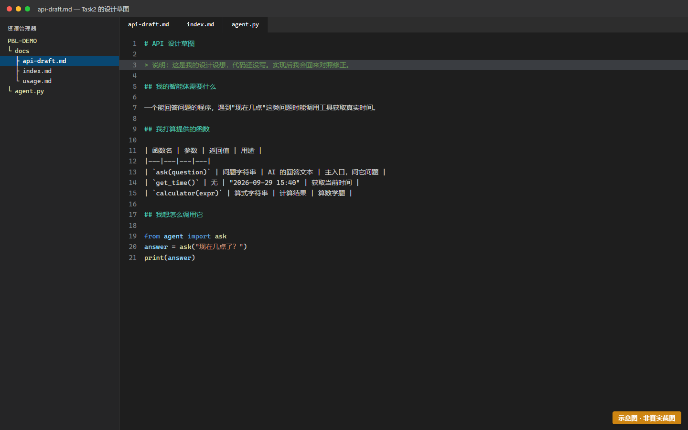
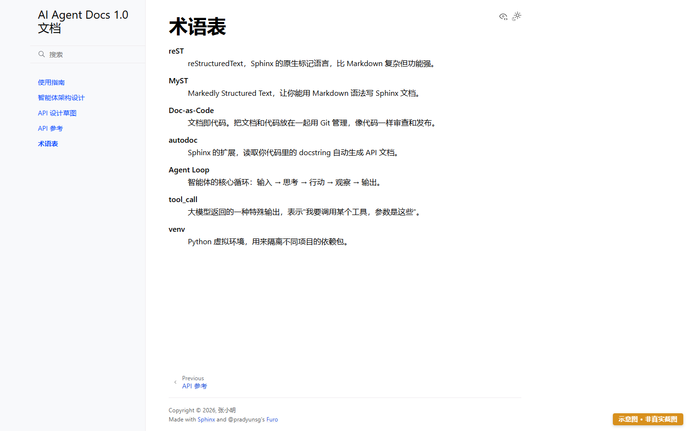
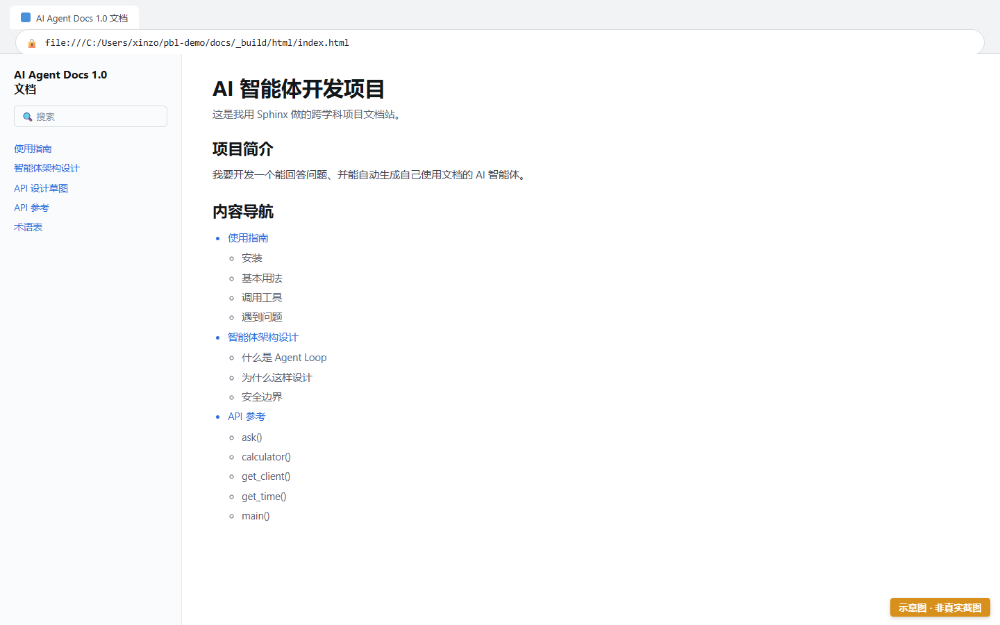

# Task2 — 文档先行：先写文档，再写代码

> 时长：2 课时 | 难度：★★★☆☆ | 前置：[Task1](task-1-env.md)
> 🎯 **目标**：为尚不存在的智能体写出文档与 API 草图，让文档站有真实内容。
>
> ⛔ **本任务必须完全手写，禁止使用 AI 生成任何内容。**
> 原因：这是你的能力建构期。用 AI 代写会让你"看起来完成了"，但实际没长出能力。Task6 才允许 AI 协作。

---

## 一、为什么"文档先行"？（读 1 分钟，很重要）

一般人是"先写完代码，再补文档"——结果文档变成事后粉饰，学生也没真搞懂。

本项目反过来：**你先写出"我打算提供哪些函数、怎么调用"，再去实现。**
于是实现的时候，如果你发现和草稿对不上，那就说明——**你找到了自己的一个理解盲点**。

把每次"对不上"记下来，这是 Task7 反思报告里最值钱的东西。

> 🔑 关键认知：**文档是理解的检验，不是理解的记录。**

---

## 二、操作步骤

### 步骤 1：写 API 草图 `api-draft.md`

在 `docs/` 下新建 `api-draft.md`。**此时你还没写一行代码**，凭想象写出你打算怎么做：

```markdown
# API 设计草图

> 说明：这是我的设计设想，代码还没写。实现后我会回来对照修正。

## 我的智能体需要什么

一个能回答问题的程序，遇到"现在几点"这类问题时能调用工具获取真实时间。

## 我打算提供的函数

| 函数名 | 参数 | 返回值 | 用途 |
|---|---|---|---|
| `ask(question)` | 问题字符串 | AI 的回答文本 | 主入口，问它问题 |
| `get_time()` | 无 | "2026-09-29 14:30" | 获取当前时间 |
| `calculator(expr)` | 算式字符串 | 计算结果 | 算数学题 |

## 我想怎么调用它

```python
from agent import ask
answer = ask("现在几点了？")
print(answer)
```

## 我还不确定的地方

- [ ] 工具调用具体怎么触发？AI 自己决定还是我判断？
- [ ] 对话历史怎么保存？只保留一轮够吗？
```

> 💡 **"我还不确定的地方"这一节别跳过**。它记录的正是你后面会踩的坑，也是反思报告的原料。



> 🖼 **S2-1 · api-draft.md 的内容**
>
> ⚠️ 本图为**示意图**（HTML 合成），用于帮助理解画面结构，**不是真实运行截图**。
> 你的实际界面会与本图有差异（版本号、路径、配色等），以你屏幕上看到的为准。
>
> 📖 原画面说明：api-draft.md 的内容

---

### 步骤 2：写主内容页

把 `docs/index.rst` 改名/替换为 `index.md`（或者保留 rst 也行，但后续统一用 md 更简单）。

`docs/index.md` 的内容：

````markdown
# AI 智能体开发项目

这是我用 Sphinx 做的跨学科项目文档站。

## 项目简介

我要开发一个能回答问题、并能自动生成自己使用文档的 AI 智能体。

## 内容导航

```{toctree}
:maxdepth: 2

usage
architecture
api-draft
glossary
```
````

> 💡 `toctree` 是 Sphinx 的导航目录。你写在里面的名字（如 `usage`）必须对应存在 `usage.md` 文件，否则会报错。

> ⚠️ **注意**：如果你把 `index.rst` 换成了 `index.md`，需要把 `conf.py` 里的 `master_doc` 或 `root_doc` 保持为 `'index'`（默认就是，通常不用改）。

---

### 步骤 3：写使用指南 `usage.md`

````markdown
# 使用指南

## 安装

```bash
pip install -r requirements.txt
```

## 基本用法

```python
from agent import ask

# 问一个简单问题
answer = ask("你好，介绍一下你自己")
print(answer)
```

## 遇到问题

如果程序报错说找不到 API Key，检查你的 `.env` 文件是否配置正确。
````

---

### 步骤 4：写架构说明 `architecture.md`

这页是你**对智能体原理的理解**，不用写得专业，写清楚就行：

````markdown
# 智能体架构设计

## 什么是 Agent Loop

智能体的核心是一个循环：

1. **输入** — 收到用户的问题
2. **思考** — 把问题发给大模型
3. **行动** — 如果大模型说要调用工具，就去执行那个工具
4. **观察** — 把工具的执行结果再发回给大模型
5. **输出** — 重复 2-4 直到大模型给出最终答案

```{mermaid}
flowchart LR
    A[用户提问] --> B[发给大模型]
    B --> C{要调用工具?}
    C -->|是| D[执行工具]
    D --> B
    C -->|否| E[输出答案]
```

## 为什么这样设计

去掉"行动"和"观察"两步，它就不是智能体，只是普通的聊天机器人——
因为它不能获取模型知识之外的实时信息。
````

> 💡 上面的 `{mermaid}` 需要额外装 `sphinxcontrib-mermaid`：`pip install sphinxcontrib-mermaid`，并在 `conf.py` 的 `extensions` 里加上 `"sphinxcontrib.mermaid"`。如果嫌麻烦，用纯文字流程图也行。

> 📸〔截图位 S2-2〕architecture.md 中的流程图渲染效果
> 文件名建议：shots/S2-2-流程图.png
> 需要显示：网页上渲染出的 Agent Loop 流程图

---

### 步骤 5：写术语表 `glossary.md`（验收会检查）

这页会很实用——把你听不懂的术语写下来。**至少 7 个**：

````markdown
# 术语表

```{glossary}
reST
    reStructuredText，Sphinx 的原生标记语言，比 Markdown 复杂但功能强。

MyST
    Markedly Structured Text，让你能用 Markdown 语法写 Sphinx 文档。

Doc-as-Code
    文档即代码。把文档和代码放在一起用 Git 管理，像代码一样审查和发布。

autodoc
    Sphinx 的扩展，读取你代码里的 docstring 自动生成 API 文档。

Agent Loop
    智能体的核心循环：输入 → 思考 → 行动 → 观察 → 输出。

tool_call
    大模型返回的一种特殊输出，表示"我要调用某个工具，参数是这些"。

venv
    Python 虚拟环境，用来隔离不同项目的依赖包。
```
````

> 💡 `{glossary}` 是 MyST 提供的指令，会自动排版成术语列表。

**跨学科提示**：如果你是非计算机背景（比如教育学方向）的同学，这个术语表也必须能让你自己看懂——**用你自己的话解释，不要抄定义**。



> 🖼 **S2-3 · 术语表页面渲染效果**
>
> ⚠️ 本图为**示意图**（HTML 合成），用于帮助理解画面结构，**不是真实运行截图**。
> 你的实际界面会与本图有差异（版本号、路径、配色等），以你屏幕上看到的为准。
>
> 📖 原画面说明：术语表页面渲染效果

---

### 步骤 6：构建并检查

```bash
sphinx-build -b html docs docs/_build/html
```

打开 `docs/_build/html/index.html`，检查：
- [ ] 左侧/顶部导航能看到 usage、architecture、api-draft、glossary 四页
- [ ] 代码块右上角有"复制"按钮（copybutton 生效）
- [ ] 代码有语法高亮
- [ ] Mermaid 流程图能显示（如果装了的话）



> 🖼 **S2-4 · 完整的文档站（含导航与内容）**
>
> ⚠️ 本图为**示意图**（HTML 合成），用于帮助理解画面结构，**不是真实运行截图**。
> 你的实际界面会与本图有差异（版本号、路径、配色等），以你屏幕上看到的为准。
>
> 📖 原画面说明：完整的文档站（含导航与内容）

---

## 三、常见报错

| 报错 | 原因 | 解决 |
|---|---|---|
| `toctree contains reference to nonexisting document 'xxx'` | 导航里写了 `xxx` 但没有 `xxx.md` | 建好那个文件，或从 toctree 里删掉它 |
| `WARNING: Document isn't included in any toctree` | 有 md 文件没被任何 toctree 引用 | 把它加进 `index.md` 的 toctree |
| `Unknown directive type "glossary"` | 没启用 MyST 或拼写错 | 确认 `myst_parser` 在 extensions 里；指令用 `{glossary}` |
| 代码块没高亮/没复制按钮 | copybutton 没启用 | 检查 `conf.py` 的 extensions 是否含 `sphinx_copybutton` |
| Mermaid 显示为代码块 | 没装 mermaid 扩展 | `pip install sphinxcontrib-mermaid` 并加入 extensions |
| 中文标题在导航里显示为拼音 | 未设语言 | `conf.py` 里 `language = 'zh_CN'` |

---

## 四、完成标志（自检）

- [ ] `docs/api-draft.md` 存在，含函数表格 + "我还不确定的地方"
- [ ] `index.md` 有 toctree，导航包含全部四个页面
- [ ] `usage.md`、`architecture.md`、`glossary.md` 都已写好
- [ ] `glossary.md` 至少 7 个术语（用你自己的话解释）
- [ ] `sphinx-build` 成功，浏览器中导航完整、copybutton 生效
- [ ] **全程我没有用 AI 帮我写** ✓

**对应验收标准**：TR-2.1（构建成功）、TR-2.2（术语表 ≥7 条）、TR-2.3（文档质量 ≥4分）、TR-2.4（文档先行落实度 ≥4分）

---
[← 上一个：Task1 环境搭建](task-1-env.md) | [返回手册目录](README.md) | [下一个：Task3 CI 部署 →](task-3-ci.md)
