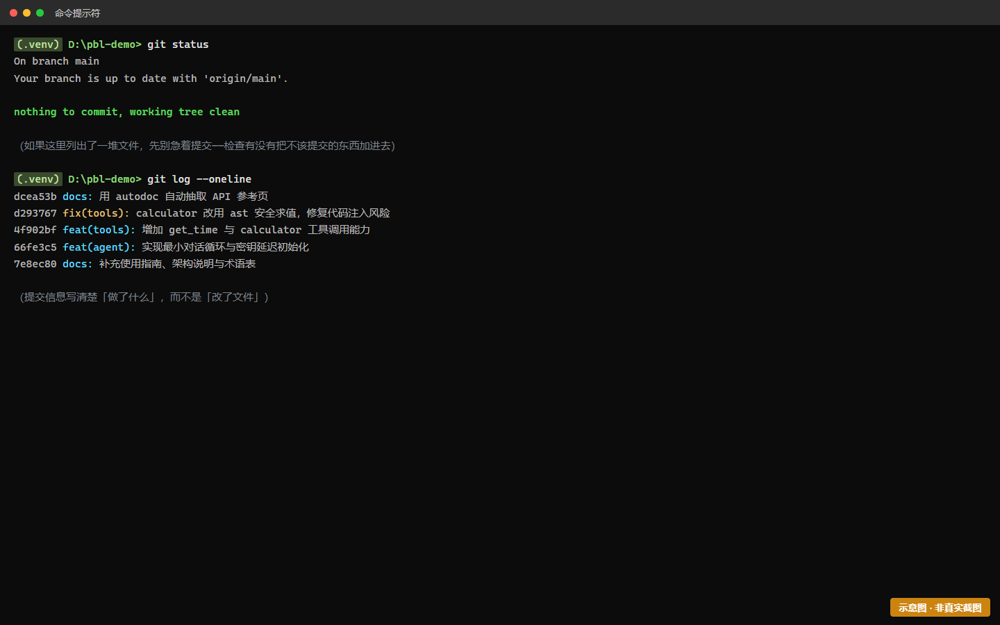
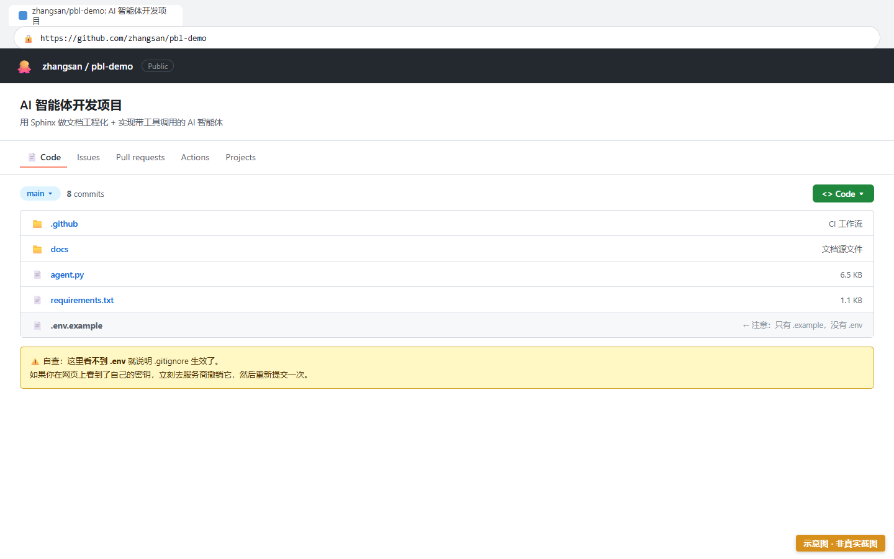
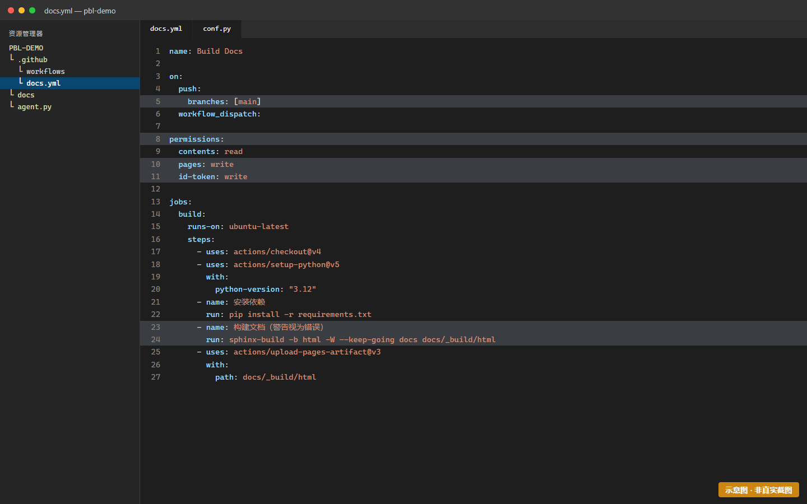
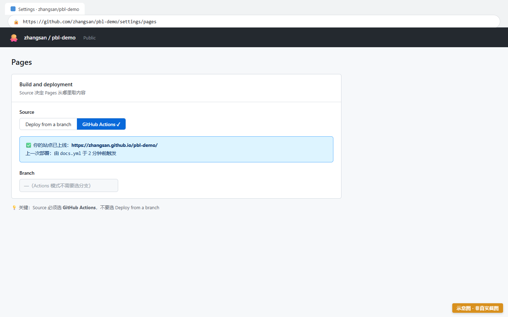
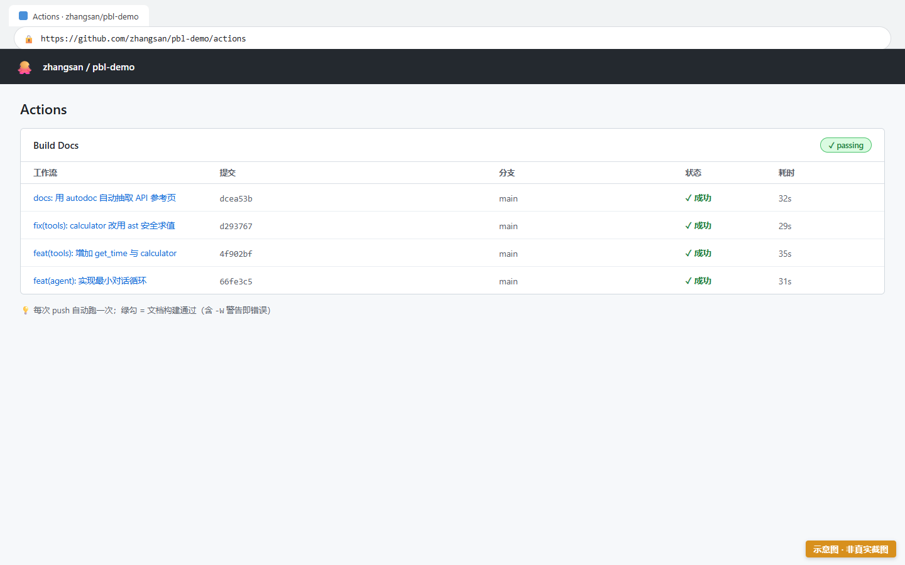
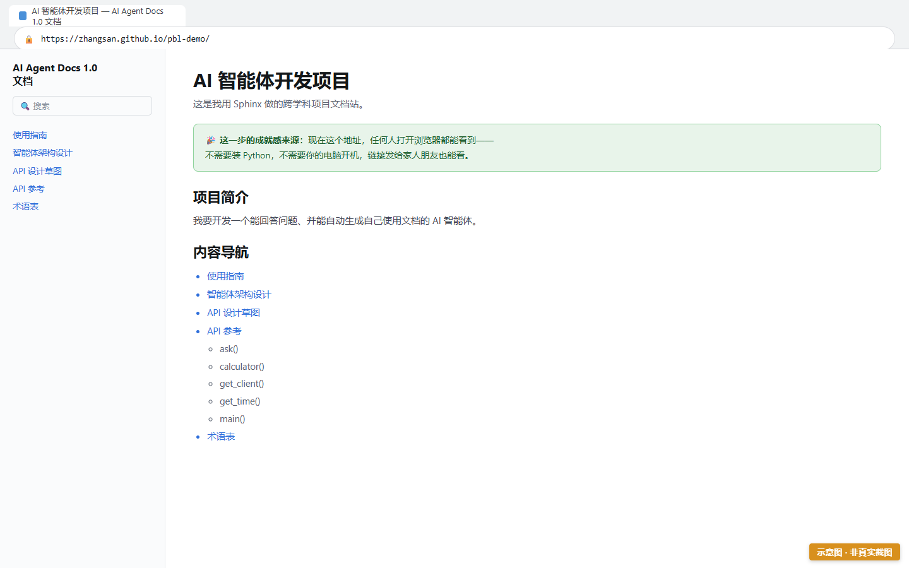

# Task3 — 文档即代码：Git + CI 自动部署

> 时长：1–2 课时 | 难度：★★★☆☆ | 前置：[Task2](task-2-docs.md)
> 🎯 **目标**：把文档站部署到公网，拿到一个能发给别人的网址。
>
> 🎁 **完成后的爽点**：以后你每次改文档 push 上去，网站会自动更新——这就是"文档即代码"。

---

## 一、操作步骤

### 步骤 1：初始化 Git 仓库并首次提交

在项目根目录 `my-agent/`：

```bash
git init
git add .
git commit -m "docs: 初始化文档站与 API 草图"
```

> ⚠️ **提交前务必确认** `.gitignore` 已包含 `.env` 和 `.venv/`（Task1 步骤 5 做过）。
> 用这条命令检查：
> ```bash
> git status --short
> ```
> 如果输出里看到 `.env` 或 `.venv/`，**立刻停下**，回去补 `.gitignore` 并执行 `git rm --cached .env`。



> 🖼 **S3-1 · git status 确认干净（无 .env/.venv）**
>
> ⚠️ 本图为**示意图**（HTML 合成），用于帮助理解画面结构，**不是真实运行截图**。
> 你的实际界面会与本图有差异（版本号、路径、配色等），以你屏幕上看到的为准。
>
> 📖 原画面说明：git status 确认干净（无 .env/.venv）

---

### 步骤 2：推送到 GitHub

1. 到 github.com 新建一个仓库（设为 **Public**，Private 仓库用不了免费的 Pages 部署）
2. 关联并推送：

```bash
git branch -M main
git remote add origin https://github.com/你的用户名/你的仓库名.git
git push -u origin main
```



> 🖼 **S3-2 · GitHub 仓库页面（代码已上传）**
>
> ⚠️ 本图为**示意图**（HTML 合成），用于帮助理解画面结构，**不是真实运行截图**。
> 你的实际界面会与本图有差异（版本号、路径、配色等），以你屏幕上看到的为准。
>
> 📖 原画面说明：GitHub 仓库页面（代码已上传）

---

### 🚧 如果学校网络访问不了 GitHub？（先看这节）

**不要跳过 Task3**。文档站必须部署到"能发给别人的网址"，这是验收要求。换一条路就行：

**方案 ②：内网 Git 服务（推荐用于无外网机房）**

机房通常已经有内网的 Git 服务（Gitea、GitLab 或类似）。用它，流程和 GitHub 几乎一模一样：

```bash
# 在内网 Git 服务上建仓库后
git branch -M main
git remote add origin http://内网地址/你的用户名/你的仓库名.git
git push -u origin main
```

CI 部分也用同一份 `docs.yml`，只需把最后两个"部署"步骤换成内网 runner 提供的部署方式（问老师要）。**前面那些步骤（装依赖、`sphinx-build -W`、构建产物）完全不变。**

> 💡 **内网版现成文件**：[`../starters/.github/workflows/docs-intranet.yml`](../starters/.github/workflows/docs-intranet.yml)。
> 它已把部署步骤改成自托管 runner 的写法，并给了两种常见方式（拷贝到 Web 根目录 / 打包成 artifact）。
> 里面标注了 `🔧 教师注意` 的那一步，请按你们机房实际情况替换。

> 🖼 **S3-7 · 内网 Git 服务的仓库页面（仅走离线档时需要）—— 本图按设计留白**
>
> **为什么没有预置图片**：内网 Git 服务各校不同（Gitea / GitLab / 自建 Kingsoft 等），
> 界面差异很大。给一张 Gitea 的图，走 GitLab 的学校会以为"我配错了"——**统一模板在这里必然误导**。
>
> **替代做法（比截图更有用）**：**用文字给你三个自行核对的判据**：
> 1. 打开 `http://内网地址/你的用户名/你的仓库名` → 能看到**文件列表**（至少含 `docs/` 目录与 `.github/` 或等效 CI 配置目录）
> 2. 页面上有 **clone 地址**（形如 `http://内网地址/.../xxx.git`）→ 与 `git remote -v` 的输出一致
> 3. 推送后能看到**最新一次提交的信息与时间**与你本地 `git log -1` 一致
>
> **验收标准**：上述 3 条**全部为"是"**才算配置成功。
> 若第 1 条看不到 `.github/` 目录，说明 `.gitignore` 把 CI 配置也忽略了——回上一步检查。
>
> **若你班上不用内网 Git**：直接删除本引用块，不影响其余内容。

**方案 ③：Read the Docs 托管**

在 readthedocs.org 用你自己的账号导入同一个仓库，它会自动拉取并构建。

> ⚠️ **代价要知道**：用 RTD 你就不用写 `docs.yml` 了——但**那恰好是本任务最重要的东西**。
> 那个 YAML 文件让你亲眼看到"文档像代码一样被自动构建、自动检查"，这是"文档即代码"这个概念的实物教具。
> 所以：**能写 `docs.yml` 就尽量写**，RTD 留作实在没条件时的兜底。

**方案 ④：完全离线（本地构建 + 共享盘）**

如果连内网 Git 都没有，退到这一步：

```bash
sphinx-build -b html docs docs/_build/html
```

把 `docs/_build/html/` 整个文件夹拷到共享盘或 U 盘，双击 `index.html` 就能看。
交给老师的"网址"改为"共享盘路径"。**验收依然算通过**——老师会按 TR-3.1 的离线口径核对。

> 🔒 **不论走哪条路，有一条不能让步**：构建必须带 `-W` 参数（把警告当错误）。
> 这是"你的文档和你的代码必须一致"的硬约束——**换平台不换标准**。

---

### 步骤 3：写 CI 配置

在项目根目录建 `.github/workflows/docs.yml`：

```yaml
name: Build and Deploy Docs

on:
  push:
    branches: [main]
  workflow_dispatch:

permissions:
  contents: read
  pages: write
  id-token: write

jobs:
  build:
    runs-on: ubuntu-latest
    steps:
      - uses: actions/checkout@v4

      - uses: actions/setup-python@v5
        with:
          python-version: '3.11'

      - name: Install dependencies
        run: pip install -r requirements.txt

      - name: Build docs (warnings as errors)
        run: sphinx-build -b html -W --keep-going docs docs/_build/html

      - uses: actions/upload-pages-artifact@v3
        with:
          path: docs/_build/html

  deploy:
    needs: build
    runs-on: ubuntu-latest
    environment:
      name: github-pages
      url: ${{ steps.deployment.outputs.page_url }}
    steps:
      - id: deployment
        uses: actions/deploy-pages@v4
```

> 🔑 **关键设计**：`-W` 参数让 Sphinx 把**警告当错误**。这意味着——如果你的文档和代码对不上（比如 autodoc 引用了不存在的函数），CI 会直接失败。
>
> 这是本项目的核心硬约束：**文档与代码必须保持一致，否则不许发布。**

> 💡 **懒人做法（推荐）**：YAML 对缩进极其敏感，**少一个空格整个 CI 就不跑**，
> 而报错信息往往不指向真正的原因。直接复制 [`../starters/.github/workflows/docs.yml`](../starters/.github/workflows/docs.yml)：
> ```bash
> mkdir -p .github/workflows
> cp starters/.github/workflows/docs.yml .github/workflows/
> ```
> 文件内容与本步骤完全一致，可以放心用。**手打一遍也完全可以**——只要你愿意承担缩进风险。



> 🖼 **S3-3 · docs.yml 文件内容**
>
> ⚠️ 本图为**示意图**（HTML 合成），用于帮助理解画面结构，**不是真实运行截图**。
> 你的实际界面会与本图有差异（版本号、路径、配色等），以你屏幕上看到的为准。
>
> 📖 原画面说明：docs.yml 文件内容

---

### 步骤 4：开启 Pages 并推送

1. 到仓库 **Settings → Pages**，把 Source 设为 **GitHub Actions**
2. 推送：

```bash
git add .github/
git commit -m "ci: 添加文档自动构建与部署"
git push
```



> 🖼 **S3-4 · GitHub Pages 设置页**
>
> ⚠️ 本图为**示意图**（HTML 合成），用于帮助理解画面结构，**不是真实运行截图**。
> 你的实际界面会与本图有差异（版本号、路径、配色等），以你屏幕上看到的为准。
>
> 📖 原画面说明：GitHub Pages 设置页

---

### 步骤 5：验证部署

1. 到仓库 **Actions** 标签页，看工作流是否变绿 ✓
2. 等 1–2 分钟，访问 `https://你的用户名.github.io/你的仓库名/`



> 🖼 **S3-5 · Actions 运行成功（绿色对勾）**
>
> ⚠️ 本图为**示意图**（HTML 合成），用于帮助理解画面结构，**不是真实运行截图**。
> 你的实际界面会与本图有差异（版本号、路径、配色等），以你屏幕上看到的为准。
>
> 📖 原画面说明：Actions 运行成功（绿色对勾）



> 🖼 **S3-6 · 公网可访问的文档站**
>
> ⚠️ 本图为**示意图**（HTML 合成），用于帮助理解画面结构，**不是真实运行截图**。
> 你的实际界面会与本图有差异（版本号、路径、配色等），以你屏幕上看到的为准。
>
> 📖 原画面说明：公网可访问的文档站

**这个网址要交给老师**（TR-3.1 的验收证据）。

---

## 二、常见报错

| 现象 | 原因 | 解决 |
|---|---|---|
| **根本访问不了 github.com** | 机房网络限制 | 见上面"如果学校网络访问不了 GitHub？"——换内网 Git 或本地构建 + 共享盘 |
| Actions 红色 ✗，日志报 `sphinx-build: command not found` | requirements.txt 里没有 sphinx | 本地 `pip freeze > requirements.txt` 后重新提交 |
| 报错 `WARNING treated as error` | `-W` 生效，文档里有警告 | **这是好事**——按日志提示修掉那个警告（通常是断链或未引用的文档） |
| 网站 404 | Pages 没开启 或 部署还在跑 | 检查 Settings→Pages；等 3 分钟再看 |
| 网站样式全丢 | base path 问题 | 通常 GitHub Pages 会自动处理；若不行，检查 URL 末尾斜杠 |
| `remote: Permission denied` | 认证失败 | 用 Personal Access Token 当密码，或配置 SSH key |
| 推上去发现 .env 已在仓库里 | .gitignore 加得太晚 | 立即在 GitHub 上删除该文件、**作废那个 API Key**，然后 `git rm --cached .env` |

> 🚨 **如果 API Key 泄露了**：不要只是删文件！必须去服务商后台**立刻作废/重置那个 Key**。因为 Git 历史里还留着，任何人 clone 都能看到。

---

## 三、完成标志（自检）

- [ ] `git status` 显示干净，**没有** `.env` / `.venv/`
- [ ] 代码已推送到 Git 仓库（GitHub 或内网 Git 服务）
- [ ] `docs.yml` 已提交（**用 RTD 托管的话可跳过此项**）
- [ ] Settings → Pages 的 Source 设为 GitHub Actions（用内网/RTD 时按对应平台设置）
- [ ] 构建流水线运行成功（绿勾）
- [ ] 公网/内网网址能打开我的文档站
- [ ] 网页源码里搜索不到任何 API Key 明文
- [ ] 构建命令带 `-W` 参数（**这一条换任何平台都不能少**）

**对应验收标准**：TR-3.1（构建成功 + URL 可访问）、TR-3.2（无明文密钥）

---
[← 上一个：Task2 文档先行](task-2-docs.md) | [返回手册目录](README.md) | [下一个：Task4 智能体循环 →](task-4-agent-loop.md)
