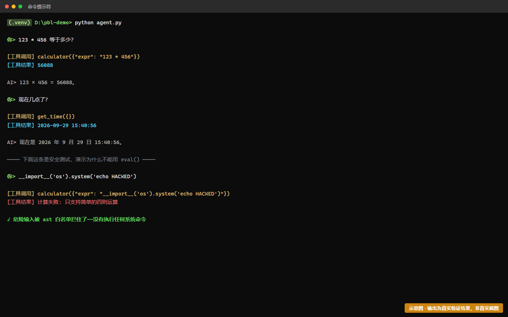
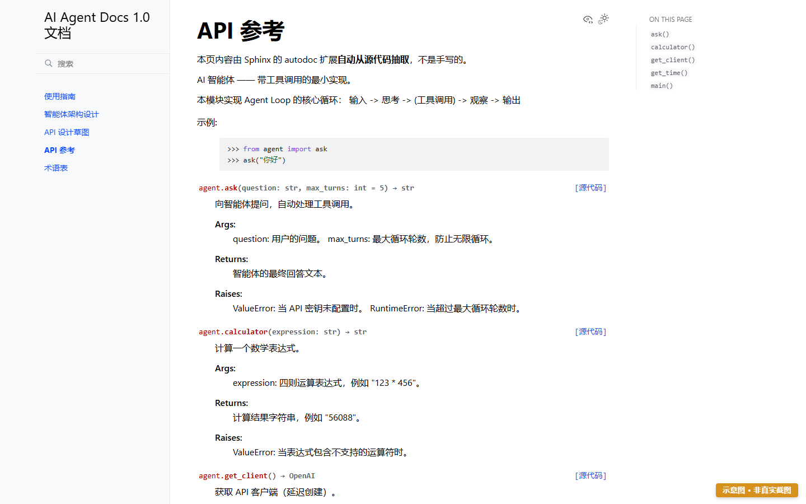
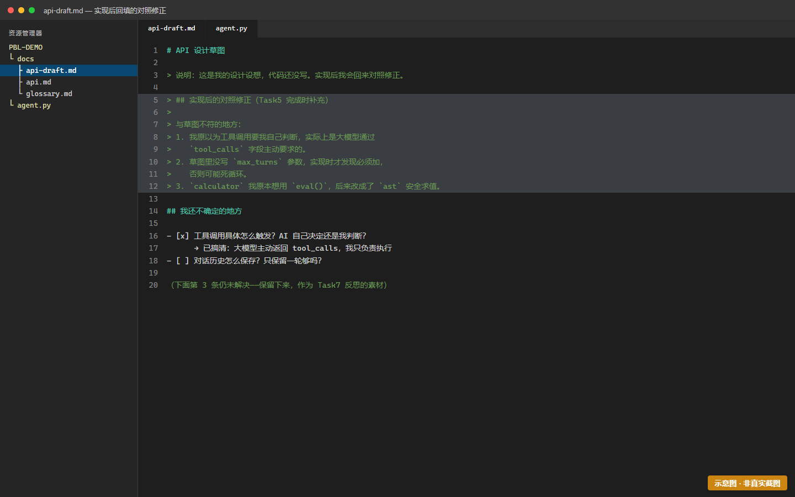

# Task5 — 工具调用 + autodoc 文档自动抽取

> 时长：2 课时 | 难度：★★★★☆ | 前置：[Task4](task-4-agent-loop.md)
> 🎯 **目标**：让智能体会调用工具（查时间、算数），并用 autodoc 把代码自动抽进文档站。
>
> ⭐ **这是全项目的关键任务**——它让"代码"和"文档"第一次真正咬合在一起。

---

## 一、操作步骤

> 📦 **沿着 Task4 的代码继续写，不要重开文件。**
> 如果你 Task4 用了模板（`templates/agent.py`），现在回去把 `TODO` 逐个实现即可：
> `get_time` → `calculator` → `build_tools` → `call_tool` → `ask`（共 5 个，13 处标记）。
> 搜 `TODO` 就能定位全部位置。详见 [`templates/README.md`](../templates/README.md)。
>
> 💡 **一次只填一个 TODO，填完就跑一次。** 别全写完再测——出了错你会很难定位是哪个函数的问题。

### 步骤 1：写工具函数

在 `agent.py` 里加两个工具。**注意每个工具都要有清晰的 docstring**——大模型会读它来决定什么时候调用：

```python
import datetime
import ast
import operator


def get_time() -> str:
    """获取当前的日期和时间。

    Returns:
        格式为 "YYYY-MM-DD HH:MM:SS" 的当前时间字符串。

    Examples:
        >>> get_time()  # doctest: +SKIP
        '2026-09-29 14:30:00'
    """
    return datetime.datetime.now().strftime("%Y-%m-%d %H:%M:%S")


# 支持的运算符（用 ast 安全求值，不用危险的 eval）
_OPS = {
    ast.Add: operator.add,
    ast.Sub: operator.sub,
    ast.Mult: operator.mul,
    ast.Div: operator.truediv,
}


def _safe_eval(node):
    """递归求值一个简单的算术表达式 AST 节点。"""
    if isinstance(node, ast.Constant):
        return node.value
    if isinstance(node, ast.BinOp):
        return _OPS[type(node.op)](_safe_eval(node.left), _safe_eval(node.right))
    raise ValueError("只支持简单的四则运算")


def calculator(expression: str) -> str:
    """计算一个数学表达式。

    Args:
        expression: 四则运算表达式，例如 "123 * 456"。

    Returns:
        计算结果字符串，例如 "56088"。

    Raises:
        ValueError: 当表达式包含不支持的运算符时。
    """
    try:
        tree = ast.parse(expression, mode="eval")
        result = _safe_eval(tree.body)
        return str(result)
    except Exception as exc:
        return f"计算失败: {exc}"
```

> 🔒 **安全提示**：这里用 `ast` 而不是 `eval()`。`eval()` 会执行任意代码，如果有人问它 `__import__('os').system('rm -rf /')` 就完蛋了。这是真实的工程教训。

---

### 步骤 2：把工具告诉大模型

OpenAI 兼容接口用 `tools` 参数描述可用工具。在 `agent.py` 里加：

```python
TOOLS = [
    {
        "type": "function",
        "function": {
            "name": "get_time",
            "description": "获取当前的日期和时间。当用户询问现在几点、今天几号时使用。",
            "parameters": {"type": "object", "properties": {}},
        },
    },
    {
        "type": "function",
        "function": {
            "name": "calculator",
            "description": "计算数学表达式。当用户需要做算术计算时使用。",
            "parameters": {
                "type": "object",
                "properties": {
                    "expression": {
                        "type": "string",
                        "description": "要计算的表达式，例如 '123 * 456'",
                    }
                },
                "required": ["expression"],
            },
        },
    },
]

# 函数名 -> 实际函数 的映射
AVAILABLE_FUNCTIONS = {
    "get_time": get_time,
    "calculator": calculator,
}
```

> 💡 `description` 写得好不好，直接决定模型会不会正确调用。这是"给模型写文档"——本质上和 Task2 你给自己写文档是一回事。

---

### 步骤 3：改造 `ask()` 支持工具循环

把 `ask()` 改成完整的 Agent Loop：

```python
import json


def ask(question: str, max_turns: int = 5) -> str:
    """向智能体提问，自动处理工具调用。

    Args:
        question: 用户的问题。
        max_turns: 最大循环轮数，防止无限循环。

    Returns:
        智能体的最终回答文本。

    Raises:
        ValueError: 当 API 密钥未配置时。
        RuntimeError: 当超过最大循环轮数时。
    """
    if not os.getenv("LLM_API_KEY"):
        raise ValueError("未配置 LLM_API_KEY，请检查 .env 文件")

    messages = [
        {"role": "system", "content": "你是一个乐于助人的助手。需要实时信息或计算时请调用工具。"},
        {"role": "user", "content": question},
    ]

    for _ in range(max_turns):
        response = client.chat.completions.create(
            model=MODEL, messages=messages, tools=TOOLS,
        )
        msg = response.choices[0].message

        # 没有工具调用 -> 直接返回答案
        if not msg.tool_calls:
            return msg.content

        # 有工具调用 -> 执行工具，把结果塞回对话
        messages.append(msg)
        for call in msg.tool_calls:
            fn = AVAILABLE_FUNCTIONS.get(call.function.name)
            args = json.loads(call.function.arguments or "{}")
            result = fn(**args) if fn else f"未知工具: {call.function.name}"
            messages.append({
                "role": "tool",
                "tool_call_id": call.id,
                "content": str(result),
            })

    raise RuntimeError(f"超过最大循环轮数 {max_turns}，可能存在死循环")
```

> 🔑 **这就是 Agent Loop 的完整实现**：
> 发给模型 → 模型说要调工具 → 我执行工具 → 把结果发回去 → 模型再思考 → 直到它给出最终答案。
>
> `max_turns` 是**安全阀**。没有它，模型可能陷入"调工具→还不满意→再调"的死循环，烧光你的额度。

> 📸〔截图位 S5-1〕完整的 agent.py（含工具定义与循环）
> 文件名建议：shots/S5-1-完整代码.png
> 需要显示：编辑器中的 agent.py，能看到 TOOLS 和 ask 函数

---

### 步骤 4：测试工具调用

```bash
python agent.py
```

```
你: 现在几点了？
智能体: 现在是 2026-09-29 14:30:00。

你: 帮我算一下 1234 * 5678
智能体: 1234 × 5678 = 7006652。
```

**关键验证**：第二个问题的答案 `7006652` 是工具算出来的，不是模型猜的。模型本身算大数乘法经常出错——这正是要用工具的原因。



> 🖼 **S5-2 · 工具调用成功**
>
> ⚠️ 本图为**示意图**（HTML 合成），用于帮助理解画面结构，**不是真实运行截图**。
> 你的实际界面会与本图有差异（版本号、路径、配色等），以你屏幕上看到的为准。
>
> 📖 原画面说明：工具调用成功

---

### 步骤 5：用 autodoc 把代码抽进文档 ⭐

**这一步是"代码↔文档"咬合的关键。**

在 `docs/` 下新建 `api.md`：

````markdown
# API 参考

本页内容由 Sphinx 的 autodoc 扩展**自动从源代码抽取**，不是手写的。

```{eval-rst}
.. automodule:: agent
   :members:
   :undoc-members:
   :show-inheritance:
```
````

然后在 `docs/conf.py` 里加一行，让 Sphinx 能找到 `agent.py`：

```python
import os
import sys
sys.path.insert(0, os.path.abspath(".."))   # 指向项目根目录
```

最后把 `api` 加进 `index.md` 的 toctree：

````markdown
```{toctree}
:maxdepth: 2

usage
architecture
api
api-draft
glossary
```
````

构建：

```bash
sphinx-build -b html docs docs/_build/html
```

打开 `api.html`——你应该看到 `get_time()`、`calculator()`、`ask()` 的**函数签名和 docstring**，全是自动生成的。

> 🎉 **这一刻的意义**：你改了代码里的 docstring，文档站会自动跟着变。文档不再可能"过时"——它和代码同源。



> 🖼 **S5-3 · autodoc 自动生成的 API 页面**
>
> ⚠️ 本图为**示意图**（HTML 合成），用于帮助理解画面结构，**不是真实运行截图**。
> 你的实际界面会与本图有差异（版本号、路径、配色等），以你屏幕上看到的为准。
>
> 📖 原画面说明：autodoc 自动生成的 API 页面

---

### 步骤 6：对照修正 `api-draft.md`

回到 Task2 写的 `api-draft.md`，**在文件开头加一段修正说明**：

```markdown
> ## 实现后的对照修正（Tas5 完成时补充）
>
> 与草图不符的地方：
> 1. 我原以为工具调用要我自己判断，实际上是大模型通过 `tool_calls` 字段主动要求的。
> 2. 草图里没写 `max_turns` 参数，实现时才发现必须加，否则可能死循环。
> 3. `calculator` 我原本想用 `eval()`，后来改成了 `ast` 安全求值。
```

**这三条差异就是你的理解盲点记录**——Task7 的反思报告要用。



> 🖼 **S5-4 · api-draft.md 的对照修正部分**
>
> ⚠️ 本图为**示意图**（HTML 合成），用于帮助理解画面结构，**不是真实运行截图**。
> 你的实际界面会与本图有差异（版本号、路径、配色等），以你屏幕上看到的为准。
>
> 📖 原画面说明：api-draft.md 的对照修正部分

---

## 二、常见报错

| 报错 | 原因 | 解决 |
|---|---|---|
| 模型不调用工具，直接瞎编时间 | `description` 写得不清楚 | 把 description 写具体，明确"当用户询问X时使用" |
| `KeyError` 在 `_OPS[type(node.op)]` | 表达式含不支持运算符（如 `**`） | 正常，会被 try/except 捕获返回"计算失败" |
| `TypeError: 'NoneType' object is not subscriptable` | `msg.content` 为 None（只有工具调用时） | 代码里已处理：先判断 `if not msg.tool_calls` |
| `RuntimeError: 超过最大循环轮数` | 模型反复调工具 | 检查工具是否返回了有效结果；调小 `max_turns` 调试 |
| autodoc 报 `ModuleNotFoundError: No module named 'agent'` | `sys.path` 没配对 | 确认 `conf.py` 里 `sys.path.insert(0, os.path.abspath(".."))`，且 `agent.py` 在项目根目录 |
| API 页是空的 | autodoc 找不到模块或没写 docstring | 确认 `automodule:: agent` 名字对；给函数补 docstring |
| autodoc 报错说某个依赖缺失 | Sphinx 需要 import 你的模块，连带 import 了 openai | `pip install -r requirements.txt` 装全依赖 |

---

## 三、完成标志（自检）

- [ ] `get_time()` 和 `calculator()` 两个工具已实现，都有 docstring
- [ ] `TOOLS` 列表已定义，description 清晰
- [ ] `ask()` 改造成了完整循环，含 `max_turns` 安全阀
- [ ] 问"现在几点"能返回真实时间
- [ ] 问"1234 * 5678"能返回正确结果 7006652
- [ ] `docs/api.md` 已建，`conf.py` 加了 `sys.path`
- [ ] API 页能看到自动生成的函数签名与 docstring
- [ ] `api-draft.md` 已补"实现后的对照修正"

**对应验收标准**：TR-5.1（工具调用正确）、TR-5.2（API 页含签名/docstring）

---
[← 上一个：Task4 智能体循环](task-4-agent-loop.md) | [返回手册目录](README.md) | [下一个：Task6 元文档闭环 →](task-6-meta-doc.md)
