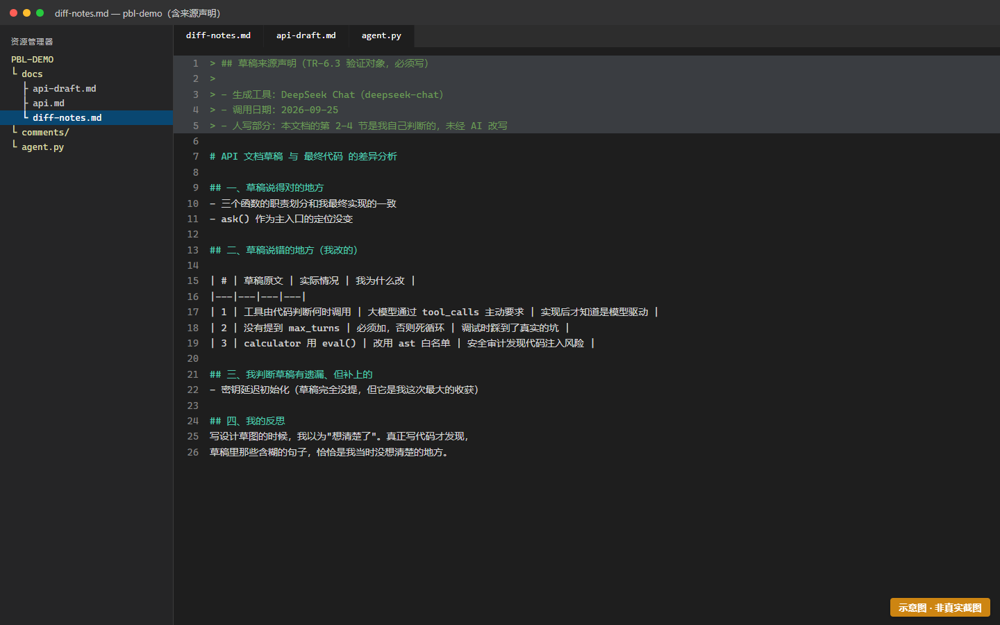

# Task6 — 元文档闭环：让智能体给自己写文档草稿

> 时长：1–2 课时 | 难度：★★★★☆ | 前置：[Task5](task-5-tools.md)
> 🎯 **目标**：让智能体读取自己的代码，生成一段文档草稿；你审校后并入正式文档。
>
> ⭐ **这是全项目最有想法的部分**：文档不再只由人写，而是人机协作产出。

---

## 〇、先搞清楚：这个任务有三档，你要走哪一档？

**核心必做的部分不取决于你有没有 API 配额。** 这个任务真正要让你得到的认知是：

> **AI 看不到我代码背后的设计意图。**

触发这个认知的条件是"**看到 AI 误解我的代码**"，而**不要求你的代码真的被 AI 读过**。所以有三条路：

| 档 | 你要做什么 | 花 Token 吗 | 是必做吗 |
|---|---|---|---|
| **档 A · 教学化形态** | 用**老师给的草稿样例**做差异分析 | **不花** | ✅ **必做（人人要做）** |
| **档 B · 全自动形态** | 自己调 API 生成草稿，再分析差异 | 花 | ⭕ 选做（做了加分） |
| **档 C · 降级通道** | 配额耗尽／无外网时，拿 Task2 的 `api-draft.md` 和你的最终代码对比 | **不花** | 用于替换档 A |

> 🚨 **诚实性红线（三档都适用）**：如果你走的是档 A 或档 C，**必须在 `diff-notes.md` 开头如实写明草稿是哪来的**。
> 比如："本次草稿来自教师预置样例，非我本人调用生成。"
>
> **谎报成"我调用 AI 生成的"属于学术诚信问题，本项直接判 0。**
>
> 为什么要说这么重？因为**降级本身完全正当、不扣分**（档 A 一样能拿满 AC-4），只有**伪装降级才不正当**。
> 把这句话写在这里，就是让"诚实"成为最省事的选项。

**怎么选**：
- 老师给了草稿样例 → 走**档 A**（默认，最省事）
- 你的 API 还有额度、也想体验真调用 → 走**档 B**（做完档 A 后顺手做，加分）
- 配额烧光了 → 走**档 C**（用你自己 Task2 写的东西对比，零成本）

---

## 一、为什么做这个？（读 1 分钟）

前面 Task5 里，autodoc 已经做到了"代码 → 文档"的**单向自动抽取**。
但那只是把 docstring 搬过去，不能生成"这个功能该怎么用"这种**解释性内容**。

Task6 让智能体自己写：它读自己的代码，产出"功能介绍 + 使用示例"的草稿。
然后**你来审校**——因为 AI 写的草稿经常是错的。

> 🔑 **关键认知**：这个任务的产出不是"省了写文档的力气"，而是**让你看到 AI 会怎么误解你的代码**。
> 那些误解的地方，往往就是你自己也没想清楚的地方。

---

## 二、操作步骤

> 📌 下面**步骤 1、2 只有走档 B 才需要做**。走档 A/C 的同学直接跳到 [步骤 3](#步骤-3审校并记录差异-核心步骤)
> ——因为对你的要求不在于"能不能让 AI 写出草稿"，而在于"**你能不能看出草稿哪里错了**"。那才是考点。

### 步骤 1：加一个"文档生成"工具（档 B）

在 `agent.py` 里加：

```python
import inspect


def draft_doc(func_name: str) -> str:
    """生成指定函数的文档草稿。

    读取目标函数的源码与签名，交给大模型写出使用说明草稿。
    注意：草稿可能不准确，必须人工审校后才能并入正式文档。

    Args:
        func_name: 要生成文档的函数名，例如 "calculator"。

    Returns:
        Markdown 格式的文档草稿字符串。
    """
    target = AVAILABLE_FUNCTIONS.get(func_name)
    if target is None:
        return f"未找到函数: {func_name}"

    try:
        source = inspect.getsource(target)
    except OSError:
        source = "（无法读取源码）"

    prompt = (
        f"请为下面这个 Python 函数写一段中文使用说明，包含：\n"
        f"1. 一句话功能描述\n2. 参数说明\n3. 一个使用示例\n"
        f"用 Markdown 格式，不要输出代码以外的东西。\n\n"
        f"```python\n{source}\n```"
    )

    response = get_client().chat.completions.create(
        model=MODEL,
        messages=[{"role": "user", "content": prompt}],
    )
    return response.choices[0].message.content
```

> 💡 注意用的是 `get_client()` 而不是直接 `client`——这就是 Task4 里学的**延迟初始化**。
> 无论哪一档，都要保证"没配密钥时 `import agent` 不崩"。

注册进 `AVAILABLE_FUNCTIONS`：

```python
AVAILABLE_FUNCTIONS = {
    "get_time": get_time,
    "calculator": calculator,
    "draft_doc": draft_doc,     # 新增
}
```

> 🖼 **S6-1 · draft_doc 函数实现 —— 本图按设计留白（仅档 B 需要）**
>
> **为什么没有预置图片**：`draft_doc` **只有走档 B（全自动形态）的同学才需要写**。
> 给一张完整的实现图，会让走**档 A / 档 C** 的同学以为"我漏看了内容"——
> 而按设计，这两个档位**根本不需要这个函数**（详见 [`../decisions.md`](../decisions.md) DQ-3）。
>
> **该函数要做什么**（文字规格，比截图更精确）：
> 1. 接收一个**函数名**（如 `"calculator"`）
> 2. 用 `inspect.getsource()` 取到该函数的**源码与 docstring**
> 3. 把源码塞进提示词，调用 `ask_simple()` 让模型生成 Markdown 草稿
> 4. **返回草稿文本**（不要直接写文件——写文件交给调用方，便于测试）
>
> **验收标准**：`draft_doc("calculator")` 返回的文本**包含** `calculator` 这个名字与它的 docstring 片段。
> 若返回的草稿里**没有**你写的 docstring 原文，说明提示词没把源码传进去。
>
> **走档 A / 档 C 的同学**：跳过本节，直接进入下面的"步骤 3：审校并记录差异"——
> 那一步才是**三档都必做**的核心。

---

### 步骤 2：生成草稿（档 B）

在项目根目录建 `docs/drafts/`，然后运行：

```bash
python -c "
from agent import draft_doc
print(draft_doc('calculator'))
" > docs/drafts/calculator-draft.md
```

或者直接在对话里：

```
你: 帮我给 calculator 生成文档草稿
```

> 🖼 **S6-2 · 生成的文档草稿内容 —— 本图按设计留白（仅档 B 需要）**
>
> **为什么没有预置图片**：草稿是**你自己的模型、按你自己的代码**生成的——
> 给一张"标准草稿"，等于告诉学生"草稿长这样"，而本任务的核心恰恰是
> **发现"草稿和我的真实代码不一样"**（见下一步的差异分析）。
> 预先看到"标准答案"会摧毁这个发现过程。
>
> **你该看到什么（这才是有用的信息）**：草稿**几乎一定会在以下三处出错**——
> 这也是 [`../teacher/SETUP-CHECKLIST.md`](../teacher/SETUP-CHECKLIST.md) 第五节列出的三种典型误解：
> 1. **类型注解误读**：把 `-> str` 说成"返回字符串对象"，漏掉"格式为 YYYY-MM-DD HH:MM:SS"这个**约定**
> 2. **设计意图缺失**：草稿只能看到"做了什么"，看不到"为什么这样做"（如"失败时返回提示而非抛异常"）
> 3. **编造异常类**：草稿常声称"会抛 `CalculationError`"——而你的代码里根本没这个类
>
> **验收标准**：你在下一步的 `diff-notes.md` 里**至少能指出 3 条草稿与真实代码的差异**，
> 且每条含"问题 + 原因 + 修正"三要素。**如果你觉得草稿写得完美，说明你还没细看。**

---

### 步骤 3：审校并记录差异 ⭐（核心步骤·三档都必做）

新建 `docs/drafts/diff-notes.md`，**开头先声明草稿来源**，然后逐条记录问题。

**要求至少 3 条具体差异**：

```markdown
# 草稿差异分析

> **草稿来源声明**（必填，从下面三行里保留一行，删掉其余两行）：
> - [ ] 本次草稿来自**教师预置样例**，非我本人调用生成。（档 A）
> - [ ] 本次草稿由**我本人调用 LLM 生成**。（档 B）
> - [ ] 本次用**我的 Task2 设计草稿（api-draft.md）与最终代码对比**。（档 C）

> 说明：对比 `calculator-draft.md`（草稿）与最终并入正式文档的版本，
> 记录草稿在哪里写错了、为什么错、我如何修正。

## 差异 1：草稿说参数可以传非字符串的表达式

- **草稿写法**：`calculator(1 + 2)` 直接传算式
- **问题**：实际函数签名要求 `expression: str`，传数值会报错
- **原因**：草稿没读懂类型注解，只看了函数名在猜
- **修正**：改为 `calculator("1 + 2")`

## 差异 2：草稿没有提到安全性设计

- **草稿写法**：只说"可以计算数学表达式"
- **问题**：完全没提为什么用 `ast` 而不是 `eval()`
- **原因**：草稿看不到设计意图，只能看到代码表面
- **修正**：补充一句"为避免代码注入，采用 AST 安全求值而非 eval"

## 差异 3：草稿编了一个不存在的错误类型

- **草稿写法**：说会抛出 `CalculationError`
- **问题**：代码里根本没有这个异常类，实际是返回"计算失败: xxx"字符串
- **原因**：草稿按常见模式推测，实际代码没这么写
- **修正**：改为"计算失败时返回提示字符串，不抛异常"
```

> 🔑 **重点**：注意差异 2——**草稿看不到你代码背后的设计意图**。
> 这是人类写文档不可替代的地方，也是这个任务最想让你体会到的。



> 🖼 **S6-3 · diff-notes.md 差异分析（含来源声明）**
>
> ⚠️ 本图为**示意图**（HTML 合成），用于帮助理解画面结构，**不是真实运行截图**。
> 你的实际界面会与本图有差异（版本号、路径、配色等），以你屏幕上看到的为准。
>
> 📖 原画面说明：diff-notes.md 差异分析

---

### 步骤 4：审校后并入正式文档

把修正后的内容并入 `usage.md` 或新建 `docs/snippets.md`，并加进 toctree。

**注意**：并入时要在文件里注明这是人机协作的产出：

```markdown
> 本节内容基于 AI 生成初稿（见 `drafts/calculator-draft.md`），
> 经人工审校修正后并入（见 `drafts/diff-notes.md`）。
```

---

### 步骤 5：构建验证

```bash
sphinx-build -b html docs docs/_build/html
```

确认新页面能正常显示，且推送后构建也是成功的。

---

### 📌 档 C 的具体做法（配额耗尽/无外网时）

你没有 AI 草稿，但你**有更值钱的东西**——Task2 亲手写的 `api-draft.md`。

1. 打开 `api-draft.md`，看你当初写的函数表（`ask` / `get_time` / `calculator`）
2. 打开你最终的 `agent.py`，看实际实现的签名与行为
3. 把"我当初以为的"和"我实际做出来的"逐条对比，写进 `diff-notes.md`

**这同样满足"至少 3 条差异"，而且往往比 AI 草稿的差异更深刻**——因为那是你自己真实的认知变化。
比如："我原以为工具调用要我自己判断，实际上是大模型通过 `tool_calls` 主动要求的。"

> 💡 **档 C 的额外好处**：你在 Task2 写的 `api-draft.md` 于是没有白写——它从"交完就丢的作业"变成了**反思的原材料**。

---

## 三、成本控制（如果只有档 B 需要担心这个）

**如果你走档 A 或档 C，你一分钱 Token 都不用花。** 这一节只给想走档 B 的同学看。

调用大模型读代码+生成文档确实比较费 token。如果全班额度紧张，档 B 可以这样降本：

- **方案 A**：老师选一个函数，全班一起看一份草稿，各自写自己的差异分析
- **方案 B**：每组只对**一个**函数做元文档闭环，其他函数跳过
- **方案 C**：把草稿结果缓存下来复用，不重复生成

这些替代方案都被认可，不影响本任务的评分。

> 💡 如果这些方案还嫌贵，就**直接走档 A**——这正是档 A 存在的意义。
> **不要因为"怕花钱"而放弃整个 Task6**，那才是真正的损失。

---

## 四、常见报错

| 报错 | 原因 | 解决 |
|---|---|---|
| `OSError: could not get source code` | 交互式环境里函数无源码文件 | 确保从 `.py` 文件运行，不用 `python` 交互模式 |
| `ValueError: 未配置 LLM_API_KEY` | `.env` 没配好，或未延迟初始化 | 见手册 [Task4](task-4-agent-loop.md) 步骤 1；确认用的是 `get_client()` 而非模块级 `client` |
| 草稿完全跑偏 | 提示词不够明确 | 在 prompt 里更明确要求"只描述实际行为，不要推测" |
| 生成的 markdown 有代码块嵌套问题 | 模型输出格式不稳 | 人工调整即可——**这本身就是审校工作的一部分** |
| 草稿里出现英文 | 模型没遵循中文要求 | prompt 里强调"用中文"，或换模型 |
| **额度已耗尽 / 连不上外网** | 不是报错，是条件限制 | **改走档 C**（用 `api-draft.md` 对比），并在 `diff-notes.md` 如实声明来源 |

---

## 五、完成标志（自检）

**三档都要做到**：
- [ ] `diff-notes.md` 存在，含 **≥3 条**具体差异（问题 + 原因 + 修正）
- [ ] `diff-notes.md` 开头**如实填了草稿来源声明**（档 A / B / C 三选一，其余删掉）
- [ ] 审校后的内容已并入正式文档，并注明来源
- [ ] 文档站构建成功，新页面可访问
- [ ] 我能说清"草稿为什么会在这一点上出错"

**只有档 B 需要**：
- [ ] `draft_doc()` 函数已实现并注册
- [ ] 至少生成了一份文档草稿（`docs/drafts/` 下真实调用 API 产出的）

**对应验收标准**：TR-6.1（跨学科融合深度 ≥4分；档 C 折半计分）、TR-6.2（差异记录 ≥3 条）、TR-6.3（来源声明真实）

---

## 六、澄清："必做"和"选做"分别指什么

**必做**（人人要做，拿 AC-4 的主要分）：**审校与差异分析**这一步。
不管你用的是老师给的草稿、自己生成的草稿，还是自己的旧设计稿——**"看出草稿哪里错了"这件事本身就是考点**。

**选做**（做了加分）：**真的调用 API 生成草稿**这一步（档 B）。
它证明你打通了"代码 → AI → 草稿"的自动链路，是工程能力的加分项。

> 🤔 **为什么"生成草稿"反而是选做，"分析草稿"才是必做？**
> 因为生成草稿这件事，AI 一秒就能做完，**它的难度不在于你**。
> 而看出草稿哪里错了、为什么会错——这需要你真的懂自己的代码。**那才是你能带走的能力。**
>
> 换句话说：**能生成草稿的是工具，能审校草稿的才是工程师。**

---

## 七、关于降级：说清楚，不丢分

配额用完、或者机房没有外网——**这是所有学校都可能遇到的情况，不是你的问题**。

按档 C 做，照样能拿到这一项的主要分数（AC-6 完整、AC-4 折半）。你唯一需要做的，**就是在 `diff-notes.md` 开头如实写一句草稿来源**。

> ⚠️ 再强调一次：**降级不扣分，谎报才判 0。**
> 把真实情况写清楚，是这件作品的一部分——**这个项目从第一天就在教你"文档要诚实"**。

---
[← 上一个：Task5 工具调用](task-5-tools.md) | [返回手册目录](README.md) | [下一个：Task7 展示与反思 →](task-7-showcase.md)
