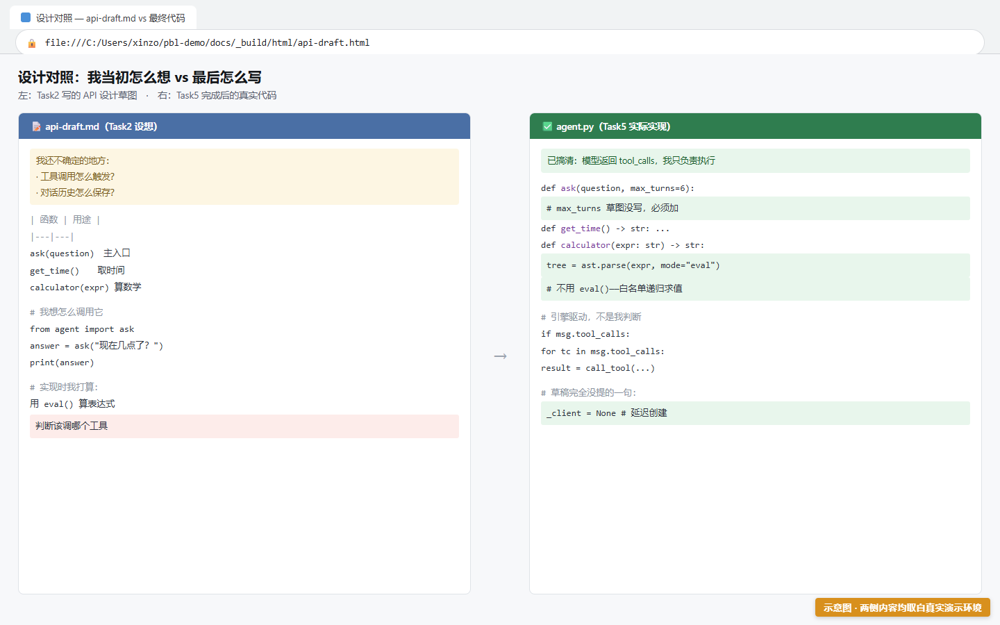
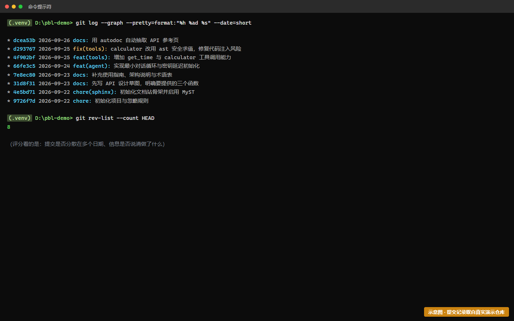

# Task7 — 展示、答辩与反思

> 时长：1 课时 | 难度：★★★☆☆ | 前置：[Task2](task-2-docs.md)、[Task5](task-5-tools.md)、[Task6](task-6-meta-doc.md)
> 🎯 **目标**：完成项目验收——路演、现场答辩、提交反思报告。

---

## 一、路演（5–8 分钟/组）

### 你要展示什么

1. **可运行的智能体** — 现场演示：问时间、算数、随便聊两句
2. **公网文档站** — 打开网址，展示结构（导航、API 页、术语表）
3. **元文档闭环**（如果做了 Task6）— 展示 AI 草稿与你的差异分析

> 📸〔截图位 S7-1〕路演现场演示画面
> 文件名建议：shots/S7-1-路演.png
> 需要显示：学生演示智能体或文档站的画面

### 演示脚本建议

```
1. 开场（30秒）：我们的智能体做什么，一句话说清
2. 功能演示（2分钟）：
   - 问"现在几点" → 展示工具调用
   - 问一道大数乘法 → 强调"这是算出来的，不是猜的"
3. 文档站走查（2分钟）：
   - 首页 → 导航结构
   - API 页 → 指出"这是 autodoc 自动生成的"
   - 术语表 → 说明为什么要有它
4. 亮点（2分钟）：元文档闭环 / 遇到的最大困难
5. 收尾（30秒）：如果再做一次，我会改什么
```

---

## 二、现场答辩 ⚠️（重要）

**老师会随机指定你代码库里的任意一个函数，请你现场解释。**

要求说清四件事：
1. 这个函数**接收什么**（参数）
2. 它**返回什么**
3. 它的**实现逻辑**是什么
4. **为什么这样设计**（有没有其他选择）

### 怎么准备

不要背代码。用这个方法自检：

> 打开 `agent.py`，从第一个函数开始，逐个问自己："如果有人现在问我这个函数，我说得清吗？"
> 说不清的那个，就是你要补的地方。

**常见的"说不清"情况**：
- 知道 `max_turns` 在那儿，但说不清为什么需要它
- 知道用了 `ast`，但说不清为什么不用 `eval`
- 知道 `messages.append(msg)`，但说不清为什么要 append 原消息

这些"说不清"的地方，正是这个项目要教给你的东西。

### 还有一个高频问题：和你当初的设想对得上吗？

老师很可能会问：**"你在 Task2 的 `api-draft.md` 里写的是什么？最后做出来的又是什么？差在哪？"**

所以答辩前，**一定要重读一遍 `docs/api-draft.md`**。这是 Task2 你亲手写的东西，里面记着你当时的理解。对照它看最终代码，通常会发现自己变了不止一处。

> 🔑 **这不是走过场的自测——它就是 AC-6 的核心证据之一。**
> 能说清"我当初以为 X，实际是 Y，原因是 Z"，说明你真的经历了一次理解修正。
> 而这，恰好也满足了 [Task6](task-6-meta-doc.md) 档 C 的差异记录要求（`diff-notes.md` ≥3 条）——**一件事，两处得分。**

常见的对不上（用自己的话重写，别照抄）：

| 你以为 | 实际 | 为什么 |
|---|---|---|
| 工具调用要我自己判断该不该调 | 大模型通过 `tool_calls` 字段主动要求 | 模型自己决定，我只负责执行 |
| 循环就是"发一次、收一次" | 循环需要一个终止条件 | 模型可能"不满足"，会反复调工具 |
| 用 `eval()` 算数最方便 | 必须用 `ast` 安全求值 | `eval` 会执行任意代码 |
| 密钥写在代码里就行 | 必须走 `.env` + `.gitignore` | 一旦推到仓库就等于公开泄露 |



> 🖼 **S7-5 · api-draft.md 与最终代码的对照**
>
> ⚠️ 本图为**示意图**（HTML 合成），用于帮助理解画面结构，**不是真实运行截图**。
> 你的实际界面会与本图有差异（版本号、路径、配色等），以你屏幕上看到的为准。
>
> 📖 原画面说明：api-draft.md 与最终代码的对照

> 📸〔截图位 S7-2〕答辩场景（教师记录表）
> 文件名建议：shots/S7-2-答辩.png
> 需要显示：答辩记录表或师生问答场景

---

## 三、反思报告

提交一份反思报告（建议 800–1500 字），围绕三个问题：

### 问题 1：文档为什么重要？

不要写"文档方便他人理解"这种套话。写你**真实的发现**。比如：

> 我在 Task5 对照 api-draft 的时候发现，我原来以为工具调用要自己判断，
> 实际上是大模型主动要求的。这个误解在我写草图的时候完全没意识到——
> 直到我要把它写清楚，才发现自己其实不懂。

### 问题 2：我在哪一步厘清了模糊的地方？

具体到任务编号和事件。例如：

> Task4 我一开始觉得 Agent Loop 就是"发给模型再拿回来"，
> 直到写 max_turns 的时候才意识到——循环需要一个终止条件，
> 而这意味着模型可能"不满足"，会反复调工具。这一刻我才真正理解了"循环"。

### 问题 3：AI 草稿与我的最终版差异说明了什么？（三档都要答）

> 说明：无论你走的是档 A（老师给的草稿）、档 B（自己生成）还是档 C（拿自己的旧设计对比），
> **这个问题都要答**——因为它问的是你的理解，不是你的配额。

> 草稿说 calculator 会抛 CalculationError，但我的代码根本不抛异常。
> 这让我意识到：草稿只能看到代码表面，看不到我为什么这么写。
> 我的设计意图——比如"失败时返回提示而不是崩溃，因为用户是学生"——
> 只有我自己能写出来。

### 问题 4：回头看 `api-draft.md`，我当初想错了什么？（建议答）

> 我 Task2 的草图里压根没写 `max_turns` 这个参数。
> 当时我以为循环就是"发过去、收回来"，没想到模型可能一直不满足、
> 反复要求调工具。写到一半我程序卡死了才发现这个问题。
> **我当初没写，正是因为我不知道它存在**——文档上的空白，暴露了我理解上的空白。

> 📸〔截图位 S7-3〕反思报告文档
> 文件名建议：shots/S7-3-反思报告.png
> 需要显示：学生的反思报告文本

---

## 四、提交前最终检查

### 代码与文档
- [ ] 智能体可运行，工具调用正常
- [ ] 文档站公网可访问
- [ ] API 页有 autodoc 自动生成的内容
- [ ] 术语表 ≥7 条

### 过程证据（会被检查）
- [ ] **Git 提交历史 ≥5 次原子提交**（不是一次大提交）
  检查命令：`git log --oneline`
- [ ] 每次提交信息有意义（说清做了什么）
- [ ] 无 `.env` 或密钥泄露

### 报告与材料
- [ ] 反思报告已提交（含四个问题的回答，问题 3 必答）
- [ ] `api-draft.md` 含"实现后的对照修正"
- [ ] `diff-notes.md` 含 ≥3 条差异，**且首部如实声明了草稿来源档位**
- [ ] 我能不用看稿子说清 `api-draft.md` 与最终代码的主要差异
- [ ] 路演 PPT / 演示脚本



> 🖼 **S7-4 · git log 展示多次原子提交**
>
> ⚠️ 本图为**示意图**（HTML 合成），用于帮助理解画面结构，**不是真实运行截图**。
> 你的实际界面会与本图有差异（版本号、路径、配色等），以你屏幕上看到的为准。
>
> 📖 原画面说明：git log 展示多次原子提交

---

## 五、评估标准速查

| 评价维度 | 权重 | 你要做到 |
|---|---|---|
| 可运行智能体 | 20% | 能跑、工具调用正确 |
| 文档站质量 | 20% | 结构完整、autodoc 生效、docstring 有意义 |
| **过程性评价** | **40%** | 参与度、协作、探究精神 |
| 跨学科融合 | 10% | 元文档闭环让三者咬合（**Task6 档 A 即可拿到，人人可达**） |
| 展示路演 | 5% | demo 流畅、文档站可访问 |
| 反思报告 | 5% | 有真实洞察，不是套话 |

> ⚠️ 注意**过程性评价占 40%**，比任何一个成果都重。所以：**不要憋大招**，多次小步提交、真实参与讨论、遇到问题主动查证——这些比一个漂亮的最终产物更重要。
>
> 💡 也注意**跨学科融合那 10%**——它的载体是 Task6，而 Task6 的**核心部分（档 A）是必做且零 Token 成本的**。
> 也就是说：**这项分数不取决于你有没有 API 额度，只取决于你有没有认真做审校。**

---

## 六、写在最后

如果你在某个时刻有过"原来是这样"的感觉——那就是这个项目的目的。

这套流程（文档先行 → 代码实现 → 对照修正 → AI 协作 → 差异分析）不只是做个作业。
以后你写任何项目，都可以这么干：**先把想做的事写清楚，实现的时候就知道自己哪里没想明白。**

---
[← 上一个：Task6 元文档闭环](task-6-meta-doc.md) | [返回手册目录](README.md)
