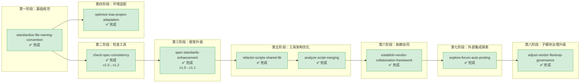

# standards-tools — 规范标准与工具链

本主题包含文档编写标准、命名规范、自动化检查/验证工具、IDE 适配优化相关的规格文档。质量保障工具、规范执行工具、开发环境适配均归入此主题。

**主题状态**：🔧 进行中（13/20 完成）
**上级看板**：[返回全局执行看板](../README.md)
**任务模板**：[standards-tools-task-template.md](../../../.agents/templates/theme-templates/standards-tools-task-template.md)

---

## 📊 主题执行看板

| Spec 名称 | 状态 | 完成度 | 交付物 | 简述 |
|---|---|---|---|---|
| [spec-standards-enhancement](spec-standards-enhancement/spec.md) | ✅ 完成 | 100% | [.agents/scripts/](../../../.agents/scripts/README.md) [.agents/rules/](../../../.agents/rules/README.md) | Spec 文档标准化框架 v1.1：结构规范、TOML frontmatter 版本号、changelog 成对标记、格式检查脚本（完善 9 项边界情况） |
| [standardize-file-naming-convention](standardize-file-naming-convention/spec.md) | ✅ 完成 | 100% | [.agents/rules/](../../../.agents/rules/README.md) | 文件命名规范：中英文分离、kebab-case、特殊字符限制、命名自动化检查脚本 |
| [check-spec-consistency](check-spec-consistency/spec.md) | ✅ 完成 | 100% | [.agents/scripts/check-spec-consistency.py](../../../.agents/scripts/check-spec-consistency.py) | 规格文档一致性检查工具 v1.2：需求→任务/场景→检查点/数据一致性校验，支持元文档识别、阈值配置 |
| [optimize-trae-project-adaptation](optimize-trae-project-adaptation/spec.md) | ✅ 完成 | 100% | 项目配置 | Trae IDE 项目适配优化：工作目录配置、工具链适配、忽略规则优化 |
| [refactor-scripts-shared-lib](refactor-scripts-shared-lib/spec.md) | ✅ 完成 | 100% | [.agents/scripts/lib/](../../../.agents/scripts/lib/README.md) | 脚本共享库提取：消除 12 类重复代码模式（~280行），建立 lib/ 子包（cli/frontmatter/markdown/link_fixer/project/spec） |
| [analyze-script-merging](analyze-script-merging/spec.md) | ✅ 完成 | 100% | 分析报告 | .agents/scripts/ 目录 28 个脚本合并可行性分析：7功能组评估、5组合并/统一入口决策、~425行去重、P0/P1/P2实施路线图 |
| [establish-vendor-collaboration-framework](establish-vendor-collaboration-framework/spec.md) | ✅ 完成 | 100% | [vendor/](../../../vendor/README.md) [docs/knowledge/VENDOR-INTEGRATION.md](../../../.agents/docs/knowledge/VENDOR-INTEGRATION.md) [.agents/scripts/lib/checks/vendor.py](../../../.agents/scripts/lib/checks/vendor.py) [pytest.ini](../../../pytest.ini) | 外部子模块（flexloop）协同集成框架：三区域边界划分、固定commit版本控制、--deep集成验证脚本、测试隔离配置、模式萃取流程、协同操作指南 |
| [explore-forum-auto-posting](explore-forum-auto-posting/spec.md) | 🔧 进行中 | 65% | [docs/knowledge/operations/forum-automation.md](../../../.agents/docs/knowledge/operations/forum-automation.md) | forum.trae.cn论坛自动化操作探索：基于integrated_browser MCP验证编辑/回复/删草稿功能，DOM选择器确认，备选方案调研（REST API/@discourse/mcp），知识库文档v2.1已完成，Skill封装与收尾待完成 |
| [adjust-vendor-flexloop-governance](adjust-vendor-flexloop-governance/spec.md) | ✅ 完成 | 100% | [.gitmodules](../../../.gitmodules) [.agents/scripts/lib/checks/vendor.py](../../../.agents/scripts/lib/checks/vendor.py) `vendor_sandbox.py` [vendor/VERSION.md](../../../vendor/VERSION.md) | flexloop子模块治理模式调整：从第三方只读转为自有协作子模块，支持main分支跟踪、双模式检查、条件导入沙箱、反向依赖检测、运行时隔离 |
| [fix-windows-terminal-chinese-encoding](fix-windows-terminal-chinese-encoding/spec.md) | ✅ 完成 | 100% | [.agents/scripts/setup-utf8-env.ps1](../../../.agents/scripts/setup-utf8-env.ps1) [.agents/scripts/check-encoding.ps1](../../../.agents/scripts/check-encoding.ps1) [.agents/scripts/verify-encoding.ps1](../../../.agents/scripts/verify-encoding.ps1) [.agents/scripts/sitecustomize.py](../../../.agents/scripts/sitecustomize.py) [docs/knowledge/operations/windows-terminal-utf8-complete-guide.md](../../../.agents/docs/knowledge/operations/windows-terminal-utf8-complete-guide.md) | Windows终端中文编码彻底修复：一键配置脚本、编码诊断/验证工具、PowerShell Profile、CMD AutoRun、Python UTF-8默认配置（sitecustomize.py）、四层防护体系、完整知识库文档 |
| [establish-mermaid-management-system](establish-mermaid-management-system/spec.md) | ✅ 完成 | 100% | [.agents/commands/mermaid.md](../../../.agents/commands/mermaid.md) [.agents/teams/mermaid-team.md](../../../.agents/teams/mermaid-team.md) [.agents/teams/data/team-mermaid.yaml](../../../.agents/teams/data/team-mermaid.yaml) [.agents/scripts/lib/checks/mermaid.py](../../../.agents/scripts/lib/checks/mermaid.py) | Mermaid图表管理体系：指令集+命令门面Skill+角色能力增强+专项团队，支持classDiagram/erDiagram检查修复，遵循渐进式披露三层架构 |
| [markdown-as-interface-research](markdown-as-interface-research/spec.md) | 🔧 进行中 | 56% | [.agents/scripts/mdi/](../../../.agents/scripts/mdi/README.md) [docs/knowledge/mdi-spec-v1.0.md](../../../.agents/docs/knowledge/mdi-spec-v1.0.md) | Markdown即接口深度研究：解析器/验证器/代码生成器（Python/TS/OpenAPI/MCP）已完成，测试生成器/版本工具/验证案例/研究报告待完成，支持MyST directives与传统格式双模式 |
| [add-tuya-ipc-minimal-closed-loop-guide](add-tuya-ipc-minimal-closed-loop-guide/spec.md) | ✅ 完成 | 100% | [docs/knowledge/operations/tuya-ipc-minimal-closed-loop.md](../../../.agents/docs/knowledge/operations/tuya-ipc-minimal-closed-loop.md) | 涂鸦Tuya IPC最小闭环跑通路径：端-云-手机全流程步骤、可观测验收标准、依赖关系图、常见问题排查方向 |
| [migrate-toml-frontmatter-to-yaml](migrate-toml-frontmatter-to-yaml/spec.md) | 📋 待启动 | 0% | [.agents/scripts/migrate-frontmatter.py](../../../.agents/scripts/migrate-frontmatter.py) [.meta/toml/](../../../.meta/toml/README.md) | TOML→YAML frontmatter全面迁移：将833个`+++`TOML文件统一迁移为`---`YAML格式+`x-toml-ref`外部引用，更新frontmatter.py解析库支持x-toml-ref，更新所有依赖脚本，建立备份回滚机制 |
| [create-tvm-ffi-wiki-tutorial](create-tvm-ffi-wiki-tutorial/spec.md) | 📋 待启动 | 0% | [docs/knowledge/learning/tvm-ffi-wiki/](../../../.agents/docs/knowledge/learning/01-agent-protocols-interfaces/tvm-ffi-wiki/README.md) | TVM FFI 完整 Wiki 教程：基于源码和官方文档的系统性学习资料，覆盖C++ API、Python绑定、容器类型、反射系统、CUDA支持、ORCJIT扩展等16个章节 |
| [learn-volcengine-mobileuse-agent](learn-volcengine-mobileuse-agent/spec.md) | ✅ 完成 | 100% | [volcengine-mobileuse-agent-skill-api-guide.md](../../../.agents/docs/knowledge/learning/07-vendor-product-learning/volcengine/volcengine-mobileuse-agent-skill-api-guide.md) | 火山引擎Mobile Use Agent Skill与API技术实现指南：ClawHub Skill安装配置、RunAgentTaskOneStep完整参数、JSONL流式输出格式解析、OpenClaw部署、错误处理与最佳实践（15章技术参考文档） |
| [sensitive-info-sanitization-audit](sensitive-info-sanitization-audit/spec.md) | 📋 待启动 | 0% | [.agents/scripts/check-sensitive-info.py](../../../.agents/scripts/check-sensitive-info.py) | 项目全面敏感信息脱敏检查与自动化检测工具：识别个人身份信息/API密钥/数据库连接/内部路径等，自动脱敏修复，.gitignore规则完善，生成审计报告 |
| [check-academic-sources](check-academic-sources/spec.md) | 📋 待启动 | 0% | [.agents/scripts/check-academic-sources.py](../../../.agents/scripts/check-academic-sources.py) | 学术来源自动验证脚本：通过CrossRef API验证DOI存在性、元数据一致性比对（标题/作者/年份模糊匹配），支持缓存与并发，只读不修改文件，不做引用计数/自动修复（MVP范围L0+L1+L2） |
| [create-seven-concepts-deeptutor-wiki-tutorial](create-seven-concepts-deeptutor-wiki-tutorial/spec.md) | 📋 待启动 | 0% | [docs/knowledge/learning/02-agent-engineering-methodology/seven-concepts-deeptutor-wiki/](../../../.agents/docs/knowledge/learning/02-agent-engineering-methodology/seven-concepts-deeptutor-wiki/README.md) | 七概念理论与DeepTutor实践案例Wiki教程：整合R-I-E-C-A-F-V七概念方法论与港大DeepTutor开源AI学习工作空间案例，采用SVA事实核查+术语漂移防御，原子化文档结构，含理论阐述/案例详解/融合分析/学习路径/实践练习 |
| [generate-first-principles-knowledge-graph](generate-first-principles-knowledge-graph/spec.md) | ✅ 完成 | 100% | [.agents/scripts/generate-knowledge-graph.py](../../../.agents/scripts/generate-knowledge-graph.py) [12-knowledge-graph.html](../../../.agents/docs/knowledge/learning/first-principles/12-knowledge-graph.html) | 第一性原理交互式知识图谱：从概念术语表和时间线Markdown自动提取节点（24概念+13人物+19事件+13文档+4时期=73节点）和关系（176边），生成vis-network力导向图HTML，支持点击详情、类型/领域筛选、搜索定位、邻居高亮、离线降级 |

---

## 🔀 主题内执行路线图



### 执行顺序说明

1. **standardize-file-naming-convention**（最先执行）：命名规范是所有工具和规范的基础
2. **check-spec-consistency**：在命名规范基础上构建一致性检查工具，经历了 v1.0→v1.2 三次迭代优化
3. **spec-standards-enhancement**：在一致性检查工具基础上升级为完整的 spec 标准化框架 v1.1，完善了 9 项边界情况并与实际项目格式对齐
4. **optimize-trae-project-adaptation**：IDE 适配可独立进行，与规范建设并行
5. **refactor-scripts-shared-lib**：在脚本数量增多、重复代码积累后，提取共享库消除重复
6. **analyze-script-merging**：在共享库完成后，进一步分析脚本入口组织方式，为后续合并优化提供决策依据
7. **establish-vendor-collaboration-framework**：在共享库和脚本架构稳定后，建立外部子模块（git submodule）协同集成框架，含边界划分、版本控制、深度验证、测试隔离、模式萃取
8. **explore-forum-auto-posting**：在项目工具链稳定后，探索外部平台（forum.trae.cn）自动化操作能力，验证integrated_browser MCP方案，产出知识库操作指南
9. **adjust-vendor-flexloop-governance**：在vendor协同框架基础上，将flexloop从第三方只读子模块升级为自有协作子模块，支持main分支跟踪、双模式检查、条件导入沙箱、反向依赖检测与运行时隔离

---

## ✅ 交付物索引

| 交付物 | 路径 | 用途 |
|---|---|---|
| Spec 编写指南 | [.agents/rules/spec-writing-guide.md](../../../.agents/rules/spec-writing-guide.md) | Spec 结构规范、命名约定、Good/Bad 示例、快速检查清单、参考模板 |
| Spec 版本控制规范 | [.agents/rules/spec-version-control.md](../../../.agents/rules/spec-version-control.md) | 语义化版本号规则、changelog 模板、弃用流程 |
| 格式检查脚本 | [.agents/scripts/check-spec-format.py](../../../.agents/scripts/check-spec-format.py) | 自动化 Spec 格式验证，支持 9 项边界情况兼容 |
| 一致性检查脚本 | [.agents/scripts/check-spec-consistency.py](../../../.agents/scripts/check-spec-consistency.py) | Requirement→Scenario→Checklist 一致性校验 |
| 共享工具库 | [.agents/scripts/lib/](../../../.agents/scripts/lib/README.md) | Python 脚本共享模块（cli/frontmatter/markdown/link_fixer/project/spec） |
| Vendor 协同操作指南 | [docs/knowledge/VENDOR-INTEGRATION.md](../../../.agents/docs/knowledge/VENDOR-INTEGRATION.md) | 外部子模块协同规范：边界划分、版本控制、更新同步、测试隔离、模式萃取 |
| Vendor 深度集成验证 | [.agents/scripts/lib/checks/vendor.py](../../../.agents/scripts/lib/checks/vendor.py)（`--deep` 参数） | Submodule 初始化/清洁度/元数据一致性/非法引用/pytest 隔离 五项深度检查 |
| Pytest 配置 | [pytest.ini](../../../pytest.ini) | pytest norecursedirs 排除 vendor/.temp/.venv，testpaths 限定测试目录 |
| 论坛自动化操作指南 | [docs/knowledge/operations/forum-automation.md](../../../.agents/docs/knowledge/operations/forum-automation.md) | forum.trae.cn 基于 integrated_browser MCP 的自动化操作：DOM选择器、操作序列、JS代码片段、故障排查、@discourse/mcp接入指南 |
| flexloop 运行时沙箱 | `vendor_sandbox.py` | 自有协作子模块安全运行工具：FLEXLOOP_AVAILABLE检测、conditional_import条件导入、run_flexloop_script子进程沙箱执行 |
| Vendor 双模式检查 | [.agents/scripts/lib/checks/vendor.py](../../../.agents/scripts/lib/checks/vendor.py)（双模式支持） | 子模块类型识别（third_party/owned_collab）、分支跟踪检查、反向依赖检测、条件导入识别、Windows编码兼容 |
| UTF-8编码一键配置 | [.agents/scripts/setup-utf8-env.ps1](../../../.agents/scripts/setup-utf8-env.ps1) | Windows终端UTF-8环境一键初始化：交互/非交互模式、会话/用户/系统三级配置、集成诊断+安装+验证全流程，同步设置PYTHONPATH使sitecustomize.py自动加载 |
| 编码诊断工具 | [.agents/scripts/check-encoding.ps1](../../../.agents/scripts/check-encoding.ps1) | 终端编码健康诊断：11项检查（代码页/Console编码/Python/Git/环境变量）、彩色报告、JSON输出、修复建议 |
| 编码验证工具 | [.agents/scripts/verify-encoding.ps1](../../../.agents/scripts/verify-encoding.ps1) | UTF-8配置全面验证：14项场景测试（PS/Python/Cmd/Git/管道/emoji）、PASS/FAIL状态、退出码、JSON模式 |
| Windows UTF-8配置指南 | [docs/knowledge/operations/windows-terminal-utf8-complete-guide.md](../../../.agents/docs/knowledge/operations/windows-terminal-utf8-complete-guide.md) | 完整Windows终端UTF-8配置文档：四层问题分析、四种配置方案、FAQ、故障排查对照表 |
| Mermaid指令集 | [.agents/commands/mermaid.md](../../../.agents/commands/mermaid.md) | Mermaid图表标准化操作流程：生成/检查/修复/模板/验收/交付6个子流程，含RACI矩阵和CMD-LOG规范 |
| Mermaid专项团队 | [.agents/teams/mermaid-team.md](../../../.agents/teams/mermaid-team.md) [.agents/teams/data/team-mermaid.yaml](../../../.agents/teams/data/team-mermaid.yaml) | Mermaid图表协作团队定义：4个现有工程角色组成、3个标准工作流、治理范围与权限配置 |
| Mermaid检查器增强 | [.agents/scripts/lib/checks/mermaid.py](../../../.agents/scripts/lib/checks/mermaid.py) | Mermaid语法检查脚本增强：新增classDiagram/erDiagram支持，含空行检测、引号检查、自动修复 |
| MDI规范v1.0 | [docs/knowledge/mdi-spec-v1.0.md](../../../.agents/docs/knowledge/mdi-spec-v1.0.md) | Markdown即接口规范v1.0：元数据模型、结构映射规则、3类场景Profile、MyST directives扩展、工具链架构 |
| MDI工具链 | [.agents/scripts/mdi/](../../../.agents/scripts/mdi/README.md) | Markdown Interface工具链：parser.py（markdown-it-py AST解析）、validator.py（规范验证）、generator.py（多语言代码生成），支持Python/TypeScript/OpenAPI/MCP/CLI/Markdown导出 |
| Tuya IPC最小闭环指南 | [docs/knowledge/operations/tuya-ipc-minimal-closed-loop.md](../../../.agents/docs/knowledge/operations/tuya-ipc-minimal-closed-loop.md) | 涂鸦IPC最小闭环跑通路径：端-云-手机全流程步骤、可观测验收标准、Mermaid依赖关系图、常见问题排查索引 |
| 第一性原理知识图谱生成器 | [.agents/scripts/generate-knowledge-graph.py](../../../.agents/scripts/generate-knowledge-graph.py) [知识图谱HTML](../../../.agents/docs/knowledge/learning/first-principles/12-knowledge-graph.html) | 从Markdown知识档案自动提取概念/人物/事件/文档/时期节点和关系，生成vis-network交互式力导向图HTML，支持筛选/搜索/详情/邻居高亮/离线降级 |

---

## 📐 主题边界与判定规则

### 归入本主题的条件
- 制定文档/代码/文件的编写规范和标准
- 开发自动化检查、验证、审计类脚本工具
- 开发环境、IDE、CI/CD 的适配配置
- 项目构建、测试、部署工具链的配置优化
- 规范执行的检查脚本和验证机制

### 不归入本主题的情况
- 创建新的核心系统或目录结构 → 归入 `core-foundation/`
- 定义角色或治理规则 → 归入 `roles-governance/`
- 纯文档结构重组（不涉及工具或规范变更） → 归入 `docs-restructure/`
- 对工具建设过程的复盘分析 → 归入 `retrospectives-insights/`

---

## 🆕 新增 Spec 指南

### 命名规范
- 使用 kebab-case，动词开头
- 常用前缀：`check-`（检查工具）、`standardize-`（标准化规范）、`optimize-`（优化适配）、`add-`（新增工具）、`enforce-`（强制执行机制）
- 示例：`add-link-validator`、`standardize-commit-message-format`、`optimize-build-performance`

### tasks.md 必备检查项

```markdown
- [ ] Task 0: 需求分析与设计
  - [ ] SubTask 0.1: 明确规范要解决的具体问题或工具要检查的具体场景
  - [ ] SubTask 0.2: 调研现有相关脚本/规范，避免重复建设
  - [ ] SubTask 0.3: 设计规范标准/工具的输入输出与核心逻辑
  - [ ] SubTask 0.4: 确定异常情况处理策略（误报、漏报、边界条件）

- [ ] Task 1: 规范/工具核心实现
  - [ ] SubTask 1.1: 编写规范文档（放在 .agents/rules/ 或 docs/knowledge/ 下）
  - [ ] SubTask 1.2: 实现核心脚本/工具（放在 .agents/scripts/ 下）
  - [ ] SubTask 1.3: 编写使用说明文档（README 或脚本头部注释）
  - [ ] SubTask 1.4: 支持命令行参数或配置项（如适用）

- [ ] Task 2: 测试与验证
  - [ ] SubTask 2.1: 对正确场景测试，确认不产生误报
  - [ ] SubTask 2.2: 对错误场景测试，确认能正确检测
  - [ ] SubTask 2.3: 边界条件测试（空文件、特殊字符、跨平台路径等）
  - [ ] SubTask 2.4: 在现有代码库/文档库上试运行，验证效果

- [ ] Task 3: 集成与文档
  - [ ] SubTask 3.1: 将工具加入 CI 检查流程或 pre-commit hook（如适用）
  - [ ] SubTask 3.2: 更新工具索引（.agents/scripts/README.md 或相关文档）
  - [ ] SubTask 3.3: 在 AGENTS.md 工具规范索引中登记（如新增工具类型）
  - [ ] SubTask 3.4: 在本主题 README.md 中登记完成状态
```

### checklist.md 必备检查项
- 脚本支持跨平台路径（Windows 反斜杠 `/` 与正斜杠 `\` 兼容）
- 脚本包含清晰的帮助信息（`--help` 参数或头部注释说明用法）
- 规范文档包含：规则说明、正例反例、检测方法、例外处理
- 工具脚本有基本的错误处理和友好的错误提示
- 工具/规范已在现有项目上验证，输出结果合理
- 脚本放在正确的目录（.agents/scripts/ 下）并遵循现有命名风格
- 相关索引文档已更新，使用者可以发现这个工具/规范

---

## 📁 目录结构

```
standards-tools/
├── README.md                                   # 本文件（主题执行看板）
├── add-tuya-ipc-minimal-closed-loop-guide/
│   ├── spec.md
│   ├── tasks.md
│   └── checklist.md
├── adjust-vendor-flexloop-governance/
│   ├── spec.md
│   ├── tasks.md
│   └── checklist.md
├── analyze-script-merging/
│   ├── spec.md
│   ├── tasks.md
│   ├── checklist.md
│   └── report.md
├── check-spec-consistency/
│   ├── spec.md
│   ├── tasks.md
│   └── checklist.md
├── check-academic-sources/
│   ├── spec.md
│   ├── tasks.md
│   └── checklist.md
├── create-tvm-ffi-wiki-tutorial/
│   ├── spec.md
│   ├── tasks.md
│   └── checklist.md
├── create-seven-concepts-deeptutor-wiki-tutorial/
│   ├── spec.md
│   ├── tasks.md
│   └── checklist.md
├── establish-mermaid-management-system/
│   ├── spec.md
│   ├── tasks.md
│   └── checklist.md
├── establish-vendor-collaboration-framework/
│   ├── spec.md
│   ├── tasks.md
│   └── checklist.md
├── explore-forum-auto-posting/
│   ├── spec.md
│   ├── tasks.md
│   └── checklist.md
├── fix-windows-terminal-chinese-encoding/
│   ├── spec.md
│   ├── tasks.md
│   └── checklist.md
├── generate-first-principles-knowledge-graph/
│   ├── spec.md
│   ├── tasks.md
│   └── checklist.md
├── markdown-as-interface-research/
│   ├── spec.md
│   ├── tasks.md
│   └── checklist.md
├── migrate-toml-frontmatter-to-yaml/
│   ├── spec.md
│   ├── tasks.md
│   └── checklist.md
├── optimize-trae-project-adaptation/
│   ├── spec.md
│   ├── tasks.md
│   └── checklist.md
├── refactor-scripts-shared-lib/
│   ├── spec.md
│   ├── tasks.md
│   └── checklist.md
├── sensitive-info-sanitization-audit/
│   ├── spec.md
│   ├── tasks.md
│   └── checklist.md
├── spec-standards-enhancement/
│   ├── spec.md
│   ├── tasks.md
│   └── checklist.md
└── standardize-file-naming-convention/
    ├── spec.md
    ├── tasks.md
    └── checklist.md
```
