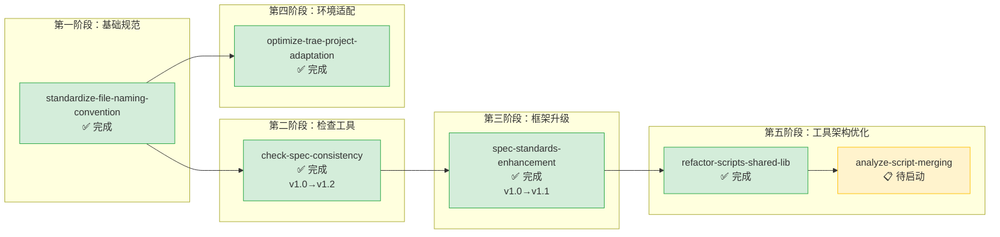

# standards-tools — 规范标准与工具链

本主题包含文档编写标准、命名规范、自动化检查/验证工具、IDE 适配优化相关的规格文档。质量保障工具、规范执行工具、开发环境适配均归入此主题。

**主题状态**：🔧 进行中（5/6 完成）
**上级看板**：[返回全局执行看板](../README.md)
**任务模板**：[standards-tools-task-template.md](../../../.agents/templates/theme-templates/standards-tools-task-template.md)

---

## 📊 主题执行看板

| Spec 名称 | 状态 | 完成度 | 交付物 | 简述 |
|---|---|---|---|---|
| [spec-standards-enhancement](spec-standards-enhancement/) | ✅ 完成 | 100% | [.agents/scripts/](../../../.agents/scripts/) [.agents/rules/](../../../.agents/rules/) | Spec 文档标准化框架 v1.1：结构规范、TOML frontmatter 版本号、changelog 成对标记、格式检查脚本（完善 9 项边界情况） |
| [standardize-file-naming-convention](standardize-file-naming-convention/) | ✅ 完成 | 100% | [.agents/rules/](../../../.agents/rules/) | 文件命名规范：中英文分离、kebab-case、特殊字符限制、命名自动化检查脚本 |
| [check-spec-consistency](check-spec-consistency/) | ✅ 完成 | 100% | [.agents/scripts/check-spec-consistency.py](../../../.agents/scripts/check-spec-consistency.py) | 规格文档一致性检查工具 v1.2：需求→任务/场景→检查点/数据一致性校验，支持元文档识别、阈值配置 |
| [optimize-trae-project-adaptation](optimize-trae-project-adaptation/) | ✅ 完成 | 100% | 项目配置 | Trae IDE 项目适配优化：工作目录配置、工具链适配、忽略规则优化 |
| [refactor-scripts-shared-lib](refactor-scripts-shared-lib/) | ✅ 完成 | 100% | [.agents/scripts/lib/](../../../.agents/scripts/lib/) | 脚本共享库提取：消除 12 类重复代码模式（~280行），建立 lib/ 子包（cli/frontmatter/markdown/link_fixer/project/spec） |
| [analyze-script-merging](analyze-script-merging/) | 📋 待启动 | 0% | 分析报告 | .agents/scripts/ 目录 28 个脚本合并可行性分析：功能分组、合并建议、收益风险评估、实施路线图 |

---

## 🔀 主题内执行路线图



### 执行顺序说明

1. **standardize-file-naming-convention**（最先执行）：命名规范是所有工具和规范的基础
2. **check-spec-consistency**：在命名规范基础上构建一致性检查工具，经历了 v1.0→v1.2 三次迭代优化
3. **spec-standards-enhancement**：在一致性检查工具基础上升级为完整的 spec 标准化框架 v1.1，完善了 9 项边界情况并与实际项目格式对齐
4. **optimize-trae-project-adaptation**：IDE 适配可独立进行，与规范建设并行
5. **refactor-scripts-shared-lib**：在脚本数量增多、重复代码积累后，提取共享库消除重复
6. **analyze-script-merging**：在共享库完成后，进一步分析脚本入口组织方式，为后续合并优化提供决策依据

---

## ✅ 交付物索引

| 交付物 | 路径 | 用途 |
|---|---|---|
| Spec 编写指南 | [.agents/rules/spec-writing-guide.md](../../../.agents/rules/spec-writing-guide.md) | Spec 结构规范、命名约定、Good/Bad 示例、快速检查清单、参考模板 |
| Spec 版本控制规范 | [.agents/rules/spec-version-control.md](../../../.agents/rules/spec-version-control.md) | 语义化版本号规则、changelog 模板、弃用流程 |
| 格式检查脚本 | [.agents/scripts/check-spec-format.py](../../../.agents/scripts/check-spec-format.py) | 自动化 Spec 格式验证，支持 9 项边界情况兼容 |
| 一致性检查脚本 | [.agents/scripts/check-spec-consistency.py](../../../.agents/scripts/check-spec-consistency.py) | Requirement→Scenario→Checklist 一致性校验 |
| 共享工具库 | [.agents/scripts/lib/](../../../.agents/scripts/lib/) | Python 脚本共享模块（cli/frontmatter/markdown/link_fixer/project/spec） |

---

## 📐 主题边界与判定规则

### 归入本主题的条件
- 制定文档/代码/文件的编写规范和标准
- 开发自动化检查、验证、审计类脚本工具
- 开发环境、IDE、CI/CD 的适配配置
- 项目构建、测试、部署工具链的配置优化
- 规范执行的检查脚本和验证机制

### 不归入本主题的情况
- 创建新的核心系统或目录结构 → 归入 `core-foundation/`
- 定义角色或治理规则 → 归入 `roles-governance/`
- 纯文档结构重组（不涉及工具或规范变更） → 归入 `docs-restructure/`
- 对工具建设过程的复盘分析 → 归入 `retrospectives-insights/`

---

## 🆕 新增 Spec 指南

### 命名规范
- 使用 kebab-case，动词开头
- 常用前缀：`check-`（检查工具）、`standardize-`（标准化规范）、`optimize-`（优化适配）、`add-`（新增工具）、`enforce-`（强制执行机制）
- 示例：`add-link-validator`、`standardize-commit-message-format`、`optimize-build-performance`

### tasks.md 必备检查项

```markdown
- [ ] Task 0: 需求分析与设计
  - [ ] SubTask 0.1: 明确规范要解决的具体问题或工具要检查的具体场景
  - [ ] SubTask 0.2: 调研现有相关脚本/规范，避免重复建设
  - [ ] SubTask 0.3: 设计规范标准/工具的输入输出与核心逻辑
  - [ ] SubTask 0.4: 确定异常情况处理策略（误报、漏报、边界条件）

- [ ] Task 1: 规范/工具核心实现
  - [ ] SubTask 1.1: 编写规范文档（放在 .agents/rules/ 或 docs/knowledge/ 下）
  - [ ] SubTask 1.2: 实现核心脚本/工具（放在 .agents/scripts/ 下）
  - [ ] SubTask 1.3: 编写使用说明文档（README 或脚本头部注释）
  - [ ] SubTask 1.4: 支持命令行参数或配置项（如适用）

- [ ] Task 2: 测试与验证
  - [ ] SubTask 2.1: 对正确场景测试，确认不产生误报
  - [ ] SubTask 2.2: 对错误场景测试，确认能正确检测
  - [ ] SubTask 2.3: 边界条件测试（空文件、特殊字符、跨平台路径等）
  - [ ] SubTask 2.4: 在现有代码库/文档库上试运行，验证效果

- [ ] Task 3: 集成与文档
  - [ ] SubTask 3.1: 将工具加入 CI 检查流程或 pre-commit hook（如适用）
  - [ ] SubTask 3.2: 更新工具索引（.agents/scripts/README.md 或相关文档）
  - [ ] SubTask 3.3: 在 AGENTS.md 工具规范索引中登记（如新增工具类型）
  - [ ] SubTask 3.4: 在本主题 README.md 中登记完成状态
```

### checklist.md 必备检查项
- 脚本支持跨平台路径（Windows 反斜杠 `/` 与正斜杠 `\` 兼容）
- 脚本包含清晰的帮助信息（`--help` 参数或头部注释说明用法）
- 规范文档包含：规则说明、正例反例、检测方法、例外处理
- 工具脚本有基本的错误处理和友好的错误提示
- 工具/规范已在现有项目上验证，输出结果合理
- 脚本放在正确的目录（.agents/scripts/ 下）并遵循现有命名风格
- 相关索引文档已更新，使用者可以发现这个工具/规范

---

## 📁 目录结构

```
standards-tools/
├── README.md                                   # 本文件（主题执行看板）
├── analyze-script-merging/
│   ├── spec.md
│   ├── tasks.md
│   └── checklist.md
├── check-spec-consistency/
│   ├── spec.md
│   ├── tasks.md
│   └── checklist.md
├── optimize-trae-project-adaptation/
│   ├── spec.md
│   ├── tasks.md
│   └── checklist.md
├── refactor-scripts-shared-lib/
│   ├── spec.md
│   ├── tasks.md
│   └── checklist.md
├── spec-standards-enhancement/
│   ├── spec.md
│   ├── tasks.md
│   └── checklist.md
└── standardize-file-naming-convention/
    ├── spec.md
    ├── tasks.md
    └── checklist.md
```
