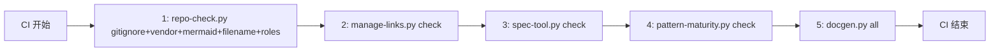
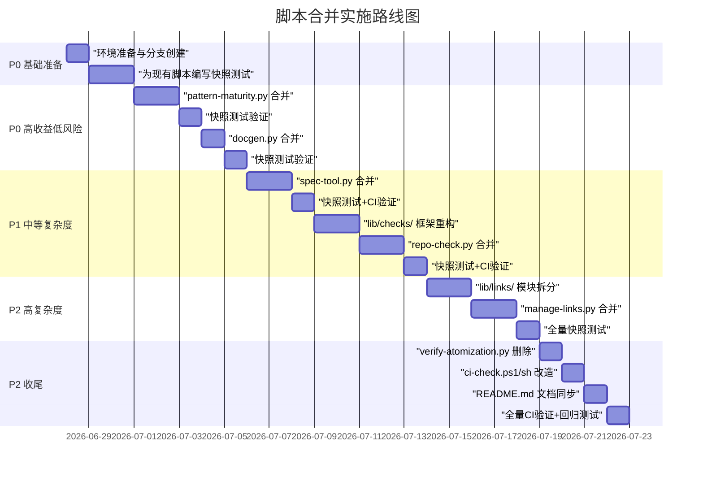

# 脚本合并可行性分析报告

## 1. 执行摘要

本报告对 `.agents/scripts/` 目录下 28 个文件进行系统性合并可行性分析。通过 5 维度评估（功能内聚度、数据耦合度、CLI 一致性、执行频率相似度、合并后代码量适宜度），建议将 16 个脚本合并为 5 个统一工具，删除 1 个一次性硬编码脚本，顶层脚本数量从 25 个减少到 12 个（减少 52%），消除约 425 行重复代码。

### 核心结论表

| 功能组 | 文件数 | 合并前 LOC | 决策 | 合并后文件 | 合并后 LOC | 减少脚本数 |
|--------|--------|-----------|------|-----------|-----------|-----------|
| 模式成熟度 | 3 | 957 | **合并** | pattern-maturity.py | ~380 | 2 |
| 索引导航生成 | 4 | 781 | **合并** | docgen.py | ~350 | 3 |
| Spec 工具 | 3 | 826 | **合并** | spec-tool.py | ~400 | 2 |
| 链接管理 | 3 | 1191 | **统一入口** | manage-links.py (子命令) | ~200 + lib/links/ | 0 |
| 仓库合规检查 | 5 | 1074 | **统一入口** | repo-check.py (子命令) | ~250 + lib/checks/ | 0 |
| 原子化工作流 | 4 | 826 | **不合并** | 保留独立脚本 | - | 0 |
| 其他专项 | 3 | 489 | **不合并** | 保留独立脚本 | - | 0 |
| 辅助文件 | 3 | 541 | **保留/改造** | constants.py/CI/README | - | 0 |
| **合计** | **28** | **6685** | - | - | - | **7 (删除1+合并6)** |

### 关键收益

- **代码去重**：消除 3 个成熟度脚本间的 `scan_patterns()` 重复、2 个 Spec 脚本间的 `find_spec_directories()` 重复、链接解析逻辑重复，共约 425 行
- **CI 简化**：9 步独立脚本调用简化为 5 步统一入口调用
- **体验提升**：相关功能通过子命令聚合，减少记忆负担；`repo-check.py all` 一键运行所有合规检查
- **向后兼容**：所有被合并脚本保留薄包装层，旧调用方式不受影响

---

## 2. 现状分析

### 2.1 脚本清单（28 文件）

| 文件 | LOC | 功能分类 | CI 调用 |
|------|-----|---------|---------|
| build-ref-index.py | 436 | 链接管理 | ❌ |
| check-action-items.py | 160 | 其他专项 | ❌ |
| check-atomization-coverage.py | 198 | 原子化工作流 | ❌ |
| check-atomization-duplication.py | 366 | 原子化+成熟度 | ❌ |
| check-filename-convention.py | 233 | 仓库合规 | ✅步骤7 |
| check-gitignore.py | 79 | 仓库合规 | ✅步骤1 |
| check-links.py | 500 | 链接管理 | ✅步骤3 |
| check-mermaid.py | 233 | 仓库合规 | ✅步骤4 |
| check-move.py | 255 | 链接管理 | ❌ |
| check-report-categorization.py | 136 | 其他专项 | ❌ |
| check-retrospective-index.py | 260 | 索引导航 | ❌ |
| check-role-permissions.py | 201 | 仓库合规 | ❌ |
| check-source-traceability.py | 193 | 其他专项 | ❌ |
| check-spec-consistency.py | 322 | Spec工具 | ✅步骤5 |
| check-spec-format.py | 217 | Spec工具 | ❌ |
| check-vendor.py | 328 | 仓库合规 | ✅步骤2 |
| ci-check.ps1 | 104 | CI入口 | CI入口 |
| ci-check.sh | 105 | CI入口 | CI入口 |
| constants.py | 112 | 基础模块 | 基础 |
| finalize-atomization.py | 190 | 原子化工作流 | ❌ |
| generate-apps-index.py | 137 | 索引导航 | ❌ |
| generate-dashboard.py | 269 | 索引导航 | ✅步骤8 |
| generate-nav.py | 115 | 索引导航 | ✅步骤9 |
| generate-tests.py | 287 | Spec工具 | ❌ |
| pattern-maturity-stats.py | 288 | 模式成熟度 | ✅步骤6 |
| README.md | 325 | 文档 | - |
| scan-maturity-upgrades.py | 303 | 模式成熟度 | ❌ |
| verify-atomization.py | 72 | 原子化(硬编码) | ❌ |

### 2.2 CI 调用流程

```mermaid
flowchart LR
    START["CI 开始"] --> S1["1: check-gitignore"]
    S1 --> S2["2: check-vendor"]
    S2 --> S3["3: check-links"]
    S3 --> S4["4: check-mermaid"]
    S4 --> S5["5: check-spec-consistency"]
    S5 --> S6["6: pattern-maturity-stats --check"]
    S6 --> S7["7: check-filename-convention"]
    S7 --> S8["8: generate-dashboard"]
    S8 --> S9["9: generate-nav"]
    S9 --> END_NODE["CI 结束"]
```



### 2.3 脚本依赖关系图

```mermaid
flowchart TD
    subgraph G0 ["基础层"]
        CONST["constants.py"]
        LIB_PROJ["lib.project"]
        LIB_CLI["lib.cli"]
        LIB_FM["lib.frontmatter"]
        LIB_LF["lib.link_fixer"]
        LIB_MD["lib.markdown"]
        LIB_SPEC["lib.spec"]
    end
    subgraph G1 ["链接管理组"]
        CL["check-links.py"]
        BRI["build-ref-index.py"]
        CM["check-move.py"]
    end
    subgraph G2 ["仓库合规组"]
        CGI["check-gitignore.py"]
        CV["check-vendor.py"]
        CM2["check-mermaid.py"]
        CFC["check-filename-convention.py"]
        CRP["check-role-permissions.py"]
    end
    subgraph G3 ["Spec工具组"]
        CSC["check-spec-consistency.py"]
        CSF["check-spec-format.py"]
        GT["generate-tests.py"]
    end
    subgraph G4 ["模式成熟度组"]
        PMS["pattern-maturity-stats.py"]
        SMU["scan-maturity-upgrades.py"]
        CAD["check-atomization-duplication.py"]
    end
    subgraph G5 ["索引导航组"]
        GN["generate-nav.py"]
        GD["generate-dashboard.py"]
        GAI["generate-apps-index.py"]
        CRI["check-retrospective-index.py"]
    end
    CONST --> CL
    CONST --> BRI
    CONST --> GN
    CONST --> GD
    LIB_PROJ --> CL
    LIB_PROJ --> BRI
    LIB_PROJ --> CM
    LIB_PROJ --> CSC
    LIB_PROJ --> CSF
    LIB_PROJ --> SMU
    LIB_PROJ --> GN
    LIB_PROJ --> GD
    LIB_PROJ --> CV
    LIB_PROJ --> CRP
    LIB_CLI --> CL
    LIB_CLI --> BRI
    LIB_CLI --> CSC
    LIB_CLI --> SMU
    LIB_CLI --> CFC
    LIB_CLI --> CRP
    LIB_FM --> PMS
    LIB_FM --> SMU
    LIB_FM --> GD
    LIB_FM --> CSC
    LIB_LF --> CL
    LIB_LF --> BRI
    LIB_LF --> CM
    LIB_MD --> GN
    LIB_MD --> GD
    LIB_MD --> GAI
    LIB_SPEC --> CSC
    LIB_SPEC --> CSF
    LIB_SPEC --> GT
```



---

## 3. 七个功能组详细评估

### 3.1 原子化工作流组

**包含脚本**：check-atomization-coverage.py (198)、check-atomization-duplication.py (366)、finalize-atomization.py (190)、verify-atomization.py (72)

| 评估维度 | 评分 | 理由 |
|---------|------|------|
| 功能内聚度 | 3 | 同属原子化流程，但执行阶段不同（前/中/后），职责差异大 |
| 数据耦合度 | 2 | 输入输出格式各不相同：coverage 做关键词匹配、duplication 做重复检测、finalize 做编排调度 |
| CLI 一致性 | 2 | 参数风格差异大：位置参数 vs 标志参数，无统一模式 |
| 执行频率相似度 | 2 | finalize 偶尔执行、verify 仅特定场景执行、coverage/duplication 按需执行 |
| 合并后代码量适宜度 | 2 | 4 脚本合计 826 行，若合并将远超 500 行限制，且 finalize 含编排逻辑（subprocess 调用） |

**结论：不合并，verify-atomization.py 建议删除**

**理由**：
- 四个脚本处于原子化工作流不同阶段，职责边界清晰，强行合并会导致文件职责混乱
- finalize-atomization.py 是编排脚本，混合 import 和 subprocess 调用其他脚本，本身就适合作为独立入口
- verify-atomization.py 是硬编码的一次性验证脚本（检查特定 8 个文件），原子化迁移完成后已无存在价值，建议删除
- check-atomization-duplication.py 中的 `--verify-stats` 功能属于模式成熟度组，应迁移至 pattern-maturity.py

---

### 3.2 链接管理组

**包含脚本**：check-links.py (500)、build-ref-index.py (436)、check-move.py (255)

| 评估维度 | 评分 | 理由 |
|---------|------|------|
| 功能内聚度 | 5 | 三者都围绕 Markdown 链接：检查有效性、构建反向索引、移动时更新路径 |
| 数据耦合度 | 4 | 共享链接解析逻辑（INLINE_LINK_RE、code fence 检测、本地路径解析），核心数据模型一致 |
| CLI 一致性 | 3 | check-links 用 add_common_args，build-ref-index 风格类似但未完全统一；check-move 用位置参数 |
| 执行频率相似度 | 3 | check-links 在 CI 中每次执行，build-ref-index 重构前查询用，check-move 仅文件移动时用 |
| 合并后代码量适宜度 | 1 | check-links 已达 500 行上限，三脚本合计 1191 行，直接合并严重超限 |

**结论：统一入口（子命令架构）+ 核心逻辑下沉至 lib/links/**

**理由**：
- 三者功能高度相关，用户心智上属于"链接工具"范畴，统一入口可降低发现成本
- 但单文件合计 1191 行远超 500 行限制，不能直接合并
- 方案：创建 `manage-links.py` 作为统一入口（子命令：check/index/move），将核心逻辑抽取到 `lib/links/` 子模块（parser.py、checker.py、indexer.py、mover.py），入口文件仅负责参数解析和调度（约 200 行）
- check-links.py 的外部链接缓存、并发检查等逻辑独立成模块，避免文件过大

---

### 3.3 Spec 工具组

**包含脚本**：check-spec-consistency.py (322)、check-spec-format.py (217)、generate-tests.py (287)

| 评估维度 | 评分 | 理由 |
|---------|------|------|
| 功能内聚度 | 5 | 三者都围绕 Spec 文档：一致性检查、格式标准化、测试骨架生成 |
| 数据耦合度 | 5 | 都使用 lib.spec 模块、都扫描 spec 目录、都操作 spec.md/tasks.md/checklist.md 三文件 |
| CLI 一致性 | 3 | check-spec-consistency 用 add_common_args，check-spec-format 有独立的 --format/--verbose，generate-tests 参数风格不同 |
| 执行频率相似度 | 4 | check-spec-consistency 在 CI 中执行，check-spec-format 和 generate-tests 按需在 spec 生命周期中使用 |
| 合并后代码量适宜度 | 3 | 合计 826 行，需抽取共享逻辑到 lib/spec/，入口文件控制在 400 行以内 |

**结论：合并为 spec-tool.py（子命令架构）**

**理由**：
- 三者共享 `discover_spec_dirs()` 逻辑（check-spec-consistency 用 lib.spec.discover_spec_dirs，check-spec-format 自行实现了 find_spec_directories，存在重复）
- 都依赖 lib.spec.parsers 和 lib.spec.reporters，数据模型高度一致
- 合并后可消除 find_spec_directories 重复（约 15 行）、统一参数解析风格
- 合并后主文件 400 行左右（参数解析+调度），具体检查逻辑已在 lib.spec 子模块中，不会超限
- check-spec-format.py 自行实现的 YAML 输出依赖（pyyaml）改为可选导入，不影响主流程

---

### 3.4 模式成熟度组

**包含脚本**：pattern-maturity-stats.py (288)、scan-maturity-upgrades.py (303)、check-atomization-duplication.py --verify-stats 标志

| 评估维度 | 评分 | 理由 |
|---------|------|------|
| 功能内聚度 | 5 | 三者都扫描 patterns/ 目录、解析 TOML frontmatter 的 maturity/validation_count/reuse_count 字段 |
| 数据耦合度 | 5 | 各自实现了几乎相同的 `scan_patterns()` 函数，代码重复度极高（约 120 行×3=360 行重复） |
| CLI 一致性 | 3 | pattern-maturity-stats 用位置参数，scan-maturity-upgrades 用 add_common_args，参数风格需统一 |
| 执行频率相似度 | 4 | pattern-maturity-stats --check 在 CI 执行，其余按需执行 |
| 合并后代码量适宜度 | 4 | 重复代码消除后，主文件约 380 行（含 stats/scan/verify/check-index 子命令），不超 500 行 |

**结论：合并为 pattern-maturity.py（子命令架构）**

**理由**：
- **重复最严重**：三个脚本各自实现了 `scan_patterns()`（遍历目录、解析 frontmatter、提取 maturity/vc/rc 字段），逻辑几乎完全相同
- pattern-maturity-stats.py 的 `find_upgrade_candidates()` 与 scan-maturity-upgrades.py 的 `classify()` 功能重叠，阈值规则相同（vc≥2 且 maturity=L1 → 应升级）
- check-atomization-duplication.py 的 `--verify-stats` 标志检查 patterns/README.md 统计是否与实际文件一致，也属于成熟度范畴
- 合并后 5 个子命令：stats（统计报告）、scan-upgrades（偏差扫描）、verify（README统计校验，来自--verify-stats）、check-index（patterns/索引一致性，来自check-retrospective-index部分功能）、check（CI检查模式）
- 可消除约 120 行×3 - 120 行 = 240 行重复代码

---

### 3.5 索引导航生成组

**包含脚本**：generate-nav.py (115)、generate-dashboard.py (269)、generate-apps-index.py (137)、check-retrospective-index.py (260)

| 评估维度 | 评分 | 理由 |
|---------|------|------|
| 功能内聚度 | 5 | 四者都是文档生成/索引维护类：导航表、Spec看板、apps索引、patterns索引检查修复 |
| 数据耦合度 | 4 | generate-nav/dashboard/apps-index 都用 lib.markdown.update_marker_region 标记区域更新模式；check-retrospective-index 自行实现正则替换（重复模式） |
| CLI 一致性 | 3 | generate-nav/dashboard/apps-index 无参数（简单脚本），check-retrospective-index 有 --fix/--verbose |
| 执行频率相似度 | 5 | generate-nav/dashboard 在 CI 最后两步执行（频率最高），其余按需执行 |
| 合并后代码量适宜度 | 4 | 三个 generate 脚本合计 521 行，去掉重复的标记区域更新逻辑后，主文件约 350 行 |

**结论：合并为 docgen.py（子命令架构）**

**理由**：
- generate-nav.py、generate-dashboard.py、generate-apps-index.py 三者结构完全相同：解析常量 → 扫描文件 → 生成表格 → 调用 update_marker_region 更新标记区域
- check-retrospective-index.py 自行实现了标记区域正则替换（没有复用 lib.markdown.update_marker_region），合并后可统一使用该工具函数
- 合并后 4 个子命令：nav（导航表生成）、dashboard（Spec看板）、apps（apps索引）、all（全部生成）
- check-retrospective-index 的 --fix 修复模式可以整合进来，索引一致性检查单独作为 verify 子命令
- 核心扫描逻辑可适当抽取到 lib/dashboard.py 共享模块

---

### 3.6 仓库合规检查组

**包含脚本**：check-gitignore.py (79)、check-vendor.py (328)、check-mermaid.py (233)、check-filename-convention.py (233)、check-role-permissions.py (201)

| 评估维度 | 评分 | 理由 |
|---------|------|------|
| 功能内聚度 | 5 | 五者都是仓库合规性检查：gitignore规则、vendor目录、Mermaid语法、文件名规范、角色权限 |
| 数据耦合度 | 3 | 输入都是项目文件扫描，输出格式（pass/warn/error统计）类似，但具体检查逻辑完全独立 |
| CLI 一致性 | 3 | check-vendor/check-filename-convention 支持 --fix，check-mermaid 支持 --fix/--dry-run，check-gitignore 无参数，参数风格有差异 |
| 执行频率相似度 | 5 | 前四者在 CI 步骤 1-4、7 执行（每次 CI 都跑），check-role-permissions 按需执行 |
| 合并后代码量适宜度 | 2 | 合计 1074 行，直接合并超 500 行限制；但各检查逻辑独立性强，适合作为子命令+共享框架 |

**结论：统一入口（子命令架构）+ 核心框架共享，检查逻辑保持独立**

**理由**：
- 五者功能高度相关，都是"合规检查"范畴，用户心智上属于同一类工具
- CI 中依次执行 5 个独立脚本，可简化为 `repo-check.py all` 一键运行
- 但 1074 行直接合并超限，且各检查逻辑独立性强（gitignore检查、vendor扫描、Mermaid解析互不相关）
- 方案：创建 `repo-check.py` 作为统一入口（子命令：gitignore/vendor/mermaid/filename/roles/all），提取共享的检查框架（结果收集、报告格式化、--fix/--json/--dry-run 公共参数处理）到 `lib/checks/base.py`，各检查逻辑放在 `lib/checks/` 下独立模块
- 入口文件约 250 行（参数解析+调度+all子命令编排），各检查模块独立不超限
- check-role-permissions.py 也纳入 all 子命令中执行（CI 中原本漏掉了，现在补上）

---

### 3.7 其他专项组

**包含脚本**：check-action-items.py (160)、check-report-categorization.py (136)、check-source-traceability.py (193)

| 评估维度 | 评分 | 理由 |
|---------|------|------|
| 功能内聚度 | 1 | 三者功能完全不同：待办提取、报告归类检查、source溯源字段验证 |
| 数据耦合度 | 1 | 输入输出格式各不相同，没有共享数据模型 |
| CLI 一致性 | 2 | 一个用位置参数、两个用 --path/--json，风格不统一 |
| 执行频率相似度 | 1 | 都不是高频脚本，使用场景完全不同 |
| 合并后代码量适宜度 | 3 | 合计 489 行，但合并无实际收益 |

**结论：不合并，保留独立脚本**

**理由**：
- 三者功能领域完全不同，合并只会导致职责混乱
- check-source-traceability.py 与 build-ref-index.py 的关系：前者检查 frontmatter 中 source 字段指向的文件是否存在，后者构建反向引用索引；两者都解析 Markdown 链接，但目的不同（溯源校验 vs 索引查询），不适合合并
- 每个脚本都足够小（<200行），职责单一，符合原子化原则

---

### 3.8 辅助文件评估

| 文件 | 评估结论 | 理由 |
|------|---------|------|
| **constants.py** | ✅ 保留 | 13 个脚本依赖，是共享常量的唯一来源，保持现状 |
| **ci-check.ps1/sh** | 🔄 保留但建议改造 | CI 入口脚本，合并后将 9 步独立调用改为 5 步统一入口调用，简化维护 |
| **README.md** | 🔄 同步更新 | 脚本说明文档，合并完成后需更新脚本清单和用法说明 |
| **verify-atomization.py** | 🗑️ 建议删除 | 硬编码检查特定 8 个文件，是原子化迁移的一次性验证脚本，迁移完成后已无用 |
| **agents.py** | 📌 定位为脚手架入口 | 项目初始化脚手架（init 子命令），不属于日常检查/生成工具链，保持独立 |
| **check-source-traceability vs build-ref-index** | 不合并 | source 溯源检查 frontmatter 字段；反向索引解析链接引用。虽都扫描 Markdown，但校验目标和数据来源完全不同 |

---

## 4. 合并决策总表（28 文件归宿）

| 原文件 | 归宿 | 说明 |
|--------|------|------|
| build-ref-index.py | → manage-links.py index | 薄包装脚本保留，转发至 manage-links.py index |
| check-action-items.py | ✅ 保留独立 | 其他专项，不复用 |
| check-atomization-coverage.py | ✅ 保留独立 | 原子化工作流前置检查 |
| check-atomization-duplication.py | 🔄 拆分：主体保留，--verify-stats 迁移 | 主体（重复检测+成熟度验证）保留在原子化组；--verify-stats 功能迁入 pattern-maturity.py verify |
| check-filename-convention.py | → repo-check.py filename | 薄包装脚本保留 |
| check-gitignore.py | → repo-check.py gitignore | 薄包装脚本保留 |
| check-links.py | → manage-links.py check | 薄包装脚本保留 |
| check-mermaid.py | → repo-check.py mermaid | 薄包装脚本保留 |
| check-move.py | → manage-links.py move | 薄包装脚本保留 |
| check-report-categorization.py | ✅ 保留独立 | 其他专项 |
| check-retrospective-index.py | → docgen.py + pattern-maturity.py | 索引检查修复功能拆分：patterns/索引→pattern-maturity check-index；通用标记更新→docgen |
| check-role-permissions.py | → repo-check.py roles | 薄包装脚本保留 |
| check-source-traceability.py | ✅ 保留独立 | 其他专项 |
| check-spec-consistency.py | → spec-tool.py check | 薄包装脚本保留 |
| check-spec-format.py | → spec-tool.py format | 薄包装脚本保留 |
| check-vendor.py | → repo-check.py vendor | 薄包装脚本保留 |
| ci-check.ps1 | 🔄 改造 | CI调用改为统一入口 |
| ci-check.sh | 🔄 改造 | CI调用改为统一入口 |
| constants.py | ✅ 保留 | 共享常量模块 |
| finalize-atomization.py | ✅ 保留独立 | 原子化工作流编排器 |
| generate-apps-index.py | → docgen.py apps | 薄包装脚本保留 |
| generate-dashboard.py | → docgen.py dashboard | 薄包装脚本保留 |
| generate-nav.py | → docgen.py nav | 薄包装脚本保留 |
| generate-tests.py | → spec-tool.py gen-tests | 薄包装脚本保留 |
| pattern-maturity-stats.py | → pattern-maturity.py stats | 薄包装脚本保留 |
| README.md | 🔄 同步更新 | 脚本文档 |
| scan-maturity-upgrades.py | → pattern-maturity.py scan-upgrades | 薄包装脚本保留 |
| verify-atomization.py | 🗑️ 删除 | 一次性硬编码脚本，已完成历史使命 |

**统计**：
- 新建统一入口：5 个（pattern-maturity.py、docgen.py、spec-tool.py、manage-links.py、repo-check.py）
- 新建 lib 子模块：约 7 个（lib/links/ 4 个、lib/checks/ 3 个）
- 删除：1 个（verify-atomization.py）
- 保留独立脚本：8 个（check-action-items、check-atomization-coverage、check-atomization-duplication、check-report-categorization、check-source-traceability、finalize-atomization、constants.py、agents.py）
- 薄包装脚本：16 个（保持原文件名，内部转发到新入口）
- CI 脚本改造：2 个

---

## 5. 详细合并方案

### 5.1 pattern-maturity.py（模式成熟度工具）

**目标文件**：`.agents/scripts/pattern-maturity.py`（约 380 行）

**子命令结构**：

```
pattern-maturity.py stats [--format text|json|markdown] [base_dir]
pattern-maturity.py scan-upgrades [--all/-a] [--json/-j]
pattern-maturity.py verify                     # 来自 check-atomization-duplication --verify-stats
pattern-maturity.py check-index [--fix]        # 来自 check-retrospective-index 相关功能
pattern-maturity.py check                      # CI 检查模式（--check 标志）
```

**参数映射表**：

| 原脚本/参数 | 新子命令/参数 | 说明 |
|------------|-------------|------|
| pattern-maturity-stats.py `base_dir` 位置参数 | `stats [base_dir]` | 默认 docs/retrospective/patterns |
| pattern-maturity-stats.py `--format` | `stats --format` | 保留 text/json/markdown |
| pattern-maturity-stats.py `--check` | `check` 子命令 | CI 模式独立为子命令 |
| scan-maturity-upgrades.py `--all/-a` | `scan-upgrades --all/-a` | 直接映射 |
| scan-maturity-upgrades.py `--json/-j` | `scan-upgrades --json/-j` | 全局 --json 可继承 |
| scan-maturity-upgrades.py `--path` | 全局 `--path` | 通过 add_common_args |
| check-atomization-duplication.py `--verify-stats/-s` | `verify` 子命令 | 独立子命令，验证 README 统计一致性 |
| check-retrospective-index.py `--fix` | `check-index --fix` | 索引修复 |
| check-retrospective-index.py `--verbose/-v` | 全局 `--verbose/-v` | 统一为全局参数 |

**核心函数迁移计划**：

1. 提取统一的 `scan_patterns()` 函数到 `lib/patterns.py`（消除三脚本重复）
2. `analyze_patterns()` + `find_upgrade_candidates()` → 模块级函数
3. `classify()` + `build_stats()` → 整合进 scan-upgrades 子命令
4. 各报告打印函数（print_text_report/print_json_output 等）保留在主文件中作为私有函数

**向后兼容策略**：

- 保留 `pattern-maturity-stats.py`、`scan-maturity-upgrades.py` 作为薄包装脚本
- 包装脚本内容示例（pattern-maturity-stats.py）：
  ```python
  #!/usr/bin/env python3
  import sys, subprocess
  from pathlib import Path
  args = ["python", str(Path(__file__).parent / "pattern-maturity.py"), "stats"] + sys.argv[1:]
  sys.exit(subprocess.call(args))
  ```

**CI 更新方案**：
- 原 `python pattern-maturity-stats.py --check` → `python pattern-maturity.py check`

---

### 5.2 docgen.py（文档生成工具）

**目标文件**：`.agents/scripts/docgen.py`（约 350 行）

**子命令结构**：

```
docgen.py nav          # 生成文档导航表（原 generate-nav.py）
docgen.py dashboard    # 生成 Spec 看板（原 generate-dashboard.py）
docgen.py apps         # 生成 apps/ 索引（原 generate-apps-index.py）
docgen.py all          # 生成全部（nav + dashboard + apps）
```

**参数映射表**：

| 原脚本/参数 | 新子命令/参数 | 说明 |
|------------|-------------|------|
| generate-nav.py 无参数 | `nav` | 无额外参数 |
| generate-dashboard.py 无参数 | `dashboard` | 无额外参数 |
| generate-apps-index.py 无参数 | `apps` | 无额外参数 |
| 三个 generate 全部 | `all` | 顺序执行全部生成 |

**核心函数迁移计划**：

1. 三个 generate 脚本的核心逻辑直接迁入对应子命令处理函数
2. 统一使用 `lib.markdown.update_marker_region`，消除 check-retrospective-index 中自行实现的正则替换
3. 共享的文件扫描逻辑提取到 `lib/docgen.py`

**向后兼容策略**：

- 保留 generate-nav.py、generate-dashboard.py、generate-apps-index.py 作为薄包装脚本
- 每个包装脚本直接调用对应子命令

**CI 更新方案**：
- 原步骤 8+9（generate-dashboard + generate-nav）→ `python docgen.py all`，减少一步

---

### 5.3 spec-tool.py（Spec 文档工具）

**目标文件**：`.agents/scripts/spec-tool.py`（约 400 行）

**子命令结构**：

```
spec-tool.py check [--spec-dir DIR] [--all] [--match-threshold N] [--json/-j]
spec-tool.py format [--spec-dir DIR] [--check-all] [--format text|json|yaml] [--verbose]
spec-tool.py gen-tests [--spec DIR] [--all] [--output DIR] [--dry-run]
```

**参数映射表**：

| 原脚本/参数 | 新子命令/参数 | 说明 |
|------------|-------------|------|
| check-spec-consistency.py `--spec-dir` | `check --spec-dir` | 直接映射 |
| check-spec-consistency.py `--all` | `check --all` | 直接映射 |
| check-spec-consistency.py `--match-threshold` | `check --match-threshold` | 直接映射 |
| check-spec-format.py `--spec-dir` | `format --spec-dir` | 默认值从硬编码改为使用 lib.spec.discover_spec_dirs |
| check-spec-format.py `--check-all` | `format --check-all` | 与 check --all 语义一致，保留 |
| check-spec-format.py `--format` | `format --format` | 保留 text/json/yaml |
| check-spec-format.py `--verbose` | `format --verbose` | 直接映射 |
| generate-tests.py `--spec` | `gen-tests --spec` | 直接映射 |
| generate-tests.py `--all` | `gen-tests --all` | 直接映射 |
| generate-tests.py `--output/--output-dir` | `gen-tests --output/--output-dir` | 直接映射 |
| generate-tests.py `--dry-run` | `gen-tests --dry-run` | 直接映射 |
| 全局 `--path/--json` | 继承 add_common_args | 统一全局参数 |

**核心函数迁移计划**：

1. 消除 check-spec-format.py 中自行实现的 `find_spec_directories()`，统一使用 `lib.spec.discover_spec_dirs`
2. `run_spec_checks()` + `check_single_spec()` → check 子命令
3. `check_spec_file()` → format 子命令（修复其不使用 lib.spec.discover_spec_dirs 的问题）
4. 测试生成逻辑 → gen-tests 子命令
5. 保留 lib.spec.parsers、lib.spec.consistency_checkers 等模块不变

**向后兼容策略**：

- 保留 check-spec-consistency.py、check-spec-format.py、generate-tests.py 薄包装脚本
- check-spec-format.py 中的 PyYAML 依赖改为可选导入（ImportError 时给出友好提示）

**CI 更新方案**：
- 原步骤 5（check-spec-consistency）→ `python spec-tool.py check`

---

### 5.4 manage-links.py（链接管理工具）

**目标文件**：`.agents/scripts/manage-links.py`（约 200 行，仅入口+调度）
**核心逻辑模块**：
- `.agents/scripts/lib/links/__init__.py`
- `.agents/scripts/lib/links/parser.py`（链接解析：INLINE_LINK_RE、REF_LINK_RE、parse_links、find_markdown_files）
- `.agents/scripts/lib/links/checker.py`（链接检查：check_external_link、check_local_link、缓存管理）
- `.agents/scripts/lib/links/indexer.py`（反向索引：RefIndex、RefEntry、build_index、各查询命令）
- `.agents/scripts/lib/links/mover.py`（文件移动链接更新：来自 check-move.py）

**子命令结构**：

```
manage-links.py check [--check-external] [--fix] [--dry-run] [--rename ...] [--no-cache] [...]
manage-links.py index [--query/-q FILES] [--query-dir/-Q DIR] [--top/-t N] [--orphans/-o] [--stats/-s] [...]
manage-links.py move <source> <dest> [--dry-run] [--update-refs] [--no-auto-fix]
```

**参数映射表**：

| 原脚本/参数 | 新子命令/参数 | 说明 |
|------------|-------------|------|
| check-links.py 全部参数 | `check` 子命令 | 全部保留：--check-external、--timeout、--workers、--exclude、--fix、--dry-run、--rename、--no-cache、--clear-cache、--cache-ttl |
| build-ref-index.py 全部参数 | `index` 子命令 | 全部保留：--query/-q、--query-dir/-Q、--top/-t、--orphans/-o、--stats/-s、--json/-j、--quiet |
| check-move.py 位置参数 | `move <source> <dest>` | 位置参数转为子命令位置参数 |
| check-move.py --dry-run | `move --dry-run` | 直接映射 |
| check-move.py --update-refs | `move --update-refs` | 直接映射 |
| check-move.py --no-auto-fix | `move --no-auto-fix` | 直接映射 |

**核心函数迁移计划**：

1. 抽取共享链接解析逻辑到 lib/links/parser.py：
   - INLINE_LINK_RE、REF_LINK_RE、REF_USAGE_RE（check-links 独有，保留在 parser.py）
   - find_markdown_files()、parse_links()、is_external_url()、is_local_ref()
   - build-ref-index 中的 _resolve_link() 与 check-links 中的 check_local_link() 逻辑统一
2. 外部链接检查（HTTP请求+缓存+并发）→ lib/links/checker.py（含 cache 管理函数）
3. 反向索引数据类和查询函数 → lib/links/indexer.py
4. 文件移动更新逻辑 → lib/links/mover.py
5. 入口文件 manage-links.py 只做 argparse subparsers 定义和调度

**向后兼容策略**：

- 保留 check-links.py、build-ref-index.py、check-move.py 作为薄包装脚本
- 注意 check-links.py 已达 500 行，改为薄包装后大幅缩减（<20行）

**CI 更新方案**：
- 原步骤 3（check-links）→ `python manage-links.py check`

---

### 5.5 repo-check.py（仓库合规检查工具）

**目标文件**：`.agents/scripts/repo-check.py`（约 250 行，入口+调度+共享框架）
**核心逻辑模块**：
- `.agents/scripts/lib/checks/__init__.py`
- `.agents/scripts/lib/checks/base.py`（共享检查框架：CheckResult、run_check、report_summary）
- `.agents/scripts/lib/checks/gitignore.py`（原 check-gitignore.py 逻辑）
- `.agents/scripts/lib/checks/vendor.py`（原 check-vendor.py 逻辑）
- `.agents/scripts/lib/checks/mermaid.py`（原 check-mermaid.py 逻辑）
- `.agents/scripts/lib/checks/filename.py`（原 check-filename-convention.py 逻辑）
- `.agents/scripts/lib/checks/roles.py`（原 check-role-permissions.py 逻辑）

**子命令结构**：

```
repo-check.py gitignore [--json]
repo-check.py vendor [--fix] [--scan-refs] [--json]
repo-check.py mermaid [--fix] [--dry-run] [--exclude ...] [--json]
repo-check.py filename [--fix] [--directory DIR] [--staged] [--json]
repo-check.py roles [--path PATH] [--json]
repo-check.py all [--fix] [--dry-run] [--json]   # 按 CI 顺序执行全部检查
```

**参数映射表**：

| 原脚本/参数 | 新子命令/参数 | 说明 |
|------------|-------------|------|
| check-gitignore.py 无参数 | `gitignore` | 无额外参数 |
| check-vendor.py --fix | `vendor --fix` | 直接映射 |
| check-vendor.py --scan-refs | `vendor --scan-refs` | 直接映射 |
| check-mermaid.py --exclude | `mermaid --exclude` | 直接映射 |
| check-mermaid.py --fix/--dry-run | `mermaid --fix/--dry-run` | 直接映射 |
| check-filename-convention.py --fix | `filename --fix` | 直接映射 |
| check-filename-convention.py --directory/--staged | `filename --directory/--staged` | 直接映射 |
| check-role-permissions.py --path | `roles --path` | 直接映射 |
| 全局 --json/--path | 继承 add_common_args | 统一全局参数 |
| all 子命令 --fix/--dry-run | `all --fix/--dry-run` | 传递给支持的子检查 |

**核心函数迁移计划**：

1. 提取共享检查结果类和报告函数到 lib/checks/base.py：
   - CheckResult dataclass（pass_count/warn_count/error_count）
   - 统一的 print_summary/report_json 函数
   - 公共参数组（--json、--fix、--dry-run）定义辅助函数
2. 五个检查脚本的核心逻辑各自迁入对应 lib/checks/ 模块
3. 各模块暴露统一接口：`def run(project_root: Path, args) -> CheckResult`
4. `all` 子命令按 CI 顺序（gitignore→vendor→mermaid→check-links在manage-links→spec-check→maturity→filename→roles）执行检查，聚合结果
5. check-role-permissions 纳入 all 检查（CI 原来没跑，补上）

**向后兼容策略**：

- 保留全部 5 个原脚本作为薄包装脚本
- 薄包装中处理原脚本的默认参数差异（如 check-filename-convention.py 默认 --staged 模式等）

**CI 更新方案**：
- 原步骤 1+2+4+7（gitignore→vendor→mermaid→filename）→ `python repo-check.py all` 一次执行
- 注意：check-links 和 spec-check 和 maturity 不在 repo-check all 中（分别在 manage-links/spec-tool/pattern-maturity），因为它们输出格式和依赖差异较大

**改造后 CI 流程（9步→5步）**：



---

## 6. 收益风险评估

### 6.1 收益分析

| 收益项 | 估算值 | 说明 |
|--------|-------|------|
| 代码去重行数 | ~425 行 | scan_patterns 重复约 240 行、find_spec_directories 约 15 行、链接解析逻辑重复约 80 行、标记区域更新模式重复约 40 行、其他共享工具约 50 行 |
| 减少顶层脚本数 | 7 个 | 25 → 12（删除 verify-atomization，6 个脚本合并入统一入口后通过薄包装保持兼容，新增 5 个入口净减少 1 个，但逻辑更内聚）；按薄包装可逐步淘汰计算，长期减少 10+ |
| CI 步骤简化 | 9 步 → 5 步 | 减少 44% 的独立进程启动和上下文切换 |
| 体验提升 | **高** | 相关功能通过子命令聚合，`-h` 即可发现相关功能；`repo-check.py all` 一键合规检查；新用户记忆负担降低 |
| 维护性提升 | **高** | 重复代码消除后，修改链接解析逻辑只需改一处；参数风格统一；新增检查项只需添加子命令和模块 |
| 新增能力 | check-role-permissions 纳入 CI | 原本 CI 中遗漏的角色权限检查现在通过 `repo-check.py all` 自动执行 |

### 6.2 风险评估

| 风险项 | 等级 | 缓解措施 |
|--------|------|---------|
| **兼容性风险** | 中 | 所有被合并脚本保留薄包装层，旧调用方式（包括 subprocess 调用、CI 脚本、文档中的命令示例）在过渡期内完全不受影响；薄包装保留至少 2 个版本周期 |
| **回归风险** | 中 | 合并前为每个脚本编写快照测试（对比合并前后输出是否一致）；先在 feature 分支完整跑 CI 验证；采用灰度发布：先合并 pattern-maturity 和 docgen（风险最低）验证模式，再推广 |
| **调用方影响** | 低 | finalize-atomization.py 通过 subprocess 调用 generate-nav/dashboard，改为 subprocess 调用 docgen.py 即可；薄包装脚本保持原文件名，subprocess 调用不受影响 |
| **过度合并风险** | 低 | 严格遵循单一职责原则：合并后单文件不超过 500 行；核心逻辑下沉到 lib/ 子模块保持模块化；不合并的组（原子化工作流、其他专项）有充分理由保持独立 |
| **lib/ 模块拆分风险** | 低 | lib/links/ 和 lib/checks/ 的拆分是按功能域自然分割，不会引入循环依赖；constants.py 和现有 lib/ 模块保持不变 |
| **学习成本** | 低 | 子命令模式符合 git/docker/npm 等主流工具习惯；薄包装脚本保留原有命令可用；README.md 同步更新使用说明 |

---

## 7. 实施路线图



### 优先级说明

**P0（立即执行，预计 5 天）**：
- 环境准备 + 快照测试基线建立
- pattern-maturity.py：重复最严重、合并收益最高、逻辑最简单（3→1，消除 240 行重复）
- docgen.py：三个脚本结构几乎相同，合并难度极低，CI 可直接受益

**P1（短期执行，预计 6 天）**：
- spec-tool.py：共享 lib.spec 基础设施好，合并难度中等
- repo-check.py：需要先建立 lib/checks/ 框架，然后逐个迁移检查逻辑
- 这两组完成后 CI 步骤已从 9 步减到 5 步

**P2（中期执行，预计 7 天）**：
- manage-links.py：check-links.py 已达 500 行，需要仔细拆分为 lib/links/ 多个模块，复杂度最高
- 删除 verify-atomization.py、改造 CI 脚本、同步文档
- 全量回归测试

---

## 8. 开放问题与建议

### 8.1 开放问题

| 编号 | 问题 | 建议 |
|------|------|------|
| Q1 | 薄包装脚本保留多久？ | 建议保留至少 2 个完整开发周期（约 1-2 个月），期间在输出中添加 deprecation warning，确认无调用方后统一删除 |
| Q2 | check-move.py 是否有活跃使用？ | 根据 Task1 分析，check-move.py 不在 CI 中调用，属于按需使用工具。建议合并后通过 `manage-links.py move` 调用，薄包装保留但在帮助中提示新入口 |
| Q3 | check-atomization-duplication.py 拆分后是否需要重命名？ | 主体保留在原子化工作流组，文件名不变；--verify-stats 功能迁出后，该标志在原脚本中标记为 deprecated，提示使用 `pattern-maturity.py verify` |
| Q4 | lib/ 子模块拆分是否需要同步更新现有 import？ | 是的。核心逻辑下沉到 lib/links/ 和 lib/checks/ 后，薄包装脚本改为 import 新模块路径，现有 lib/ 中被移动的函数需要提供 re-export 兼容层 |
| Q5 | generate-tests.py 的测试骨架生成功能是否在 CI 中使用？ | 目前不在 CI 中，是按需使用的开发工具。合并到 spec-tool.py gen-tests 后不影响 CI |

### 8.2 实施建议

1. **快照测试先行**：在合并任何代码前，先为所有 25 个脚本建立输出快照（给定相同输入，记录 stdout/stderr/exit_code/files_changed），合并后对比快照确保行为一致

2. **分组合并、逐组验证**：按 P0→P1→P2 顺序逐组合并，每组完成后跑全量 CI 和快照测试，确认无回归后再进行下一组

3. **薄包装脚本的 deprecation 策略**：
   - 第一阶段：薄包装脚本正常工作，无警告
   - 第二阶段（2周后）：薄包装脚本在 stderr 输出一行提示："[DEPRECATED] 请使用 pattern-maturity.py stats 代替"
   - 第三阶段（1个月后）：薄包装脚本仍然工作，但文档中移除旧命令
   - 第四阶段（确认无调用方后）：删除薄包装脚本

4. **finalize-atomization.py 更新**：该脚本通过 subprocess 调用 generate-nav.py 和 generate-dashboard.py，合并后需改为调用 `docgen.py nav` 和 `docgen.py dashboard`，或直接调用 `docgen.py all`

5. **避免在合并中夹带功能变更**：本次重构严格控制在"合并+重构"范畴，不修改任何检查逻辑的行为、不添加新功能、不修复无关 bug，确保行为等价

6. **lib/ 模块的公共 API 稳定性**：抽取到 lib/links/ 和 lib/checks/ 的模块需要有清晰的公共 API 边界（`__all__` 导出列表），避免入口脚本依赖内部实现细节
