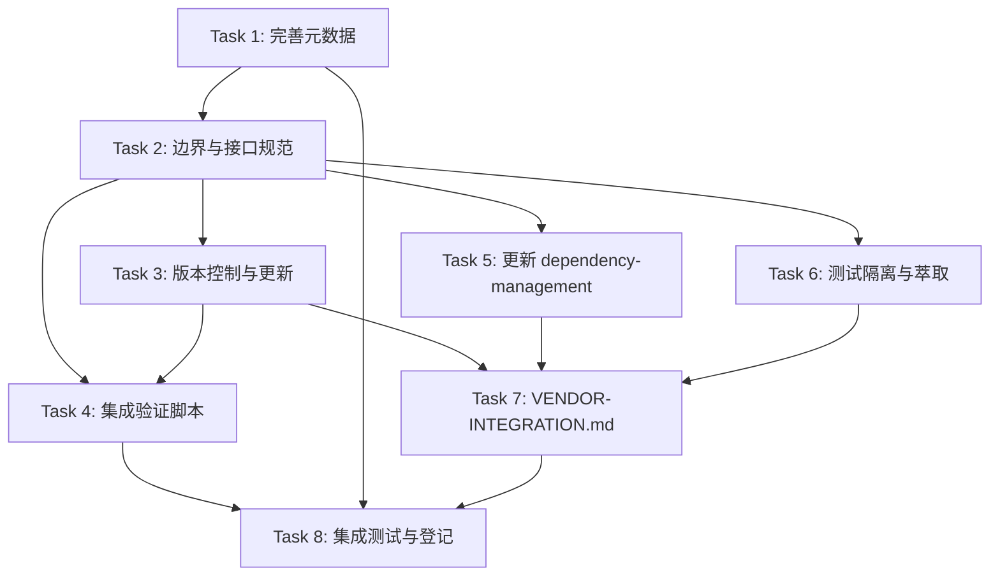

# Vendor 外部项目协同框架 - The Implementation Plan (Decomposed and Prioritized Task List)

> 主题：standards-tools（规范标准与工具链）
> 适用场景：编写规范文档、开发检查脚本、协同流程定义

## [x] Task 1: 完善 vendor 元数据文件
- **Priority**: high
- **Depends On**: None
- **Description**:
  - ~~补全 vendor/flexloop/README.md 元数据文件~~（不可行：submodule 内创建文件会导致 modified content，违反边界原则）
  - 更新 vendor/VERSION.md，记录 flexloop 当前 submodule 的 commit 哈希、版本标签、首次引入日期、许可证（Apache-2.0）
  - 更新 vendor/README.md，补充 flexloop 的版本和详细用途
  - 获取当前 flexloop submodule 的 commit 信息（`git submodule status vendor/flexloop`）
  - **重要发现**：git submodule 目录内禁止放置主项目维护的文件（会导致 submodule dirty），子模块的元数据应通过 vendor/ 根级文件（README.md、VERSION.md）管理
- **Acceptance Criteria Addressed**: AC-2
- **Test Requirements**:
  - `programmatic` TR-1.1: vendor/VERSION.md 中 flexloop 条目包含所有必需字段（版本号含 commit、来源地址、引入日期、许可证 Apache-2.0、用途备注）
  - `programmatic` TR-1.2: vendor/VERSION.md 中 flexloop 条目包含具体 commit 哈希 d618849a（非"见子模块"占位符）
  - `human-judgement` TR-1.3: 元数据内容准确，用途说明清晰描述 flexloop 与 SpecWeave 的"规范-实现"关系
  - `programmatic` TR-1.4: vendor/flexloop submodule 工作树保持清洁（无 modified content）
- **Notes**: 子模块类型的依赖不适用 vendor-lib-README.md.template（该模板用于手动管理的依赖）；子模块元数据统一在 vendor/ 根级文档管理

## [x] Task 2: 定义边界划分原则与接口规范
- **Priority**: high
- **Depends On**: Task 1
- **Description**:
  - 编写边界划分原则（作为 VENDOR-INTEGRATION.md 的核心章节）：
    - SpecWeave 主权区：除 vendor/ 外的所有目录
    - flexloop 主权区：vendor/flexloop/ 下的所有内容（仅通过 git submodule 更新，禁止本地修改）
    - 接口层：vendor/flexloop/README.md（元数据，SpecWeave 维护）、docs/knowledge/vendor-integration/（协同知识文档）
  - 定义交互接口规范：
    - 文档引用：使用相对路径 `../../vendor/flexloop/...`，禁止绝对路径
    - 脚本复用：不直接 import 或调用 vendor/ 内脚本，需复制/萃取到 .agents/scripts/ 并标注来源
    - 模式参考：通过案例文档（如 agentforge-adoption.md）引用，不直接复制规则文件
    - 禁止行为：在 vendor/flexloop/ 内创建/修改文件、将 vendor/ 路径加入 sys.path、在主项目测试中遍历 vendor/ 目录
  - 使用 Mermaid 绘制边界示意图
- **Acceptance Criteria Addressed**: AC-1
- **Test Requirements**:
  - `human-judgement` TR-2.1: 边界文档包含清晰的目录树标注，三个区域（主权区/接口层/禁止区）划分明确
  - `human-judgement` TR-2.2: 接口规范覆盖文档引用、脚本复用、模式参考、禁止行为四个维度，每条有正例反例
  - `programmatic` TR-2.3: 边界规则可转化为程序化检测逻辑（为 Task 4 的脚本实现提供依据）

## [x] Task 3: 建立版本控制策略与子模块更新机制
- **Priority**: high
- **Depends On**: Task 2
- **Description**:
  - 编写版本控制策略文档：
    - 锁定策略：默认固定在已验证的 commit 上，不跟踪上游分支
    - 版本标签：使用上游 tag（如 v0.x.x）或 commit 短哈希作为版本标识
    - 兼容性：更新前检查上游 CHANGELOG，评估破坏性变更
    - 回滚机制：`git submodule update` 恢复到上一个已记录的 commit
  - 编写子模块更新标准流程（4 步法）：
    1. 更新前检查：工作树清洁、当前版本已记录、无未提交变更
    2. 执行更新：`git submodule update --remote vendor/flexloop` 或 checkout 指定 commit
    3. 更新后验证：运行集成验证脚本、检查引用完整性、人工抽查关键文档
    4. 提交更新：更新 VERSION.md、gitlink 变更、验证报告
  - 实现辅助脚本 `.agents/scripts/vendor-submodule-update.py`（可选但推荐）：
    - 参数：`--check-only`（仅检查更新）、`--update`（执行更新）、`--rollback`（回滚）
    - 自动记录更新前后 commit 哈希
    - 更新后自动触发集成验证
- **Acceptance Criteria Addressed**: AC-3, AC-7
- **Test Requirements**:
  - `human-judgement` TR-3.1: 版本策略文档明确回答"何时更新"、"如何更新"、"如何回滚"三个问题
  - `human-judgement` TR-3.2: 更新流程每步有具体命令和验证标准，可被不熟悉 submodule 的开发者执行
  - `programmatic` TR-3.3: 若实现辅助脚本，支持 `--help`、`--check-only` 模式，输出结构化信息

## [x] Task 4: 实现集成验证脚本
- **Priority**: high
- **Depends On**: Task 2, Task 3
- **Description**:
  - 阅读现有的 `.agents/scripts/repo-check.py`，了解其 vendor 检查模块的结构
  - 增强 vendor 检查能力，新增以下检查项（可直接扩展 repo-check.py vendor 命令，或创建独立脚本）：
    1. **submodule 初始化检查**：vendor/flexloop 已 init 且有内容（非空目录）
    2. **submodule 工作树清洁检查**：vendor/flexloop 内无未提交的本地修改（`git status` 检测）
    3. **边界违规检查**：检测 vendor/flexloop/ 下是否有 SpecWeave 侧新增的未跟踪文件（非 submodule 标准内容）
    4. **元数据完整性检查**：vendor/flexloop/README.md 存在且包含必需字段
    5. **VERSION.md 一致性检查**：VERSION.md 记录的 commit 与当前 submodule HEAD 一致
    6. **非法引用检查**：扫描代码中是否有 `sys.path.insert` 指向 vendor/、是否有直接 import vendor 内模块
    7. **测试路径排除检查**：确认 pytest 配置或测试脚本不会收集 vendor/ 下的测试
  - 脚本遵循现有风格：使用 `.agents/scripts/lib/` 中的共享函数、支持 `--fix`（自动修复可修复项）、输出 ANSI 颜色、返回合适的 exit code
  - 更新 `.agents/scripts/check-vendor.py` 包装脚本以暴露新功能（如有独立脚本则注册）
- **Acceptance Criteria Addressed**: AC-4, AC-5, AC-6
- **Test Requirements**:
  - `programmatic` TR-4.1: 脚本在正常状态下运行通过（exit code 0），输出所有检查项的 PASS/FAIL 状态
  - `programmatic` TR-4.2: 模拟边界违规（在 vendor/flexloop/ 下创建测试文件），脚本检测到并报告 FAIL
  - `programmatic` TR-4.3: 模拟非法引用（添加 sys.path 指向 vendor/），脚本检测到并报告 FAIL
  - `programmatic` TR-4.4: 脚本单次运行时间在 10 秒以内（NFR-1）
  - `human-judgement` TR-4.5: 脚本输出格式清晰，错误信息有具体文件路径和修复建议
- **Notes**: 注意不要误报 flexloop 自身正常的 .git/ 目录和文件；需要排除 vendor/flexloop/.git/ 等 git 内部目录

## [x] Task 5: 更新 dependency-management 协议
- **Priority**: medium
- **Depends On**: Task 2
- **Description**:
  - 在 `.agents/protocols/dependency-management.md` 中新增"Git 子模块依赖管理"章节
  - 章节内容应涵盖：
    - 适用场景（什么情况下使用 git submodule vs 手动管理 vs 包管理器）
    - 引入流程（`git submodule add` 标准步骤）
    - 元数据要求（参照 Task 1 的元数据规范）
    - 版本管理（固定 commit、不跟踪分支、更新流程）
    - 禁止事项（不在 submodule 内做本地修改、不直接 import submodule 内代码）
    - 克隆后初始化（`git submodule update --init`）
  - 更新协议中 vendor/ 标准目录结构图，标注 submodule 类型
  - 在 vendor/ 验证脚本章节中补充新增的检查项说明
- **Acceptance Criteria Addressed**: AC-10
- **Test Requirements**:
  - `human-judgement` TR-5.1: 新章节与现有"手动管理依赖"章节结构一致，不冲突
  - `human-judgement` TR-5.2: 内容覆盖引入、元数据、版本、禁止事项、初始化五个方面
  - `programmatic` TR-5.3: Markdown 链接有效，无断链（运行 check-links.py 验证）

## [x] Task 6: 定义测试环境隔离与模式萃取机制
- **Priority**: medium
- **Depends On**: Task 2
- **Description**:
  - 编写测试环境隔离规范（纳入 VENDOR-INTEGRATION.md）：
    - Python 路径：主项目 `.venv` 不安装 flexloop 的依赖，flexloop 使用 `apps/chaos/` 下自己的 `uv` 环境
    - pytest 配置：确认主项目的 pytest 不会收集 `vendor/` 下的测试文件（检查 pytest.ini、pyproject.toml、conftest.py）
    - 脚本执行：如需运行 flexloop 内的脚本，必须 cd 到 vendor/flexloop/ 目录并使用其自有环境
  - 编写模式萃取流程文档（纳入 VENDOR-INTEGRATION.md）：
    - 萃取触发条件：发现 flexloop 中有高价值的脚本/规则/模式值得在 SpecWeave 中复用
    - 萃取步骤：
      1. 评估通用性（是否仅适用于 flexloop 的特定场景？）
      2. 阅读并理解原始实现
      3. 适配 SpecWeave 规范（命名、路径、依赖、风格）
      4. 添加来源标注（在文件注释或 TOML frontmatter 中注明 `source = "vendor/flexloop/..."`）
      5. 编写测试验证
      6. 更新资产清单/复用文档
    - 回流建议：SpecWeave 的创新若适合 flexloop，通过上游 PR 或 issue 反馈，不直接在 submodule 内修改
  - 检查并更新现有 pytest 配置，确保 vendor/ 目录被排除
- **Acceptance Criteria Addressed**: AC-6, AC-8
- **Test Requirements**:
  - `programmatic` TR-6.1: 主项目运行 pytest 时不会收集 vendor/ 下的任何测试文件（可通过 `pytest --collect-only` 验证）
  - `human-judgement` TR-6.2: 模式萃取流程包含评估、适配、标注、验证、登记五个步骤，每步有明确产出
  - `human-judgement` TR-6.3: 测试隔离规范说明如何在需要时独立运行 flexloop 自己的测试

## [x] Task 7: 编写 VENDOR-INTEGRATION.md 协同操作指南
- **Priority**: high
- **Depends On**: Task 2, Task 3, Task 5, Task 6
- **Description**:
  - 创建 `docs/knowledge/VENDOR-INTEGRATION.md`（位置可根据项目知识库结构调整，或放在 `.agents/protocols/` 下）
  - 整合所有规范内容，结构如下：
    1. 概述：flexloop 是什么、为什么用 submodule、两个项目的关系
    2. 快速入门：克隆后初始化 submodule 的命令、基本操作
    3. 边界划分原则（来自 Task 2）：主权区/接口层/禁止区 Mermaid 图
    4. 交互接口规范（来自 Task 2）：引用格式、复用规则、禁止行为
    5. 版本控制策略（来自 Task 3）：锁定策略、版本标识
    6. 子模块更新流程（来自 Task 3）：4 步法详解
    7. 测试环境隔离（来自 Task 6）：环境隔离规则、独立运行 flexloop 测试
    8. 模式萃取与同步（来自 Task 6）：萃取流程、回流建议
    9. 常见问题与故障排查
    10. 检查清单：执行 vendor 相关操作前的快速检查项
  - 文档风格遵循项目规范：使用 Mermaid 图表、中文编写、路径使用相对引用
- **Acceptance Criteria Addressed**: AC-9
- **Test Requirements**:
  - `human-judgement` TR-7.1: 文档结构完整，10 个章节无遗漏
  - `human-judgement` TR-7.2: 新开发者阅读文档后可独立完成 submodule 初始化、版本检查、更新操作
  - `programmatic` TR-7.3: 文档中所有内部链接有效（运行 check-links.py 验证）
  - `human-judgement` TR-7.4: 故障排查章节覆盖至少 3 个常见问题（如 submodule 未初始化、更新后冲突、本地修改丢失）

## [x] Task 8: 集成、测试与登记
- **Priority**: medium
- **Depends On**: Task 1, Task 4, Task 7
- **Description**:
  - 运行完整的集成验证脚本，确认所有检查项通过
  - 验证脚本幂等性：连续运行两次结果一致
  - 更新 `.agents/scripts/README.md`，登记新增的验证脚本
  - 在 AGENTS.md 的上下文路由表中登记新的文档和脚本
  - 更新 `.trae/specs/standards-tools/README.md` 主题看板，添加本 spec 条目
  - 运行全局链接检查 `python .agents/scripts/check-links.py --path .` 确保无断链
  - 运行 `python .agents/scripts/ci-check.ps1`（如适用）确认无回归
  - 如有必要，更新 `.gitignore` 规则
- **Acceptance Criteria Addressed**: AC-1, AC-2, AC-4, AC-10
- **Test Requirements**:
  - `programmatic` TR-8.1: 集成验证脚本全项 PASS
  - `programmatic` TR-8.2: check-links.py 无断链报告
  - `human-judgement` TR-8.3: 新脚本在 .agents/scripts/README.md 中有登记
  - `human-judgement` TR-8.4: standards-tools/README.md 看板已更新，状态为进行中→已完成

# Task Dependencies

- Task 1 最先执行（元数据是基础）
- Task 2 依赖 Task 1（边界定义需要了解元数据现状）
- Task 3、5、6 可并行（均依赖 Task 2 的边界定义）
- Task 4 依赖 Task 2 和 Task 3（验证脚本需要边界规则和版本规则作为检测依据）
- Task 7 依赖 Task 3、5、6（指南整合所有规范文档）
- Task 8 最后执行（集成所有产出物并做全局验证）
