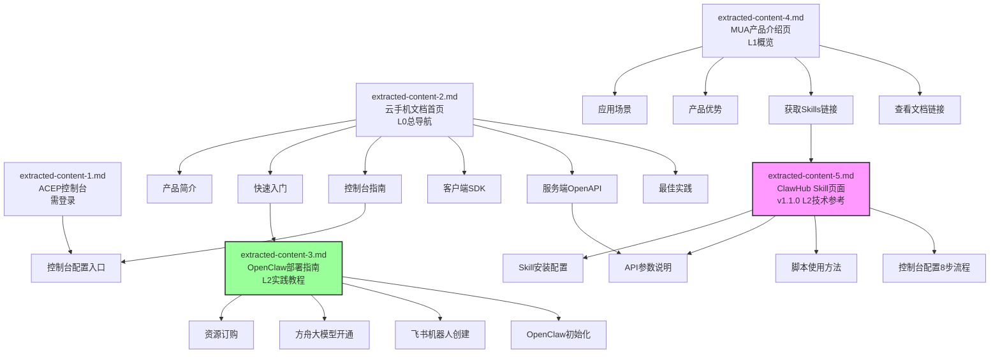

# 火山引擎Mobile Use Agent资源分析结果

## 一、术语表

| 术语 | 全称/定义 | 来源文件 |
|------|----------|---------|
| **MUA** | Mobile Use Agent，云手机应用助手 | extracted-content-4.md |
| **ACEP** | Auto-Cloud-End-Platform，火山引擎云手机产品 | extracted-content-2.md |
| **OpenClaw** | 开源、本地优先的AI代理与自动化平台，可集成飞书通信能力与大语言模型 | extracted-content-3.md |
| **ClawHub** | OpenClaw技能市场，用于分发和安装Skill包 | extracted-content-5.md |
| **Skill** | OpenClaw/ClawHub体系中的可安装功能模块，通过`openclaw skills install`安装 | extracted-content-5.md |
| **RunId** | Agent任务运行ID，用于追踪和查询任务状态 | extracted-content-5.md |
| **ThreadId** | 线程ID，传入arkclaw session_id以关联同一会话中的多次运行 | extracted-content-5.md |
| **ProductId** | 云手机业务ID，创建业务时生成 | extracted-content-5.md |
| **PodId** | 云手机实例ID，购买资源后获得 | extracted-content-5.md |
| **JSONL** | JSON Lines格式，每行一个JSON对象，用于流式输出进度 | extracted-content-5.md |
| **ServiceRoleForIPaaS** | IAM服务角色，MUA操作所需依赖服务权限之一 | extracted-content-5.md |
| **PaasServiceRole** | IAM服务角色，MUA操作所需依赖服务权限之一 | extracted-content-5.md |
| **TOS** | Tinder Object Storage，火山引擎对象存储，用于屏幕录制文件存储 | extracted-content-5.md |
| **Doubao-seed** | 火山方舟豆包视觉大模型系列，支持GUI理解能力 | extracted-content-3.md |
| **config_openclaw** | OpenClaw初始化配置命令，在云手机终端执行 | extracted-content-3.md |
| **ark模式** | OpenClaw配置模式之一，使用火山引擎方舟大模型平台 | extracted-content-3.md |
| **volcengine-plan模式** | OpenClaw配置模式之一，使用火山引擎Coding Plan订阅服务 | extracted-content-3.md |
| **AOSP** | Android Open Source Project，安卓开源项目，云手机系统基础 | extracted-content-3.md |
| **g3.8c24g** | 云手机实例规格系列，支持单开/双开/三开配置 | extracted-content-3.md |
| **应用操作指南** | Markdown格式的应用操作说明文档，上传至控制台供Agent参考 | extracted-content-5.md |
| **终端状态** | 任务最终状态，包括Status 3(已完成)/5(已取消)/6(失败)/7(中断) | extracted-content-5.md |

---

## 二、核心知识点摘要

### 2.1 ClawHub Skill核心信息（重点新增）

| 项目 | 详情 |
|------|------|
| **Skill名称** | `@volcengine-skills/byted-ai-mobileuse-agent` |
| **版本** | v1.1.0 |
| **分类** | Automation |
| **安装命令** | `openclaw skills install @volcengine-skills/byted-ai-mobileuse-agent` |
| **Python依赖** | Python 3.9+，volcengine-python-sdk（volcenginesdkcore） |
| **依赖安装** | `pip install -r "skills/byted-ai-mobileuse-agent/references/requirements.txt"` |
| **核心API** | RunAgentTaskOneStep（ipaas / 2023-08-01） |
| **输出格式** | JSONL流式输出 |

### 2.2 认证方式（两种）

| 认证方式 | 环境变量 | 优先级 |
|---------|---------|--------|
| **Ark Skill API代理** | `ARK_SKILL_API_BASE` + `ARK_SKILL_API_KEY` | 优先（无需火山引擎AK/SK） |
| **火山引擎AK/SK** | `VOLCENGINE_ACCESS_KEY` + `VOLCENGINE_SECRET_KEY`（或`VOLC_ACCESSKEY`/`VOLC_SECRETKEY`） | 备选 |

### 2.3 OpenClaw部署核心信息

| 项目 | 详情 |
|------|------|
| **部署平台** | 火山引擎云手机（云盘存储类型） |
| **支持地域** | 暂仅支持华东区域 |
| **指定机房** | 浙江温州三线03-ppe |
| **最低实例规格** | g3.8c24g三开（3vCPU｜8GB内存） |
| **要求镜像** | 公共镜像/img-1080115458（必须选择） |
| **最低存储** | 不低于32GB |
| **系统版本** | AOSP13 |
| **初始化命令** | `config_openclaw`（云手机终端执行） |
| **支持模型** | Doubao-seed-1.8（GUI能力）/ doubao-seed-2.0-code（编码） |
| **Dashboard命令** | `openclaw dashboard` |

---

## 三、资源定位与关联图

### 3.1 五份资源定位说明

| 文件名 | 资源类型 | URL | 内容状态 | 文档层级 |
|--------|---------|-----|---------|---------|
| **extracted-content-1.md** | ACEP控制台指南 | https://console.volcengine.com/ACEP/guide | ❌ 需要登录，仅获取登录页 | 控制台入口 |
| **extracted-content-2.md** | 云手机文档首页 | https://www.volcengine.com/docs/6394 | ✅ 完整获取文档导航 | 文档总入口（L0） |
| **extracted-content-3.md** | OpenClaw部署指南 | https://www.volcengine.com/docs/6394/2227834 | ⚠️ 内容截断（步骤五不完整） | 实践教程（L2） |
| **extracted-content-4.md** | MUA产品介绍页 | https://www.volcengine.com/product/MobileUseAgent | ✅ 完整获取 | 产品概览（L1） |
| **extracted-content-5.md** | ClawHub Skill页面 | https://clawhub.ai/volcengine-skills/skills/byted-ai-mobileuse-agent | ✅ 完整获取v1.1.0 | 技术参考（L2） |

### 3.2 资源层级关系图



### 3.3 引用关系说明

| 关系类型 | 源文件 | 目标文件/资源 | 说明 |
|---------|--------|-------------|------|
| **链接跳转** | extracted-content-4.md | extracted-content-5.md | 产品页"获取Skills"按钮直接指向ClawHub页面 |
| **依赖关系** | extracted-content-5.md（Skill） | extracted-content-3.md（OpenClaw） | Skill需要安装在OpenClaw运行时环境中 |
| **前置依赖** | extracted-content-3.md（部署） | extracted-content-1.md（控制台） | 部署需通过控制台购买资源、创建实例 |
| **导航包含** | extracted-content-2.md（首页） | extracted-content-3.md（部署） | 部署指南属于"快速入门"分类下的实践文档 |
| **API对应** | extracted-content-5.md（Skill） | extracted-content-2.md提到的OpenAPI | Skill封装了服务端OpenAPI的调用 |
| **控制台关联** | extracted-content-5.md内嵌控制台指南 | extracted-content-1.md | Skill文档内嵌了完整的控制台配置流程 |

---

## 四、API详情

### 4.1 核心API：RunAgentTaskOneStep

**API版本**：ipaas / 2023-08-01

**功能**：启动一个云手机Agent任务，单步执行模式

#### 4.1.1 必填参数

| 参数名 | 类型 | 说明 | 示例值 |
|--------|------|------|--------|
| `--product-id` | string | 云手机产品ID（业务ID） | （创建业务后获取） |
| `--pod-id` | string | 云手机实例（pod）ID | （购买资源后获取） |
| `--prompt` | string | 自然语言指令 | "Open Xiaohongshu and go to the Search page" |
| `--thread-id` | string | 线程ID，传入arkclaw `session_id`以关联同一会话 | thread-123 / session_id |

#### 4.1.2 可选参数

| 参数名 | 类型 | 取值范围 | 默认值 | 说明 |
|--------|------|---------|--------|------|
| `--max-step` | integer | 1 ~ 500 | （未设置） | 最大智能体执行步数 |
| `--timeout` | integer | 1 ~ 86400秒 | （未设置） | 任务超时时间（秒） |
| `--is-screen-record` | boolean | true/false | false | 是否启用屏幕录制 |
| `--tos-bucket` | string | - | 未设置 | 屏幕录制存储的TOS桶名称 |
| `--tos-endpoint` | string | - | 未设置 | 屏幕录制存储的TOS端点 |
| `--tos-region` | string | - | 未设置 | 屏幕录制存储的TOS区域 |

#### 4.1.3 环境变量

| 变量名 | 说明 | 认证模式 |
|--------|------|---------|
| `ARK_SKILL_API_BASE` | Ark Skill API代理地址 | 代理模式（优先） |
| `ARK_SKILL_API_KEY` | Ark Skill API代理密钥 | 代理模式（优先） |
| `VOLCENGINE_ACCESS_KEY` / `VOLC_ACCESSKEY` | 火山引擎Access Key | AK/SK模式（备选） |
| `VOLCENGINE_SECRET_KEY` / `VOLC_SECRETKEY` | 火山引擎Secret Key | AK/SK模式（备选） |

### 4.2 输出格式（JSONL流）

每行一个JSON对象，共4种消息类型：

#### 4.2.1 type=started（任务已创建）
```json
{
  "type": "started",
  "run_id": "756729984938989****",
  "thread_id": "thread-123"
}
```

#### 4.2.2 type=progress（进度更新）
```json
{
  "type": "progress",
  "status": "<当前状态值>",
  "raw_payload": {}
}
```

#### 4.2.3 type=result（最终结果）
```json
{
  "type": "result",
  "ok": true,
  "run_id": "756729984938989****",
  "run_name": "test-run",
  "thread_id": "thread-123",
  "raw_response": {},
  "current_step_status": 3,
  "current_step_raw": {},
  "agent_result_raw": {}
}
```

**终端状态码说明**：
| Status值 | 含义 |
|---------|------|
| 3 | 已完成 |
| 5 | 已取消 |
| 6 | 失败 |
| 7 | 中断 |

#### 4.2.4 type=error（致命错误）
```json
{
  "type": "error",
  "error_code": "<错误码>",
  "error_message": "<错误描述>"
}
```

### 4.3 辅助脚本API

| 脚本名 | 功能 | 主要参数 |
|--------|------|---------|
| `run_agent_task_one_step.py` | 启动任务 | product-id, pod-id, prompt, thread-id + 可选参数 |
| `list_agent_run_current_step.py` | 查询当前进度 | run-id, thread-id, wait, interval, pretty |
| `get_agent_result.py` | 获取最终结果 | run-id, thread-id, pretty |
| `cancel_task.py` | 取消运行中任务 | run-id, thread-id, wait, interval, pretty |
| `console_help.py` | 控制台帮助查询 | question, pretty |

---

## 五、Skill使用指南

### 5.1 安装流程

#### 步骤1：安装Skill包
```bash
openclaw skills install @volcengine-skills/byted-ai-mobileuse-agent
```

#### 步骤2：安装Python依赖
```bash
pip install -r "skills/byted-ai-mobileuse-agent/references/requirements.txt"
```

### 5.2 本地使用示例

```bash
# 设置认证环境变量（AK/SK模式）
export VOLC_ACCESSKEY="<your-access-key>"
export VOLC_SECRETKEY="<your-secret-key>"

# 启动任务
python "skills/byted-ai-mobileuse-agent/scripts/run_agent_task_one_step.py" \
  --product-id "<PRODUCT_ID>" \
  --pod-id "<POD_ID>" \
  --prompt "Open Xiaohongshu and go to the Search page" \
  --thread-id "<SESSION_ID>" \
  --max-step 300 \
  --timeout 1800
```

### 5.3 结果查询示例

#### 查询当前进度
```bash
python "skills/byted-ai-mobileuse-agent/scripts/list_agent_run_current_step.py" \
  --run-id "<RunId>" \
  --thread-id "<SESSION_ID>" \
  --wait 10 \
  --interval 2 \
  --pretty
```

#### 获取最终结果
```bash
python "skills/byted-ai-mobileuse-agent/scripts/get_agent_result.py" \
  --run-id "<RunId>" \
  --thread-id "<SESSION_ID>" \
  --pretty
```

#### 取消任务
```bash
# 当Status不在3/5/6/7时可取消
python "skills/byted-ai-mobileuse-agent/scripts/cancel_task.py" \
  --run-id "<RunId>" \
  --thread-id "<SESSION_ID>" \
  --wait 20 \
  --interval 2 \
  --pretty
```

#### 控制台帮助查询
```bash
python "skills/byted-ai-mobileuse-agent/scripts/console_help.py" \
  --question "How do I grant first-time authorization?" \
  --pretty
```

### 5.4 控制台配置完整流程（8步）

#### Flow 1：创建AccessKey
1. 访问 https://console.volcengine.com/iam/keymanage
2. 点击"创建密钥"
3. 记录AccessKey ID和SecretAccessKey

#### Flow 2：首次授权（必需）
1. 检查`ServiceRoleForIPaaS`角色：
   - 如不存在：访问 https://console.volcengine.com/iam/service/attach_role/?ServiceName=ipaas 授予授权
2. 检查`PaasServiceRole`角色：
   - 如不存在：访问 https://console.volcengine.com/iam/identitymanage/role 创建/授予角色

#### Flow 3：启用MUA Token服务
1. 访问 https://console.volcengine.com/ACEP/Business/6
2. 阅读并接受服务条款和SLA
3. 点击"立即启用"

#### Flow 4：创建业务
1. 在MUA业务管理页面点击"创建业务"
2. 填写业务名称并提交
3. **记录业务ID（product_id）**

#### Flow 5：购买资源
1. 在业务列表中找到目标业务，点击"购买资源"
2. 完成选择和支付
3. **等待2-3分钟**，直到实例状态变为"就绪"
4. 刷新并检查资源状态
5. **记录实例ID/名称（pod_id）**

#### Flow 6：上传/升级应用操作指南
入口：业务管理 → 工具配置 → 应用操作指南
- **新建**：上传Markdown指南文件
- **升级**：上传的包名必须与现有指南完全匹配
- 参考模板：https://lf3-static.bytednsdoc.com/obj/eden-cn/uhmlnbs/%E5%BA%94%E7%94%A8%E6%93%8D%E4%BD%9C%E6%8C%87%E5%8D%97%E6%A8%A1%E7%89%88.md

#### Flow 7：配置技能
入口：业务管理 → 工具配置 → 技能配置
- 在"技能存储位置"填写文件夹路径（**必须是文件夹级别，不能是单个文件**）
- 保存

#### Flow 8：发布应用（如需要）
入口：云手机业务 → 进入业务 → 应用管理 → 添加应用
- 输入应用名称
- 通过URL上传或本地上传安装包
- 点击"确认"

### 5.5 OpenClaw初始化配置参数

执行`config_openclaw`命令后，选择服务提供商并配置：

#### ark模式（火山方舟）参数
| 参数 | 说明 | 示例 |
|------|------|------|
| Enter models id | 模型ID | doubao-seed-1-8-251228 |
| Enter apiKey | API Key | e615c7a1-dab3-40fa-af54-d4**** |
| Enter Feishu appId | 飞书App ID | cli_a92bfb97be3**** |
| Enter Feishu appSecret | 飞书App Secret | 2oGtsZDR083GMvWfPIbLFcy**** |
| Enter Feishu botName | 机器人名称 | My OpenClaw Bot |
| Enable Feishu? | 启用飞书 | true |

#### volcengine-plan模式（Coding Plan）参数
| 参数 | 说明 | 示例 |
|------|------|------|
| Enter models id | 模型ID（推荐doubao-seed-2.0-code） | doubao-seed-2.0-code |
| Enter apiKey | API Key | e615c7a1-dab3-40fa-af54-d4**** |
| Enter Feishu appId | 飞书App ID | cli_a92bfb97be3**** |
| Enter Feishu appSecret | 飞书App Secret | 2oGtsZDR083GMvWfPIbLFcy**** |
| Enter Feishu botName | 机器人名称 | My OpenClaw Bot |
| Enable Feishu? | 启用飞书 | true |

### 5.6 飞书机器人权限配置

创建飞书企业自建应用时，需批量导入以下权限JSON：
```json
{
  "scopes": {
    "tenant": [
      "im:chat:read",
      "im:chat:update",
      "im:message.group_at_msg:readonly",
      "im:message.p2p_msg:readonly",
      "im:message.pins:read",
      "im:message.pins:write_only",
      "im:message.reactions:read",
      "im:message.reactions:write_only",
      "im:message:readonly",
      "im:message:recall",
      "im:message:send_as_bot",
      "im:message:send_multi_users",
      "im:message:send_sys_msg",
      "im:message:update",
      "im:resource",
      "contact:contact.base:readonly"
    ],
    "user": [
      "contact:user.employee_id:readonly"
    ]
  }
}
```

飞书事件配置：
- 选择"使用长连接接收事件"
- 添加事件：勾选"接收消息"及其他需要订阅的事件

---

## 六、场景与问题清单

### 6.1 应用场景清单

| 场景分类 | 具体场景 | 来源 | 详细说明 |
|---------|---------|------|---------|
| **OpenClaw专属场景** | 批量账号运营与自动化流程执行 | extracted-content-3.md | 内容分发、任务调度、标准化操作流程，降低重复操作成本 |
| **OpenClaw专属场景** | AI智能客服自动响应 | extracted-content-3.md | 消息自动回复与智能咨询处理，提升响应速度与服务效率 |
| **OpenClaw专属场景** | 日常工作流智能协同 | extracted-content-3.md | 文档生成、任务提醒、待办事项实时推送，提升工作生活效率 |
| **MUA通用场景** | 手机应用测试 | extracted-content-4.md | 24*7 AI测试员，像真实用户一样思考和操作 |
| **MUA通用场景** | 数据收集整理 | extracted-content-4.md | 自动进入指定App检查价格、库存、页面状态，输出结果摘要 |
| **MUA通用场景** | 内容合规检测 | extracted-content-4.md | 智能化获取数据，减少技术人员依赖，提高检测成功率和效率 |
| **MUA通用场景** | 自动任务助手 | extracted-content-4.md | 自动执行内容发布、巡检和多平台搬运等重复性运营任务 |

### 6.2 实例规格清单

| 实例规格 | vCPU核数 | 内存（GB） | Android版本 | 适用场景 |
|---------|---------|-----------|------------|---------|
| g3.8c24g单开 | 8 | 24 | AOSP13 | 高性能单实例任务 |
| g3.8c24g双开 | 4 | 12 | - | 中等负载双实例 |
| g3.8c24g三开 | 3 | 8 | - | OpenClaw最低要求配置 |

### 6.3 限制条件清单

| 限制类型 | 具体限制 | 来源 |
|---------|---------|------|
| **地域限制** | OpenClaw暂仅支持华东区域 | extracted-content-3.md |
| **机房限制** | OpenClaw指定机房：浙江温州三线03-ppe | extracted-content-3.md |
| **存储方案** | OpenClaw仅支持云盘存储 | extracted-content-3.md |
| **镜像限制** | OpenClaw必须使用公共镜像/img-1080115458 | extracted-content-3.md |
| **存储最低要求** | 实例存储不低于32GB | extracted-content-3.md |
| **实例等待时间** | 购买资源后需等待约2-3分钟直到状态变为"就绪" | extracted-content-5.md |
| **技能路径要求** | "技能存储位置"必须指向文件夹，不能是单个文件路径 | extracted-content-5.md |
| **应用指南升级** | 升级"应用操作指南"时，上传包名必须与之前版本完全匹配 | extracted-content-5.md |
| **预装应用限制** | 默认云手机镜像预装应用有限，需特定应用须先"发布应用" | extracted-content-5.md |
| **屏幕录制前置条件** | IsScreenRecord=true时需先在控制台配置对象存储（TOS） | extracted-content-5.md |
| **API QPS限制** | 整体50 QPS，每用户10 QPS，超出可能被限流 | extracted-content-5.md |
| **max-step范围** | 1 ~ 500步 | extracted-content-5.md |
| **timeout范围** | 1 ~ 86400秒（24小时） | extracted-content-5.md |
| **Python版本** | 需要Python 3.9+ | extracted-content-5.md |

### 6.4 最佳实践清单

| 实践项 | 具体建议 |
|--------|---------|
| **模型选择** | GUI交互任务推荐使用Doubao-seed-1.8，编码任务推荐doubao-seed-2.0-code |
| **认证方式** | 生产环境优先使用Ark Skill API代理，本地开发可使用AK/SK |
| **实例规格** | 初始部署使用g3.8c24g三开即可满足需求，后续根据负载扩容 |
| **任务参数** | max-step建议设置300左右，timeout建议设置1800秒（30分钟） |
| **会话关联** | 同一会话的多次运行必须使用相同的thread-id（传入session_id） |
| **结果轮询** | 使用list_agent_run_current_step.py时建议wait=10、interval=2 |
| **取消逻辑** | 用户要求停止时先检查状态，非终端状态（Status不在3/5/6/7）再调用取消 |
| **应用发布** | 任务需要特定应用时，必须先通过"发布应用"功能安装 |
| **屏幕录制** | 需要录制时必须同时配置tos-bucket、tos-endpoint、tos-region三个参数 |
| **Dashboard验证** | OpenClaw初始化后执行`openclaw dashboard`获取URL，用Via浏览器访问验证 |

### 6.5 常见问题排查清单

| 问题现象 | 可能原因 | 解决方案 |
|---------|---------|---------|
| API调用返回权限错误 | 未完成首次授权，缺少ServiceRoleForIPaaS或PaasServiceRole角色 | 按Flow 2完成两个角色的授权 |
| 任务一直排队不执行 | 实例状态未就绪 | 购买资源后等待2-3分钟，刷新确认状态为"就绪" |
| 屏幕录制失败 | 未配置TOS对象存储 | 先在控制台配置TOS，调用时传入完整的tos-*参数 |
| Skill加载失败 | 技能存储路径配置错误 | 确认配置的是文件夹路径而非单个文件路径 |
| 应用指南升级失败 | 上传包名与现有版本不匹配 | 确保包名完全一致后重新上传 |
| 找不到特定应用 | 默认镜像未预装 | 通过"应用管理→添加应用"发布安装所需应用 |
| 请求被限流 | QPS超出限制 | 降低请求频率，整体不超过50 QPS，单用户不超过10 QPS |
| OpenClaw初始化失败 | 镜像选择错误 | 确认使用img-1080115458公共镜像 |
| 飞书机器人收不到消息 | 事件配置错误 | 确认使用长连接，已勾选"接收消息"事件 |
| 同一会话上下文丢失 | thread-id不一致 | 同一会话多次调用必须传入相同的session_id作为thread-id |

---

## 七、新增内容清单（对比已有笔记）

### 7.1 内容对比总览

| 内容分类 | 已有笔记覆盖情况 | 本次新增内容量 | 新增内容价值 |
|---------|----------------|--------------|------------|
| 产品定位与优势 | ✅ 完整覆盖 | - | - |
| 三层架构原理 | ✅ 完整覆盖 | - | - |
| 宏观应用场景 | ✅ 4大场景 | ➕ 补充OpenClaw 3个具体场景 | 更落地的使用场景 |
| MCP协议分析 | ✅ 完整覆盖 | - | - |
| **Skill安装配置** | ❌ 完全缺失 | ➕➕➕ 完整安装流程、依赖管理 | 可直接操作的技术细节 |
| **API调用参数** | ❌ 仅有概览 | ➕➕➕ 完整参数表、取值范围、环境变量 | 生产级调用必需信息 |
| **输入输出格式** | ❌ 完全缺失 | ➕➕➕ JSONL格式、4种消息类型、状态码 | 解析返回结果必需 |
| **脚本使用方法** | ❌ 完全缺失 | ➕➕➕ 5个脚本的调用示例和参数 | 实际开发参考 |
| **控制台配置流程** | ❌ 仅有链接 | ➕➕➕ 8步完整Flow、两个必需IAM角色 | 从零配置指南 |
| **OpenClaw部署** | ❌ 完全缺失 | ➕➕➕ 完整部署步骤、飞书集成、两种配置模式 | 搭建可运行环境 |
| **实例规格详情** | ❌ 完全缺失 | ➕➕ 3种规格参数对比 | 资源选型依据 |
| **限制条件** | ❌ 零散提及 | ➕➕ 14项明确限制条件 | 避坑指南 |
| **错误处理** | ❌ 完全缺失 | ➕➕ 10个常见问题排查方案 | 问题诊断参考 |
| **飞书集成** | ❌ 完全缺失 | ➕➕ 权限JSON、事件配置 | 飞书机器人对接必需 |
| **QPS限制** | ❌ 完全缺失 | ➕ 明确限流阈值 | 高并发设计依据 |
| **屏幕录制** | ❌ 完全缺失 | ➕ TOS配置三参数 | 录制功能使用 |
| **凭证获取** | ❌ 未明确地址 | ➕ IAM密钥管理具体URL | 快速找到入口 |

### 7.2 需要补充到已有笔记的新增章节建议

| 新增章节 | 优先级 | 来源文件 | 内容要点 |
|---------|--------|---------|---------|
| **ClawHub Skill安装与使用指南** | 🔴 高 | extracted-content-5.md | 安装命令、依赖安装、两种认证方式 |
| **OpenAPI参数完整参考** | 🔴 高 | extracted-content-5.md | 4必填+5可选参数、取值范围、环境变量 |
| **JSONL输出格式解析** | 🔴 高 | extracted-content-5.md | 4种消息类型、状态码说明、结果结构 |
| **控制台配置8步流程** | 🔴 高 | extracted-content-5.md | IAM授权、业务创建、资源购买、工具配置 |
| **OpenClaw部署实践教程** | 🟡 中 | extracted-content-3.md | 资源订购、方舟开通、飞书创建、初始化配置 |
| **飞书机器人集成指南** | 🟡 中 | extracted-content-3.md | 权限配置JSON、事件订阅、长连接模式 |
| **实例规格选型参考** | 🟡 中 | extracted-content-3.md | g3.8c24g系列单开/双开/三开对比 |
| **限制条件与QPS配额** | 🟡 中 | extracted-content-5.md | 14项使用限制、QPS阈值 |
| **辅助脚本使用手册** | 🟢 低 | extracted-content-5.md | 5个Python脚本的调用方法 |
| **常见问题排查手册** | 🟢 低 | extracted-content-5.md/3.md | 10个常见问题的原因与解决方案 |
| **应用操作指南编写** | 🟢 低 | extracted-content-5.md | Markdown模板、包名匹配规则 |
| **屏幕录制功能配置** | 🟢 低 | extracted-content-5.md | TOS三参数配置、前置条件 |

### 7.3 关键技术细节新增列表

1. **认证双模式**：Ark Skill API代理（优先）vs 火山引擎AK/SK（备选）
2. **核心API名称**：RunAgentTaskOneStep（ipaas/2023-08-01版本）
3. **必填4参数**：product-id、pod-id、prompt、thread-id
4. **可选5参数**：max-step、timeout、is-screen-record、tos-bucket、tos-endpoint、tos-region
5. **输出4消息类型**：started、progress、result、error
6. **终端4状态码**：3=已完成、5=已取消、6=失败、7=中断
7. **5个辅助脚本**：run、list、get、cancel、console_help
8. **IAM双角色**：ServiceRoleForIPaaS + PaasServiceRole（必须授权）
9. **OpenClaw双模式**：ark（方舟）vs volcengine-plan（Coding Plan）
10. **飞书16项权限**：租户权限15项 + 用户权限1项（JSON配置）
11. **QPS双阈值**：整体50 QPS、每用户10 QPS
12. **等待时间**：实例就绪需等待2-3分钟
13. **路径要求**：技能存储必须是文件夹路径
14. **包名规则**：应用指南升级包名必须完全匹配
15. **镜像ID**：OpenClaw必须使用img-1080115458

### 7.4 已有笔记中需要修正/更新的内容

| 已有内容 | 更新建议 | 依据 |
|---------|---------|------|
| 接入方式中提到"Mobile Use Agent MCP" | 补充ClawHub Skill安装方式作为主要接入途径 | extracted-content-5.md提供了完整的Skill安装使用流程 |
| OpenAPI部分仅有概览 | 需要补充完整参数表和调用示例 | extracted-content-5.md有详细参数说明和脚本示例 |
| 未提及OpenClaw生态 | 需要补充OpenClaw作为运行时环境的角色，以及ClawHub技能市场 | extracted-content-3/5.md显示Skill是OpenClaw生态的一部分 |
| 未提及屏幕录制功能 | 需要补充is-screen-record参数及TOS配置要求 | extracted-content-5.md明确了录制功能和三参数 |
| 未提及具体QPS限制 | 需要补充API限流阈值 | extracted-content-5.md明确标注50/10 QPS |

---

## 八、文件完整性说明

| 文件 | 提取状态 | 缺失内容 | 影响评估 |
|------|---------|---------|---------|
| extracted-content-1.md | ⚠️ 需登录，仅获取登录页 | 控制台完整指南内容 | 低 - extracted-content-5.md已内嵌控制台8步流程 |
| extracted-content-2.md | ✅ 完整 | 无 | 文档导航结构完整 |
| extracted-content-3.md | ⚠️ 步骤五截断 | 飞书AI助手完整配置（事件回调后的步骤） | 中 - 主要部署步骤已获取，飞书事件配置部分获取 |
| extracted-content-4.md | ✅ 完整 | 无 | 产品概览信息完整 |
| extracted-content-5.md | ✅ 完整（v1.1.0） | 无 | Skill技术参考完整（含内嵌控制台指南） |

**总结**：核心技术参考（extracted-content-5.md）完整度100%，部署指南（extracted-content-3.md）约85%完整，缺失部分为飞书事件配置后续步骤，可通过飞书开发者平台常规文档补充。
