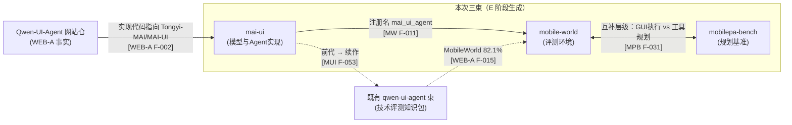

# Insights: Tongyi-MAI 三束知识地图（MAI-UI / MobileWorld / MobilePA-Bench）

> **I 阶段产出** ｜ 生成日期：2026-08-29 ｜ 工作流：source-code-to-okf-wiki R→**I**→E→V→C
>
> **前置输入**：`facts-mai-ui.md`（F-001~F-054）、`facts-mobile-world.md`（F-001~F-080）、`facts-mobilepa-bench.md`（F-001~F-032）、`facts-websites.md`（F-001~F-040，A=Qwen-UI-Agent 网站仓，B=MAI-UI-blog 博客站）
>
> **证据图例**：**[MUI]** = facts-mai-ui.md；**[MW]** = facts-mobile-world.md；**[MPB]** = facts-mobilepa-bench.md；**[WEB-A]/[WEB-B]** = facts-websites.md A/B 部分。所有证据均限于事实清单已登记条目（编号 + 关键签名），零推测。
>
> ⚠️ **博客红线**：MAI-UI-blog 的两篇博客正文为 Notion 重定向 stub（[WEB-B] F-036、F-037），任何文档不得引用其正文内容；mai-ui 束提及博客时只允许登记 stub 存在性与 URL 字面标题。

---

## 一、mai-ui（模型与 Agent 实现）

### 洞察 1：推理外壳与模型底座彻底解耦——src 是纯 API 客户端，vLLM 才是运行时

- **陈述**：MAI-UI 仓库的 `src/` 是不依赖任何深度学习框架的 OpenAI 兼容 API 客户端外壳，模型服务一律外置到 vLLM，权重不在仓库内。
- **证据**：[MUI] F-003（`requirements.txt` 仅 Jinja2/numpy/openai/Pillow 4 包，"无 torch/transformers（src 通过 OpenAI 兼容 API 调用模型）"）；F-004（安装章节指定 `vllm==0.11.0`，"Must use VLLM=0.11.0"，服务地址 `http://localhost:8000/v1`）；F-019/F-026（两个 Agent 的 `__init__` 均只接 `llm_base_url + model_name`）；F-001（权重在 HuggingFace，仅 2B/8B 已发布）。
- **反常识**：仓库名为"基础模型家族仓库"，但克隆后既不能训练也不能离线推理——必须先起 vLLM 服务再谈 Agent；且评估环境另有独立 requirements（[MUI] F-045：vllm 0.11.0 + transformers 4.57.0 + torch 2.8.0，与根 4 包依赖版本不一致）。
- **行动**：教程 Quickstart 第一步必须是部署 vLLM 服务（F-004 命令）而非 `pip install -r requirements.txt`；01-quickstart 文档须并列"根依赖（4 包，跑 Agent）"与"评估依赖（F-045，跑评测）"两套环境，防止读者混装。

### 洞察 2：双 Agent 异构设计——继承差异即生命周期差异

- **陈述**：grounding Agent 有意不继承 BaseAgent（无状态单轮定位），navigation Agent 继承 BaseAgent 并内嵌 TrajMemory 轨迹记忆，两类任务的生命周期差异直接体现在类层级上。
- **证据**：[MUI] F-019（`class MAIGroundingAgent:` 无基类）；F-009（`class BaseAgent(ABC)`，`__init__` 初始化 `self.traj_memory = TrajMemory(...)`）；F-026（`class MAIUINaivigationAgent(BaseAgent)`，类 docstring 名为 "MAIMobileAgent"，与类名不一致属代码现状）；F-020（grounding `predict(instruction, image)` 单图）；F-022（grounding 消息为 system + 单条 user，"无历史图像逻辑"）；F-033（navigation predict 成功后构造 TrajStep 追加进 traj_memory）。
- **反常识**：直觉上同一模型家族的 Agent 应共享基类，实际 grounding 是纯函数式调用（predict 第二参数直接传 PIL 图，[MUI] F-049），navigation 才有多轮轨迹积累；强行统一基类只会产生空实现。另外类名拼写 "Naivigation" 在 README、源码、notebook 标题（[MUI] F-005、F-050 "# Run Naivagation"）中一贯如此，是检索代码时的关键签名而非笔误待修。
- **行动**：读者按任务类型选型——单元素定位用 MAIGroundingAgent，多步任务用 MAIUINaivigationAgent；自定义无多轮需求的 Agent 可效仿"不继承"。03/04 两篇 concepts 应显式对比两者的 predict 签名差异（F-020 vs F-032）。

### 洞察 3：上下文工程三原则——文本全量回放、图像滑动窗口、回放文本再合成

- **陈述**：navigation Agent 的对话历史采取"文本全量回放、图像只挂最近 history_n-1 张"的窗口策略，且回放的 assistant 文本不是原始输出，而是从结构化 action_json 反归一化坐标后重新拼装的规范化版本。
- **证据**：[MUI] F-031（`_build_messages` "历史完整回放但图像只挂最后 history_n-1 张"，`start_image_idx = max(0, len(steps) - (history_n - 1))`）；F-030（`_prepare_images` 取 `min(len(history_images), history_n - 1)` 张）；F-026（default_conf `history_n: 3`）；F-028（`history_responses` 属性"坐标反归一化后重组 tool_call 文本"：normalized 坐标乘 SCALE_FACTOR 取 int，`json.dumps(..., separators=(",", ":"))` 紧凑格式重组 `<thinking>/<tool_call>`）；F-033（predict 写入 `structured_action={"action_json": action_json}`）；F-051（测试用例 `test_build_messages_with_5_history_steps` 断言 "5 assistant + 3 image"）。
- **反常识**：直觉上多模态历史应图文成对保留；实际图像远贵于文本，模型可从先前 assistant 回复文本（含动作与思考）推断早期画面，故图像滑窗、文本长存——`history_n` 只控制图像窗口，长任务 token 开销主要来自全量文本。原始 `prediction` 字段虽被保存（F-007）但回放时不使用，回放的是"再合成"的规范化文本。
- **行动**：04-navigation-agent 以此为核心案例讲上下文工程；想修改回放格式只需改 `history_responses`/`mem2response` 一处（F-029），不要篡改 `prediction` 字段；10 个消息结构契约测试（F-051/F-052，mock OpenAI + JSON 基线）是无 LLM 复现消息格式的现成素材。

### 洞察 4：坐标归一化双口径并存——src 一律除以 999，评估端一律除以 1000

- **陈述**：同一仓库内坐标归一化存在两套并存约定：`src/` 两个 Agent 的模块级常量 `SCALE_FACTOR = 999`，评估管线（单样本按 resize 宽度、批量与 eval-server）按 1000 归一化。
- **证据**：[MUI] F-017/F-023（`mai_grounding_agent.py` 与 `mai_naivigation_agent.py` 均为模块级常量 `SCALE_FACTOR = 999`）；F-018（`parse_grounding_response` 坐标除以 999 归一化）；F-025（navigation 支持坐标长度 2 或 4，除以 SCALE_FACTOR）；F-036（评估 `batch_ground_only_positive` "point 归一化固定除以 1000"，单样本为 `point_x / resized_width`）；F-040（eval_server "坐标按 `related / 1000.0` 归一化"）。
- **反常识**：999 与 1000 极易被当成笔误，但 src 两个文件一致用 999、评估端一致用 1000，说明是两套约定并存；另外 grounding 解析对非法坐标 raise ValueError（F-018/F-025），而判分层对解析失败另有 `wrong_format` 标签（F-040），三层容错语义不同。
- **行动**：05-prompt-action-space 应设"坐标口径对照表"（999 / 1000 / resized_width 三列）；读者把 Agent 接入第三方环境时必须显式约定除数，复现分数异常时先查归一化口径再查模型。

### 洞察 5：评估方法论——6 基准统一重排为 ScreenSpot-Pro 格式，三种评测方式互相印证

- **陈述**：评估管线将 6 个基准统一重排为 ScreenSpot-Pro 格式后用同一套判分聚合，且提供 vLLM 离线批量与 OpenAI 兼容服务两条通道，三组结果与技术报告分数互相印证（差距约 1 个点内）。
- **证据**：[MUI] F-048（data/ 下 6 个数据目录，README 声明 "OSWorld-G、MMBench 已重排为 ScreenSpot-Pro 格式"）；F-041（`evaluate` 返回 `fine_grained / seeclick_style / leaderboard_simple_style / leaderboard_detailed_style / overall` 五类指标视图）；F-040（正样本 bbox 归一化点包含判分，负样本按 result 判定）；F-035/F-043（vLLM 离线批量通道与 OpenAI 客户端 + ThreadPoolExecutor 16 线程服务通道）；F-047（MAI-UI-8B 三行结果：Tech Report 40.7 / eval locally 40.9 / eval by vllm api 40.3 等，六个数据集差距均 ≤1 点）；F-046（训练范式沿用 UI-Ins，`--use_guide_text False` 对齐标准推理模式）；F-044（`extract_metrics.py` 读 `metrics.overall.action_acc`，支持多 checkpoint 对比表）。
- **反常识**：评估 prompt 与 src 的 grounding prompt 同源但末尾追加一行 `## Input instruction`（F-037）——训练/推理用的 prompt 与评测用的 prompt 并非逐字节相同；评测的负样本（negative gt）把模型"回答有目标元素"判为 wrong，而非仅统计正样本命中率。
- **行动**：06-evaluation-pipeline 按"数据统一格式 → 双通道执行 → 判分 → 五视图聚合 → 汇总导出"五段组织；教程引用 F-047 表格说明复现口径，并提醒 `--use_guide_text False` 是 MAI-UI 的必要参数（F-046）。

---

## 二、mobile-world（评测环境）

### 洞察 1：单容器全栈仿真——DinD 里跑 Android 模拟器，一个镜像即一个环境

- **陈述**：MobileWorld 把整套 Android 评测环境压缩进单个 Docker 镜像：DinD 基础镜像内启动 Android 模拟器（Pixel_8_API_34_x86_64 AVD）+ FastAPI 控制服务，ADB 经 socat 中继对外暴露，健康检查直通 `/health`。
- **证据**：[MW] F-067（`FROM cruizba/ubuntu-dind:latest`；安装 openjdk-17/scrcpy/xvfb/novnc；Android SDK 34 + `AVD_NAME=Pixel_8_API_34_x86_64`；`HEALTHCHECK ... curl -f http://localhost:6800/health`）；F-068（entrypoint 十步序列：② 禁用 IPv6（注释引用 Google issue 215231636）、⑤ `docker load` 应用镜像、⑦ 启动模拟器、⑧ socat `0.0.0.0:5556→127.0.0.1:5555`、⑨ `uv run mobile-world server --port 6800`）；F-031（FastAPI `title="Mobile GUI Agent Benchmark Server"`）；F-024（env run 四组起始端口 6800/7860/5800/5556）。
- **反常识**：直觉上 Android 模拟器需要图形界面与宿主 KVM，实际方案是容器套 Docker（DinD）再套模拟器的三层虚拟化，VNC 仅是可选项；entrypoint 特意禁用 IPv6 否则 SIM 卡不可用（F-068 ②），内核 6.x 还会因缺 iptable_nat 导致 dockerd 静默失败（F-071 v1.2：默认 iptables-nft 并自动回退 legacy + `docker info` 30 秒验证）。
- **行动**：07-docker-environment 按 entrypoint 十步编号逐条讲解；读者部署失败时按 F-071 v1.2 的 iptables 探测与 dockerd 验证清单排查；F-080 的 WSL/KVM 配置（`nestedVirtualization=true`）是 Windows 宿主的前置条件，归入 01-quickstart。

### 洞察 2：确定性复现三件套——AVD 快照 + 冻结时钟 + 后台清理

- **陈述**：环境可复现性靠三件事共同保证：任务初始化统一加载 `init_state` 模拟器快照、默认日期字面量冻结在 2025-10-16、初始化时强制停 Mattermost/Mastodon 后端并清空 mall 配置与回调文件。
- **证据**：[MW] F-060（`snapshot_tag` 默认 `"init_state"`；`_compute_current_date` 仅当 app_names 命中 `["Chrome", "Maps", "MCP-arXiv"]` 才返回当天日期，否则字面量 `"2025-10-16"`）；F-061（`initialize_task` 顺序：`reset_task_state` → `load_snapshot` → 时间同步 → `stop_mattermost_backend`/`stop_mastodon_backend` → `clear_config`/`clear_callback_files` → hooks → `controller.home()` → 清 interaction_cache/chat_history）；F-073（AVD 定制 8 步流程含 `adb shell su root date 101612002025.00` 定日期后 `snapshot save init_state`）。
- **反常识**：模拟环境里"今天几号"是写死的——只有任务显式声明依赖时间敏感应用才同步真实日期；这让"周二发消息"类任务的 ground truth 永远稳定。快照不只在镜像里，还可按 F-073 流程在 dev 容器内手工重制并 `docker cp` 回宿主重新构建镜像。
- **行动**：04-tasks-registry 讲新任务编写时强调 reset 纪律（快照加载 + 双后端停止 + 配置清理缺一不可）；读者自建时间敏感任务须显式维护 `apps_require_time_sync`；02-customize-avd-snapshot 示例直接复刻 F-073 八步。

### 洞察 3：Agent 接入面最小化——一个抽象方法 + 封闭注册表 + 文件路径后门

- **陈述**：接入新 Agent 只需实现 `predict(observation) -> tuple[str, JSONAction]` 一个抽象方法；扩展走"9 项固定注册表 + .py 文件路径动态加载"双通道，各家模型 API 怪癖集中收敛在 BaseAgent 的一个方法里。
- **证据**：[MW] F-007（`BaseAgent(ABC)` 抽象 `predict`，`build_openai_client` timeout=120s、api_key 空时用 `"empty"`）；F-011（`AGENT_CONFIGS` 固定 9 项，含 `"mai_ui_agent": MAIUINaivigationAgent`）；F-012/F-013（`create_agent` 双路径：`agent_type` 以 `.py` 结尾或路径存在时走 `load_agent_from_file`（importlib + inspect 收集 BaseAgent 子类），否则查注册表）；F-008（`openai_chat_completions_create` 按模型名分支：含 `"claude"` 强制 `max_tokens=64000` 并删除 `temperature`，`"gpt"/"o1"` 换 `max_completion_tokens`，`"kimi-k"` 加 `enable_thinking` 并把 reasoning 包成 `<think>` 前缀）；F-010（`MCPAgent(BaseAgent)` 持有 tools）。
- **反常识**：注册表不是插件目录而是写死的 9 项字典，"开放扩展"由文件路径分支提供——"封闭枚举 + 后门"组合；MAI-UI 的 navigation Agent 无需任何改造即成为 9 个内置 agent 之一（F-011）；模型适配怪癖不散落在子类而是集中在一个方法（F-008），甚至流式响应也要经 `_wrap_stream_with_usage_logging` 记账（F-009）。
- **行动**：03-agent-registry 给出"接入新模型最小实现清单"（继承 BaseAgent → 实现 predict → 必要时覆写 build_openai_client）；模型兼容性排查先查 F-008 分支表而非各子类；`--agent-type` 参数既接受注册名也接受文件路径（F-019）值得在文档中显式标注。

### 洞察 4：评测编排三层扩张——线程并行 → SQLite 队列 + tmux → pass@k 报告

- **陈述**：评测编排分三层：CLI eval 单进程内 joblib 线程并行驱动多容器；eval-server 以 SQLite WAL 队列 + 轮询 worker + tmux 会话管理至多 40 容器；报告层聚合 pass@k（score > 0.99 判过）与 ALL 统计。
- **证据**：[MW] F-038（`_execute_single_task` 主循环：`get_task_goal` → `agent.initialize` → 循环 predict/execute → `get_task_score` → `tear_down` → `agent.done()`；并发用 `joblib.Parallel(backend="threading")` + Queue 分配 env；设备不健康 sleep(20) 重试）；F-041（SQLite WAL `jobs` 表，`uuid.uuid4().hex[:12]` 生成 id，`container_prefix = f"eval_{job_id}"`）；F-043（`MAX_CONTAINERS = 40`、`POLL_INTERVAL = 5`、tmux 会话 `eval_{job_id}`）；F-021（`generate_pass_k_report` 读 `run_{i}/`，"score > 0.99 且至少一次"判过）；F-022（ALL 统计 `overall_success_rate` 等字段）；F-037（`run_agent_with_evaluation` 的 aw_urls 为空时 `discover_backends` 自动发现容器）。
- **反常识**：大规模评测的"调度器"不是 celery/k8s 而是 tmux 会话 + 5 秒轮询 SQLite 的单 worker；成功阈值是 0.99 而非 1.0（容浮点误差）；SCROLL 动作在 `/step` 分发时映射为 swipe 且方向相反（F-034："scroll 的 up/down 与 swipe 相反"）——语义对齐藏在服务端。
- **行动**：06-eval-server-mcp 按"单机（runner）→ 集群（eval-server）→ 报告（pass@k）"三层组织；读者跑百级任务前先核对 `count_running_envs` 上限（F-041）与 Docker 资源；JSONAction 的字段校验与方向约定（F-054）是理解 `/step` 分发（F-034）的前提。

### 洞察 5：交互与工具是一等公民——"用户"由另一个 LLM 冒充，MCP 工具按任务过滤注入

- **陈述**：ask_user 在评测态下默认由一个独立的"用户代理" LLM 应答（带任务相关背景注入的 sys prompt 与独立对话历史），MCP 工具按任务元数据的 tag 与 apps 字段过滤后注入 agent。
- **证据**：[MW] F-051（`ask_user` 校验 `user_sys_prompt`/`model_config` 后调 `user_agent_answer_question`，问答追加进 `user_agent_chat_history`）；F-062（默认 `relevant_information` 文案；无配置时 `ModelConfig(model_name=os.getenv("USER_AGENT_MODEL", "gpt-4o-mini"), ...)`；user_sys_prompt 含 goal 与 `"Today is {self.current_date}"`）；F-064（应答参数 `temperature=0.0, ..., seed=42`）；F-040（`_ask_user_interactive` 用 `input()` 人工应答，仅 test 子命令通道）；F-048（`AndroidMCPEnvClient.reset_tools`：任务无 `"agent-mcp"` tag 则置空 tools，有则按 metadata apps 含 `"MCP"` 项取 `app.split("-")[-1]` 过滤；MCP 结果以 `<!DOCTYPE html>` 开头时经 markdownify 转换）；F-052（`MCP_CONFIG` 固定 5 个远端服务：amap/stockstar（DashScope SSE）+ gitHub/jina/arXiv（ModelScope HTTP））。
- **反常识**："ask_user" 并不真等人——评测态下"用户"是温度 0、seed 42 的另一个 LLM，且 agent 与"用户"各持独立对话历史，计费与审计要分开；`TrajStep` 的 ask_user_response/mcp_response 字段由外部 runtime 回填而非 agent 自写（[MUI] F-033 + [MW] F-038 观测键含 `ask_user_response`），单看任一仓库都看不出完整回路。
- **行动**：04/06 文档说明 `--enable-user-interaction` 与 `--enable-mcp` 两组开关如何改变任务集合（F-047 `get_suite_task_list` 按 `"agent-mcp"`/`"agent-user-interaction"` tag 过滤）；复现分数时必须注明用户代理模型配置；MCP 服务商与密钥见 F-076/F-025（DASHSCOPE/MODELSCOPE 双 key）。

---

## 三、mobilepa-bench（规划基准）

### 洞察 1：页面即仓库——零评测代码，基准本体在论文与托管私有评测服务里

- **陈述**：MobilePA-Bench 仓库的形态是"README + Apache-2.0 LICENSE + 纯静态项目页 + CI 脚本"，不存在任何基准任务数据、评测 harness 或实现代码；基准本体以 arXiv 论文发布，评测经托管私有通道进行。
- **证据**：[MPB] F-001（仓库根经 Glob 全量核查仅 README/LICENSE/.gitignore/github-pages/.github；"不存在任何基准任务数据、评测 harness、模型或智能体实现代码目录"；arXiv:2608.23035）；F-008（private evaluation 要求提交 HTTPS、OpenAI-compatible、支持 tool-calling 的 endpoint）；F-009（四条特性：Confidential by design / Hidden-test integrity / Reviewed results / 3 个工作日 + 每账户每 7 天 1 次）；F-006（2026-08-24 论文、2026-08-25 仓库开放）。
- **反常识**：与 MobileWorld 的"开源 harness + Docker 环境 + 本地跑分"完全相反，这个基准无法下载复现——ground truth 与 judge 凭据被有意隔离（F-009 ②），社区唯一参与方式是提交 endpoint；"open repository" 不等于 "open benchmark"。
- **行动**：00-benchmark-overview 首段即声明该性质，防止读者寻找 run 脚本；教程实操章节写"如何提交私有评测"（F-008/F-009 的 endpoint 要求与频率限制）而非"如何本地运行"。

### 洞察 2：四维加权总分——Tool Use 独占一半权重，Sub-agent 仅占 10%

- **陈述**：基准按 Tool Use / Memory / Skills / Sub-agent 四维组织，总分公式 `Overall = 0.5*Tool + 0.2*Memory + 0.2*Skills + 0.1*SubAgent`，任务分布同样向 Tool Use 倾斜（1040/376/200/89）。
- **证据**：[MPB] F-005（四维定义表，每行附站点锚点）；F-011（leaderboard_data.js 头注释："MobilePA-Bench v1.5 leaderboard data (from paper_v5 Table 1...)"、"// Overall = 0.5*Tool + 0.2*Memory + 0.2*Skills + 0.1*SubAgent"）；F-013（页面副标题同式 "Overall = 50% Tool Use + 20% Memory + 20% Skills + 10% Sub-agent."）；F-018（Tool Use 1,040 / Memory 376 / Skills 200 / Sub-agent 89，合计 1,705）；F-012（13 个模型：榜首 Claude-Opus-5 75.52 与次席 Claude-Fable-5 75.31 仅差 0.21）；F-014（"Cost/1K Tasks is estimated from visible output tokens only"）。
- **反常识**：基准名叫 "planner agents"，直觉上规划/协作是主角，实际 Sub-agent 协作仅 10% 权重、89 个任务（约 5%）；只看 Overall 会抹平 Memory/Skills 维度的模型分化；Cost 口径排除 input/cached/hidden reasoning tokens，跨模型成本比较必须带此脚注。
- **行动**：03-leaderboard-analysis 必须按维度拆列解读并注明权重公式与版本（v1.5）；引用名次时同时给出四维分；F-017 的 `N=15 Candidate Recall / T=15 Max Steps` 是理解任务难度设置的关键参数。

### 洞察 3：证据制判分——每任务固定验证策略，六类 checker 谱系化

- **陈述**：判分不是统一 LLM 评审，而是每个任务分配固定验证策略（fixed verification policy）；站点案例暴露出六类 checker 字面量，从精确工具参数比对到行为评审构成谱系。
- **证据**：[MPB] F-007（"成功可要求 an exact tool call, a target state transition, a prescribed action order, or a valid collaboration pattern"）；F-021（六类 checker 字面量：Strict tool + arguments / Behavior judge / Final DB state / DB state + retrieval / Behavior judge + retrieval / Skill routing + execution；Tool Use 三案例各对应一种，Memory 用 DB state 组合，Skills 全部 Skill routing + execution，Sub-agent 全部 Behavior judge）；F-023（replay demo 两场景 policy：`tool_acc`（Exact tool + arguments）与 `task_db_acc`（Final environment state），页脚注明 "hidden evaluation tasks and ground truth remain private."）；F-022（代表案例：BTU-204 ordered execution、BTU-622 conflict intent（模型反问用户）、MEM-0043 memory update）。
- **反常识**：并非"越有状态越用数据库比对"——Sub-agent 维度统一交由 Behavior judge（LLM 评审），而 Tool Use 反而最"硬"（Strict tool + arguments）；BTU-622 中模型的最优行为是识别冲突后反问用户而非强行执行——"多执行动作"反而错。
- **行动**：02-verification-policy 建立"六类 checker × 四维"对照表，逐条挂接 F-022/F-032 的代表案例；解读分数时先问"该维度用什么 checker"，Behavior judge 类分数的方差属性与确定性 checker 不同。

### 洞察 4：定位是补空档而非替代——有状态工具执行，GUI 只是交接对象

- **陈述**：基准自我定位为填补"静态函数调用评测"与"GUI 中心评测"之间的空档：在可变环境中执行每个动作并核对动作轨迹与结果状态，GUI 能力仅以子代理交接对象出现。
- **证据**：[MPB] F-002（"moves beyond static function matching by executing agent actions in a mutable mobile environment and checking both the action trace and the resulting state"）；F-031（"static function-calling benchmarks rarely execute predicted calls against a persistent environment, while GUI-centric benchmarks underrepresent efficient structured APIs, personalized context, reusable procedures, and coordination with specialized agents"）；F-003（realistic failure modes：工具依赖、权限边界、冲突请求、运行时错误、不完整用户上下文）；F-032（Sub-agent 维度 summary "Delegation to specialized agents, recovery from tool boundaries, and transparent fallbacks."，案例 "Recover into a GUI handoff" 等）；F-019（13 个工具域从 Audio & Entertainment 25 到 Security & Privacy 10）。
- **反常识**：它与 MobileWorld 不是竞品而是互补层级——MobileWorld 考"端到端在真实 GUI 里做对"，MobilePA-Bench 考"规划器对 212 个结构化工具的调度与状态推理"；一个模型完全可能在 GUI 基准强而在工具规划基准弱（或反之），两套分数不可互相替代。
- **行动**：00/01 概念放置"静态函数调用 vs GUI 中心 vs 有状态工具执行"三层对照表（链接 mobile-world 束与既有 qwen-ui-agent 束）；读者选基准按"被测能力层"而非"谁分数高"。

### 洞察 5：纯静态站点工程——本地 vendor + Playwright 自动截图 + 统一评测入口注入

- **陈述**：项目页是零 CDN 依赖的纯静态工程：UI 库全部本地化，README 顶部的 leaderboard 展示图由 Playwright 在 CI 中对本地渲染页面自动截屏，评测入口 URL 由 site_config.js 统一改写注入。
- **证据**：[MPB] F-024（HTML 注释 "Local UI dependencies keep the static site independent of external CDNs."；vendor 含 bulma/fontawesome/tabulator/jquery；根有 `.nojekyll`）；F-025（`capture-leaderboard.mjs` 用 `chromium.launch({ headless: true })` 打开 `http://127.0.0.1:4180/#leaderboard`，隐藏 nav 后截 `#leaderboard > .inner` 存 `leaderboard.jpg`）；F-010（`site_config.js` 的 `evaluationServiceUrl = "https://116.62.42.171"` 挂载 `window.MobilePABenchConfig`，遍历 `data-evaluation-path` 链接改写 href）；F-026（deploy-pages workflow 无构建步骤，直接上传 `github-pages/` 静态目录）；F-027（另有 update-leaderboard-preview.yml 存在）。
- **反常识**：README 顶部截图不是设计稿而是 CI 自动截屏——leaderboard 数据（手工维护的 JS 数组，F-011 注释指向 paper_v5 Table 1）更新后图会随 workflow 重拍；评测按钮指向裸 IP 地址（116.62.42.171）而非域名，与"论文级严谨"的第一印象相反，但这是 F-009 保密设计的一部分。
- **行动**：04-qwen-ui-agent-website 概念可将两种学术站点工程并置对比（本束：纯静态 + 本地 vendor + Playwright；Qwen-UI-Agent 网站仓：Next.js 16 + vinext/wrangler 双构建轨道，[WEB-A] F-004/F-006）；读者自建学术项目页可直接复用该模式。

---

## 跨束关系

### 1. 关系总图



### 2. mai-ui ↔ mobile-world：实现与环境的直连

- **Agent 注册**：MAI-UI 的 `MAIUINaivigationAgent` 以注册名 `"mai_ui_agent"` 进入 MobileWorld 的 `AGENT_CONFIGS` 九项注册表（[MW] F-011），无需任何改造即成为内置 agent——这是三束最强的代码级耦合点。
- **观测/回填协议对齐**：[MUI] F-032 的 obs 键（`screenshot` / `accessibility_tree`）与可选 `ask_user_response`/`mcp_response`，正对应 [MW] F-038 主循环 `agent.predict({"screenshot", "tool_call", "ask_user_response"})` 的观测构造；[MUI] F-033 说明 ask_user_response/mcp_response 字段由外部回填——MobileWorld runner 就是那个外部宿主。
- **动作空间对齐**：[MUI] F-014 的 10/12 种动作（click/swipe/open/terminate/answer/ask_user...）与 [MW] F-054 `JSONAction` 的 19 种动作常量、F-034 `/step` 分发表存在映射关系（如 `open` → `OPEN_APP`，见 [MW] F-015 的动作映射字典）。
- **App 生态同源**：[MUI] F-016 ASK_USER_MCP 模板的 14 个 App（Mattermost/Mastodon/Mail/Taodian/Calendar...）与 [MW] F-055 `APP_DICT`（"淘店"→com.testmall.app 等）及 F-006 三个 submodule 资源（mall/mail/mastodon-android）部分重叠同源。
- **分数交叉印证**：[MW] F-078 记录 "2025-12-29 MAI-UI 41.7%"，与 [WEB-B] F-034 博客站 MobileWorld 表 MAI-UI-235B-A22B overall 41.7 一致（GUI-Only 39.7 / User-Int. 51.1 / MCP 37.5）。
- **坐标口径差异**：[MUI] F-017/F-023 的 SCALE_FACTOR=999 与 [MW] F-019 `--scale-factor` 默认 1000、F-074 真机坐标约定表（多数模型相对 0–1000）不同——跨束引用坐标代码时必须核对除数（呼应 mai-ui 洞察 4）。

### 3. mobile-world ↔ mobilepa-bench：互补层级而非竞品

- MobileWorld 是可执行的开源环境（GUI 任务 + 40 个 MCP 任务，任务数口径见 [WEB-B] F-038 `task_counts`）；MobilePA-Bench 是结构化工具规划维度的托管基准（212 tools / 1,705 tasks，[MPB] F-004）。两者同属 MAI Team / Tongyi-MAI（[MPB] F-015 hero 署名），分别覆盖"端到端 GUI 执行"与"规划器工具调度"两层（呼应 mobilepa-bench 洞察 4）。
- 交互维度对应：MobileWorld 的 `--enable-user-interaction`/`--enable-mcp` 任务开关（[MW] F-019、F-047 tag 过滤）与 MobilePA-Bench 的 "不完整用户上下文" 失败模式（[MPB] F-003）考察的是同类能力，但判分机制完全不同（环境实测得分 vs 固定验证策略，[MPB] F-007）。

### 4. 三束 ↔ 既有 qwen-ui-agent 束：前代澄清与分数溯源

- **版本谱系**：[MUI] F-053（伞仓 README："Qwen-UI-Agent——continuation work of MAI-UI"，arXiv:2607.28227）；[WEB-A] F-002（网站仓 README 明确"实现代码请访问 Tongyi-MAI/MAI-UI"）。既有 qwen-ui-agent 束的"权重混淆勘误"（MAI-UI 2B/8B 是 2025-12 前代权重，Qwen-UI-Agent 自身权重未发布）由 mai-ui 束的 F-001/F-053 提供仓库级权威细节。
- **分数溯源**：既有束引用的 MobileWorld 82.1%（Qwen-UI-Agent 27B，GUI-Only）出自 [WEB-A] F-015；MobileWorld-Real 真机子页（409 任务 / 104 App）见 [WEB-A] F-016——mobile-world 束为这些分数提供环境侧（快照/冻结时钟/判分阈值）解读。
- **数据口径纪律**：[WEB-B] F-039 实证同一站点内 leaderboard.json 与 HTML 表收录范围不一致（json 无 MAI-UI 条目、HTML 表含 Ours 组）——E 阶段跨束引用任何分数必须注明出处文件与快照版本，禁止跨信源混拼表格。
- **博客登记边界**：[WEB-B] F-036/F-037 两篇博客为 Notion 重定向 stub，仅在 mai-ui 束 references 登记存在性与 URL 字面标题（"Why your AI Agent keeps misclicking..." / "MobileWorld Update: Can Frontier Models Really Control Your Phone?..."），正文一律不引用。

### 5. 互链设计（E 阶段执行）

| 方向 | 落点 | 互链内容 |
|---|---|---|
| mai-ui → mobile-world | concepts/04-navigation-agent 与 concepts/06 的"相关概念"节 | 链接 mobile-world 束 03-agent-registry（`mai_ui_agent` 注册）与 05-runtime-controller（观测回填协议） |
| mai-ui → 既有 qwen-ui-agent 束 | concepts/00-project-overview 与 references | 单向链接既有束 index（版本谱系澄清），**不回写既有束**（awesome-okf-xs 束库为只读引用） |
| mobile-world → mai-ui | concepts/03-agent-registry 的 `mai_ui_agent` 条目 | 链接 mai-ui 束 04-navigation-agent；references 登记 MAI-UI 仓库路径 |
| mobile-world → mobilepa-bench | concepts/00 或 06 的互补定位说明 | 链接 mobilepa-bench 束 00-benchmark-overview |
| mobilepa-bench → mobile-world / 既有束 | concepts/00 与 concepts/04 | 互补定位链接 mobile-world 束；04-qwen-ui-agent-website 末尾链接既有 qwen-ui-agent 束（网站内容 vs 网站工程两个视角） |

互链路径在 E 阶段按实际 bundle 落位解析（同域并列时用 bundle 相对路径，跨域时从 doc 根解析），并在各束 references/ 登记 对侧 index 作为信源。

---

## 知识地图（E 阶段执行蓝图）

> 执行纪律（源自 source-code-to-okf-wiki Skill §5/§7）：**references/ 先于 concepts/ 生成**；每批 ≤7 文件；各级 index.md 最后写且必含 `{toctree}` 隐藏块；生成后运行 toctrees 质量门。

### 束 1：mai-ui（7 篇 concepts + 2 篇 examples + 7 篇 references）

#### concepts/ 清单

| 文件名 | 覆盖事实 | 内容界定 |
|---|---|---|
| `00-project-overview.md` | [MUI] F-001、F-002、F-003、F-006、F-053、F-054；[WEB-B] F-025~F-030、F-033~F-035 | 仓库定位（2B/8B/32B/235B-A22B 家族、Apache-2.0+NOTICE、4 包依赖、目录结构）、与 Qwen-UI-Agent 的前代关系；并入博客站的模型家族声明、四大技术亮点卡与 AndroidWorld/MobileWorld/ScreenSpot-Pro 三张基准表（HTML 表可引用；两篇 Notion 博客仅登记 stub 标题 [WEB-B] F-036/F-037） |
| `01-quickstart-installation.md` | [MUI] F-004、F-005、F-003 | vLLM 0.11.0 部署（服务命令与端口）、双 Agent 初始化示例、runtime_conf 参数、根依赖与评估依赖两套环境说明 |
| `02-base-agent-traj-memory.md` | [MUI] F-007、F-008、F-009、F-010、F-011、F-012 | TrajStep/TrajMemory 数据结构、BaseAgent 抽象契约（predict 签名）、6 个只读 property、reset/load_traj/save_traj、utils 5 个图像坐标工具 |
| `03-grounding-agent.md` | [MUI] F-015、F-017、F-018、F-019、F-020、F-021、F-022 | 无基类无状态定位代理：SCALE_FACTOR=999、parse_grounding_response 正则解析、predict 签名与 3 次重试、seed=42、双消息结构 |
| `04-navigation-agent.md` | [MUI] F-014、F-023~F-034、F-051、F-052 | 继承 BaseAgent 的导航代理：3 个模块级解析函数、坐标 2/4 值格式、mcp_tools 模板切换、history_responses 再合成、_prepare_images 图像窗口、_build_messages 全文本回放、predict 生命周期与 TrajStep 回填边界、10 个消息契约测试（mock OpenAI + JSON 基线） |
| `05-prompt-action-space.md` | [MUI] F-013、F-014、F-015、F-016、F-027 | 4 个 prompt 模板、10/12 种动作定义、`<thinking>/<tool_call>` XML 输出协议、grounding 版 `<grounding_think>/<answer>`、21/14 两套 App 列表差异、坐标口径对照表（999/1000/resized_width，呼应洞察 4） |
| `06-evaluation-pipeline.md` | [MUI] F-035~F-048 | 评估模型封装（vLLM 离线批量）、单样本/批量推理与 guide_text、双通道（eval_local / eval_server 多线程）、判分逻辑（正负样本、wrong_format）、5 类指标视图、6 基准统一 ScreenSpot-Pro 格式、extract_metrics 汇总、评估依赖版本与 UI-Ins 范式声明 |

#### examples/：**需要**（2 篇）

| 文件名 | 覆盖事实 | 界定 |
|---|---|---|
| `01-grounding-notebook.md` | [MUI] F-049、F-012 | cookbook/grounding.ipynb 六 cell 全流程：加载示例图 → 建 Agent → predict → extract_click_coordinates 换算绝对坐标 → draw_clicks_on_image 可视化 |
| `02-navigation-trajectory-notebook.md` | [MUI] F-050 | cookbook/run_agent.ipynb：5 张连续截图循环预测、同一实例轨迹累积、结果可视化 |

理由：两个 notebook 步骤完整可复现（仅需 vLLM 服务 + 仓库自带示例图），是仓库内唯一的"跑一遍"素材。

#### references/ 清单（先生成）

| 文件名 | 登记信源 | 覆盖事实 |
|---|---|---|
| `repo-readme-license.md` | `README.md`、`LICENSE`、`NOTICE`、`requirements.txt`、伞仓 `../README.md`、`.github/workflows/deploy-pages.yml` | [MUI] F-001~F-006、F-053、F-054 |
| `src-core.md` | `src/unified_memory.py`、`src/base.py`、`src/utils.py` | [MUI] F-007~F-012 |
| `src-agents.md` | `src/mai_grounding_agent.py`、`src/mai_naivigation_agent.py` | [MUI] F-017~F-034 |
| `src-prompts.md` | `src/prompt.py` | [MUI] F-013~F-016 |
| `evaluation.md` | `evaluation/grounding/models/MAI_UI.py`、`eval_local.py`、`eval_server.py`、`extract_metrics.py`、`requirements.txt`、`README.md`、`data/`、`output_local/*.json` | [MUI] F-035~F-048 |
| `cookbook-and-tests.md` | `cookbook/grounding.ipynb`、`cookbook/run_agent.ipynb`、`tests/test_mai_navigation_agent.py`、`tests/output_messages/*.json` | [MUI] F-049~F-052 |
| `blog-site.md` | MAI-UI-blog `site/index.html`（英文/中文主站）、`site/leaderboard.json`、`site/MobileWorld/trajs/` 资产清单、两篇 Notion stub 页 | [WEB-B] F-025~F-040（F-036/F-037 仅登记 stub 与 URL 字面标题） |

#### 学习路径

```
入门：00 → 01（配 examples/01）
核心：05（动作空间与输出协议，读 03/04 的前提）→ 02（BaseAgent 契约）→ 03 → 04（配 examples/02）
高级：06（评估管线，依赖 01 的 vLLM 部署）
说明：03 可在 01 后提前阅读（grounding 无基类依赖，是最低成本的成功路径）
```

### 束 2：mobile-world（8 篇 concepts + 3 篇 examples + 7 篇 references）

> 篇数说明：蓝图列 00~07 共 8 篇，虽超出"4-7 篇为宜"1 篇，但本束事实量最大（80 条）且 agents/core/runtime/tasks 四层概念群各自独立，强行合并将产生跨 F-018~F-066 的单篇，故按蓝图保留 8 篇。

#### concepts/ 清单

| 文件名 | 覆盖事实 | 内容界定 |
|---|---|---|
| `00-project-overview.md` | [MW] F-001、F-002、F-003、F-004、F-006、F-078、F-079 | 包定义与双 CLI 入口（mobile-world/mw）、40 项依赖与 optional-groups、ruff/mypy 配置、3 个 submodule 应用资源、CHANGELOG 版本时间线与 Pages 站点/轨迹提交机制 |
| `01-quickstart-installation.md` | [MW] F-005、F-024、F-025、F-080 | .env 六变量与 env check 校验、首个容器启动（env run 端口组）、Windows/WSL/KVM 前置（nestedVirtualization） |
| `02-architecture-layers.md` | [MW] F-018~F-040 | 四层架构地图（agents/core/runtime/tasks）；CLI 8 子命令全家福与公共参数；FastAPI 服务 19 端点全表与 /step 动作分发表、/health 自愈；runner 主循环、终止条件、joblib 并发与设备重试 |
| `03-agent-registry.md` | [MW] F-007~F-017、F-019 | BaseAgent/MCPAgent 契约与 token 记账、openai_chat_completions_create 模型怪癖分支、AGENT_CONFIGS 九项注册表与 create_agent 双路径、load_agent_from_file、UIINS grounding 子代理、动作映射字典、统一 agent 测试脚本 |
| `04-tasks-registry.md` | [MW] F-060~F-066 | BaseTask 抽象与类属性、initialize_task 流程（快照+冻结时钟+后台清理）、用户代理注入与 ModelConfig、TaskRegistry rglob 扫描、8 场景任务目录统计、任务测试脚本 |
| `05-runtime-controller.md` | [MW] F-045~F-047、F-049~F-059 | AndroidEnvClient 签名与任务生命周期（backoff 截图）、AndroidController 35 方法清单（截图双回退、快照、ask_user）、JSONAction 模型与校验器、APP_DICT/COMMON_APP_MAPPER、artifacts 常量、TrajLogger、docker 工具函数、app_helpers 7 模块 |
| `06-eval-server-mcp.md` | [MW] F-029、F-041~F-044、F-048、F-052、F-053、F-076 | eval-server：SQLite WAL jobs 表、FastHTML 应用与路由、后台 worker（40 容器/tmux/5s 轮询）；MCP：MCP_CONFIG 五个远端服务、SyncMCPClient 串行化与重试、AndroidMCPEnvClient 按任务 tag/apps 过滤工具、DashScope/ModelScope 双密钥 |
| `07-docker-environment.md` | [MW] F-067~F-071、F-073、F-077 | DinD 镜像分层（Android SDK 34 + AVD + noVNC）、entrypoint 十步序列、start_emulator.sh（swiftshader/动画禁用/proxy_chain 旁路代理）、iptables nft/legacy 探测与镜像版本史、AVD 快照定制八步、dev 模式挂载 |

#### examples/：**需要**（3 篇）

| 文件名 | 覆盖事实 | 界定 |
|---|---|---|
| `01-run-built-in-eval-scripts.md` | [MW] F-072、F-037 | 四个官方评测脚本的公共模式与差异（agentic/claude/gemini/qwen3vl），`sudo mw env run --count 5` + `sudo mw eval` 参数解读 |
| `02-customize-avd-snapshot.md` | [MW] F-073、F-061、F-067 | dev 容器内改快照 → 定冻结日期 → snapshot save → docker cp → buildx 重建镜像的八步流程 |
| `03-real-device-and-leaderboard-submit.md` | [MW] F-074、F-075、F-030、F-079 | 真机评测（ADB + 各模型坐标约定表）与 leaderboard 提交（bundle_trajs.py 打包 → leaderboard.json 条目 → issue 提交） |

理由：官方 shell 脚本、AVD 定制流程、真机与提交流程均为文档化的可复现操作序列，且是读者实际跑分的三类必经路径。

#### references/ 清单（先生成）

| 文件名 | 登记信源 | 覆盖事实 |
|---|---|---|
| `pyproject-env.md` | `pyproject.toml`、`.env.example`、`.gitmodules`、`.gitignore` | [MW] F-001~F-006 |
| `agents.md` | `src/mobile_world/agents/`（base.py、registry.py、grounding/uiins.py、utils/*） | [MW] F-007~F-017 |
| `core.md` | `core/cli.py`、`subcommands/*`、`core/server.py`、`core/runner.py`、`core/api/*`、`core/eval_server/*`、`core/log_viewer/*`、`core/device_viewer.py`、`user_task_runner/` | [MW] F-018~F-044、F-029 |
| `runtime.md` | `runtime/client.py`、`runtime/controller.py`、`runtime/mcp_server.py`、`runtime/app_helpers/*`、`runtime/utils/*` | [MW] F-045~F-059 |
| `tasks.md` | `tasks/base.py`、`tasks/registry.py`、`tasks/utils.py`、`tasks/test_task.py`、`tasks/definitions/` | [MW] F-060~F-066 |
| `docker-and-docs.md` | `docker/Dockerfile`、`docker/entrypoint.sh`、`docker/start_emulator.sh`、`docker/proxy_chain.py`、`docs/*.md`（7 篇）、`scripts/run_*.sh`（4 个） | [MW] F-067~F-077 |
| `changelog-site.md` | `CHANGELOG.md`、`.github/workflows/deploy-pages.yml`、`site/`（leaderboard.json、bundle_trajs.py、trajs/） | [MW] F-078~F-080 |

#### 学习路径

```
入门：00 → 01（部署环境，卡壳时跳 07 排查）
核心：02（分层地图）→ 05（JSONAction 是通用语言）→ 03（Agent 接入）→ 04（任务体系）
高级：06（大规模编排与 MCP）→ 07（DinD 环境深度定制，配 examples/02）
依赖：05 的 JSONAction 是 03 的 predict 返回类型与 02 的 /step 分发共同语言；04 依赖 05 的 controller；06 依赖 02 的 runner
```

### 束 3：mobilepa-bench（5 篇 concepts，无 examples + 5 篇 references）

#### concepts/ 清单

| 文件名 | 覆盖事实 | 内容界定 |
|---|---|---|
| `00-benchmark-overview.md` | [MPB] F-001、F-002、F-003、F-006、F-007、F-028、F-030、F-031 | 仓库性质声明（页面即仓库，零评测代码）、基准一句话定义、Highlights 五条、News 时间线、私有评测通道（endpoint 要求/保密设计/频率限制）、与静态函数调用及 GUI 中心基准的差异化定位 |
| `01-capability-dimensions.md` | [MPB] F-005、F-016、F-017、F-018、F-019、F-020、F-022、F-032 | 四维定义与锚点、任务分布（1040/376/200/89）、六项统计（N=15/T=15）、13 工具域清单、四维代表案例（BTU-204/BTU-622/MEM-0043/MEM-MT0421 等）与 subtype |
| `02-verification-policy.md` | [MPB] F-007、F-021、F-023 | 固定验证策略四形态（exact tool call/state transition/action order/collaboration pattern）、六类 checker 字面量与维度分布对照表、replay demo 的 tool_acc/task_db_acc 双场景与"hidden tasks remain private"边界 |
| `03-leaderboard-analysis.md` | [MPB] F-011、F-012、F-013、F-014、F-017 | v1.5 权重公式与数据出处（paper_v5 Table 1）、13 模型四维分数与 Cost/1K 口径（仅可见输出 token）、榜单解读纪律（按维度拆分、注版本） |
| `04-qwen-ui-agent-website.md` | [WEB-A] F-001~F-024 | Qwen-UI-Agent 技术报告网站技术栈简析：网站仓非实现仓（实现指向 Tongyi-MAI/MAI-UI）、Next.js 16 + vinext/wrangler 与 next build 双构建轨道、双语 LocalizedText 机制、SITE_COPY/APPLICATIONS/METHOD_STEPS/PERFORMANCE_BENCHMARKS 数据结构、Pages 部署与自检脚本 |

#### examples/：**不需要**

理由：仓库不存在可运行的评测代码与数据（[MPB] F-001），案例与 replay 数据是站点展示型 JS 数组（F-020/F-023）而非操作序列；唯一"运行"形态是提交 endpoint 的私有评测（F-008/F-009），作为 00 概念的实操说明即可。

#### references/ 清单（先生成）

| 文件名 | 登记信源 | 覆盖事实 |
|---|---|---|
| `readme-paper.md` | `README.md`（99 行全文）、`LICENSE`、arXiv:2608.23035 页面、私有评测入口 URL | [MPB] F-001~F-009、F-028、F-030 |
| `site-pages.md` | `github-pages/index.html`（308 行全文） | [MPB] F-004、F-013~F-019、F-024、F-029、F-031 |
| `site-data-scripts.md` | `static/js/site_config.js`、`leaderboard_data.js`、`case_studies_data.js`、`replay_demo_data.js` | [MPB] F-010~F-012、F-020~F-023 |
| `ci-workflows.md` | `.github/scripts/capture-leaderboard.mjs`、`.github/workflows/deploy-pages.yml`、`update-leaderboard-preview.yml`（存在性） | [MPB] F-025~F-027 |
| `qwen-ui-agent-website.md` | Qwen-UI-Agent 仓 `README.md`、`package.json`、`next.config.ts`、`app/siteContent.ts`、`app/*.tsx`、`.github/workflows/deploy-pages.yml`、网站 URL | [WEB-A] F-001~F-024 |

#### 学习路径

```
线性：00（性质与定位）→ 01（四维与任务分布）→ 02（判分机制）→ 03（榜单解读）→ 04（网站工程，独立可跳读）
说明：04 是并入的网站技术栈简析，与基准本体无依赖关系；03 依赖 01/02 的维度与 checker 概念
```

### 三束文档量汇总

| 束 | concepts | examples | references | 合计内容文档 |
|---|---|---|---|---|
| mai-ui | 7 | 2 | 7 | 16 |
| mobile-world | 8 | 3 | 7 | 18 |
| mobilepa-bench | 5 | 0 | 5 | 10 |
| **总计** | **20** | **5** | **19** | **44**（另加各束 index/log） |

---

## G2 自检（I 阶段质量门）

- [x] 15 个洞察四元组完整（陈述/证据/反常识/行动）
- [x] 所有证据引用真实存在于 4 份 facts 文件（编号 + 关键签名/引文），无超范围发挥
- [x] Notion stub 博客仅登记存在性与标题（[WEB-B] F-036/F-037），未引用正文
- [x] 知识地图含每篇 concepts 的 F-xxx 覆盖范围、references 信源清单与入门→核心→高级学习路径
- [x] examples 决策逐束给出事实依据；跨束互链为单向（新束 → 既有束），不回写只读引用的既有 bundle
