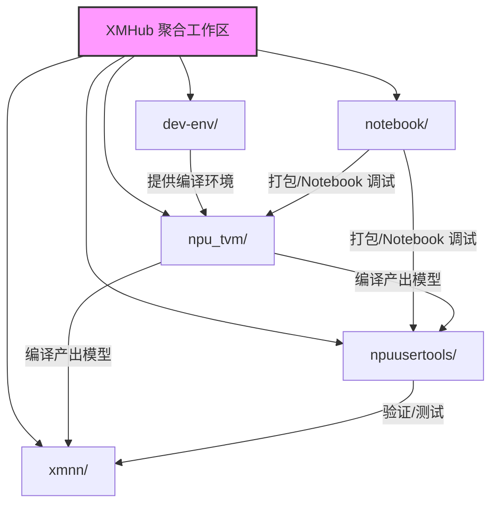

# XMHub Agent Workspace 初始化 - Product Requirement Document

## Overview
- **Summary**: 在 `d:\spaces\SpecWeave\external\xmhub` 根目录建立标准化的 AI Agent Workspace 结构，包含 AGENTS.md（智能体入口）、.agents/（轻量级项目手册）和 README.md（人类开发者导航页）。采用 llvm-dev 风格的「按需阅读」模式，支持多项目聚合根工作区架构。
- **Purpose**: 为 xmhub 下的 5 个子项目（dev-env、notebook、npu_tvm、npuusertools、xmnn）提供统一的智能体入口和跨项目导航，同时保持各子项目的独立性（已有 AGENTS.md 的子项目可继续独立运作）。
- **Target Users**: AI 智能体、xmhub 项目开发者、跨子项目协作的工程师

## Goals
- 建立符合 SpecWeave 工作区发现协议的根 AGENTS.md，包含启动协议、子项目路由表、按需阅读索引
- 创建轻量级 .agents/ 项目手册，包含 4 个核心文档（overview、commands、constraints、troubleshooting）
- 编写面向人类开发者的 README.md，提供子项目导航和快速开始指南
- 保持与已有子项目（notebook、dev-env/llvm-dev）AGENTS.md 风格一致
- 遵循工作区发现协议，确保零安装可用（git clone 后智能体即可识别并工作）

## Non-Goals (Out of Scope)
- 不引入 SpecWeave 完整的治理体系（roles/skills/scripts/templates 等全套）
- 不修改各子项目已有的 AGENTS.md 或 .agents/ 目录
- 不创建复杂的 workspace.yaml 或打包/安装机制
- 不实现自动化脚本或工具链
- 不重构各子项目内部结构

## Background & Context
- xmhub 目录是一个多项目聚合工作区，包含以下子项目：
  - **dev-env/**: 开发环境配置（llvm-dev 子项目已有 AGENTS.md）
  - **notebook/**: Notebook 与 Nuitka 打包流水线（已有 AGENTS.md 和 .agents/）
  - **npu_tvm/**: NPU TVM 深度学习编译器（完整 TVM 0.19.0 代码库）
  - **npuusertools/**: NPU 用户工具集（Python 工具包）
  - **xmnn/**: XMNN 神经网络推理框架
- 现有子项目中，notebook 和 dev-env/llvm-dev 采用「按需阅读」风格的轻量级 AGENTS.md，这是本次设计的主要参考
- SpecWeave 根目录的 AGENTS.md 是完整治理体系的范例，但对于 xmhub 这种外部项目聚合目录过于重型
- 工作区发现协议要求根 AGENTS.md 包含「启动协议」关键词才能被正确识别为 Root Workspace

## Functional Requirements
- **FR-1**: 创建 AGENTS.md，包含启动协议、子项目路由表、按需阅读索引、使用约定
- **FR-2**: 创建 .agents/README.md，说明 .agents 目录结构和文档使用约定
- **FR-3**: 创建 .agents/01-overview.md，描述 xmhub 整体定位、子项目关系、目录地图
- **FR-4**: 创建 .agents/02-commands.md，列出跨子项目常用命令和工作流
- **FR-5**: 创建 .agents/03-constraints.md，定义全局约束和跨项目协作规则
- **FR-6**: 创建 .agents/04-troubleshooting.md，整理常见问题和环境排查指南
- **FR-7**: 创建 README.md，提供人类开发者导航、子项目速查表、快速开始指南

## Non-Functional Requirements
- **NFR-1**: AGENTS.md 必须包含「启动协议」关键词，以通过工作区发现协议验证
- **NFR-2**: 整个 .agents/ 目录文档总长度控制在合理范围内（不超过 500 行），避免上下文浪费
- **NFR-3**: 所有 Markdown 文档遵循项目约定：中文描述、相对路径引用、无 file:/// 绝对路径
- **NFR-4**: 文档风格与 notebook/AGENTS.md、dev-env/llvm-dev/AGENTS.md 保持一致
- **NFR-5**: 所有文件编码为 UTF-8，换行符为 LF（Unix 风格）

## Constraints
- **Technical**: 
  - 必须遵循工作区发现协议（workspace-discovery.md）的最小可行 AGENTS.md 规范
  - 不引入外部依赖或工具
  - 保持轻量级，不复制 SpecWeave 的完整 .agents/ 结构
- **Business**:
  - 不破坏现有子项目的独立性
  - 与已有子项目 AGENTS.md 风格协调
- **Dependencies**:
  - 参考文档：[workspace-discovery.md](../../../../.agents/protocols/workspace-discovery.md)
  - 参考样例：[notebook/AGENTS.md](../../../../external/xmhub/notebook/AGENTS.md)、[dev-env/llvm-dev/AGENTS.md](../../../../external/xmhub/dev-env/llvm-dev/AGENTS.md)

## Assumptions
- 各子项目会持续独立演进，根工作区只提供路由和全局约束，不强制统一规范
- 用户主要在 Windows 环境下通过 Docker 容器进行开发（基于 npu_tvm 项目的 compose.sh 模式）
- 智能体进入子目录时会向上递归发现根工作区，但具体任务遵循子项目自身的 AGENTS.md
- 中文是主要工作语言

## Acceptance Criteria

### AC-1: AGENTS.md 符合工作区发现协议
- **Given**: xmhub 根目录存在 AGENTS.md
- **When**: 智能体进入该目录执行工作区发现
- **Then**: 识别为 Root Workspace，按启动协议完成自举
- **Verification**: `programmatic`
- **Notes**: 必须包含「启动协议」关键词，启动流程清晰可执行

### AC-2: 子项目路由正确
- **Given**: 任务涉及特定子项目（如 npu_tvm 编译）
- **When**: 智能体查阅 AGENTS.md 的子项目路由表
- **Then**: 能正确定位到对应子项目目录和其自身的 AGENTS.md（如存在）
- **Verification**: `human-judgment`
- **Notes**: 路由表需覆盖所有 5 个子项目，标注哪些已有 AGENTS.md

### AC-3: .agents/ 文档完整性
- **Given**: .agents/ 目录已创建
- **When**: 检查目录内容
- **Then**: 包含 README.md 和 01-04 四个主题文档，结构清晰，内容实用
- **Verification**: `human-judgment`

### AC-4: README.md 面向人类开发者友好
- **Given**: README.md 已创建
- **When**: 人类开发者阅读 README
- **Then**: 快速了解 xmhub 包含哪些子项目、如何开始开发、常用命令在哪
- **Verification**: `human-judgment`

### AC-5: 文档风格一致性
- **Given**: 所有文档已创建
- **When**: 对比 notebook/AGENTS.md 和 llvm-dev/AGENTS.md 风格
- **Then**: 按需阅读模式、简洁索引、中文表述、无冗余规则等风格保持一致
- **Verification**: `human-judgment`

### AC-6: 无破坏性变更
- **Given**: 文件创建完成
- **When**: 检查现有子项目
- **Then**: 所有已有文件（子项目 AGENTS.md、代码、配置等）未被修改
- **Verification**: `programmatic`

---

## 文件内容详细设计

### AGENTS.md 内容设计

```markdown
# XMHub - AI 协作者入口

本目录是 NPU/XMNN 相关项目的聚合工作区，包含开发环境、TVM 编译器、用户工具、推理框架等子项目。

## 启动协议（所有智能体必须遵循）

收到任务后立即按以下步骤执行，优先级高于任何 Skill 加载：

1. **读取本文件全文** — 本文件是 AI 协作者的唯一入口
2. **检查任务涉及的子项目** — 若任务明确针对某个子项目，先查阅下方「子项目路由表」跳转到对应子项目的 AGENTS.md（如存在）
3. **按按需阅读索引加载全局规范** — 跨项目任务或不涉及特定子项目时，按下方索引加载 .agents/ 下的对应文档
4. **自检** — 确认已理解子项目边界和全局约束
5. **开始工作** — 在规范指导下执行任务

## 子项目路由表

| 子项目 | 路径 | 定位 | 已有 AGENTS.md |
|--------|------|------|----------------|
| 开发环境 | dev-env/ | Docker 开发环境、LLVM 工具链配置 | dev-env/llvm-dev/AGENTS.md |
| Notebook 与打包 | notebook/ | Jupyter Notebook、Nuitka 打包流水线 | ✅ notebook/AGENTS.md |
| NPU TVM | npu_tvm/ | TVM 深度学习编译器（NPU 后端适配） | ❌（遵循本目录全局规范） |
| NPU 用户工具 | npuusertools/ | 精度验证、性能测试、带宽测试工具集 | ❌（遵循本目录全局规范） |
| XMNN 推理框架 | xmnn/ | XMNN 神经网络推理引擎 | ❌（遵循本目录全局规范）

## 按需阅读

请根据当前任务类型选择并遵循相关文档，无需按固定顺序全部读取：

- 了解 xmhub 整体定位、子项目关系或目录结构时，读取 `.agents/01-overview.md`
- 执行跨项目命令、运行 Docker 工作流或了解常用操作时，读取 `.agents/02-commands.md`
- 修改代码、了解全局约束或跨项目协作注意事项时，读取 `.agents/03-constraints.md`
- 进行环境问题排查、容器调试或常见错误解决时，读取 `.agents/04-troubleshooting.md`

## 补充资料

- `.agents/README.md`：.agents 目录说明、文档索引与使用约定
- 各子项目自身的 README.md：了解单个子项目的详细信息

## 使用约定

- 进入子目录工作时，遵循「就近优先」原则：若子目录有自己的 AGENTS.md，按子目录规范执行；否则继承本目录规范
- 涉及 Docker 容器操作、跨子项目文件引用或环境变量配置时，优先参考 `.agents/02-commands.md` 和 `.agents/03-constraints.md`
- 若新增长期有效的智能体规则或全局背景资料，请放入 `.agents/` 下对应编号的主题文档，并在本入口中补充索引
- 报告与临时文档统一存放到 `.agents/reports/` 目录，不要在根目录散落单独的 .md 文件

<!-- changelog -->
- 2026-07-17 | feat | 初始化 xmhub 根工作区 AGENTS.md
```

---

### .agents/README.md 内容设计

```markdown
---
id: "xmhub-agents-readme"
title: "XMHub .agents 目录说明"
---

# .agents 目录说明

本目录是 XMHub 工作区的 AI 智能体项目手册，采用轻量级「按需阅读」设计，包含 4 个主题文档：

| 文档 | 用途 | 阅读时机 |
|------|------|----------|
| [01-overview.md](01-overview.md) | xmhub 整体定位、子项目关系图、目录地图 | 了解工作区全貌时 |
| [02-commands.md](02-commands.md) | 跨子项目常用命令、Docker 工作流、开发流程 | 执行命令、运行工作流时 |
| [03-constraints.md](03-constraints.md) | 全局不可变约束、跨项目协作规则 | 修改代码、跨子项目操作时 |
| [04-troubleshooting.md](04-troubleshooting.md) | 常见问题、环境排查、容器调试技巧 | 遇到问题、需要排障时 |

## 使用约定

1. **按需阅读**：不需要一次性读完所有文档，根据当前任务类型选择对应文档
2. **就近优先**：子项目目录有自己的 `.agents/` 或 `AGENTS.md` 时，优先遵循子项目的规范
3. **补充资料**：子项目特定的规则请查看各子项目目录下的文档
4. **报告存放**：任务总结、复盘报告统一放到 `reports/` 子目录，命名格式 `task-summary-YYYYMMDD.md`

## 文档维护

- 如果发现规则缺失或需要补充，请更新对应编号的文档
- 新增主题文档时，在本 README 的表格中补充索引
- 保持文档简洁：只放长期稳定的规则，临时信息放到 `reports/` 目录
```

---

### .agents/01-overview.md 内容设计

```markdown
---
id: "xmhub-overview"
title: "XMHub 项目概览"
---

# 01 - 项目概览

## 工作区定位

XMHub 是 NPU（神经网络处理器）相关开发工具的聚合工作区，将编译工具链、开发环境、推理框架、用户工具整合在同一目录下，方便跨项目联调开发。

```
xmhub/
├── dev-env/          # 开发环境配置
│   └── llvm-dev/     # LLVM/Clang 容器化开发环境（有独立 AGENTS.md）
├── notebook/         # Notebook + Nuitka 打包流水线（有独立 AGENTS.md）
├── npu_tvm/          # TVM 深度学习编译器（NPU 后端适配版）
├── npuusertools/     # NPU 用户工具集（精度/性能/带宽测试）
└── xmnn/             # XMNN 神经网络推理框架
```

## 子项目关系



**依赖关系说明：**

1. **dev-env** 提供基础的 Docker 编译环境（LLVM、GCC、Python、Conda 等），其他项目的编译/构建可基于此环境
2. **npu_tvm** 是核心编译器，负责将深度学习模型编译为 NPU 可执行的格式
3. **npuusertools** 是用户侧工具，用于模型精度验证、性能测试、带宽测试等
4. **xmnn** 是轻量级推理框架，可运行 npu_tvm 编译后的模型
5. **notebook** 提供交互式调试环境和 Nuitka 打包流水线，用于工具打包和实验

## 主要技术栈

- **容器化**: Docker + Docker Compose
- **编译器**: TVM 0.19.0、LLVM >=22
- **语言**: Python >=3.14、C++17
- **构建系统**: CMake、Ninja、scikit-build-core
- **打包**: Nuitka、Conda
- **Notebook**: Jupyter Lab

## 开发模式

本工作区采用「宿主机编辑 + 容器内编译/运行」的开发模式：

- 宿主机（Windows）：代码编辑、Git 操作、浏览器访问 Jupyter
- 容器内（Linux）：编译 TVM、运行 Python 脚本、执行测试、RPC 服务
- 目录挂载：xmhub 目录挂载到容器内的工作路径
```

---

### .agents/02-commands.md 内容设计

```markdown
---
id: "xmhub-commands"
title: "XMHub 命令与工作流"
---

# 02 - 命令与流程

## 环境要求

- Windows 10/11 + WSL2 或原生 Linux
- Docker Desktop（启用 WSL2 后端）
- Docker Compose v2+

## npu_tvm 开发流程（主要工作流）

npu_tvm 是最常用的子项目，其开发流程通过 compose.sh 脚本管理：

```bash
cd npu_tvm

# 1. 配置环境（首次或需要重新配置时）
./compose.sh configure

# 2. 启动开发环境（Jupyter Lab + 编译容器）
./compose.sh up-dev

# 3. 编译 TVM（在容器内执行，或通过 docker exec）
./compose.sh build-tvm

# 4. （可选）启动 RPC 服务（用于板端调试）
./compose.sh up-rpc

# 5. 停止开发环境
./compose.sh down
```

### Jupyter Lab 访问

启动 up-dev 后，Jupyter Lab 可通过以下地址访问：
- URL: http://localhost:8888
- Token: `tvm`

### 常用容器操作

```bash
# 进入编译容器 shell
./compose.sh builder

# 在容器内执行命令
./compose.sh exec <command>

# 查看容器日志
./compose.sh logs
```

## dev-env/llvm-dev 使用流程

如需自定义 LLVM 开发环境：

```bash
cd dev-env/llvm-dev

# 查看可用命令
inv --list

# 构建 Docker 镜像
inv build

# 启动容器
inv up
```

详细说明见 dev-env/llvm-dev/ 自身的文档。

## notebook 使用流程

```bash
cd notebook

# 查看可用任务
inv --list

# 构建 Nuitka 打包镜像
inv build

# 执行 Nuitka 打包
inv nuitka
```

详细说明见 notebook/AGENTS.md。

## 跨项目文件引用约定

- 子项目之间引用文件时，使用**相对路径**，不要用绝对路径
- 公共脚本或工具优先考虑放到合适的子项目内，通过相对路径调用
- 避免在多个子项目中重复放置相同的配置文件

## Git 操作约定

- 各子项目是独立的 Git 仓库（有自己的 .git 目录）
- 在子项目目录内执行 git 命令，不要在 xmhub 根目录执行 git 操作
- xmhub 本身不是 Git 仓库（它是多个独立仓库的父目录）
```

---

### .agents/03-constraints.md 内容设计

```markdown
---
id: "xmhub-constraints"
title: "XMHub 约束与注意事项"
---

# 03 - 约束与注意事项

## 不可变全局约束（违反必失败）

1. **子项目独立性**：各子项目是独立 Git 仓库，不要在 xmhub 根目录执行 git 操作
2. **容器化构建**：所有编译/构建操作必须在 Docker 容器内执行，宿主机仅做编辑和编排
3. **换行符**：Shell 脚本（.sh）必须使用 LF 换行符，Windows 下 CRLF 会导致容器内执行失败
4. **Python/LLVM 版本**：npu_tvm 项目使用 Python >=3.14、LLVM >=22（已包含 Python 3.14 AST 兼容补丁）
5. **路径分隔**：文档和脚本中统一使用 Unix 风格路径（/），避免 Windows 反斜杠（\）
6. **中文编码**：Python 脚本处理容器 I/O 时使用 `sys.stdout.buffer.write()` 处理 bytes，避免 Windows GBK 编码问题

## 跨项目协作规则

1. **就近原则**：任务主要在哪个子目录，就遵循哪个子目录的规范（包括其 AGENTS.md 和 .agents/）
2. **边界清晰**：不要在子项目之间随意移动文件或复制代码；公共逻辑应明确归属到某个子项目
3. **环境变量**：跨子项目的环境变量统一在 docker-compose 配置中管理，不要硬编码在脚本里
4. **依赖管理**：Python 依赖通过 Conda 环境或 pyproject.toml 管理，不要全局 pip install
5. **输出位置**：编译产物、打包结果放在各子项目约定的目录（如 npu_tvm/build/），不要散落在根目录

## 代码风格约定

### Python
- 遵循 PEP 8 风格
- 类型注解按需添加
- 使用 `logging` 模块而非 `print()` 输出日志（简单脚本可例外）
- 容器内脚本注意处理 bytes 输出，避免编码错误

### Shell
- 使用 `#!/bin/bash` shebang
- 所有 .sh 文件必须是 LF 换行符
- 错误处理：使用 `set -euo pipefail` 作为脚本开头（复杂脚本）
- 路径引用：变量用双引号包裹，如 `"$WORKSPACE_PATH"`

### C++
- 遵循现有代码风格（参考 npu_tvm/src/ 下的代码）
- 使用 C++17 标准
- 重要逻辑添加注释

## 文档约定

- 新增智能体规则文档放入 `.agents/` 目录，按编号命名
- 子项目特定文档放在子项目自己的目录下
- 临时报告、复盘放入 `.agents/reports/` 目录
- Markdown 链接使用**相对路径**，禁止 `file:///` 绝对路径
```

---

### .agents/04-troubleshooting.md 内容设计

```markdown
---
id: "xmhub-troubleshooting"
title: "XMHub 调试与排障"
---

# 04 - 调试与排障

## 常见问题

### Q1: Shell 脚本在容器内报错 "bad interpreter" 或 "^M: command not found"

**原因**: Windows 下编辑导致 CRLF 换行符问题。

**解决**:
```bash
# 在项目目录执行，转换换行符
sed -i 's/\r$//' *.sh
# 或使用 dos2unix
dos2unix *.sh
```

**预防**: 配置 Git 使用 LF 换行符，或在编辑器中设置默认 LF。

---

### Q2: Jupyter Lab 无法访问或提示权限错误

**原因**: 容器内 Jupyter 未使用 --allow-root 启动，或端口映射问题。

**解决**:
1. 确认容器正在运行：`docker ps`
2. 检查端口 8888 是否被占用：`netstat -ano | findstr :8888`
3. 重新启动开发环境：`cd npu_tvm && ./compose.sh down && ./compose.sh up-dev`
4. 确认访问 URL 带 token：http://localhost:8888/?token=tvm

---

### Q3: TVM 编译失败，提示 Python.h 找不到或 LLVM 相关错误

**原因**: Conda 环境未正确激活，或 LLVM 版本不匹配。

**解决**:
```bash
# 进入容器
cd npu_tvm && ./compose.sh builder

# 确认在 tvm-build 环境中
conda activate tvm-build
python --version  # 应该是 >=3.14
llvm-config --version  # 应该是 >=22

# 重新配置和编译
rm -rf build
cmake .. -DUSE_LLVM=llvm-config
make -j$(nproc)
```

---

### Q4: Docker 容器启动失败，端口冲突

**原因**: 8888（Jupyter）或其他端口被占用。

**解决**:
```bash
# 查看端口占用
# Windows
netstat -ano | findstr :8888
# Linux
lsof -i :8888

# 杀掉占用进程或修改 compose 配置中的端口映射
```

---

### Q5: Python 导入 tvm 失败，提示找不到 libtvm.so

**原因**: TVM_LIBRARY_PATH 或 PYTHONPATH 未设置。

**解决**:
在容器内确认环境变量：
```bash
echo $TVM_LIBRARY_PATH  # 应该指向 /workspace/npu_tvm/build
echo $PYTHONPATH       # 应该包含 /workspace/npu_tvm/python

# 验证 TVM 是否可用
python -c "import tvm; print(tvm.__version__)"
```

---

### Q6: Nuitka 打包时中文输出乱码

**原因**: Windows GBK 编码与容器内 UTF-8 不兼容。

**解决**: Python 脚本中使用 buffer 方式输出：
```python
import sys
sys.stdout.buffer.write("中文输出".encode('utf-8'))
```

---

## 容器调试技巧

### 查看容器日志
```bash
cd npu_tvm
./compose.sh logs -f  # 实时跟踪日志
```

### 在运行中的容器内执行命令
```bash
./compose.sh exec python --version
./compose.sh exec bash  # 进入 shell
```

### 重建容器（配置变更后）
```bash
./compose.sh down
./compose.sh up-dev --build  # 重新构建镜像
```

## 环境诊断清单

遇到问题时按以下顺序检查：

1. **容器状态**: `docker ps` 确认相关容器在运行
2. **端口占用**: 确认需要的端口（8888、RPC 端口等）未被占用
3. **换行符**: .sh 文件是否为 LF
4. **Conda 环境**: 是否进入正确的 Conda 环境（tvm-build）
5. **环境变量**: TVM_LIBRARY_PATH、PYTHONPATH、LD_LIBRARY_PATH 是否正确
6. **磁盘空间**: Docker 镜像和构建产物占用大量空间，必要时 `docker system prune`
7. **文件权限**: 挂载目录的权限是否正确（Linux 下 UID/GID 映射）

## 获取帮助

- 子项目特定问题：查看子项目自己的 README.md 或 .agents/ 文档
- TVM 官方文档: https://tvm.apache.org/docs/
- Docker 文档: https://docs.docker.com/
```

---

### README.md 内容设计

```markdown
# XMHub

NPU 开发工具聚合工作区 — 包含开发环境、TVM 编译器、用户工具、推理框架。

## 子项目速查

| 子项目 | 路径 | 一句话说明 |
|--------|------|-----------|
| 🔧 开发环境 | [dev-env/](dev-env/) | Docker 容器化 LLVM/编译环境 |
| 📓 Notebook | [notebook/](notebook/) | Jupyter 交互式调试 + Nuitka 打包流水线 |
| 🚀 NPU TVM | [npu_tvm/](npu_tvm/) | TVM 深度学习编译器（NPU 后端适配） |
| 🛠️ 用户工具 | [npuusertools/](npuusertools/) | 精度验证、性能测试、带宽测试工具集 |
| ⚡ XMNN 推理 | [xmnn/](xmnn/) | XMNN 轻量级神经网络推理框架 |

## 快速开始

### 1. 环境准备

确保已安装：
- Docker Desktop（启用 WSL2 后端，Windows 用户）
- Docker Compose v2+

### 2. 启动 NPU TVM 开发环境（最常用）

```bash
cd npu_tvm

# 首次运行先配置
./compose.sh configure

# 启动开发环境（Jupyter + 编译容器）
./compose.sh up-dev
```

启动后访问：
- **Jupyter Lab**: http://localhost:8888（Token: `tvm`）

### 3. 编译 TVM

```bash
# 在新终端中，或通过 Jupyter Terminal
cd npu_tvm
./compose.sh build-tvm
```

编译完成后，验证 TVM 可用：
```bash
./compose.sh exec python -c "import tvm; print('TVM version:', tvm.__version__)"
```

## 常用命令

### npu_tvm 管理脚本

在 `npu_tvm/` 目录下：

| 命令 | 说明 |
|------|------|
| `./compose.sh configure` | 配置环境 |
| `./compose.sh up-dev` | 启动开发环境（Jupyter + builder） |
| `./compose.sh build-tvm` | 编译 TVM |
| `./compose.sh up-rpc` | 启动 RPC 服务（板端调试用） |
| `./compose.sh builder` | 进入编译容器 shell |
| `./compose.sh down` | 停止并移除容器 |
| `./compose.sh logs -f` | 查看容器日志 |

### 进入容器后

```bash
# 激活 Conda 环境
conda activate tvm-build

# Python 路径已配置，可直接使用
python
>>> import tvm
>>> import numpy as np
```

## AI 智能体协作

本目录已配置 AI Agent Workspace：

- **AGENTS.md**: 智能体入口文件，包含启动协议和路由表
- **.agents/**: 智能体项目手册（项目概览、命令流程、约束注意事项、调试排障）

AI 智能体进入本目录时会自动识别工作区并按规范协作。

## 目录结构

```
xmhub/
├── AGENTS.md         # AI 协作者入口（智能体读这个）
├── README.md         # 本文件（人类开发者读这个）
├── .agents/          # AI 智能体项目手册
│   ├── README.md
│   ├── 01-overview.md
│   ├── 02-commands.md
│   ├── 03-constraints.md
│   └── 04-troubleshooting.md
├── dev-env/          # 开发环境配置
├── notebook/         # Notebook 与 Nuitka 打包
├── npu_tvm/          # TVM 编译器
├── npuusertools/     # NPU 用户工具
└── xmnn/             # XMNN 推理框架
```

## 注意事项

- ⚠️ 各子项目是独立的 Git 仓库，请在子项目目录内执行 git 命令
- ⚠️ Shell 脚本使用 LF 换行符，Windows 下注意 Git 配置
- ⚠️ 所有编译/构建操作在 Docker 容器内执行，不要在宿主机直接编译
- 📖 详细开发规范见 `.agents/` 目录下的文档

## 相关链接

- [TVM 官方文档](https://tvm.apache.org/docs/)
- [Docker 文档](https://docs.docker.com/)

<!-- changelog -->
- 2026-07-17 | feat | 初始化 xmhub 根工作区 README
```

## Open Questions
- 无（需求已澄清，设计方案已确认）
