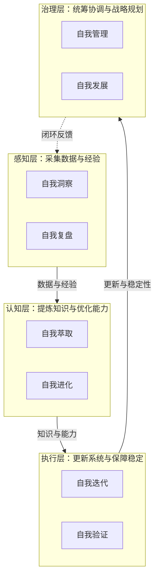

# SpecWeave — AI 智能体开发规范体系

[](LICENSE)
[](AGENTS.md)
[](https://conventionalcommits.org)
[](CONTRIBUTING.md)
[](https://gitcode.com/daoCollective/SpecWeave)
[](https://gitcode.com/daoCollective/SpecWeave/issues)
[](https://gitcode.com/daoCollective/SpecWeave)
[](https://gitcode.com/daoCollective/SpecWeave)

> **SpecWeave** — 规范之网：将角色、协议、工作流编织为有机的智能体协作体系

> 一套面向多智能体协作开发的开放规范体系，基于 [AGENTS.md 开放标准](https://agents.md) 定义智能体的角色、能力边界、协作协议与工作流，让 AI 智能体在项目中能够"按需加载、各司其职、协同交付"。

本体系基于 [AGENTS.md 开放标准](https://agents.md) 构建，通过单一入口路由与按需加载机制，让多智能体协作具备一致的上下文与质量基线。详见 [项目概述](docs/project-overview.md)。

## 快速开始

```bash
git clone <repository-url>
cd <repository-name>
```

将本仓库根目录指定为 AI 编码工具（Codex、Cursor、Copilot 等）的工作目录，工具会自动读取 `AGENTS.md` 作为项目级指令。验证脚本的使用方式请参见 [.agents/scripts/](.agents/scripts/)。

## 项目亮点

详细的技术创新点与量化成果见 [docs/project-highlights.md](docs/project-highlights.md)。

### 核心优势

| 优势 | 说明 |
|---|---|
| 单一入口路由 | AGENTS.md 作为最高优先级入口，按需加载 .agents/ 规范，避免上下文爆炸 |
| 7 角色分工体系 | orchestrator/architect/developer/reviewer/tester/co-founder/team-admin，每个角色有明确职责与能力边界 |
| 机器可读的角色定义 | TOML frontmatter 声明 id/domain/layer/bindings，便于智能体程序化解析与绑定 |
| 完整协作协议 | 覆盖任务交接、消息传递、冲突解决、临时依赖管理与应用开发生命周期 |
| Mermaid 流程可视化 | 所有工作流、架构、关系均使用 Mermaid 表达，可渲染、可版本化 |
| 原子化规范体系 | 文档与代码遵循单一职责原则拆分，入口精简、细节按需加载 |

### 技术创新点

核心创新包括：入口+容器二元架构、三层递进提示词体系、元工具体系、三层治理模型、自指性规范体系、工具熵减非线性优化、元文档杠杆效应、两栖定位模型等。详见 [项目亮点](docs/project-highlights.md#技术创新点)。

## 项目蓝图

短期发展目标、中长期战略方向、技术路线演进、功能迭代计划与市场拓展策略详见 [docs/roadmap.md](docs/roadmap.md)。

## 系统规划

围绕"用工具治理工具"的核心理念，构建感知→认知→执行→治理四层闭环的八模块自我演进体系。

| 层级 | 模块 | 核心职责 | 入口 |
|---|---|---|---|
| 感知层 | 自我洞察 · 自我复盘 | 状态监控与异常预警 · 项目复盘与知识沉淀 | [.agents/modules/](.agents/modules/) |
| 认知层 | 自我萃取 · 自我进化 | 模式提取与资产入库 · 反馈分析与性能调优 | [.agents/modules/](.agents/modules/) |
| 执行层 | 自我迭代 · 自我验证 | 自动更新与回滚 · 测试生成与覆盖率分析 | [.agents/modules/](.agents/modules/) |
| 治理层 | 自我管理 · 自我发展 | 资源调度与冲突仲裁 · 战略规划与生态建设 | [.agents/modules/](.agents/modules/) |

每个模块的完整技术定义（架构、实现步骤、资源需求、预期指标）详见 [.agents/modules/](.agents/modules/)。



## 可复用模式体系

本项目在实践中持续萃取可复用的开发模式，形成三层模式库（**方法论模式177+、架构模式25+、代码模式35+，合计237+个，其中5个L3标准化模式**），涵盖从代码级到方法论级的完整复用体系。详见 [docs/reuse-and-generalization.md#可复用模式库](docs/reuse-and-generalization.md)。核心数据见 [项目亮点](docs/project-highlights.md#量化成果)（截至2026-07-05，800次提交）。

> 模式全景索引见 [retrospective/patterns/](docs/retrospective/patterns/)

## 泛化与资产复用

本规范体系是可迁移到任何项目的**元规范框架**。可复用资产清单、三维泛化路径（术语泛化/领域泛化/标准泛化）与已有落地案例详见 [docs/reuse-and-generalization.md](docs/reuse-and-generalization.md)。

> 已有复用案例：`vendor/flexloop/` 目录下的 AgentForge 项目验证了核心机制的可迁移性，详见 [agentforge-adoption.md](.agents/cases/agentforge-adoption.md)

### 提示词萃取系统

独立的 Python 子项目，实现从对话记录中自动萃取可复用提示词模式的完整流水线。详见 [prompt_extraction/](prompt_extraction/)，系统架构见 [.agents/systems/prompt-extraction.md](.agents/systems/prompt-extraction.md)。

## 角色协作场景

多智能体协作系统支持**中心化模式**（由 orchestrator 主导组队，适用于跨角色大型任务）与**去中心化模式**（任意角色通过 `@角色名` 语法发起协作请求，适用于局部需求）两种互补模式。

> 完整的协作场景定义（触发条件、成员选择机制、协作流程图、任务分配方式、角色相互 @ 机制、预期交付物等）见 [.agents/roles/collaboration-scenarios.md](.agents/roles/collaboration-scenarios.md)

## 文档导航

<!-- NAV_TABLE_START -->

| 文档 | 说明 |
|------|------|
| [智能体角色体系](docs/agent-roles.md) | 5 个核心角色定义与绑定关系 |
| [协作体系](docs/collaboration.md) | 4 项协作协议、3 个标准工作流 |
| [开发规范](docs/development-standards.md) | 代码风格、提交规范、测试要求、文档边界 |
| [知识库](docs/knowledge-base.md) | 技术知识库、复盘文档体系 |
| [「复盘+洞察+萃取+导出」与「原子化+模块化」方法论全面分析](docs/methodology-analysis-report.md) | 「复盘+洞察+萃取+导出」与「原子化+模块化」方法论全面分析 |
| [项目亮点](docs/project-highlights.md) | 本文件汇总 SpecWeave 规范体系的核心优势、技术创新点与量化成果数据。数据截至2026-07-05（800... |
| [项目概述](docs/project-overview.md) | 项目定位、设计理念、核心特性 |
| [项目结构](docs/project-structure.md) | 完整目录树与职责说明 |
| [RACI 治理规范与模板](docs/raci-governance-standards.md) | RACI 治理规范与模板 |
| [相关链接](docs/related-links.md) | 外部标准、工具文档、项目仓库 |
| [泛化与资产复用](docs/reuse-and-generalization.md) | 本规范体系的设计目标不仅是"描述一个项目"，更是"可以迁移到任何项目"的**元规范框架**。本文件说明可复用资产清... |
| [项目蓝图与路线图](docs/roadmap.md) | 本文件定义 SpecWeave 规范体系的短期目标、中长期战略方向、技术路线演进与功能迭代计划。 |
| [技术栈与环境要求](docs/tech-stack.md) | 技术选型、环境依赖 |
| [Trae 应用优化分析与实施指南](docs/trae-project-adaptation-guide.md) | Trae 应用优化分析与实施指南 |
| [验证与自动化](docs/verification-automation.md) | 临时依赖治理、验证脚本 |
| [贡献指南](CONTRIBUTING.md) | 贡献流程、分支命名、PR 规范 |

<!-- NAV_TABLE_END -->

## MDI（Markdown Interface）示例

MDI 是一套"Markdown 即接口"规范，支持用 Markdown 文件同时承载人类阅读与机器解析的接口定义。所有示例位于 [examples/mdi/](examples/mdi/) 目录：

| Profile 类型 | 示例文件 | 说明 |
|---|---|---|
| WebApi | [user-api.md](examples/mdi/user-api.md) | 用户管理 RESTful API 完整示例（CRUD + 分页 + 错误码） |
| WebApi | [todo-api.md](examples/mdi/todo-api.md) | 待办事项 API |
| WebApi | [generate-api.md](examples/mdi/generate-api.md) | 内容生成服务 API |
| CliTool | [file-cli.md](examples/mdi/file-cli.md) | 文件操作 CLI 工具示例 |
| GraphQL | [graphql-blog.md](examples/mdi/graphql-blog.md) | 博客平台 GraphQL API（英文） |
| GraphQL | [graphql-blog-cn.md](examples/mdi/graphql-blog-cn.md) | 博客平台 GraphQL API（中文），含完整 Schema/Query/Mutation/Subscription |

> 📖 完整使用指南见 [examples/mdi/README.md](examples/mdi/README.md)，包含 GraphQL Profile 的 Schema 定义、Directive 操作、验证规则等详细说明。
> 📐 MDI 规范文档：[mdi-spec-v1.0.md](docs/knowledge/mdi-spec-v1.0.md)

## Spec 执行进度

<!-- SPEC_DASHBOARD_START -->

**整体进度：143/172 完成 · 83% · 15 项进行中 · 14 项待启动**

| 主题 | Spec 数 | 已完成 | 状态 | 看板 |
|---|---|---|---|---|
| [core-foundation](.trae/specs/core-foundation/) | 11 | 11 | ✅ 100% | [查看](.trae/specs/core-foundation/README.md) |
| [roles-governance](.trae/specs/roles-governance/) | 8 | 8 | ✅ 100% | [查看](.trae/specs/roles-governance/README.md) |
| [standards-tools](.trae/specs/standards-tools/) | 24 | 22 | 🔧 91% | [查看](.trae/specs/standards-tools/README.md) |
| [readme-branding](.trae/specs/readme-branding/) | 4 | 4 | ✅ 100% | [查看](.trae/specs/readme-branding/README.md) |
| [docs-restructure](.trae/specs/docs-restructure/) | 11 | 10 | 🔧 90% | [查看](.trae/specs/docs-restructure/README.md) |
| [retrospectives-insights](.trae/specs/retrospectives-insights/) | 109 | 83 | 🔧 76% | [查看](.trae/specs/retrospectives-insights/README.md) |
| [migration-archival](.trae/specs/migration-archival/) | 5 | 5 | ✅ 100% | [查看](.trae/specs/migration-archival/README.md) |
| [ark-cli-git-submodule](.trae/specs/ark-cli-git-submodule/) | 0 | 0 | ✅ 100% | [查看](.trae/specs/ark-cli-git-submodule/README.md) |
| [camera-power-automation-testing](.trae/specs/camera-power-automation-testing/) | 0 | 0 | ✅ 100% | [查看](.trae/specs/camera-power-automation-testing/README.md) |
| [dingtalk-okr-wiki-migration](.trae/specs/dingtalk-okr-wiki-migration/) | 0 | 0 | ✅ 100% | [查看](.trae/specs/dingtalk-okr-wiki-migration/README.md) |
| [gitcode-ai-best-practices](.trae/specs/gitcode-ai-best-practices/) | 0 | 0 | ✅ 100% | [查看](.trae/specs/gitcode-ai-best-practices/README.md) |
| [okr-wiki-manual](.trae/specs/okr-wiki-manual/) | 0 | 0 | ✅ 100% | [查看](.trae/specs/okr-wiki-manual/README.md) |
| [retrospective-analysis-dimension-template-library](.trae/specs/retrospective-analysis-dimension-template-library/) | 0 | 0 | ✅ 100% | [查看](.trae/specs/retrospective-analysis-dimension-template-library/README.md) |

> 详细进度、待办事项、里程碑路线图与跨主题依赖关系见 [全局执行看板](.trae/specs/README.md)。

<!-- SPEC_DASHBOARD_END -->

## 许可证

本项目基于 [Apache License 2.0](LICENSE) 开源。

## 联系方式

- **问题反馈**：[GitCode Issues](https://gitcode.com/daoCollective/SpecWeave/issues)
- **讨论交流**：[GitCode Pull Requests](https://gitcode.com/daoCollective/SpecWeave/pulls)

---

> **规范体系入口**：智能体启动时必须首先读取 [AGENTS.md](AGENTS.md)，按上下文路由表加载 [.agents/](.agents/) 下的对应规范。详细文档索引见 [docs/README.md](docs/README.md)。
