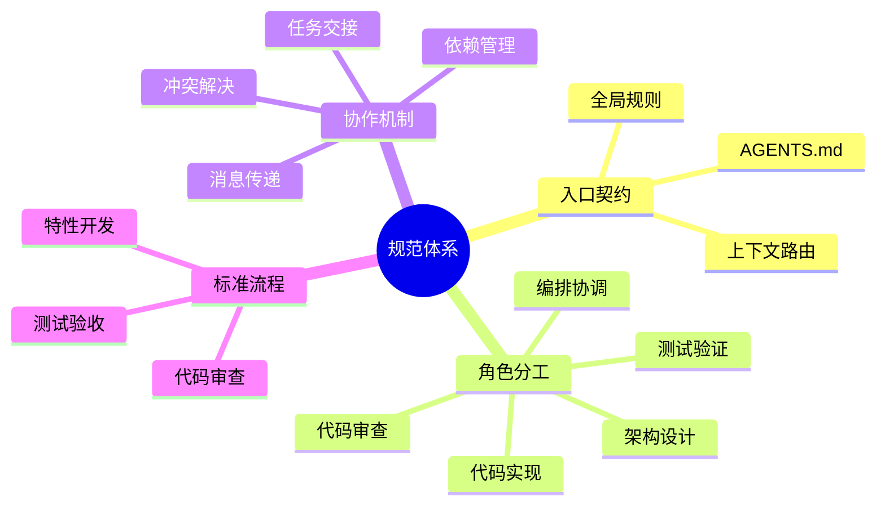
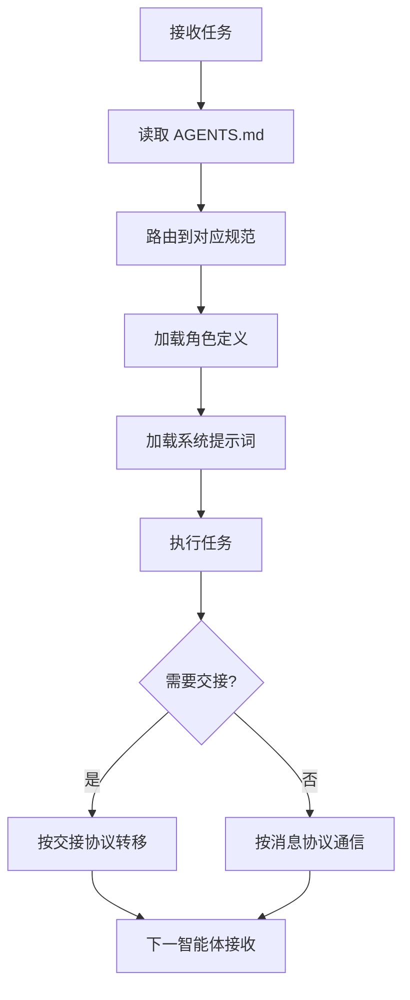
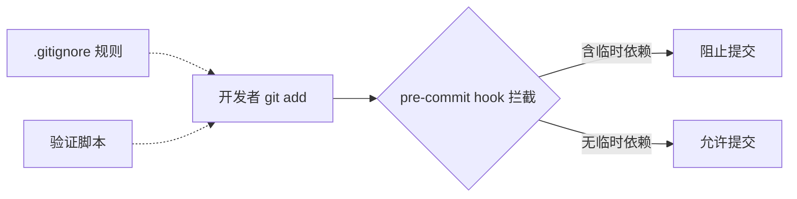

# AI 智能体开发规范体系

[![License][license-badge]][license-link]
[![AGENTS.md][agents-badge]][agents-link]
[![Conventional Commits][commits-badge]][commits-link]
[![PRs Welcome][prs-badge]][prs-link]
[![Repo][repo-badge]][repo-link]
[![Issues][issue-badge]][issue-link]
[![Stars][star-badge]][star-link]
[![Forks][fork-badge]][fork-link]

[license-badge]: https://img.shields.io/badge/license-Apache--2.0-blue.svg
[license-link]: LICENSE
[agents-badge]: https://img.shields.io/badge/AGENTS.md-Open%20Standard-orange.svg
[agents-link]: AGENTS.md
[commits-badge]: https://img.shields.io/badge/Conventional%20Commits-1.0.0-yellow.svg
[commits-link]: https://conventionalcommits.org
[prs-badge]: https://img.shields.io/badge/PRs-welcome-brightgreen.svg
[prs-link]: #贡献指南
[repo-badge]: https://img.shields.io/badge/repo-atomgit-blue.svg
[repo-link]: https://atomgit.com/daoCollective/AI
[issue-badge]: https://img.shields.io/badge/issues-welcome-red.svg
[issue-link]: https://atomgit.com/daoCollective/AI/issues
[star-badge]: https://img.shields.io/badge/stars-welcome-yellow.svg
[star-link]: https://atomgit.com/daoCollective/AI
[fork-badge]: https://img.shields.io/badge/forks-welcome-green.svg
[fork-link]: https://atomgit.com/daoCollective/AI

> 一套面向多智能体协作开发的开放规范体系，基于 [AGENTS.md 开放标准](https://agents.md) 定义智能体的角色、能力边界、协作协议与工作流，让 AI 智能体在项目中能够"按需加载、各司其职、协同交付"。

## 项目概述

本项目是一套**智能体开发规范体系**，而非传统意义上的可执行应用。它通过两个核心载体为 AI 智能体提供项目级上下文与协作契约：

- **`AGENTS.md`**：项目 AI 智能体的最高优先级入口与上下文路由文件，定义全局核心规则、角色索引、能力边界与协作协议概要。
- **`.agents/`**：智能体规范容器，承载角色定义、系统提示词、工具调用规范、协作协议、工作流、模板与自动化脚本。

本规范体系被 [OpenAI Codex](https://openai.com/codex)、[Cursor](https://cursor.sh)、[GitHub Copilot](https://github.com/features/copilot) 等 30+ 工具识别与遵循，可作为任意 AI 编码工具的项目级指令源。

### 设计理念



## 核心特性

- **单一入口路由**：所有智能体启动时仅读取 `AGENTS.md`，按上下文路由表按需加载 `.agents/` 中的具体规范，避免上下文爆炸。
- **5 角色分工体系**：定义 orchestrator、architect、developer、reviewer、tester 五个核心角色，每个角色有明确的职责与能力边界（Non-Goals）。
- **机器可读的角色定义**：角色文件使用 TOML frontmatter 声明 `id`、`domain`、`layer`、`bindings`，便于智能体程序化解析与绑定。
- **完整协作协议**：覆盖任务交接、消息传递、冲突解决与临时依赖管理四类协议，确保多智能体协作有章可循。
- **Mermaid 流程可视化**：所有工作流、架构、关系均使用 Mermaid 表达，可渲染、可版本化、可审查。
- **临时依赖治理**：通过 `.gitignore` 规则、Git pre-commit hook 与验证脚本三重机制，防止 `vendor/`、`.temp/`、`__pycache__/` 等临时依赖被误提交。
- **Conventional Commits 规范**：统一提交信息格式，便于自动生成变更日志与版本管理。

## 项目结构

```
.
├── AGENTS.md                 # 智能体全局契约（最高优先级入口）
├── LICENSE                   # Apache 2.0 许可证
├── README.md                 # 项目说明文档（本文件）
├── .gitignore                # Git 忽略规则
├── .agents/                  # 智能体规范容器
│   ├── README.md             # 目录说明与使用指引
│   ├── roles/                # 智能体角色定义（5 个角色 + 索引）
│   ├── prompts/              # 系统提示词与 few-shot 示例（按角色分子目录）
│   ├── tools/                # 工具调用规范（文件/执行/搜索/通信）
│   ├── protocols/            # 协作协议（交接/消息/冲突/依赖）
│   ├── workflows/            # 标准工作流（开发/审查/测试）
│   ├── templates/            # 任务与交接模板
│   └── scripts/              # 验证与自动化脚本
├── .trae/
│   └── specs/                # 规格驱动开发文档（spec/tasks/checklist）
└── vendor/                   # 第三方库依赖（已被 .gitignore 排除）
```

> **说明**：`vendor/` 目录用于存放第三方库依赖，已被 `.gitignore` 排除，不会纳入版本控制。详见 [临时依赖管理](#临时依赖治理)。

## 技术栈

| 类别 | 技术 / 标准 | 用途 |
|---|---|---|
| 智能体标准 | [AGENTS.md Open Standard](https://agents.md) | 项目级智能体指令文件 |
| 元数据格式 | [TOML](https://toml.io/) Frontmatter | 角色定义的机器可读元数据 |
| 可视化 | [Mermaid](https://mermaid.js.org/) | 流程图、架构图、关系图 |
| 提交规范 | [Conventional Commits 1.0](https://conventionalcommits.org) | 统一提交信息格式 |
| 版本控制 | [Git](https://git-scm.com/) | 源代码版本管理 |
| 验证脚本 | [Python 3.10+](https://www.python.org/) | .gitignore 规则与 git 状态验证 |
| 自动化 | Git Hooks (pre-commit) | 阻止临时依赖被提交 |
| 许可证 | [Apache License 2.0](https://www.apache.org/licenses/LICENSE-2.0) | 开源许可证 |

## 环境要求

使用本规范体系前，请确认本地已安装以下工具：

| 工具 | 最低版本 | 用途 | 必需 |
|---|---|---|---|
| Git | 2.30+ | 版本控制、执行 hooks | 是 |
| Python | 3.10+ | 运行验证脚本 | 否（仅验证时需要） |
| AI 编码工具 | — | Codex / Cursor / Copilot / Claude 等 | 是 |

> 本规范体系本身不包含可执行的业务代码，无需安装运行时依赖。

## 快速开始

### 1. 克隆仓库

```bash
git clone <repository-url>
cd <repository-name>
```

### 2. 验证 Git 忽略规则

运行验证脚本，确认临时依赖路径已被正确排除：

```bash
python .agents/scripts/check-gitignore.py
```

预期输出：

```
验证通过: 所有临时依赖路径已被 .gitignore 覆盖
```

### 3. 配置 AI 编码工具

将本仓库根目录指定为 AI 编码工具的工作目录。支持 AGENTS.md 标准的工具（Codex、Cursor、Copilot 等）会自动读取 `AGENTS.md` 作为项目级指令。

### 4. 启用 Git pre-commit Hook（可选）

本仓库已内置 `pre-commit` 脚本，用于阻止临时依赖被提交。如需启用：

```bash
# Git 默认会执行 .git/hooks/pre-commit（仓库已配置）
# 首次克隆后可验证 hook 是否生效
git commit --allow-empty -m "test: 验证 pre-commit hook"
```

## 智能体角色体系

本项目定义了 5 个核心智能体角色，各司其职、互不越权：

| 角色 | ID | 职责 | 能力边界（Non-Goals） |
|---|---|---|---|
| 编排协调者 | `orchestrator` | 任务分解、流程协调、冲突仲裁 | 不编写业务代码、不做技术决策 |
| 架构师 | `architect` | 技术方案设计、架构决策 | 不负责代码实现细节、不编写测试 |
| 开发者 | `developer` | 代码实现、重构、缺陷修复 | 不擅自变更架构、不绕过审查合并 |
| 代码审查者 | `reviewer` | 代码质量审查、规范校验 | 不直接修改业务代码、不执行验收测试 |
| 测试工程师 | `tester` | 测试用例编写、执行、覆盖率 | 不负责生产部署、不修改业务逻辑 |

每个角色定义文件位于 `.agents/roles/<role>.md`，使用 TOML frontmatter 声明绑定关系：

```toml
+++
id = "orchestrator"
domain = "coordination"
layer = "orchestration"

[bindings]
rules = [".agents/protocols/handoff.md", ".agents/protocols/messaging.md"]
references = [".agents/workflows/feature-development.md"]
skills = []
+++
```

对应的系统提示词与 few-shot 示例位于 `.agents/prompts/<role>/`。

## 协作协议

多智能体协作通过以下 4 项协议保障：

| 协议 | 入口 | 用途 |
|---|---|---|
| 任务交接 | [.agents/protocols/handoff.md](.agents/protocols/handoff.md) | 智能体间任务转移的标准化格式 |
| 消息传递 | [.agents/protocols/messaging.md](.agents/protocols/messaging.md) | 智能体间通信的消息结构 |
| 冲突解决 | [.agents/protocols/conflict-resolution.md](.agents/protocols/conflict-resolution.md) | 分歧仲裁与升级机制 |
| 临时依赖管理 | [.agents/protocols/dependency-management.md](.agents/protocols/dependency-management.md) | 依赖存放、使用与清理 |

### 协作流程



## 标准工作流

本项目定义了 3 个标准工作流，均包含 Mermaid 流程图与详细步骤：

| 工作流 | 入口 | 适用场景 |
|---|---|---|
| 特性开发 | [.agents/workflows/feature-development.md](.agents/workflows/feature-development.md) | 新功能从需求到交付 |
| 代码审查 | [.agents/workflows/code-review.md](.agents/workflows/code-review.md) | 代码合并前的质量把关 |
| 测试 | [.agents/workflows/testing.md](.agents/workflows/testing.md) | 测试编写、执行与验收 |

## 开发规范

### 代码风格

- 遵循现有代码风格，不引入与项目不一致的新风格。
- 命名、缩进、注释、文件组织均以仓库内既有约定为准。
- 新增依赖前先评估必要性，优先复用现有工具链。

### 提交规范

遵循 [Conventional Commits](https://conventionalcommits.org) 规范，格式为 `type(scope): subject`：

| 类型 | 用途 |
|---|---|
| `feat` | 新功能 |
| `fix` | 缺陷修复 |
| `refactor` | 代码重构（不改变行为） |
| `test` | 测试相关 |
| `docs` | 文档变更 |
| `chore` | 构建、工具、依赖等杂项 |
| `perf` | 性能优化 |

提交信息主体使用中文描述，简明扼要说明"为什么"而非仅"做了什么"。

### 测试要求

- 每个模块必须有对应的单元测试，覆盖核心逻辑与边界条件。
- 整体测试覆盖率不低于 **80%**，关键模块不低于 **90%**。
- 所有测试用例通过，无新增失败用例与回归问题。

### 文档边界

- `README.md` 面向**人类读者**，介绍项目用途、安装、使用与贡献方式。
- `AGENTS.md` 与 `.agents/` 面向 **AI 智能体**，存放机器可读规范。
- 两者职责分离，不相互混用。

## 验证与自动化

### 临时依赖治理

本项目通过三重机制防止临时依赖被误提交：



| 机制 | 文件 | 作用 |
|---|---|---|
| 忽略规则 | [.gitignore](.gitignore) | 排除 `vendor/`、`.temp/`、`__pycache__/`、`.venv/`、`node_modules/` 等路径 |
| 自动拦截 | `.git/hooks/pre-commit` | 暂存区含临时依赖时阻止提交 |
| 主动验证 | [.agents/scripts/check-gitignore.py](.agents/scripts/check-gitignore.py) | 验证规则覆盖度与 git 状态洁净度 |

### 运行验证脚本

```bash
python .agents/scripts/check-gitignore.py
```

脚本会检查：
1. `.gitignore` 是否包含所有必需的忽略规则（共 10+ 条）。
2. `git status` 输出中是否包含临时依赖路径。

## 贡献指南

欢迎为本规范体系贡献内容！请遵循以下流程：

### 1. 准备工作

```bash
# Fork 仓库后克隆到本地
git clone <your-fork-url>
cd <repository-name>

# 确认验证脚本通过
python .agents/scripts/check-gitignore.py
```

### 2. 创建分支

```bash
git checkout -b feat/your-feature
```

分支命名遵循 `type/brief-description` 格式，例如 `feat/add-new-role`、`fix/handoff-protocol`。

### 3. 提交变更

- 遵循 [Conventional Commits](https://conventionalcommits.org) 规范。
- 每个提交应是逻辑完整的原子单元，聚焦单一职责。
- 提交信息主体使用中文描述。

```bash
git add <相关文件>
git commit -m "feat: 添加 XXX 角色" -m "详细说明变更原因与影响。"
```

### 4. 提交前检查

- [ ] 验证脚本通过：`python .agents/scripts/check-gitignore.py`
- [ ] 提交信息符合 Conventional Commits 规范
- [ ] 变更不包含临时依赖（`vendor/`、`.temp/` 等）
- [ ] 新增角色/协议/工作流已更新对应 README.md 索引

### 5. 发起 Pull Request

- PR 标题遵循 Conventional Commits 格式。
- PR 描述说明：变更内容、变更原因、影响范围、验证方式。
- 等待代码审查（由 `reviewer` 角色或维护者执行）。

### 贡献规范补充

- 新增智能体角色时，需同步更新 `AGENTS.md` 角色索引表与 `.agents/roles/README.md`。
- 新增协作协议时，需同步更新 `AGENTS.md` 协作协议概要表与 `.agents/protocols/README.md`。
- 新增工作流时，需包含 Mermaid 流程图并更新 `.agents/workflows/README.md`。
- 所有 Markdown 文档使用中文撰写，技术术语保留英文原文。

## 相关链接

- [AGENTS.md 开放标准](https://agents.md/) — 社区驱动的 AI 指令标准，被 OpenAI Codex、Cursor、GitHub Copilot 等 30+ 工具原生支持
- [Conventional Commits 1.0](https://conventionalcommits.org/) — 统一提交信息格式规范，便于自动生成变更日志
- [Mermaid](https://mermaid.js.org/) — 基于 Markdown 的图表生成工具，用于流程图、架构图、关系图
- [TOML](https://toml.io/) — 语义明确的配置文件格式，用于角色定义的 frontmatter 元数据
- [Apache License 2.0](https://www.apache.org/licenses/LICENSE-2.0) — 开源许可证全文
- [Git Documentation](https://git-scm.com/doc) — Git 官方文档与 hooks 机制说明
- [Python Documentation](https://docs.python.org/3/) — Python 官方文档（验证脚本运行环境）

## 许可证

本项目基于 [Apache License 2.0](LICENSE) 开源。

```
Copyright 2026 Project Contributors

Licensed under the Apache License, Version 2.0 (the "License");
you may not use this file except in compliance with the License.
You may obtain a copy of the License at

    http://www.apache.org/licenses/LICENSE-2.0

Unless required by applicable law or agreed to in writing, software
distributed under the License is distributed on an "AS IS" BASIS,
WITHOUT WARRANTIES OR CONDITIONS OF ANY KIND, either express or implied.
See the License for the specific language governing permissions and
limitations under the License.
```

## 联系方式

- **问题反馈**：请通过 [AtomGit Issues](https://atomgit.com/daoCollective/AI/issues) 提交问题与建议。
- **安全漏洞**：请勿通过公开 Issue 报告安全漏洞，请私下联系维护者。
- **讨论交流**：欢迎通过 [AtomGit Pull Requests](https://atomgit.com/daoCollective/AI/pulls) 发起讨论与贡献。

---

<details>
<summary>📖 规范体系文档索引</summary>

| 文档 | 路径 | 说明 |
|---|---|---|
| 全局契约 | [AGENTS.md](AGENTS.md) | 智能体最高优先级入口 |
| 目录说明 | [.agents/README.md](.agents/README.md) | .agents/ 容器说明 |
| 角色索引 | [.agents/roles/README.md](.agents/roles/README.md) | 5 个角色索引与职责矩阵 |
| 提示词索引 | [.agents/prompts/README.md](.agents/prompts/README.md) | 系统提示词使用说明 |
| 工具规范索引 | [.agents/tools/README.md](.agents/tools/README.md) | 4 类工具调用规范 |
| 协议索引 | [.agents/protocols/README.md](.agents/protocols/README.md) | 4 项协作协议 |
| 工作流索引 | [.agents/workflows/README.md](.agents/workflows/README.md) | 3 个标准工作流 |
| 模板索引 | [.agents/templates/README.md](.agents/templates/README.md) | 任务与交接模板 |
| 规格文档 | [.trae/specs/create-agents-md-and-config/spec.md](.trae/specs/create-agents-md-and-config/spec.md) | 本体系的需求规格 |

</details>
