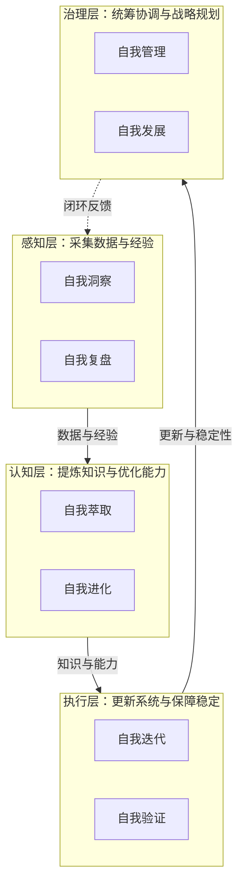

# SpecWeave — AI 智能体开发规范体系

[](LICENSE)
[](AGENTS.md)
[](https://conventionalcommits.org)
[](CONTRIBUTING.md)
[](https://gitcode.com/daoCollective/SpecWeave)
[](https://gitcode.com/daoCollective/SpecWeave/issues)
[](https://gitcode.com/daoCollective/SpecWeave/pulls)
[](https://gitcode.com/daoCollective/SpecWeave)
[](https://gitcode.com/daoCollective/SpecWeave)

> **SpecWeave** — 规范之网：给 AI 智能体写一本"员工手册"，让多个 AI 像真正的团队一样协作交付

你是否遇到过这样的困境：用 AI 写代码时，它总是乱改文件、忘记上下文、多个 AI 之间"打架"——越帮越忙？SpecWeave 正是为解决这一痛点而生。

> 一套面向多智能体协作开发的开放规范体系，基于 [AGENTS.md 开放标准](https://agents.md) 定义智能体的角色分工、能力边界、协作协议与标准工作流，让 AI 智能体在项目中能够"按需加载、各司其职、协同交付"。就像给 AI 团队制定了一套明确的"职场规矩"：谁写代码、谁审查、谁测试分得清清楚楚。

本体系经过 **1313+ 次真实提交** 持续迭代验证，包含 6 个明确定义的智能体角色、**441+ 个可复用模式**（方法论/架构/代码/分析卡片）和 **309+ 自动化脚本**，通过 AGENTS.md 单一入口路由、渐进式披露（L0/L1/L2）、Core/Tools 双层治理与运行时阶段守卫，让多智能体协作具备一致的上下文、可执行的质量门禁与可审计的交付基线。只需将本仓库作为 AI 编码工具的工作目录，即可开箱即用。详见 [项目概述](docs/project-overview.md)。

## 快速开始

### 🚀 方式一：一句话装载（最便捷，推荐）

**零手动操作——将以下提示词发给任意支持工具调用的AI智能体（ChatGPT/Claude/Trae等），自动完成装载：**

> 请帮我装载 SpecWeave Agent Workspace Hub 系统。请严格按照以下步骤执行：
>
> 【安全规则】只从官方仓库获取；写入前确认路径；不在系统目录创建文件夹；自举只读不执行脚本；验证AGENTS.md完整性；错误明确报告；不扫描整个文件系统；已在SpecWeave内则直接就绪
>
> 【步骤】环境检测 → 路径确认 → git clone（或给出zip下载链接）→ 验证AGENTS.md → 自举加载 → 报告就绪

在Trae环境中，直接说"**装载SpecWeave**"即可触发。详细规范见 [提示词自举协议](.agents/protocols/prompt-bootstrap.md)。

### 📦 方式二：git clone（传统方式）

```bash
git clone https://github.com/SpecWeave/SpecWeave.git
cd SpecWeave
```

将本仓库根目录指定为 AI 编码工具（Codex、Cursor、Copilot、Trae 等）的工作目录，工具会自动读取 `AGENTS.md` 作为项目级指令，**零安装、零配置即可开始协作**。验证脚本的使用方式请参见 [.agents/scripts/](.agents/scripts/)。

> 💡 **零安装原理**：`AGENTS.md` 是自描述的入口文件——智能体读取后按启动协议自动加载规范，不需要运行任何安装命令。详见 [工作区发现协议](.agents/protocols/workspace-discovery.md)。

## 项目亮点

详细的技术创新点与量化成果见 [docs/project-highlights.md](docs/project-highlights.md)。

### 核心优势

| 优势 | 说明 |
|---|---|
| 单一入口契约 | AGENTS.md 作为最高优先级启动入口，定义启动协议（含内容敏感度预检）与22项核心规范路由，避免上下文爆炸 |
| L0/L1/L2 渐进式披露 | ONBOARDING(L0入门) → capability-registry(L1索引) → 详细规范(L2深度)，信息粒度匹配任务阶段 |
| Core/Tools 双层治理 | Core 层定义规范（规则/协议/角色），Tools 层实现执行（脚本/Skill/配置），依赖方向单向可控 |
| 7 角色分工体系 | orchestrator/architect/developer/reviewer/tester/co-founder/team-admin，每个角色有明确职责、能力边界与Non-Goals |
| 机器可执行规范 | 阶段守卫运行时、CI 质量门禁、320+ 自动化验证脚本，规范不只是文档更是可执行门禁 |
| 完整协作协议 | 覆盖任务交接、消息传递、冲突解决、PDR前置阅读、三层路由、临时依赖管理、应用开发生命周期 |
| 私域/公开内容分流 | 启动协议内置内容敏感度预检，私域内容自动跳过公共规划区域，保护敏感信息 |
| Mermaid 流程可视化 | 所有工作流、架构、关系、决策树均使用 Mermaid 表达，可渲染、可版本化、可自动检查 |
| 自指性闭环验证 | 规范体系自身遵循所定义的方法论（格式、流程、验证），形成「规范即测试」的自我验证闭环 |

### 技术创新点

核心创新包括：入口+容器二元架构、L0/L1/L2三层渐进式披露、Core/Tools双层治理、元工具体系、阶段守卫运行时强制执行、内容敏感度分流、自指性规范体系、工具熵减非线性优化、元文档杠杆效应、两栖定位模型、四层质量防御体系、七概念对抗式评审方法论、三阶段递进演化规律、修复即闭环SOP等。详见 [项目亮点](docs/project-highlights.md#技术创新点)。

## 项目蓝图

短期发展目标、中长期战略方向、技术路线演进、功能迭代计划与市场拓展策略详见 [docs/roadmap.md](docs/roadmap.md)。

## 系统规划

围绕"用工具治理工具"的核心理念，构建感知→认知→执行→治理四层闭环的八模块自我演进体系。

| 层级 | 模块 | 核心职责 | 入口 |
|---|---|---|---|
| 感知层 | 自我洞察 · 自我复盘 | 状态监控与异常预警 · 项目复盘与知识沉淀 | [.agents/modules/](.agents/modules/) |
| 认知层 | 自我萃取 · 自我进化 | 模式提取与资产入库 · 反馈分析与性能调优 | [.agents/modules/](.agents/modules/) |
| 执行层 | 自我迭代 · 自我验证 | 自动更新与回滚 · 测试生成与覆盖率分析 | [.agents/modules/](.agents/modules/) |
| 治理层 | 自我管理 · 自我发展 | 资源调度与冲突仲裁 · 战略规划与生态建设 | [.agents/modules/](.agents/modules/) |

每个模块的完整技术定义（架构、实现步骤、资源需求、预期指标）详见 [.agents/modules/](.agents/modules/)。



## 可复用模式体系

本项目在实践中持续萃取可复用的开发模式，形成三层模式库（**方法论模式280+、架构模式35+、代码模式65+、分析卡片3+，合计438+个，其中多个L3标准化模式嵌入执行门禁**），涵盖从代码级到方法论级的完整复用体系。详见 [docs/reuse-and-generalization.md#可复用模式库](docs/reuse-and-generalization.md)。核心数据见 [项目亮点](docs/project-highlights.md#量化成果)（截至2026-07-12，1290次提交）。

> 模式全景索引见 [retrospective/patterns/](docs/retrospective/patterns/)

## 泛化与资产复用

本规范体系是可迁移到任何项目的**元规范框架**。可复用资产清单、三维泛化路径（术语泛化/领域泛化/标准泛化）与已有落地案例详见 [docs/reuse-and-generalization.md](docs/reuse-and-generalization.md)。

> 已有复用案例：`vendor/flexloop/` 目录下的 AgentForge 项目验证了核心机制的可迁移性，详见 [agentforge-adoption.md](.agents/cases/agentforge-adoption.md)

### 提示词萃取系统

独立的 Python 子项目，实现从对话记录中自动萃取可复用提示词模式的完整流水线。详见 [prompt_extraction/](prompt_extraction/)，系统架构见 [.agents/systems/prompt-extraction.md](.agents/systems/prompt-extraction.md)。

### 文件I/O安全工具库

面向 Windows 平台文件锁冲突的并发安全工具集，解决杀毒软件/索引器短暂锁定文件导致 `os.replace` 抛出 `PermissionError` 的经典问题。所有工具集中在 [lib/io_safety.py](.agents/scripts/lib/io_safety.py) 和 [lib/atomic_write.py](.agents/scripts/lib/atomic_write.py)，已在全部308+脚本中统一使用，覆盖率100%。

| 工具 | 类型 | 用途 |
|---|---|---|
| `atomic_write_bytes/text/json/edit_text` | 原子写入函数 | temp文件+PID随机后缀命名+os.replace原子替换，保证读者看不到中间状态 |
| `staged_timer(logger, op, **fields)` | 上下文管理器 | 分阶段计时日志，自动输出 `DEBUG/WARNING` 级别的耗时报告（各阶段ms+总耗时+key=value字段） |
| `retry_on_lock(max_retries=3, interval_ms=10)` | 装饰器 | Windows文件锁重试（捕获OSError、固定间隔退避、失败清理回调、DEBUG重试日志） |
| `write_file_with_retry(path, data, **kw)` | 便捷函数 | 语义化别名，等价于带重试参数的原子写入 |

快速使用：

```python
from lib import staged_timer, retry_on_lock, atomic_write_bytes

# 分阶段计时写缓存
with staged_timer(_log, "缓存保存完成", path="cache.json") as t:
    with t.stage("build"):    data = serialize(entries)
    with t.stage("write"):    atomic_write_bytes(path, data, fsync=False)
# DEBUG: 缓存保存完成 | build=0.15ms | write=0.32ms | 总耗时=0.62ms | path=cache.json

# 自定义锁重试装饰器
@retry_on_lock(max_retries=3, interval_ms=10)
def save_config(path, data):
    os.replace(tmp, path)
```

详见 [L2性能优化规范§8](docs/knowledge/best-practices/l2-progressive-disclosure-performance.md) 和 [文件I/O并发安全规范](docs/knowledge/best-practices/file-io-concurrency-safety.md)。

## 角色协作场景

多智能体协作系统支持**中心化模式**（由 orchestrator 主导组队，适用于跨角色大型任务）与**去中心化模式**（任意角色通过 `@角色名` 语法发起协作请求，适用于局部需求）两种互补模式。

> 完整的协作场景定义（触发条件、成员选择机制、协作流程图、任务分配方式、角色相互 @ 机制、预期交付物等）见 [.agents/roles/collaboration-scenarios.md](.agents/roles/collaboration-scenarios.md)

## 文档导航

<!-- NAV_TABLE_START -->

| 文档 | 说明 |
|------|------|
| [智能体角色体系](docs/agent-roles.md) | 5 个核心角色定义与绑定关系 |
| [协作体系](docs/collaboration.md) | 4 项协作协议、3 个标准工作流 |
| [开发规范](docs/development-standards.md) | 代码风格、提交规范、测试要求、文档边界 |
| [知识库](docs/knowledge-base.md) | 技术知识库、复盘文档体系 |
| [「复盘+洞察+萃取+导出」与「原子化+模块化」方法论全面分析](docs/methodology-analysis-report.md) | 「复盘+洞察+萃取+导出」与「原子化+模块化」方法论全面分析 |
| [项目亮点](docs/project-highlights.md) | 本文件汇总 SpecWeave 规范体系的核心优势、技术创新点与量化成果数据。数据截至2026-07-05（800... |
| [项目概述](docs/project-overview.md) | 项目定位、设计理念、核心特性 |
| [项目结构](docs/project-structure.md) | 完整目录树与职责说明 |
| [RACI 治理规范与模板](docs/raci-governance-standards.md) | RACI 治理规范与模板 |
| [相关链接](docs/related-links.md) | 外部标准、工具文档、项目仓库 |
| [泛化与资产复用](docs/reuse-and-generalization.md) | 本规范体系的设计目标不仅是"描述一个项目"，更是"可以迁移到任何项目"的**元规范框架**。本文件说明可复用资产清... |
| [项目蓝图与路线图](docs/roadmap.md) | 本文件定义 SpecWeave 规范体系的短期目标、中长期战略方向、技术路线演进与功能迭代计划。 |
| [技术栈与环境要求](docs/tech-stack.md) | 技术选型、环境依赖 |
| [Trae 应用优化分析与实施指南](docs/trae-project-adaptation-guide.md) | Trae 应用优化分析与实施指南 |
| [验证与自动化](docs/verification-automation.md) | 临时依赖治理、验证脚本 |
| [贡献指南](CONTRIBUTING.md) | 贡献流程、分支命名、PR 规范 |

<!-- NAV_TABLE_END -->

## MDI（Markdown Interface）示例

MDI 是一套"Markdown 即接口"规范，支持用 Markdown 文件同时承载人类阅读与机器解析的接口定义。所有示例位于 [examples/mdi/](examples/mdi/) 目录：

| Profile 类型 | 示例文件 | 说明 |
|---|---|---|
| WebApi | [user-api.md](examples/mdi/user-api.md) | 用户管理 RESTful API 完整示例（CRUD + 分页 + 错误码） |
| WebApi | [todo-api.md](examples/mdi/todo-api.md) | 待办事项 API |
| WebApi | [generate-api.md](examples/mdi/generate-api.md) | 内容生成服务 API |
| CliTool | [file-cli.md](examples/mdi/file-cli.md) | 文件操作 CLI 工具示例 |
| GraphQL | [graphql-blog.md](examples/mdi/graphql-blog.md) | 博客平台 GraphQL API（英文） |
| GraphQL | [graphql-blog-cn.md](examples/mdi/graphql-blog-cn.md) | 博客平台 GraphQL API（中文），含完整 Schema/Query/Mutation/Subscription |

> 📖 完整使用指南见 [examples/mdi/README.md](examples/mdi/README.md)，包含 GraphQL Profile 的 Schema 定义、Directive 操作、验证规则等详细说明。
> 📐 MDI 规范文档：[mdi-spec-v1.0.md](docs/knowledge/mdi-spec-v1.0.md)

## Spec 执行进度

<!-- SPEC_DASHBOARD_START -->

**整体进度：172/206 完成 · 83% · 19 项进行中 · 15 项待启动**

| 主题 | Spec 数 | 已完成 | 状态 | 看板 |
|---|---|---|---|---|
| [core-foundation](.trae/specs/core-foundation/) | 14 | 13 | 🔧 92% | [查看](.trae/specs/core-foundation/README.md) |
| [roles-governance](.trae/specs/roles-governance/) | 8 | 8 | ✅ 100% | [查看](.trae/specs/roles-governance/README.md) |
| [standards-tools](.trae/specs/standards-tools/) | 27 | 25 | 🔧 92% | [查看](.trae/specs/standards-tools/README.md) |
| [readme-branding](.trae/specs/readme-branding/) | 4 | 4 | ✅ 100% | [查看](.trae/specs/readme-branding/README.md) |
| [docs-restructure](.trae/specs/docs-restructure/) | 12 | 10 | 🔧 83% | [查看](.trae/specs/docs-restructure/README.md) |
| [retrospectives-insights](.trae/specs/retrospectives-insights/) | 135 | 106 | 🔧 78% | [查看](.trae/specs/retrospectives-insights/README.md) |
| [migration-archival](.trae/specs/migration-archival/) | 6 | 6 | ✅ 100% | [查看](.trae/specs/migration-archival/README.md) |
| [adversarial-review-knowledge-base](.trae/specs/adversarial-review-knowledge-base/) | 0 | 0 | ✅ 100% | [查看](.trae/specs/adversarial-review-knowledge-base/README.md) |
| [ai-website-cloner-analysis](.trae/specs/ai-website-cloner-analysis/) | 0 | 0 | ✅ 100% | [查看](.trae/specs/ai-website-cloner-analysis/README.md) |
| [ark-cli-git-submodule](.trae/specs/ark-cli-git-submodule/) | 0 | 0 | ✅ 100% | [查看](.trae/specs/ark-cli-git-submodule/README.md) |
| [camera-power-automation-testing](.trae/specs/camera-power-automation-testing/) | 0 | 0 | ✅ 100% | [查看](.trae/specs/camera-power-automation-testing/README.md) |
| [create-first-principles-command](.trae/specs/create-first-principles-command/) | 0 | 0 | ✅ 100% | [查看](.trae/specs/create-first-principles-command/README.md) |
| [daoshang-wudao-upgrade](.trae/specs/daoshang-wudao-upgrade/) | 0 | 0 | ✅ 100% | [查看](.trae/specs/daoshang-wudao-upgrade/README.md) |
| [dingtalk-okr-wiki-migration](.trae/specs/dingtalk-okr-wiki-migration/) | 0 | 0 | ✅ 100% | [查看](.trae/specs/dingtalk-okr-wiki-migration/README.md) |
| [gitcode-ai-best-practices](.trae/specs/gitcode-ai-best-practices/) | 0 | 0 | ✅ 100% | [查看](.trae/specs/gitcode-ai-best-practices/README.md) |
| [images-first-principles-analysis](.trae/specs/images-first-principles-analysis/) | 0 | 0 | ✅ 100% | [查看](.trae/specs/images-first-principles-analysis/README.md) |
| [okr-wiki-manual](.trae/specs/okr-wiki-manual/) | 0 | 0 | ✅ 100% | [查看](.trae/specs/okr-wiki-manual/README.md) |
| [retrospective-analysis-dimension-template-library](.trae/specs/retrospective-analysis-dimension-template-library/) | 0 | 0 | ✅ 100% | [查看](.trae/specs/retrospective-analysis-dimension-template-library/README.md) |
| [universal-prd-template-extraction](.trae/specs/universal-prd-template-extraction/) | 0 | 0 | ✅ 100% | [查看](.trae/specs/universal-prd-template-extraction/README.md) |
| [update-specweave-demo-post](.trae/specs/update-specweave-demo-post/) | 0 | 0 | ✅ 100% | [查看](.trae/specs/update-specweave-demo-post/README.md) |
| [web-content-analysis](.trae/specs/web-content-analysis/) | 0 | 0 | ✅ 100% | [查看](.trae/specs/web-content-analysis/README.md) |

> 详细进度、待办事项、里程碑路线图与跨主题依赖关系见 [全局执行看板](.trae/specs/README.md)。

<!-- SPEC_DASHBOARD_END -->

## 许可证

本项目基于 [Apache License 2.0](LICENSE) 开源。

## 联系方式

- **问题反馈**：[GitCode Issues](https://gitcode.com/daoCollective/SpecWeave/issues)
- **讨论交流**：[GitCode Pull Requests](https://gitcode.com/daoCollective/SpecWeave/pulls)

---

> **规范体系入口**：智能体启动时必须首先读取 [AGENTS.md](AGENTS.md)，按上下文路由表加载 [.agents/](.agents/) 下的对应规范。详细文档索引见 [docs/README.md](docs/README.md)。
