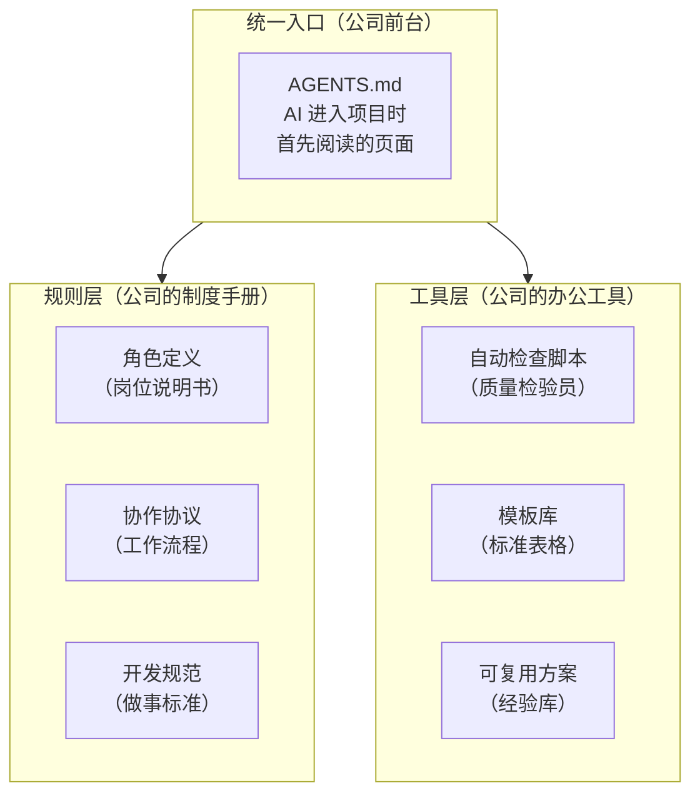
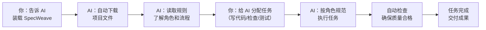

# SpecWeave — 让多个 AI 像真正的团队一样协作

> **AI 智能体工作区规范体系** — 以 AGENTS.md 为统一入口，提供角色定义、协作协议、质量门禁与自我演进机制的多智能体协作开放标准。

![repo size][repo-size-badge]
[![GitHub stars][stars-badge]][stars-link]
[![GitHub forks][forks-badge]][forks-link]
[![GitHub issues][issues-badge]][issues-link]
[![GitHub license][gh-license-badge]][gh-license-link]
[![GitHub contributors][contributors-badge]][contributors-link]
[![GitHub watchers][watchers-badge]][watchers-link]
![GitHub last commit][last-commit-badge]
[![AGENTS.md][agents-badge]][agents-link]
[![Conventional Commits][cc-badge]][cc-link]
[![PRs Welcome][pr-badge]][pr-link]
[![Python][python-badge]][python-link]
![scripts][scripts-badge]
![skills][skills-badge]
![rules][rules-badge]
![commands][commands-badge]
[![GitCode Mirror][gitcode-badge]][gitcode-link]

[repo-size-badge]: https://img.shields.io/github/repo-size/xinetzone/SpecWeave.svg
[stars-badge]: https://img.shields.io/github/stars/xinetzone/SpecWeave
[stars-link]: https://github.com/xinetzone/SpecWeave/stargazers
[forks-badge]: https://img.shields.io/github/forks/xinetzone/SpecWeave
[forks-link]: https://github.com/xinetzone/SpecWeave/network
[issues-badge]: https://img.shields.io/github/issues/xinetzone/SpecWeave
[issues-link]: https://github.com/xinetzone/SpecWeave/issues
[gh-license-badge]: https://img.shields.io/github/license/xinetzone/SpecWeave
[gh-license-link]: LICENSE
[contributors-badge]: https://img.shields.io/github/contributors/xinetzone/SpecWeave
[contributors-link]: https://github.com/xinetzone/SpecWeave/contributors
[watchers-badge]: https://img.shields.io/github/watchers/xinetzone/SpecWeave
[watchers-link]: https://github.com/xinetzone/SpecWeave/watchers
[last-commit-badge]: https://img.shields.io/github/last-commit/xinetzone/SpecWeave
[agents-badge]: https://img.shields.io/badge/AGENTS.md-Open%20Standard-orange.svg
[agents-link]: AGENTS.md
[cc-badge]: https://img.shields.io/badge/Conventional%20Commits-1.0.0-yellow.svg
[cc-link]: https://conventionalcommits.org
[pr-badge]: https://img.shields.io/badge/PRs-welcome-brightgreen.svg
[pr-link]: CONTRIBUTING.md
[python-badge]: https://img.shields.io/badge/python-3.10%2B-blue?logo=python&logoColor=white
[python-link]: .agents/docs/tech-stack.md
[scripts-badge]: https://img.shields.io/badge/脚本-360%2B-blue?style=flat
[skills-badge]: https://img.shields.io/badge/Skills-27-success?style=flat
[rules-badge]: https://img.shields.io/badge/规则-130%2B-orange?style=flat
[commands-badge]: https://img.shields.io/badge/指令集-14-purple?style=flat
[gitcode-badge]: https://img.shields.io/badge/GitCode-镜像-blue?logo=gitee
[gitcode-link]: https://gitcode.com/daoCollective/SpecWeave

---

## 目录

- [这是什么](#这是什么)
- [为什么需要它](#为什么需要它)
- [项目包含什么](#项目包含什么)
- [如何使用](#如何使用)
- [项目亮点](#项目亮点)
- [文档导航](#文档导航)
- [常见术语解释](#常见术语解释)
- [许可证与联系方式](#许可证与联系方式)

---

## 这是什么

**SpecWeave 是一套给 AI 助手（智能体）使用的"员工手册"。**

想象一下：你开了一家餐厅，招了 5 个厨师。如果没有明确的岗位说明书——谁切菜、谁炒菜、谁装盘——厨房里肯定会乱成一团。5 个厨师可能同时抢一个灶台，或者都以为对方会放盐，结果菜没味道。

SpecWeave 解决的就是类似的问题，只不过对象不是厨师，而是 **AI 智能体**（可以理解为一个能自动干活的 AI 助手）。当你用 AI 工具写代码、做项目时，多个 AI 同时工作如果没有统一规范，就会互相"打架"：乱改文件、忘记上下文、重复劳动。

**SpecWeave 就是给这些 AI 助手写的一本"公司制度手册"**——明确告诉它们：谁负责什么、按什么流程做事、怎么互相配合。有了这套规范，多个 AI 就能像训练有素的团队一样高效协作。

> 它不是一个需要安装的软件，而是一套文档和规则。把它放在你的项目文件夹里，AI 工具就会自动按规则行事。

---

## 为什么需要它

### 没有 SpecWeave 时，用 AI 写代码常见的问题：

| 问题 | 具体表现 |
|------|----------|
| **AI 乱改文件** | 你让它改 A 文件，它把 B、C、D 都改了，还改错了 |
| **AI 忘记上下文** | 聊了 10 分钟后，AI 忘记了你一开始的要求 |
| **多个 AI 互相冲突** | 一个 AI 删掉的代码，另一个 AI 又写回来了 |
| **质量不稳定** | 同样的任务，有时候做得很好，有时候乱七八糟 |
| **无法追溯** | 搞不清楚哪个 AI 做了什么修改，出了问题不知道找谁 |

### 有了 SpecWeave 之后：

- **分工明确**：每个 AI 有清晰的角色（就像公司里有产品经理、开发、测试），各司其职
- **流程规范**：任务怎么分配、怎么交接、怎么检查，都有标准流程
- **质量有保障**：每个环节有检查清单和自动验证，不合格的过不了关
- **可追溯**：每次操作都有记录，出了问题能快速定位

**一句话总结：SpecWeave 把你的 AI 工具从"单打独斗的自由职业者"变成"有组织有纪律的专业团队"。**

---

## 项目包含什么

SpecWeave 的核心组件就像一家公司的组织架构：



| 组成部分 | 通俗解释 | 类比 |
|----------|----------|------|
| **角色体系** | 定义 7 种 AI 角色（协调员、架构师、开发者、审查员、测试员等），每种角色有自己的职责说明书 | 公司的岗位职责表 |
| **协作协议** | 规定 AI 之间怎么沟通、怎么交接任务、怎么解决冲突 | 公司的工作流程制度 |
| **开发规范** | 代码怎么写、提交信息怎么标注、文档怎么组织 | 公司的质量标准手册 |
| **自动检查** | 300 多个自动化脚本，自动检查工作质量，不合规的会被拦住 | 质检流水线 |
| **模板库** | 标准化的文档模板和 440 多个可复用方案 | 公司的标准表格和经验库 |

---

## 如何使用

使用 SpecWeave 不需要安装任何软件。你只需要把它放到项目文件夹里，AI 工具就会自动读取规则。

### 方式一：一句话装载（最推荐，最简单）

把下面这段话复制发给你的 AI 工具（ChatGPT、Claude、Trae 等都支持），AI 会自动帮你完成所有设置：

> 请帮我装载 SpecWeave Agent Workspace Hub 系统。请严格按照以下步骤执行：
>
> 【安全规则】只从官方仓库获取；写入前确认路径；不在系统目录创建文件夹；自举只读不执行脚本；验证 AGENTS.md 完整性；错误明确报告；不扫描整个文件系统；已在 SpecWeave 内则直接就绪
>
> 【步骤】环境检测 → 路径确认 → git clone（或给出 zip 下载链接）→ 验证 AGENTS.md → 自举加载 → 报告就绪

*在 Trae 环境中，直接说"装载 SpecWeave"即可。*

#### 预期看到什么

AI 会依次执行 6 个步骤，最后报告：
- 项目已装载到哪个文件夹
- 有哪些 AI 角色可用（协调员、开发者、审查员等）
- 有哪些技能可用（代码审查、自动提交、链接检查等）
- 告诉你下一步可以做什么

### 方式二：手动下载

> 以下步骤涉及 **Git**（一种代码版本管理工具）和 **GitHub**（代码托管网站）。如果你不熟悉这些，推荐使用方式一，让 AI 帮你完成。

1. **安装 Git**（如果还没装）
   - 访问 [git-scm.com](https://git-scm.com) 下载安装包
   - 按默认选项安装即可

2. **下载项目**
   - 打开命令行（Windows 按 `Win+R`，输入 `cmd` 回车）
   - 输入以下命令并回车：
   ```bash
   git clone https://github.com/xinetzone/SpecWeave.git
   ```

3. **预期看到什么**
   - 命令行会显示下载进度
   - 下载完成后，当前文件夹下会出现一个 `SpecWeave` 文件夹
   - 里面包含 `AGENTS.md` 文件和 `.agents` 文件夹

4. **开始使用**
   - 用 AI 编码工具（如 Trae、Cursor、Copilot）打开这个文件夹
   - AI 会自动读取规则并按要求工作

### 使用流程图



---

## 项目亮点

| 亮点 | 通俗解释 |
|------|----------|
| **统一入口，不混乱** | AI 一进项目就知道该读什么规则，不会加载无关信息造成混乱 |
| **7 种角色，分工明确** | 像真实团队一样有协调员、开发者、审查员、测试员等角色，各干各的活 |
| **规则 + 工具，双保险** | 不仅告诉 AI "该怎么做"，还有自动检查工具确保"真的做到了" |
| **经过实战验证** | 经过 1300 多次真实使用和迭代优化，不是纸上谈兵 |
| **按需加载，不浪费** | AI 不会一次性读完所有文档，用到什么才读什么，效率高 |
| **开放标准，不锁定** | 基于公开的 AGENTS.md 标准，任何 AI 工具都能用，不绑定特定平台 |

> 更详细的技术数据（脚本数量、测试覆盖率等）请查看 [项目亮点详细文档](.agents/docs/project-highlights.md)。

---

<!-- end-doc-include -->

## 文档导航

如果你想深入了解某个方面，可以查看以下文档：

| 文档 | 适合谁 | 说明 |
|------|--------|------|
| [项目概述](.agents/docs/project-overview.md) | 所有人 | 项目定位、设计理念与核心特性 |
| [智能体角色体系](.agents/docs/agent-roles.md) | 想了解 AI 角色分工 | 7 个角色的职责和配合方式 |
| [协作体系](.agents/docs/collaboration.md) | 想了解 AI 怎么协作 | 任务交接、消息传递、冲突解决 |
| [开发规范](.agents/docs/development-standards.md) | 想贡献代码的人 | 代码风格、提交规范、测试要求 |
| [项目结构](.agents/docs/project-structure.md) | 想了解文件组织 | 完整目录树与职责说明 |
| [技术栈与环境](.agents/docs/tech-stack.md) | 技术人员 | 技术选型与环境依赖 |
| [验证与自动化](.agents/docs/verification-automation.md) | 技术人员 | 自动检查和验证机制 |
| [泛化与资产复用](.agents/docs/reuse-and-generalization.md) | 想迁移到其他项目 | 如何把规范用到自己的项目中 |
| [项目蓝图](.agents/docs/roadmap.md) | 想了解未来规划 | 短期目标与中长期战略 |
| [贡献指南](CONTRIBUTING.md) | 想参与贡献 | 如何提建议、报问题、提交代码 |

---

## 常见术语解释

| 术语 | 通俗解释 |
|------|----------|
| **AI 智能体（Agent）** | 一个能独立完成任务的 AI 助手。你给它指令，它自己规划步骤并执行 |
| **AGENTS.md** | SpecWeave 的"首页"。AI 进入项目后最先读这个文件，从中知道该遵守什么规则 |
| **Git** | 一个版本管理工具。可以记录文件的每一次修改，方便回溯和多人协作。就像 Word 的"修订模式"但强大得多 |
| **GitHub / GitCode** | 代码托管网站。可以把项目存放在上面，别人也能下载和参与。类似"网盘"但专门给代码用 |
| **规范（Specification）** | 规定"应该怎么做"的文档。SpecWeave 本身就是一套规范 |
| **开源（Open Source）** | 代码公开给所有人看、用、修改，通常免费 |
| **克隆（Clone）** | 把网上的项目下载到自己的电脑上 |
| **Markdown** | 一种简单的文本格式。用 `#` 表示标题、`-` 表示列表，比 Word 简单但效果类似。本文档就是用 Markdown 写的 |
| **Mermaid** | 一种用文字画图的方法。本文档中的流程图就是用 Mermaid 画的，不需要设计软件 |
| **提交（Commit）** | 在 Git 中保存一次修改记录。就像游戏里的"存档" |

---

## 许可证与联系方式

本项目基于 [Apache License 2.0](LICENSE) 开源，可自由使用、修改和分发。

- **问题反馈**：[GitCode Issues](https://gitcode.com/daoCollective/SpecWeave/issues)
- **讨论交流**：[GitCode Pull Requests](https://gitcode.com/daoCollective/SpecWeave/pulls)

> **想了解更多？** 如果你有技术背景，想了解底层架构和设计原理，可以从 [项目概述](.agents/docs/project-overview.md) 和 [项目亮点](.agents/docs/project-highlights.md) 开始深入阅读。
