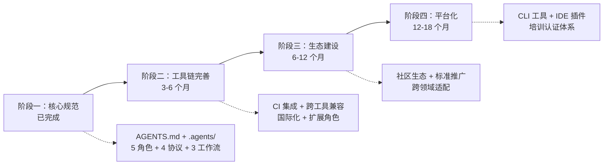
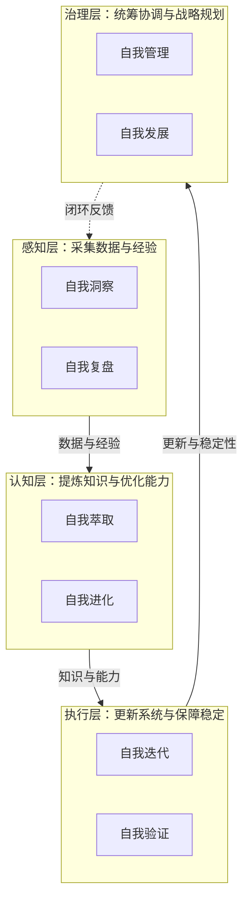
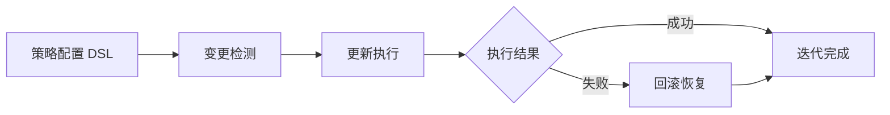
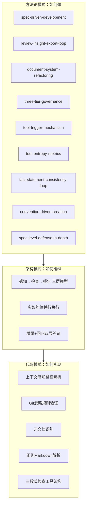
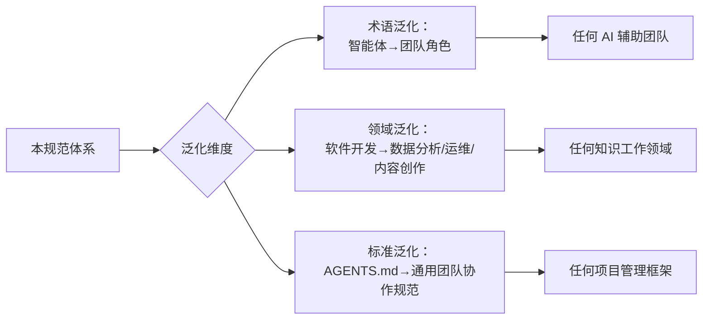
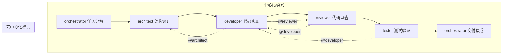

# AI 智能体开发规范体系

[![License][license-badge]][license-link]
[![AGENTS.md][agents-badge]][agents-link]
[![Conventional Commits][commits-badge]][commits-link]
[![PRs Welcome][prs-badge]][prs-link]
[![Repo][repo-badge]][repo-link]
[![Issues][issue-badge]][issue-link]
[![Stars][star-badge]][star-link]
[![Forks][fork-badge]][fork-link]

[license-badge]: https://img.shields.io/badge/license-Apache--2.0-blue.svg
[license-link]: LICENSE
[agents-badge]: https://img.shields.io/badge/AGENTS.md-Open%20Standard-orange.svg
[agents-link]: AGENTS.md
[commits-badge]: https://img.shields.io/badge/Conventional%20Commits-1.0.0-yellow.svg
[commits-link]: https://conventionalcommits.org
[prs-badge]: https://img.shields.io/badge/PRs-welcome-brightgreen.svg
[prs-link]: CONTRIBUTING.md
[repo-badge]: https://img.shields.io/badge/repo-atomgit-blue.svg
[repo-link]: https://atomgit.com/daoCollective/AI
[issue-badge]: https://img.shields.io/badge/issues-welcome-red.svg
[issue-link]: https://atomgit.com/daoCollective/AI/issues
[star-badge]: https://img.shields.io/badge/stars-welcome-yellow.svg
[star-link]: https://atomgit.com/daoCollective/AI
[fork-badge]: https://img.shields.io/badge/forks-welcome-green.svg
[fork-link]: https://atomgit.com/daoCollective/AI

> 一套面向多智能体协作开发的开放规范体系，基于 [AGENTS.md 开放标准](https://agents.md) 定义智能体的角色、能力边界、协作协议与工作流，让 AI 智能体在项目中能够“按需加载、各司其职、协同交付”。

本体系基于 [AGENTS.md 开放标准](https://agents.md) 构建，通过单一入口路由与按需加载机制，让多智能体协作具备一致的上下文与质量基线。详见 [项目概述](docs/project-overview.md)。

## 快速开始

```bash
# 克隆仓库
git clone <repository-url>
cd <repository-name>

# 验证 Git 忽略规则
python .agents/scripts/check-gitignore.py
```

预期输出：`验证通过: 所有临时依赖路径已被 .gitignore 覆盖`

将本仓库根目录指定为 AI 编码工具（Codex、Cursor、Copilot 等）的工作目录，工具会自动读取 `AGENTS.md` 作为项目级指令。

## 项目亮点

### 核心优势

| 优势 | 说明 |
|------|------|
| 单一入口路由 | AGENTS.md 作为最高优先级入口，按需加载 .agents/ 规范，避免上下文爆炸 |
| 5 角色分工体系 | orchestrator/architect/developer/reviewer/tester，每个角色有明确职责与能力边界（Non-Goals） |
| 机器可读的角色定义 | TOML frontmatter 声明 id/domain/layer/bindings，便于智能体程序化解析与绑定 |
| 完整协作协议 | 覆盖任务交接、消息传递、冲突解决与临时依赖管理四类协议 |
| Mermaid 流程可视化 | 所有工作流、架构、关系均使用 Mermaid 表达，可渲染、可版本化、可审查 |
| 临时依赖治理三重机制 | .gitignore 规则 + Git pre-commit hook + 验证脚本，防止临时依赖误提交 |

### 技术创新点

| 创新 | 说明 | 来源 |
|------|------|------|
| 入口+容器二元架构 | AGENTS.md（路由+约束）+ .agents/（具体规范），分离关注点，可扩展性强 | 架构决策 |
| 三层递进提示词体系 | 全局契约→角色定义→精细化提示词，递进式加载 | [提示词萃取](docs/retrospective/prompt-extraction.md) |
| TOML frontmatter 绑定关系 | 通过 rules/references/skills 声明角色与协议/工作流的绑定 | [角色体系](docs/agent-roles.md) |
| 元工具体系 | 用工具治理工具，每个工具解决上一轮工作的摩擦点 | [优化循环洞察](docs/retrospective/reports/insight-report-optimization-cycle.md) |
| 三层治理模型 | 原子化→自动化→验证，形成闭环，缺失任何一层都会出现治理漏洞 | [验证与自动化](docs/verification-automation.md) |

### 量化成果

| 维度 | 数值 |
|------|------|
| 交付物总数 | 70+ 个（规范层 + 工程层 + 治理层 + 知识层 + 子项目） |
| 验证脚本 | 7 个（check-gitignore/check-spec-consistency/check-links/generate-nav/check-move/check-source-traceability/check-role-permissions） |
| 复盘报告 | 14 份（含初版、深度版、洞察报告、综合报告） |
| 方法论模式 | 9 个（spec-driven/review-loop/document-refactoring/three-tier-governance/tool-trigger/tool-entropy/fact-statement-consistency/convention-driven-creation/spec-level-defense-in-depth） |
| 架构模式 | 3 个（感知→检查→报告/多智能体并行执行/增量+回归双层验证） |
| 代码模式 | 5 个（上下文感知路径解析/Git忽略验证/元文档识别/Markdown解析/三段式检查工具） |
| 决策框架 | 4 个（目录命名/依赖管理/元文档处理/语义匹配阈值） |
| 知识概念 | 6 个（元文档/上下文感知/正交验证/零依赖原则/语义前缀/规范自举性） |
| 工具兼容性 | 基于 AGENTS.md 开放标准，可被支持该标准的工具加载 |

## 项目蓝图

### 短期发展目标（3-6 个月）

| 目标 | 交付标志 |
|------|---------|
| 完善角色体系 | 新增 devops、security 等扩展角色，覆盖更多开发场景（角色定义文件 + 提示词 + 工作流） |
| 扩展工具链 | 增加 CI 集成脚本、自动化测试脚本、性能监控脚本（scripts/ 目录新增 3+ 脚本） |
| 增强跨工具兼容性 | 测试 10+ AI 编码工具的兼容性，输出兼容性矩阵（兼容性测试报告） |
| 国际化支持 | 提供英文版 AGENTS.md 与核心规范，支持跨国团队（en/ 子目录或 i18n 方案） |
| 社区贡献流程优化 | 完善 issue/PR 模板、贡献指南、行为准则（.github/ 目录与 CONTRIBUTING.md 完善） |

### 中长期战略方向（6-18 个月）

1. **建立社区生态**：形成 AGENTS.md 标准的中文社区，定期举办分享活动，建立最佳实践案例库
2. **推动行业标准形成**：与 AGENTS.md 开放标准社区协作，推动中文场景的最佳实践反哺标准演进
3. **跨领域适配**：从软件开发扩展到数据分析、内容创作、运维等领域，形成领域专属角色与工作流
4. **工具链生态建设**：开发配套 CLI 工具、IDE 插件，降低规范体系的采用门槛

### 技术路线演进



### 功能迭代计划

| 优先级 | 功能 | 阶段 | 说明 |
|--------|------|------|------|
| P0 | 国际化（i18n） | 短期 | 提供英文版核心规范 |
| P0 | CI 集成 | 短期 | GitHub Actions / GitLab CI 配置模板 |
| P1 | 扩展角色 | 短期 | devops、security 等角色定义 |
| P1 | 工具链扩展 | 短期 | 自动化测试、性能监控脚本 |
| P2 | IDE 插件 | 中期 | VS Code / JetBrains 插件 |
| P2 | CLI 工具 | 中期 | 规范初始化、验证、生成 CLI |
| P3 | 培训课程 | 长期 | 智能体开发培训体系 |
| P3 | 认证体系 | 长期 | AGENTS.md 实践认证 |

### 市场拓展策略

- **目标用户**：AI 开发团队、开源项目维护者、企业 AI 转型团队、AI 工具厂商
- **推广渠道**：AtomGit/GitHub 开源社区、技术博客与公众号、开发者社区（掘金/思否）、技术会议分享
- **合作模式**：与 AI 工具厂商合作验证兼容性、社区贡献驱动迭代、企业试点与案例沉淀

## 系统规划

围绕"用工具治理工具"的核心理念，构建感知、认知、执行、治理四层闭环的八模块体系，驱动智能体规范体系的自我演进与生态发展。

### 整体架构



### 自我迭代机制

设计可配置的迭代策略，实现系统功能的自动更新与优化流程。

- **技术架构**：迭代策略配置层（DSL 定义迭代触发条件、频率、范围）+ 变更检测层（监控规范文件、脚本、配置的变更）+ 自动更新执行层（按策略执行更新）+ 回滚机制（失败时自动恢复）。



- **关键实现步骤**：

| 步骤 | 说明 |
|------|------|
| 定义迭代策略 DSL | 设计触发条件、频率、范围的配置语法 |
| 实现变更检测器 | 监控规范文件、脚本、配置的变更事件 |
| 构建更新执行器 | 按策略自动执行更新流程 |
| 建立回滚机制 | 失败时自动恢复至上一稳定版本 |
| 迭代效果评估 | 度量迭代周期与成功率，持续优化策略 |

- **资源需求**：1 名架构师 + 1 名开发者，2 个月
- **时间节点**：M1-M2
- **预期成果指标**：

| 指标 | 目标 |
|------|------|
| 迭代策略可配置率 | 100% |
| 自动更新成功率 | ≥ 95% |
| 回滚成功率 | ≥ 99% |
| 迭代周期缩短 | ≥ 30% |

### 自我进化能力

建立基于数据反馈的进化模型，使系统能够适应环境变化并提升性能。

- **技术架构**：数据采集层（运行指标、用户反馈、环境变化）+ 反馈分析层（识别优化机会）+ 进化决策层（生成进化方案）+ 性能优化层（自动调优参数与策略）。

- **关键实现步骤**：

| 步骤 | 说明 |
|------|------|
| 建立数据采集管道 | 采集运行指标、用户反馈与环境变化数据 |
| 实现反馈分析模型 | 识别优化机会与瓶颈点 |
| 构建进化决策引擎 | 基于分析结果生成进化方案 |
| 实现性能自适应调优 | 自动调整参数与策略以提升性能 |
| 进化效果度量 | 评估进化前后的性能差异 |

- **资源需求**：1 名架构师 + 2 名开发者，3 个月
- **时间节点**：M2-M5
- **预期成果指标**：

| 指标 | 目标 |
|------|------|
| 性能提升 | ≥ 20% |
| 环境适应率 | ≥ 90% |
| 进化决策准确率 | ≥ 85% |
| 反馈响应时间 | ≤ 24h |

### 自我验证体系

开发自动化测试与验证框架，确保系统变更的稳定性与可靠性。

- **技术架构**：测试用例生成层（基于规范自动生成测试用例）+ 自动化执行层（并行执行测试）+ 覆盖率分析层（检测测试盲区）+ 稳定性评估层（评估变更影响）。

- **关键实现步骤**：

| 步骤 | 说明 |
|------|------|
| 开发测试用例自动生成器 | 基于规范文件自动生成测试用例 |
| 构建并行执行框架 | 支持测试用例的并行执行 |
| 实现覆盖率分析工具 | 检测测试盲区并输出报告 |
| 建立稳定性评估模型 | 评估变更对系统稳定性的影响 |
| 集成 CI 流水线 | 将验证流程嵌入持续集成 |

- **资源需求**：1 名测试工程师 + 1 名开发者，2 个月
- **时间节点**：M1-M3
- **预期成果指标**：

| 指标 | 目标 |
|------|------|
| 测试覆盖率 | ≥ 90% |
| 回归问题检出率 | ≥ 95% |
| 测试执行时间 | ≤ 5min |
| 稳定性评估准确率 | ≥ 90% |

### 自我洞察功能

构建数据分析与问题诊断模块，实现系统状态的实时监控与异常预警。

- **技术架构**：数据采集层（系统指标、日志、事件）+ 分析引擎层（趋势分析、根因分析）+ 异常检测层（基于阈值与机器学习）+ 预警通知层（多渠道通知）。

- **关键实现步骤**：

| 步骤 | 说明 |
|------|------|
| 构建状态监控管道 | 采集系统指标、日志与事件 |
| 实现数据分析引擎 | 支持趋势分析与根因分析 |
| 开发异常检测算法 | 基于阈值与机器学习识别异常 |
| 建立预警通知机制 | 多渠道（邮件、IM、Webhook）通知 |
| 构建可视化仪表盘 | 实时展示系统状态与告警 |

- **资源需求**：1 名架构师 + 1 名开发者，2 个月
- **时间节点**：M3-M5
- **预期成果指标**：

| 指标 | 目标 |
|------|------|
| 异常检出率 | ≥ 95% |
| 预警准确率 | ≥ 90% |
| 告警延迟 | ≤ 1min |
| 误报率 | ≤ 5% |

### 自我复盘

自动执行项目复盘，提炼经验教训并生成可复用知识资产。

- **技术架构**：事件采集层（收集项目事件、决策、问题）+ 复盘分析层（按"事实→分析→洞察→建议"结构分析）+ 知识沉淀层（生成复盘报告与模式）+ 改进追踪层（跟踪建议执行）。

- **关键实现步骤**：

| 步骤 | 说明 |
|------|------|
| 建立事件采集管道 | 收集项目事件、决策与问题 |
| 实现复盘分析引擎 | 按"事实→分析→洞察→建议"结构化分析 |
| 构建知识沉淀模板 | 生成复盘报告与可复用模式 |
| 建立改进追踪机制 | 跟踪建议执行情况 |
| 复盘报告自动归档 | 按主题与时间归档至知识库 |

- **资源需求**：1 名架构师 + 1 名开发者，2 个月
- **时间节点**：M2-M4
- **预期成果指标**：

| 指标 | 目标 |
|------|------|
| 复盘覆盖率 | 100% |
| 知识沉淀率 | ≥ 90% |
| 改进执行率 | ≥ 85% |
| 复盘报告生成时间 | ≤ 1h |

### 自我萃取

从项目实践中萃取可复用的模式、模板与方法论，形成知识资产库。

- **技术架构**：实践采集层（扫描代码、文档、配置）+ 特征提取层（识别可复用模式）+ 质量评估层（评估模式成熟度）+ 资产沉淀层（分类入库并建立索引）。

- **关键实现步骤**：

| 步骤 | 说明 |
|------|------|
| 构建实践采集器 | 扫描代码、文档与配置文件 |
| 实现特征提取算法 | 识别可复用模式与模板 |
| 开发质量评估模型 | 评估模式成熟度与适用性 |
| 建立资产分类体系 | 按类型、领域、成熟度分类入库 |
| 生成资产索引与导航 | 建立可检索的资产索引 |

- **资源需求**：1 名架构师 + 1 名开发者，2 个月
- **时间节点**：M3-M5
- **预期成果指标**：

| 指标 | 目标 |
|------|------|
| 模式萃取率 | ≥ 80% |
| 资产复用率 | ≥ 70% |
| 资产索引完整率 | 100% |
| 萃取准确率 | ≥ 85% |

### 自我管理

统筹协调各模块运行，管理资源分配、优先级调度与冲突解决。

- **技术架构**：调度中心层（任务编排与优先级管理）+ 资源管理层（计算/存储/时间资源分配）+ 冲突解决层（模块间冲突仲裁）+ 策略配置层（管理各模块运行策略）。

- **关键实现步骤**：

| 步骤 | 说明 |
|------|------|
| 构建调度中心 | 任务编排与优先级管理 |
| 实现资源分配算法 | 计算与存储资源的动态分配 |
| 开发冲突解决机制 | 模块间冲突的仲裁与协调 |
| 建立策略配置接口 | 管理各模块运行策略 |
| 实现运行状态可视化 | 实时展示模块运行状态 |

- **资源需求**：1 名架构师 + 1 名开发者，2 个月
- **时间节点**：M1-M3
- **预期成果指标**：

| 指标 | 目标 |
|------|------|
| 调度成功率 | ≥ 98% |
| 资源利用率 | ≥ 85% |
| 冲突解决率 | 100% |
| 策略配置灵活度 | 100% |

### 自我发展

基于战略目标规划系统能力演进，驱动长期发展与生态建设。

- **技术架构**：目标规划层（定义长期战略目标）+ 能力评估层（评估当前能力差距）+ 路径生成层（生成发展路线图）+ 生态建设层（社区、标准、合作生态）。

- **关键实现步骤**：

| 步骤 | 说明 |
|------|------|
| 建立目标规划框架 | 定义长期战略目标与里程碑 |
| 实现能力评估模型 | 评估当前能力与目标的差距 |
| 构建路径生成引擎 | 生成发展路线图与优先级 |
| 制定生态建设策略 | 社区、标准与合作生态建设 |
| 建立发展度量体系 | 度量目标达成与能力提升 |

- **资源需求**：1 名架构师 + 1 名开发者，3 个月
- **时间节点**：M4-M7
- **预期成果指标**：

| 指标 | 目标 |
|------|------|
| 目标达成率 | ≥ 80% |
| 能力提升率 | ≥ 25% |
| 路线图执行率 | ≥ 90% |
| 生态合作数 | ≥ 5 |

## 可复用模式体系

本项目在实践中持续萃取可复用的开发模式，形成三层模式库，涵盖从代码级到方法论级的完整复用体系。

### 模式全景



| 层级 | 数量 | 目录 | 说明 |
|------|------|------|------|
| 方法论模式 | 9 个 | [docs/retrospective/patterns/methodology-patterns/](docs/retrospective/patterns/methodology-patterns/) | 开发→复盘→优化→治理→自动化→度量完整闭环 |
| 架构模式 | 3 个 | [docs/retrospective/patterns/architecture-patterns/](docs/retrospective/patterns/architecture-patterns/) | 可复用的系统组织与验证架构 |
| 代码模式 | 5 个 | [docs/retrospective/patterns/code-patterns/](docs/retrospective/patterns/code-patterns/) | 可复用的代码实现范式 |

> 详见 [方法论模式索引](docs/retrospective/patterns/methodology-patterns/README.md)

## 提示词萃取系统（prompt_extraction）

独立的 Python 子项目，实现从对话记录中自动萃取可复用提示词模式的完整流水线。

### 系统架构

| 模块 | 组件 | 功能 |
|------|------|------|
| 输入层 | `input/` | 对话记录解析与结构化 |
| 预处理层 | `preprocessing/` | 数据清洗与标准化 |
| 萃取层 | `extraction/` | 提示词模式提取 |
| 优化层 | `optimization/` | 模式调优与去重 |
| 评估层 | `assessment/` | 质量评估与评分 |
| 界面层 | `ui/` | Streamlit Web 界面（含雷达图、差异查看器） |
| 测试层 | `tests/` | 7 个测试模块的完整测试套件 |

> 详见 [提示词萃取系统入口](prompt_extraction/)

## 泛化与资产复用

本规范体系的设计目标不仅是"描述一个项目"，更是"可以迁移到任何项目"的**元规范框架**。

### 可复用资产清单

项目通过 [资产清单与复用指南](docs/retrospective/assets/asset-inventory.md) 提供完整的复用路径：

| 复用等级 | 示例资产 | 适配工作量 |
|---------|---------|-----------|
| 直接复用 | 任务模板、交接模板、目录索引 README 模板 | 零 |
| 配置后复用 | check-gitignore.py（修改路径列表）、依赖管理协议 | 低（5-30 分钟） |
| 实例化后复用 | 三段式检查工具架构、Spec-driven 开发流程、复盘报告模板 | 中（1 小时） |
| 按场景适配 | 目录命名矩阵、依赖管理矩阵、语义匹配阈值矩阵 | 中（按需定制） |

### 泛化路径



### 已有复用案例

`vendor/flexloop/` 目录下的 AgentForge 项目是本文规范体系在实际项目中的**落地案例**，证明了角色体系、协作协议、自我演进模块等核心机制的可迁移性。

| 复用要素 | 原项目（本体系） | 落地项目（AgentForge） |
|---------|----------------|---------------------|
| 入口机制 | AGENTS.md 全局契约 | AGENTS.md 全局契约 |
| 角色体系 | 5 个核心角色 + 扩展角色 | engineering + governance 双角色体系 |
| 规范容器 | .agents/ 目录结构 | .agents/ 目录结构（13 个子目录） |
| 验证脚本 | 7 个验证脚本 | 25+ 验证与检查脚本 |
| 模板系统 | 任务/交接模板 | 多类模板 + 启动脚手架 |
| Spec 驱动 | .trae/specs/ 规格文档 | .trae/specs/ 规格文档（12 个 spec） |

## 角色协作场景

### 场景概述

本章展示多智能体协作系统的运行模式，说明角色如何基于 [.agents/roles/](.agents/roles/) 角色定义与 [.agents/protocols/](.agents/protocols/) 协作协议自动组队并完成工作。系统支持两种协作模式：

- **中心化模式**：由 [orchestrator](.agents/roles/orchestrator.md) 主导组队，依据任务分解结果向各角色分配工作并协调全流程，适用于跨角色的大型任务。
- **去中心化模式**：任意角色在执行过程中遇到超出自身职责边界的问题时，可通过 `@角色名` 语法直接向其他角色发起协作请求，适用于执行过程中的局部协作需求。

两种模式可并存互补：中心化模式保障整体流程有序推进，去中心化模式提升局部协作效率。

### 触发条件

**中心化模式触发**：orchestrator 接收复杂任务且任务超出单角色能力范围。例如"实现新功能模块"需同时涉及架构设计、代码实现、代码审查与测试验证，由 orchestrator 统一分解并分配。

**去中心化模式触发**：任意角色在执行过程中遇到超出自身职责边界的问题。典型示例如下：

- developer 完成代码实现后 `@reviewer` 请求代码审查
- developer 遇到架构决策问题时 `@architect` 请求方案评审
- reviewer 发现安全漏洞时 `@developer` 反馈修复请求
- tester 发现缺陷时 `@developer` 请求修复

### 团队成员选择机制

orchestrator 依据角色 frontmatter 的 `Responsibilities` 字段匹配所需角色，依据 `Non-Goals` 字段排除不相关角色，确保任务分配精准且不越界。

| 任务类型 | 主导角色 | 协作角色 | 排除角色（依据 Non-Goals） |
|---|---|---|---|
| 任务分解与分配 | orchestrator | — | developer/architect/tester/reviewer |
| 架构设计与决策 | architect | orchestrator | developer/tester/reviewer |
| 代码实现与重构 | developer | architect | orchestrator/reviewer/tester |
| 代码质量审查 | reviewer | developer | orchestrator/architect/tester |
| 测试用例与验收 | tester | developer | orchestrator/architect/reviewer |

### 协作流程



协作流程包含六个环节，各环节主导角色依次为：任务分解（orchestrator）→ 架构设计（architect）→ 代码实现（developer）→ 代码审查（reviewer）→ 测试验证（tester）→ 交付集成（orchestrator）。

### 任务分配方式

orchestrator 依据角色 frontmatter 的 `bindings.rules` 绑定的协作协议进行任务交接。例如 orchestrator 绑定了 [handoff.md](.agents/protocols/handoff.md) 与 [messaging.md](.agents/protocols/messaging.md)，交接时采用 YAML 格式记录任务上下文、已完成工作与待办事项。

| 任务示例 | 分配给 | 交接协议 | 优先级 |
|---|---|---|---|
| 设计新模块架构方案 | architect | handoff.md | high |
| 实现用户认证模块 | developer | handoff.md | high |
| 审查 PR #42 代码质量 | reviewer | messaging.md | medium |
| 编写认证模块测试用例 | tester | handoff.md | medium |

角色相互 @ 时遵循 [messaging.md](.agents/protocols/messaging.md) 协议进行直接通信，消息类型包括 `question`、`review_request`、`status_update`、`conflict_report` 等。

### 角色相互 @ 机制

任意角色可使用 `@角色名` 语法直接发起协作请求，无需经 orchestrator 中转，但需遵循 messaging 协议留存消息记录。

**@ 语法示例**：

- `@architect 请求架构评审：用户认证模块技术选型`
- `@reviewer 请求代码审查：PR #42 已就绪`
- `@developer 请求修复：reviewer 发现 SQL 注入漏洞`
- `@tester 请求验收：认证模块已通过自测`

**协作矩阵表**：

| 发起方 @ 接收方 | 目的 | 消息类型 |
|---|---|---|
| developer @ architect | 架构决策咨询 | question |
| developer @ reviewer | 请求代码审查 | review_request |
| reviewer @ developer | 反馈审查问题 | status_update |
| tester @ developer | 报告缺陷与修复请求 | conflict_report |
| architect @ developer | 同步设计变更 | status_update |

### 预期工作成果

协作完成后产出以下交付物，由各角色依据自身职责维护并留存备查：

| 交付物 | 产出角色 | 存放位置 |
|---|---|---|
| 架构方案 | architect | docs/knowledge/decisions/ |
| 实现代码 | developer | src/ |
| 审查报告 | reviewer | docs/reviews/ |
| 测试用例 | tester | tests/ |
| 技术文档 | developer | docs/ |

所有交付物须通过 reviewer 的质量审查与 tester 的验收测试后方可纳入版本控制，确保协作成果符合项目规范。

## 文档导航

<!-- NAV_TABLE_START -->

| 文档 | 说明 |
|------|------|
| [智能体角色体系](docs/agent-roles.md) | 7 个核心与扩展角色定义与绑定关系 |
| [协作体系](docs/collaboration.md) | 4 项协作协议、3 个标准工作流 |
| [开发规范](docs/development-standards.md) | 代码风格、提交规范、测试要求、文档边界、Spec 路径规范 |
| [知识库](docs/knowledge-base.md) | 技术知识库、复盘文档体系 |
| [项目概述](docs/project-overview.md) | 项目定位、设计理念、核心特性 |
| [项目结构](docs/project-structure.md) | 完整目录树与职责说明 |
| [相关链接](docs/related-links.md) | 外部标准、工具文档、项目仓库 |
| [技术栈与环境要求](docs/tech-stack.md) | 技术选型、环境依赖 |
| [验证与自动化](docs/verification-automation.md) | 临时依赖治理、验证脚本 |
| [可复用模式体系](docs/retrospective/patterns/) | 方法论、架构、代码三层模式库 |
| [提示词萃取系统](prompt_extraction/) | 对话记录→可复用提示词模式的萃取流水线 |
| [泛化与资产复用](docs/retrospective/assets/asset-inventory.md) | 资产清单、复用指南、已有落地案例 |
| [贡献指南](CONTRIBUTING.md) | 贡献流程、分支命名、PR 规范 |

<!-- NAV_TABLE_END -->

## 许可证

本项目基于 [Apache License 2.0](LICENSE) 开源。

## 联系方式

- **问题反馈**：[AtomGit Issues](https://atomgit.com/daoCollective/AI/issues)
- **讨论交流**：[AtomGit Pull Requests](https://atomgit.com/daoCollective/AI/pulls)

---

<details>
<summary>规范体系文档索引</summary>

| 文档 | 路径 | 说明 |
|---|---|---|
| 全局契约 | [AGENTS.md](AGENTS.md) | 智能体最高优先级入口 |
| 目录说明 | [.agents/README.md](.agents/README.md) | .agents/ 容器说明 |
| 角色索引 | [.agents/roles/README.md](.agents/roles/README.md) | 5 个角色索引与职责矩阵 |
| 演进模块索引 | [.agents/modules/README.md](.agents/modules/README.md) | 8 个自我演进子智能体定义 |
| 提示词索引 | [.agents/prompts/README.md](.agents/prompts/README.md) | 系统提示词使用说明 |
| 工具规范索引 | [.agents/tools/README.md](.agents/tools/README.md) | 4 类工具调用规范 |
| 协议索引 | [.agents/protocols/README.md](.agents/protocols/README.md) | 4 项协作协议 |
| 工作流索引 | [.agents/workflows/README.md](.agents/workflows/README.md) | 3 个标准工作流 |
| 模板索引 | [.agents/templates/README.md](.agents/templates/README.md) | 任务与交接模板 |
| 脚本索引 | [.agents/scripts/README.md](.agents/scripts/README.md) | 验证与工具脚本 |
| 规格文档 | [.trae/specs/create-agents-md-and-config/spec.md](.trae/specs/create-agents-md-and-config/spec.md) | 本体系的需求规格 |
| 知识库索引 | [docs/knowledge/README.md](docs/knowledge/README.md) | 技术知识库入口 |
| 复盘体系索引 | [docs/retrospective/README.md](docs/retrospective/README.md) | 复盘文档体系入口 |
| 提示词萃取 | [docs/retrospective/prompt-extraction.md](docs/retrospective/prompt-extraction.md) | 可迁移提示词模式与方法论 |

</details>