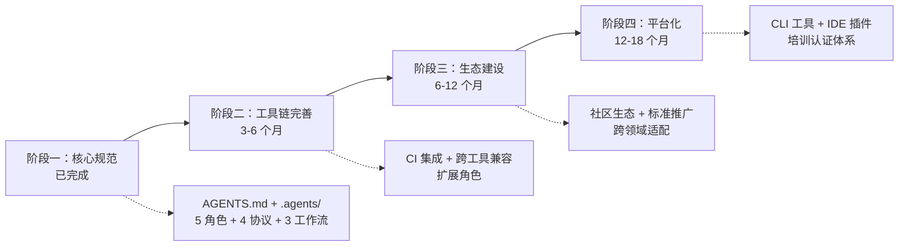
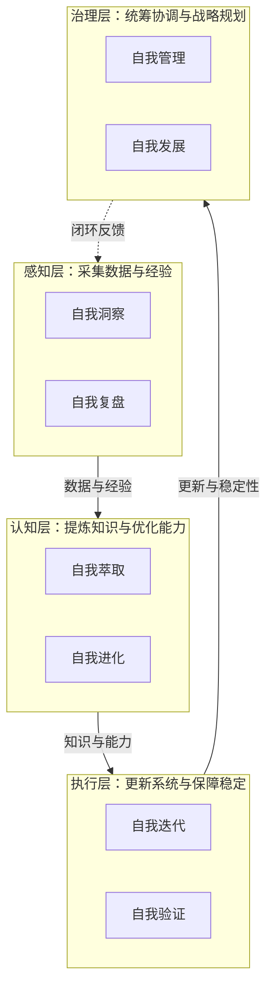
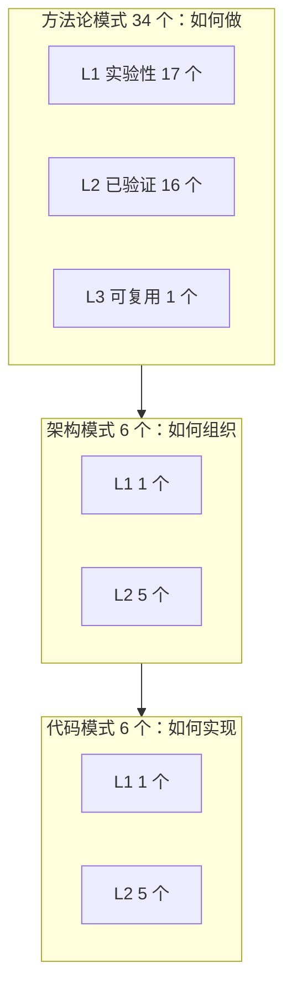
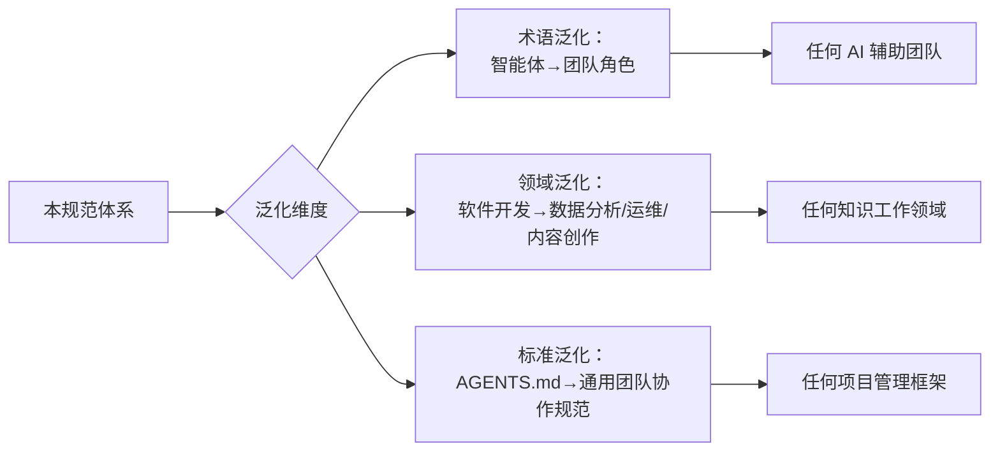

# AI 智能体开发规范体系

[](LICENSE)
[](AGENTS.md)
[](https://conventionalcommits.org)
[](CONTRIBUTING.md)
[](https://atomgit.com/daoCollective/AI)
[](https://atomgit.com/daoCollective/AI/issues)
[](https://atomgit.com/daoCollective/AI)
[](https://atomgit.com/daoCollective/AI)

> 一套面向多智能体协作开发的开放规范体系，基于 [AGENTS.md 开放标准](https://agents.md) 定义智能体的角色、能力边界、协作协议与工作流，让 AI 智能体在项目中能够“按需加载、各司其职、协同交付”。

本体系基于 [AGENTS.md 开放标准](https://agents.md) 构建，通过单一入口路由与按需加载机制，让多智能体协作具备一致的上下文与质量基线。详见 [项目概述](docs/project-overview.md)。

## 快速开始

```bash
git clone <repository-url>
cd <repository-name>
```

将本仓库根目录指定为 AI 编码工具（Codex、Cursor、Copilot 等）的工作目录，工具会自动读取 `AGENTS.md` 作为项目级指令。验证脚本的使用方式请参见 [.agents/scripts/](.agents/scripts/)。

## 项目亮点

### 核心优势

| 优势            | 说明                                                                         |
| ------------- | -------------------------------------------------------------------------- |
| 单一入口路由        | AGENTS.md 作为最高优先级入口，按需加载 .agents/ 规范，避免上下文爆炸                               |
| 5 角色分工体系      | orchestrator/architect/developer/reviewer/tester，每个角色有明确职责与能力边界（Non-Goals） |
| 机器可读的角色定义     | TOML frontmatter 声明 id/domain/layer/bindings，便于智能体程序化解析与绑定                 |
| 完整协作协议        | 覆盖任务交接、消息传递、冲突解决与临时依赖管理四类协议                                                |
| Mermaid 流程可视化 | 所有工作流、架构、关系均使用 Mermaid 表达，可渲染、可版本化、可审查                                     |
| 临时依赖治理三重机制    | .gitignore 规则 + Git pre-commit hook + 验证脚本，防止临时依赖误提交                       |

### 技术创新点

| 创新                    | 说明                                           | 来源                                                                               |
| --------------------- | -------------------------------------------- | -------------------------------------------------------------------------------- |
| 入口+容器二元架构             | AGENTS.md（路由+约束）+ .agents/（具体规范），分离关注点，可扩展性强 | 架构决策                                                                             |
| 三层递进提示词体系             | 全局契约→角色定义→精细化提示词，递进式加载                       | [提示词萃取](docs/retrospective/prompt-extraction.md)                                 |
| TOML frontmatter 绑定关系 | 通过 rules/references/skills 声明角色与协议/工作流的绑定    | [角色体系](docs/agent-roles.md)                                                      |
| 元工具体系                 | 用工具治理工具，每个工具解决上一轮工作的摩擦点                      | [优化循环洞察](docs/retrospective/reports/retrospective-insight-optimization-cycle.md) |
| 三层治理模型                | 原子化→自动化→验证，形成闭环，缺失任何一层都会出现治理漏洞               | [验证与自动化](docs/verification-automation.md)                                        |

### 量化成果

| 维度    | 数值                                                                      |
| ----- | ----------------------------------------------------------------------- |
| 交付物总数 | 70+ 个（规范层 + 工程层 + 治理层 + 知识层 + 子项目）                                      |
| 验证脚本  | 9 个（7 个核心验证 + 2 个原子化预检）                                                 |
| 复盘报告  | 16+ 份（含初版、深度版、洞察报告、综合报告、原子化元级复盘）                                        |
| 方法论模式 | 34 个（spec-driven/review-loop/three-tier-governance/critical-mass 等完整闭环） |
| 架构模式  | 6 个（感知→检查→报告/多智能体并行/增量+回归验证 等）                                          |
| 代码模式  | 6 个（上下文感知路径解析/Git忽略验证/元文档识别 等）                                          |
| 决策框架  | 4 个（目录命名/依赖管理/元文档处理/语义匹配阈值）                                             |
| 知识概念  | 6 个（元文档/上下文感知/正交验证/零依赖原则/语义前缀/规范自举性）                                    |
| 工具兼容性 | 基于 AGENTS.md 开放标准，可被支持该标准的工具加载                                          |

## 项目蓝图

### 短期发展目标（3-6 个月）

| 目标       | 交付标志                                                      |
| -------- | --------------------------------------------------------- |
| 完善角色体系   | 新增 devops、security 等扩展角色，覆盖更多开发场景（角色定义文件 + 提示词 + 工作流）     |
| 扩展工具链    | 增加 CI 集成脚本、自动化测试脚本、性能监控脚本（scripts/ 目录新增 3+ 脚本）            |
| 增强跨工具兼容性 | 测试 10+ AI 编码工具的兼容性，输出兼容性矩阵（兼容性测试报告）                       |
| 社区贡献流程优化 | 完善 issue/PR 模板、贡献指南、行为准则（.github/ 目录与 CONTRIBUTING.md 完善） |

### 中长期战略方向（6-18 个月）

1. **建立社区生态**：形成 AGENTS.md 标准的中文社区，定期举办分享活动，建立最佳实践案例库
2. **推动行业标准形成**：与 AGENTS.md 开放标准社区协作，推动中文场景的最佳实践反哺标准演进
3. **跨领域适配**：从软件开发扩展到数据分析、内容创作、运维等领域，形成领域专属角色与工作流
4. **工具链生态建设**：开发配套 CLI 工具、IDE 插件，降低规范体系的采用门槛

### 技术路线演进



### 功能迭代计划

| 优先级 | 功能     | 阶段 | 说明                              |
| --- | ------ | -- | ------------------------------- |
| P0  | CI 集成  | 短期 | GitHub Actions / GitLab CI 配置模板 |
| P1  | 扩展角色   | 短期 | devops、security 等角色定义           |
| P1  | 工具链扩展  | 短期 | 自动化测试、性能监控脚本                    |
| P2  | IDE 插件 | 中期 | VS Code / JetBrains 插件          |
| P2  | CLI 工具 | 中期 | 规范初始化、验证、生成 CLI                 |
| P3  | 培训课程   | 长期 | 智能体开发培训体系                       |
| P3  | 认证体系   | 长期 | AGENTS.md 实践认证                  |

### 市场拓展策略

- **目标用户**：AI 开发团队、开源项目维护者、企业 AI 转型团队、AI 工具厂商
- **推广渠道**：AtomGit/GitHub 开源社区、技术博客与公众号、开发者社区（掘金/思否）、技术会议分享
- **合作模式**：与 AI 工具厂商合作验证兼容性、社区贡献驱动迭代、企业试点与案例沉淀

## 系统规划

围绕"用工具治理工具"的核心理念，构建感知→认知→执行→治理四层闭环的八模块自我演进体系。每个模块的完整技术定义（架构、实现步骤、资源需求、预期指标）详见 [.agents/modules/](.agents/modules/)。

| 层级  | 模块          | 核心职责                  | 入口                                   |
| --- | ----------- | --------------------- | ------------------------------------ |
| 感知层 | 自我洞察 · 自我复盘 | 状态监控与异常预警 · 项目复盘与知识沉淀 | [.agents/modules/](.agents/modules/) |
| 认知层 | 自我萃取 · 自我进化 | 模式提取与资产入库 · 反馈分析与性能调优 | [.agents/modules/](.agents/modules/) |
| 执行层 | 自我迭代 · 自我验证 | 自动更新与回滚 · 测试生成与覆盖率分析  | [.agents/modules/](.agents/modules/) |
| 治理层 | 自我管理 · 自我发展 | 资源调度与冲突仲裁 · 战略规划与生态建设 | [.agents/modules/](.agents/modules/) |

### 整体架构



## 可复用模式体系

本项目在实践中持续萃取可复用的开发模式，形成三层模式库，涵盖从代码级到方法论级的完整复用体系。

### 模式全景



| 层级    | 数量   | 目录                                                                                                       | 说明                     |
| ----- | ---- | -------------------------------------------------------------------------------------------------------- | ---------------------- |
| 方法论模式 | 34 个 | [docs/retrospective/patterns/methodology-patterns/](docs/retrospective/patterns/methodology-patterns/)   | 开发→复盘→优化→治理→自动化→度量完整闭环 |
| 架构模式  | 6 个  | [docs/retrospective/patterns/architecture-patterns/](docs/retrospective/patterns/architecture-patterns/) | 可复用的系统组织与验证架构          |
| 代码模式  | 6 个  | [docs/retrospective/patterns/code-patterns/](docs/retrospective/patterns/code-patterns/)                 | 可复用的代码实现范式             |

> 详见 [方法论模式索引](docs/retrospective/patterns/methodology-patterns/README.md)

## 提示词萃取系统（prompt\_extraction）

独立的 Python 子项目，实现从对话记录中自动萃取可复用提示词模式的完整流水线。

> 详见 [提示词萃取系统入口](prompt_extraction/)，系统架构等技术细节参见 [.agents/systems/prompt-extraction.md](.agents/systems/prompt-extraction.md)

## 泛化与资产复用

本规范体系的设计目标不仅是"描述一个项目"，更是"可以迁移到任何项目"的**元规范框架**。

### 可复用资产清单

项目通过 [资产清单与复用指南](docs/retrospective/assets/asset-inventory.md) 提供完整的复用路径：

| 复用等级   | 示例资产                              | 适配工作量      |
| ------ | --------------------------------- | ---------- |
| 直接复用   | 任务模板、交接模板、目录索引 README 模板          | 零          |
| 配置后复用  | check-gitignore.py（修改路径列表）、依赖管理协议 | 低（5-30 分钟） |
| 实例化后复用 | 三段式检查工具架构、Spec-driven 开发流程、复盘报告模板 | 中（1 小时）    |
| 按场景适配  | 目录命名矩阵、依赖管理矩阵、语义匹配阈值矩阵            | 中（按需定制）    |

### 泛化路径



### 已有复用案例

`vendor/flexloop/` 目录下的 AgentForge 项目是本规范体系在实际项目中的**落地案例**，验证了角色体系、协作协议、自我演进模块等核心机制的可迁移性。详细的复用对照与技术分析参见 [.agents/cases/agentforge-adoption.md](.agents/cases/agentforge-adoption.md)。

## 角色协作场景

多智能体协作系统支持**中心化模式**（由 orchestrator 主导组队，适用于跨角色大型任务）与**去中心化模式**（任意角色通过 `@角色名` 语法发起协作请求，适用于局部需求）两种互补模式。orchestrator 依据角色的 `Responsibilities` 与 `Non-Goals` 字段精准分配任务，角色间通过 `@角色名` 语法直接通信并遵循 messaging 协议留存消息记录。

> 完整的协作场景定义（触发条件、成员选择机制、协作流程图、任务分配方式、角色相互 @ 机制、预期交付物等）已迁移至 [.agents/roles/collaboration-scenarios.md](.agents/roles/collaboration-scenarios.md)，请查阅该文件获取详细信息。

## 文档导航

<!-- NAV_TABLE_START -->

| 文档                                        | 说明                  |
| ----------------------------------------- | ------------------- |
| [智能体角色体系](docs/agent-roles.md)            | 5 个核心角色定义与绑定关系      |
| [协作体系](docs/collaboration.md)             | 4 项协作协议、3 个标准工作流    |
| [开发规范](docs/development-standards.md)     | 代码风格、提交规范、测试要求、文档边界 |
| [知识库](docs/knowledge-base.md)             | 技术知识库、复盘文档体系        |
| [项目概述](docs/project-overview.md)          | 项目定位、设计理念、核心特性      |
| [项目结构](docs/project-structure.md)         | 完整目录树与职责说明          |
| [相关链接](docs/related-links.md)             | 外部标准、工具文档、项目仓库      |
| [技术栈与环境要求](docs/tech-stack.md)            | 技术选型、环境依赖           |
| [验证与自动化](docs/verification-automation.md) | 临时依赖治理、验证脚本         |
| [贡献指南](CONTRIBUTING.md)                   | 贡献流程、分支命名、PR 规范     |
| [原子化预检工具](.agents/scripts/)               | 模式覆盖与内容一致性自动检查      |
| [复盘报告系列](docs/retrospective/reports/)     | 综合复盘、执行复盘、洞察萃取、元级复盘 |

<!-- NAV_TABLE_END -->

## 许可证

本项目基于 [Apache License 2.0](LICENSE) 开源。

## 联系方式

- **问题反馈**：[AtomGit Issues](https://atomgit.com/daoCollective/AI/issues)
- **讨论交流**：[AtomGit Pull Requests](https://atomgit.com/daoCollective/AI/pulls)

***

<details>
<summary>规范体系文档索引</summary>

| 文档     | 路径                                                                                                 | 说明             |
| ------ | -------------------------------------------------------------------------------------------------- | -------------- |
| 全局契约   | [AGENTS.md](AGENTS.md)                                                                             | 智能体最高优先级入口     |
| 目录说明   | [.agents/README.md](.agents/README.md)                                                             | .agents/ 容器说明  |
| 角色索引   | [.agents/roles/README.md](.agents/roles/README.md)                                                 | 5 个角色索引与职责矩阵   |
| 角色协作场景 | [.agents/roles/collaboration-scenarios.md](.agents/roles/collaboration-scenarios.md)               | 中心化与去中心化协作模式定义 |
| 演进模块索引 | [.agents/modules/README.md](.agents/modules/README.md)                                             | 8 个自我演进子智能体定义  |
| 提示词索引  | [.agents/prompts/README.md](.agents/prompts/README.md)                                             | 系统提示词使用说明      |
| 工具规范索引 | [.agents/tools/README.md](.agents/tools/README.md)                                                 | 4 类工具调用规范      |
| 协议索引   | [.agents/protocols/README.md](.agents/protocols/README.md)                                         | 4 项协作协议        |
| 工作流索引  | [.agents/workflows/README.md](.agents/workflows/README.md)                                         | 3 个标准工作流       |
| 模板索引   | [.agents/templates/README.md](.agents/templates/README.md)                                         | 任务与交接模板        |
| 脚本索引   | [.agents/scripts/README.md](.agents/scripts/README.md)                                             | 验证与工具脚本        |
| 规格文档   | [.trae/specs/create-agents-md-and-config/spec.md](.trae/specs/create-agents-md-and-config/spec.md) | 本体系的需求规格       |
| 知识库索引  | [docs/knowledge/README.md](docs/knowledge/README.md)                                               | 技术知识库入口        |
| 复盘体系索引 | [docs/retrospective/README.md](docs/retrospective/README.md)                                       | 复盘文档体系入口       |
| 提示词萃取  | [docs/retrospective/prompt-extraction.md](docs/retrospective/prompt-extraction.md)                 | 可迁移提示词模式与方法论   |

</details>
