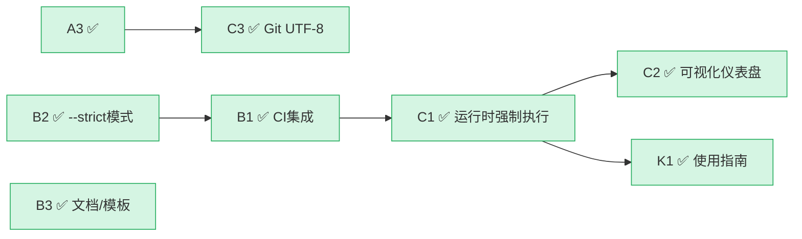

# TODO - SpecWeave 待办事项追踪

> 最后更新：2026-06-29（P0+P1全部完成 ✅）
> 来源：[阶段守卫机制落地迭代复盘](docs/retrospective/reports/governance/retrospective-stage-guardrails-logging-20260629/README.md)

---

## 阶段守卫机制改进项

### ✅ 已完成

| 编号 | 任务 | 类型 | 完成日期 | 交付物 |
|------|------|------|---------|--------|
| A1 | 萃取「规则落地三层模型」模式入库 | 模式萃取 | 2026-06-29 | [three-layer-rule-enforcement.md](docs/retrospective/patterns/methodology-patterns/governance-strategy/three-layer-rule-enforcement.md) |
| A2 | 萃取「结构化轻量日志」模式入库 | 模式萃取 | 2026-06-29 | [structured-lightweight-logging.md](docs/retrospective/patterns/code-patterns/structured-lightweight-logging.md) |
| A3 | 配置.gitattributes统一换行符 | 环境修复 | 2026-06-29 | [.gitattributes](.gitattributes) |
| BONUS | 萃取「弹性流程分级」模式入库 | 模式萃取 | 2026-06-29 | [elastic-workflow-classification.md](docs/retrospective/patterns/methodology-patterns/governance-strategy/elastic-workflow-classification.md) |
| C3 | 配置Git UTF-8编码解决中文乱码 | 环境修复 | 2026-06-29 | Git全局配置（i18n.commitEncoding=utf-8, i18n.logOutputEncoding=utf-8, core.quotepath=false, gui.encoding=utf-8） |
| B2 | check-stage-guardrails.py 添加`--strict`模式 | 功能增强 | 2026-06-29 | [check-stage-guardrails.py](.agents/scripts/check-stage-guardrails.py)（argparse参数+退出码逻辑+DEMO数据+测试用例） |
| B1 | CI脚本集成阶段守卫日志检查 | CI集成 | 2026-06-29 | [ci-check.ps1](.agents/scripts/ci-check.ps1)第11步、[ci-check.sh](.agents/scripts/ci-check.sh)第11步（支持STAGE_GUARDRAIL_LOG环境变量+自动扫描.agents/logs/） |
| B3 | 更新文档/模板/spec模板增加SG-LOG示例与可观测性检查项 | 文档+模板 | 2026-06-29 | [feature-development.md](.agents/workflows/feature-development.md)（结构化日志输出要求章节）、5个角色[system-prompt](.agents/prompts/)（日志输出要求）、[standards-tools-task-template.md](.agents/templates/theme-templates/standards-tools-task-template.md)（SubTask 1.7/2.7）、[roles-governance-task-template.md](.agents/templates/theme-templates/roles-governance-task-template.md)（SubTask 1.8/3.6）、[check-stage-guardrails.py](.agents/scripts/check-stage-guardrails.py)（docstring完善）、[test_stage_guardrails_strict.py](.agents/scripts/tests/test_stage_guardrails_strict.py)（自动化测试） |
| C1 | 阶段守卫运行时强制执行层 | 功能增强 | 2026-06-29 | [state.py](.agents/scripts/lib/stage_guardrails/state.py)（StageStateManager）、[boundary.py](.agents/scripts/lib/stage_guardrails/boundary.py)（BoundaryChecker）、[interceptor.py](.agents/scripts/lib/stage_guardrails/interceptor.py)（InterceptorFormatter+BypassDetector）、[runtime.py](.agents/scripts/lib/stage_guardrails/runtime.py)（GuardrailRuntime门面）、[check-stage-guardrail-runtime.py](.agents/scripts/check-stage-guardrail-runtime.py)（CLI入口，5子命令） |
| K1 | 创建阶段守卫使用指南 | 文档 | 2026-06-29 | [stage-guardrails-guide.md](docs/knowledge/stage-guardrails-guide.md)（8阶段权限速查+10种日志示例+7种拦截场景+CLI+API参考） |
| C2 | 日志聚合可视化仪表盘 | 可视化 | 2026-06-29 | [generate-sg-dashboard.py](.agents/scripts/generate-sg-dashboard.py)（多会话SG-LOG/PDR-LOG聚合+Mermaid饼图/柱状图+7指标卡+Top-N+会话表+时间线；暗色主题响应式HTML输出到[sg-dashboard.html](.agents/reports/sg-dashboard.html)；支持--demo/--json/--open） |

### 🔵 P2 — 后续规划（预计1-3天，需要架构设计）

> 执行顺序：C1可独立启动；C2依赖C1产出真实运行数据；K1可在C1完成后编写

- [x] **C1** 阶段守卫运行时强制执行层 ✅ 2026-06-29
  - 类型：功能增强
  - 依赖：B1（CI集成验证规则可行后）
  - 验收标准：
    - 实现工具调用拦截中间件：在角色执行操作前自动检查当前阶段权限
    - 越界操作输出标准⚠️拦截格式（含当前阶段、目标阶段、退出标准）
    - 阶段跳转需显式审批记录（orchestrator批准/reviewer确认）
  - 相关文件：[.agents/rules/stage-guardrails.md](.agents/rules/stage-guardrails.md)、[.agents/workflows/feature-development.md](.agents/workflows/feature-development.md)

- [x] **K1** 创建阶段守卫使用指南 ✅ 2026-06-29
  - 类型：文档
  - 依赖：C1
  - 验收标准：
    - 各阶段必读文档速查表 ✅
    - 典型场景日志输出示例（正常/拦截/审批/异常）✅（10种场景）
    - 常见拦截原因与解决方案 ✅（7种场景）
    - check脚本使用手册 ✅
  - 存放位置：docs/knowledge/stage-guardrails-guide.md

- [x] **C2** 日志聚合可视化仪表盘 ✅ 2026-06-29
  - 类型：可视化
  - 依赖：C1（需要真实运行日志数据）
  - 验收标准：
    - 多会话[SG-LOG]/[PDR-LOG]聚合分析 ✅
    - 阶段完成率/拦截率/审批通过率等指标Mermaid图表 ✅（pie + xychart-beta stacked bar）
    - 异常趋势与高频拦截点Top-N统计 ✅
  - 相关文件：[generate-sg-dashboard.py](.agents/scripts/generate-sg-dashboard.py)、[sg-dashboard.html](.agents/reports/sg-dashboard.html)

---

## 🎉 P2 全部完成！

### 依赖关系图（最终状态）

## 验证结果

- **B2 --strict模式**：4项自动化测试全部通过（demo normal=0, demo strict=1, clean=0, warn=1）
- **B1 CI集成**：ci-check.ps1/ci-check.sh 第11步添加完成，支持环境变量和自动扫描
- **B3 文档/模板**：5个system-prompt + feature-development.md + 2个主题模板 + docstring 全部更新
- **C3 Git UTF-8**：4项编码配置已设置，`git log` 中文提交信息正常显示
- **C1.1 StageStateManager**：状态管理器完成，8阶段流转+正向跳过+回退+审批，46个测试通过
- **C1.2 BoundaryChecker**：操作边界校验引擎完成，57条权限规则+角色匹配+跨阶段映射，73个测试通过
- **C1.3 InterceptorFormatter**：拦截输出格式化器完成，SG-LOG生成+绕过检测+彩色输出+反向解析，37个测试通过
- **C1.4 GuardrailRuntime**：运行时集成门面完成，统一拦截入口+生命周期管理+日志收集+异常格式化，49个测试通过
- **C1.5 CLI入口脚本**：check-stage-guardrail-runtime.py完成，5个子命令（--demo/--full-flow/--check/--export-logs/--status），支持JSON输出、彩色输出、strict模式；运行时+离线工具日志格式双向兼容验证通过
- **K1 阶段守卫使用指南**：stage-guardrails-guide.md完成，含8阶段权限速查表+必读文档清单+10种典型SG-LOG示例+7种常见拦截原因解决方案+CLI手册+Python API参考，知识库索引已自动更新
- **C2 日志聚合可视化仪表盘**：generate-sg-dashboard.py完成，8个demo场景（正常/skip/rollback/reject/bypass/error全场景覆盖），734条日志条目聚合，暗色主题HTML仪表盘含7指标卡+Mermaid饼图/xychart-beta stacked bar+Top-7拦截原因+阶段统计表+8会话详情表+30条最近事件时间线；CI脚本第12步集成（自动扫描logs目录，不阻断CI）；AGENTS.md上下文路由表已更新；浏览器渲染验证通过
- **Bug修复**：state.py中approve_jump回退角色选择bug（rollback后用orchestrator尝试进入architect专属阶段S2）、interceptor.py中format_error的is_intercept标志应为True、check-stage-guardrails.py的SG_EVENTS缺少PDR_CONFIRM事件、generate-sg-dashboard.py中resolve_project_root()未传__file__参数、demo数据skip后break导致后续阶段丢失

## 关键洞察（来自复盘）

1. **规则落地三层模型**：定义层（规范）+ 痕迹层（日志）+ 验证层（工具），缺一不可
2. **竞品借鉴"吸收-适配"**：吸收设计理念而非照搬配置
3. **结构化轻量日志**：键值对+JSON ctx是可观测性最小实现方案
4. **弹性流程分级**：三路径（新功能🟢/扩展🔵/重构🔴）按风险适配流程严格度
5. **环境噪音信号**：原子提交中无关变更=环境治理信号，不应只"排除"而应根治
