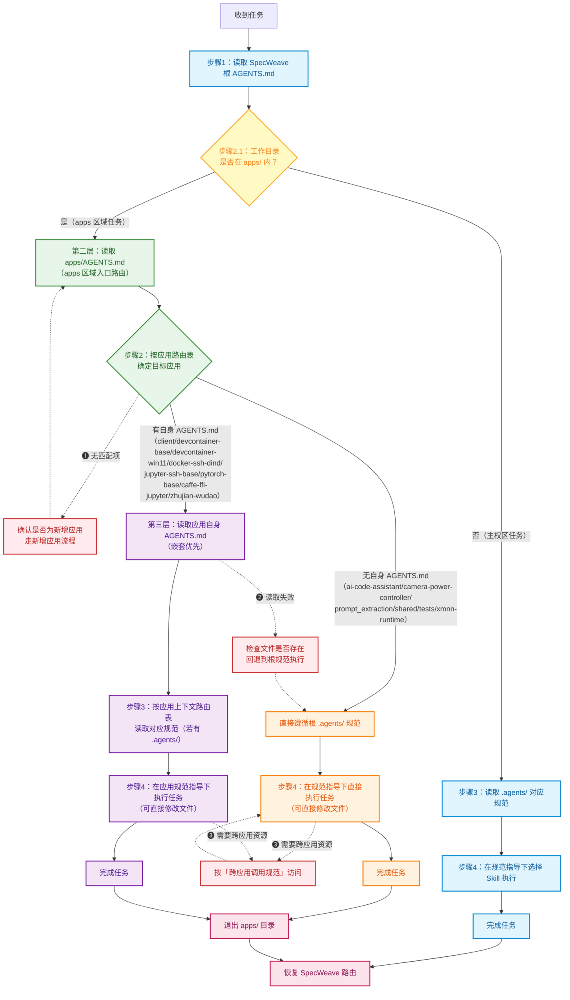

# Apps 区域智能体契约 (AGENTS Manifest)

> **启动协议（PRIORITY ZERO）**
>
> ```
> 步骤 1：读取本文件全文
> 步骤 2：按「应用路由表」确定本次任务需要进入的应用
> 步骤 3：若应用有自身的 AGENTS.md，进入后读取该文件（嵌套优先）
> 步骤 4：若应用无 AGENTS.md，直接遵循根 .agents/ 规范执行
> 步骤 5：退出 apps/ 目录后，恢复 SpecWeave 主权区路由（回到根 AGENTS.md）
> ```
>
> ⚠️ 本文件是 apps 区域的 AI 智能体入口。apps/ 存放 SpecWeave 主仓库内的**内置应用**，所有文件都在主仓库内直接管理，可直接修改——与 projects/vendor 的 git submodule 机制有本质区别。

## 区域性质

apps/ 存放 SpecWeave 主仓库内的内置应用，与 `projects/`（第一方自有子项目）、`vendor/`（第三方依赖）形成明确区分：

| 目录 | 用途 | 管理方式 | 是否可直接修改 |
|------|------|----------|:---:|
| `apps/` | 主仓库内置应用（直接属于 SpecWeave） | 同仓库直接管理，非 git submodule | ✅ 是 |
| `projects/` | 第一方自有子项目 | git submodule，子模块内开发 | ❌ 否（走子项目流程） |
| `vendor/` | 第三方依赖 | git submodule，第三方代码 | ❌ 否（禁止本地修改） |

> **关键区别**：apps/ 内所有内容都是 SpecWeave 主仓库的一部分，没有 git submodule 隔离，智能体可以直接修改 apps/ 下的任何文件。这是与 projects/vendor 的本质差异——projects/vendor 都是 git submodule，需要遵循子模块流程。

> **.gitignore 策略**：apps/ 目录完全纳入主仓库版本控制，不使用 .gitignore 排除应用内容。

apps/AGENTS.md 由 SpecWeave 主权区维护，直接纳入版本管理；部分应用有自己的 AGENTS.md 和 .agents/ 目录实现自治，部分应用直接遵循根 .agents/ 规范。

## 应用路由表

> apps/ 下应用按**应用类型**分组存放：`containers/`（Podman容器镜像类）、`docker-images/`（Docker容器镜像类）、`ai-agents/`（AI 应用类）、`dev-tools/`（开发工具类）、`samples/`（示例/原型类）。根级保留治理层（shared/、tests/、.agents/）。

| 分组 | 应用 | AGENTS.md 入口 | .agents/ | 说明 |
|------|------|---------------|:---:|------|
| containers/ | jupyter-podman-rootless | [containers/jupyter-podman-rootless/AGENTS.md](containers/jupyter-podman-rootless/AGENTS.md) | ✅ 有 | 基于Podman rootless的Jupyter开发容器（Python 3.14t + Miniforge3 + SSH + rootless Podman + OMLMD/OLOT + Toolbx透传，invoke管理，三层后端自动降级） |
| containers/ | client | [containers/client/AGENTS.md](containers/client/AGENTS.md) | ✅ 有 | jupyter-podman-rootless 镜像消费端：基于 podman-py 从本地 tar.gz 加载镜像并管理容器生命周期，供脚本化集成/嵌入调用；含 `env.*` 容器内自举命名空间；含 opt-in `quant.*` podman-compose 工作负载栈命名空间（overlays/onnx-quantized 量化叠加层：build/up/down/ps/logs/smoke，Windows 原生门禁）；含 opt-in `xmnn.*` 开发/打包栈命名空间（overlays/xmnn-dev：build/up/down/ps/logs/smoke/build-tvm/wheel，运行时挂载 npu_tvm/npuusertools 源码，LLVM 22 + Nuitka 打 xmnn whl，同族 Windows 原生门禁）；含 opt-in `monetize.*` tvm-ffi 原生编译栈命名空间（overlays/agent-monetize-dev：build/up/down/ps/logs/smoke/build-native/wheel，apt clang+apache-tvm-ffi 单一 cp314 GIL，挂载 apps/agent-monetize）；含 opt-in `xmnnrt.*` wheel 消费运行时栈命名空间（overlays/xmnn-runtime：build/up/down/ps/logs/smoke，把 xmnn-dev 产出的 whl 装入干净运行时镜像，无工具链零源码挂载，2225/8893，builder/runtime 分离） |
| containers/ | shared | [containers/AGENTS.md](containers/AGENTS.md)（组层代管） | ❌ 无 | 组内共享包 jpman-common 0.1.0（scikit-build-core 纯 Python；podman SDK 连接层唯一事实源 + 平台/进程/容器只读工具，builder/client 共同依赖须先 editable 安装；G1/G2 治理见组层 [.agents/rules/shared-package.md](containers/.agents/rules/shared-package.md)） |
| docker-images/ | devcontainer-base | [docker-images/devcontainer-base/AGENTS.md](docker-images/devcontainer-base/AGENTS.md) | ❌ 无 | 全功能开发容器（Ubuntu 26.04，SSH+Docker DinD/DooD+Podman+Jupyter，supervisord管理，Python 3.14 cp314t free-threading） |
| docker-images/ | devcontainer-win11 | [docker-images/devcontainer-win11/AGENTS.md](docker-images/devcontainer-win11/AGENTS.md) | ✅ 有 | Windows 11 开发容器（Server Core 2022，SSH+Docker DooD+Jupyter，PowerShell管理，Python 3.14 cp314t free-threading） |
| docker-images/ | docker-ssh-dind | [docker-images/docker-ssh-dind/AGENTS.md](docker-images/docker-ssh-dind/AGENTS.md) | ✅ 有 | Docker SSH DinD（Docker-in-Docker）环境 |
| docker-images/ | jupyter-ssh-base | [docker-images/jupyter-ssh-base/AGENTS.md](docker-images/jupyter-ssh-base/AGENTS.md) | ❌ 无 | Jupyter Notebook SSH 基础镜像 |
| docker-images/ | pytorch-base | [docker-images/pytorch-base/AGENTS.md](docker-images/pytorch-base/AGENTS.md) | ❌ 无 | PyTorch 基础环境镜像 |
| docker-images/ | caffe-ffi-jupyter | [docker-images/caffe-ffi-jupyter/AGENTS.md](docker-images/caffe-ffi-jupyter/AGENTS.md) | ❌ 无 | Caffe-FFI Jupyter 开发环境（基于jupyter-ssh-base） |
| docker-images/ | caffe-ffi-cross | —（遵循根规范） | ❌ 无 | Caffe-FFI 交叉编译（macOS/Windows 交叉构建镜像） |
| docker-images/ | xmnn-runtime | —（遵循根规范） | ❌ 无 | XMNN 运行时环境 |
| ai-agents/ | zhujian-wudao | [ai-agents/zhujian-wudao/AGENTS.md](ai-agents/zhujian-wudao/AGENTS.md) | ✅ 有 | 竹简悟道——道家哲学AI洞察项目 |
| ai-agents/ | eve-minimal-agent | —（遵循根规范） | ❌ 无 | Vercel Eve 最小可运行 Agent 示例 |
| ai-agents/ | ai-code-assistant | —（遵循根规范） | ❌ 无 | AI 代码助手 Web 应用 |
| dev-tools/ | camera-power-controller | —（遵循根规范） | ❌ 无 | 摄像头电源控制工具 |
| dev-tools/ | prompt_extraction | —（遵循根规范） | ❌ 无 | 提示词质量评估与提取工具 |
| samples/ | cow-demo | —（遵循根规范） | ❌ 无 | 零拷贝COW读写分离模式C++示例框架 |
| samples/ | short-video-site | —（遵循根规范） | ❌ 无 | ReelVibe 短视频网站（AI全流程开发Demo） |
| samples/ | zleap-workspace-first-prototype | —（遵循根规范） | ❌ 无 | 工作区首个原型（多模型路由） |
| samples/ | serial-camera-controller | —（遵循根规范） | ❌ 无 | 串口控制USB摄像头抓图/录像（CH340+OpenCV+pyserial，双协议三线程架构） |
| 根级 | shared | —（遵循根规范） | ❌ 无 | 跨应用共享资源目录 |
| 根级 | tests | —（遵循根规范） | ❌ 无 | 测试用例目录 |

### 嵌套优先级

```
SpecWeave 根 AGENTS.md
  └─ apps/AGENTS.md（本文件，apps 区域入口）
       ├─ containers/（Podman容器镜像类分组 · 组层入口 containers/AGENTS.md）
       │    ├─ AGENTS.md（containers 组级路由：builder/client/shared 三角 + G1-G4 跨成员契约）
       │    │    └─ .agents/rules/shared-package.md（jpman_common 共享包治理）+ docs/（00-overview / 01-getting-started）
       │    ├─ jupyter-podman-rootless/AGENTS.md（jupyter-podman-rootless 构建端入口 · 嵌套优先 · rootless Podman + conda + invoke + OMLMD/OLOT + Toolbx）
       │    │    └─ .agents/rules/（containerfile/entrypoint/services/compose/invoke-tasks/ml-models/build-test 7个规范文件）
       │    │    └─ docs/（18个人类可读文档）
       │    ├─ client/AGENTS.md（jupyter-podman-rootless 镜像消费端 · podman-py SDK 优先 · invoke load/run/stop/status/clean · env.* 容器内自举 · quant/xmnn/monetize/xmnnrt 四栈）
       │    └─ shared（组内共享包 jpman-common，无独立 AGENTS，由组层 AGENTS + .agents/rules/shared-package.md 代管）
       └─ docker-images/（Docker容器镜像类分组）
            ├─ devcontainer-base/AGENTS.md（devcontainer-base 应用入口 · 嵌套优先）
            ├─ devcontainer-win11/AGENTS.md（devcontainer-win11 应用入口 · 嵌套优先 · Windows+free-threading）
            ├─ docker-ssh-dind/AGENTS.md（docker-ssh-dind 应用入口 · 嵌套优先）
            ├─ jupyter-ssh-base/AGENTS.md（jupyter-ssh-base 应用入口 · 嵌套优先）
            ├─ pytorch-base/AGENTS.md（pytorch-base 应用入口 · 嵌套优先）
            └─ caffe-ffi-jupyter/AGENTS.md（caffe-ffi-jupyter 应用入口 · 嵌套优先）
       └─ ai-agents/（AI 应用类分组）
            └─ zhujian-wudao/AGENTS.md（zhujian-wudao 应用入口 · 嵌套优先）
```

进入任意子目录后，优先读取**离当前工作目录最近**的 AGENTS.md。若应用自身的 AGENTS.md 规则与本文件冲突，以应用的 AGENTS.md 为准（子层覆盖父层）。无自身 AGENTS.md 的应用直接遵循根 .agents/ 规范。

### 路由流程图



**关键机制：**

- **实线箭头**（`-->`）主流程；**红色虚线箭头**（`-.->`）异常处理分支，编号 ❶-❸ 对应下方「异常处理分支」表格
- **嵌套优先**：有自身 AGENTS.md 的应用，进入后优先读取应用的 AGENTS.md，应用规则覆盖父级
- **直连模式**：无自身 AGENTS.md 的应用，跳过第三层，直接遵循根 .agents/ 规范执行
- **可直接修改**：apps/ 内所有文件都在主仓库，可直接修改——这是与 projects/vendor 的核心区别
- **退出恢复**：正常完成或异常回退均退出 `apps/` 目录，自动恢复 SpecWeave 路由

## 可用资产索引

apps 区域内有 `.agents/` 目录的应用，其规范资产可被跨应用调用。实际资产存放在各应用内，本索引仅提供路由定位。

### jupyter-podman-rootless 应用（containers/分组）

| 资产 | 路径 | 说明 |
|------|------|------|
| 入门指南 | [containers/jupyter-podman-rootless/.agents/README.md](containers/jupyter-podman-rootless/.agents/README.md) | jupyter-podman-rootless .agents/ 入口 |
| Containerfile 规则 | [containers/jupyter-podman-rootless/.agents/rules/containerfile.md](containers/jupyter-podman-rootless/.agents/rules/containerfile.md) | 3阶段运行时链 + toolbox-builder aux 阶段 + final 5层运行时分层、Toolbx兼容、free-threading配置规范 |
| Entrypoint 规则 | [containers/jupyter-podman-rootless/.agents/rules/entrypoint.md](containers/jupyter-podman-rootless/.agents/rules/entrypoint.md) | 7步启动流程规范（密码/SSH/Podman/Jupyter） |
| 服务配置规则 | [containers/jupyter-podman-rootless/.agents/rules/services.md](containers/jupyter-podman-rootless/.agents/rules/services.md) | supervisord/SSH/Jupyter/Podman服务配置规范 |
| Compose编排规则 | [containers/jupyter-podman-rootless/.agents/rules/compose.md](containers/jupyter-podman-rootless/.agents/rules/compose.md) | compose.yaml/profiles/透传配置/安全设计规范 |
| Invoke任务规则 | [containers/jupyter-podman-rootless/.agents/rules/invoke-tasks.md](containers/jupyter-podman-rootless/.agents/rules/invoke-tasks.md) | 三层后端架构、任务编写（10个任务模块）、路径自动转换规范 |
| ML模型规则 | [containers/jupyter-podman-rootless/.agents/rules/ml-models.md](containers/jupyter-podman-rootless/.agents/rules/ml-models.md) | OMLMD/OLOT/ModelCar/model-registry规范 |
| 构建测试规则 | [containers/jupyter-podman-rootless/.agents/rules/build-test.md](containers/jupyter-podman-rootless/.agents/rules/build-test.md) | 构建/运行/7步验证/问题排查规范 |
| 人类可读文档 | [containers/jupyter-podman-rootless/docs/README.md](containers/jupyter-podman-rootless/docs/README.md) | 18个原子化使用文档索引 |

### client 应用（containers/分组）

| 资产 | 路径 | 说明 |
|------|------|------|
| 入门指南 | [containers/client/.agents/README.md](containers/client/.agents/README.md) | client .agents/ 入口 |
| Invoke任务规则 | [containers/client/.agents/rules/invoke-tasks.md](containers/client/.agents/rules/invoke-tasks.md) | 两层后端（SDK 优先 → CLI fallback）、`src/jpman_client/tasks/` 5模块单一职责、`jpman_client.tasks` 命名空间 |
| SDK连接规则 | [containers/client/.agents/rules/sdk-connection.md](containers/client/.agents/rules/sdk-connection.md) | podman-py 6种合法 scheme 白名单、连接策略与诊断（W-I2） |
| Windows/WSL规则 | [containers/client/.agents/rules/windows-wsl.md](containers/client/.agents/rules/windows-wsl.md) | Windows 11 原生 + WSL2 画像、A/B 双维度分离（卷挂载路径 / SDK 连接） |
| 变更日志 | [containers/client/.agents/CHANGELOG.md](containers/client/.agents/CHANGELOG.md) | client 规范体系变更记录 |

### devcontainer-win11 应用

| 资产 | 路径 | 说明 |
|------|------|------|
| 入门指南 | [docker-images/devcontainer-win11/.agents/README.md](docker-images/devcontainer-win11/.agents/README.md) | devcontainer-win11 .agents/ 入口 |
| Dockerfile 规则 | [docker-images/devcontainer-win11/.agents/rules/dockerfile.md](docker-images/devcontainer-win11/.agents/rules/dockerfile.md) | Windows Dockerfile 编写规范（含 free-threading 配置） |
| Entrypoint 规则 | [docker-images/devcontainer-win11/.agents/rules/entrypoint.md](docker-images/devcontainer-win11/.agents/rules/entrypoint.md) | entrypoint.ps1 编写规范 |
| 服务配置规则 | [docker-images/devcontainer-win11/.agents/rules/services.md](docker-images/devcontainer-win11/.agents/rules/services.md) | sshd/jupyter/docker dood 服务配置规范 |
| 构建测试规则 | [docker-images/devcontainer-win11/.agents/rules/build-test.md](docker-images/devcontainer-win11/.agents/rules/build-test.md) | 构建和测试规范 |

### docker-ssh-dind 应用

| 资产 | 路径 | 说明 |
|------|------|------|
| 入门指南 | [docker-images/docker-ssh-dind/.agents/README.md](docker-images/docker-ssh-dind/.agents/README.md) | docker-ssh-dind .agents/ 入口 |
| 构建测试规则 | [docker-images/docker-ssh-dind/.agents/rules/build-test.md](docker-images/docker-ssh-dind/.agents/rules/build-test.md) | 构建与测试规范 |
| Containerfile 规则 | [docker-images/docker-ssh-dind/.agents/rules/containerfile.md](docker-images/docker-ssh-dind/.agents/rules/containerfile.md) | Containerfile/Dockerfile 编写规范 |
| Entrypoint 规则 | [docker-images/docker-ssh-dind/.agents/rules/entrypoint.md](docker-images/docker-ssh-dind/.agents/rules/entrypoint.md) | 入口脚本编写规范 |

### zhujian-wudao 应用

| 资产 | 路径 | 说明 |
|------|------|------|
| 约束规范 | [ai-agents/zhujian-wudao/.agents/constraints.md](ai-agents/zhujian-wudao/.agents/constraints.md) | 竹简悟道项目约束 |
| 约定规范 | [ai-agents/zhujian-wudao/.agents/conventions.md](ai-agents/zhujian-wudao/.agents/conventions.md) | 代码与文档约定 |
| 项目说明 | [ai-agents/zhujian-wudao/.agents/project.md](ai-agents/zhujian-wudao/.agents/project.md) | 项目概述 |
| 工作流 | [ai-agents/zhujian-wudao/.agents/workflows.md](ai-agents/zhujian-wudao/.agents/workflows.md) | 工作流程规范 |
| 哲学家角色 | [ai-agents/zhujian-wudao/.agents/roles/philosopher.md](ai-agents/zhujian-wudao/.agents/roles/philosopher.md) | 哲学洞察角色定义 |
| 洞察写作指南 | [ai-agents/zhujian-wudao/.agents/roles/references/insight-writing-guide.md](ai-agents/zhujian-wudao/.agents/roles/references/insight-writing-guide.md) | 洞察文档写作规范 |
| 约束速查表 | [ai-agents/zhujian-wudao/.agents/roles/references/constraints-cheatsheet.md](ai-agents/zhujian-wudao/.agents/roles/references/constraints-cheatsheet.md) | 约束条件速查 |
| 洞察写作技能 | [ai-agents/zhujian-wudao/.agents/skills/zhujian-insight-writer/SKILL.md](ai-agents/zhujian-wudao/.agents/skills/zhujian-insight-writer/SKILL.md) | 洞察写作 Skill |
| 道家学者插画技能 | [ai-agents/zhujian-wudao/.agents/skills/dao-scholar-illustrations/SKILL.md](ai-agents/zhujian-wudao/.agents/skills/dao-scholar-illustrations/SKILL.md) | 道家风格插画 Skill |
| 产品规格 | [ai-agents/zhujian-wudao/.agents/docs/product/2026-06-17-product-spec.md](ai-agents/zhujian-wudao/.agents/docs/product/2026-06-17-product-spec.md) | 产品规格文档 |
| 洞察库索引 | [ai-agents/zhujian-wudao/.agents/docs/insights/_index.md](ai-agents/zhujian-wudao/.agents/docs/insights/_index.md) | 洞察文档索引 |
| 可迁移方法 | [ai-agents/zhujian-wudao/.agents/docs/knowledge-transfer/2026-06-17-transferable-methods.md](ai-agents/zhujian-wudao/.agents/docs/knowledge-transfer/2026-06-17-transferable-methods.md) | 可迁移方法论 |
| 可迁移模式 | [ai-agents/zhujian-wudao/.agents/docs/knowledge-transfer/2026-06-17-transferable-patterns.md](ai-agents/zhujian-wudao/.agents/docs/knowledge-transfer/2026-06-17-transferable-patterns.md) | 可复用设计模式 |

## 边界声明

| 资产 | 归属 | 可直接修改 | 说明 |
|------|------|:---:|------|
| apps/AGENTS.md | SpecWeave 主权区 | ✅ 是 | apps 区域入口路由 |
| apps/README.md | SpecWeave 主权区 | ✅ 是 | apps 目录总览 |
| apps/shared/ | SpecWeave 主权区 | ✅ 是 | 跨应用共享资源 |
| apps/tests/ | SpecWeave 主权区 | ✅ 是 | 全局测试用例 |
| apps/docker-images/ | SpecWeave 主权区 | ✅ 是 | 容器镜像类应用分组（Docker/DinD） |
| apps/containers/ | SpecWeave 主权区 | ✅ 是 | 容器镜像类应用分组（Podman rootless；jupyter-podman-rootless/client/shared 三成员，组层 AGENTS.md 路由 + G1-G4 跨成员契约） |
| apps/containers/AGENTS.md | SpecWeave 主权区 | ✅ 是 | containers 组级路由入口（三成员路由表、shared 代管、G1-G4 契约） |
| apps/containers/shared/ | SpecWeave 主权区 | ✅ 是 | 组内共享包 jpman-common（连接层+只读工具；无独立 AGENTS，组层代管） |
| apps/ai-agents/ | SpecWeave 主权区 | ✅ 是 | AI 应用类分组 |
| apps/dev-tools/ | SpecWeave 主权区 | ✅ 是 | 开发工具类分组 |
| apps/samples/ | SpecWeave 主权区 | ✅ 是 | 示例/原型类分组 |
| apps/containers/jupyter-podman-rootless/ | 应用自治（有自身 AGENTS.md） | ✅ 是 | Podman rootless Jupyter开发容器（Python 3.14t + Miniforge3 + SSH + rootless Podman + OMLMD/OLOT + Toolbx透传，invoke管理，三层后端自动降级） |
| apps/containers/jupyter-podman-rootless/AGENTS.md | 应用自治 | ✅ 是 | jupyter-podman-rootless 入口 |
| apps/containers/jupyter-podman-rootless/.agents/ | 应用自治 | ✅ 是 | jupyter-podman-rootless 规范体系（7个rules文件：containerfile/entrypoint/services/compose/invoke-tasks/ml-models/build-test） |
| apps/containers/jupyter-podman-rootless/docs/ | 应用自治 | ✅ 是 | jupyter-podman-rootless 人类可读文档（18个原子化文档+索引） |
| apps/containers/client/ | 应用自治（有自身 AGENTS.md） | ✅ 是 | jupyter-podman-rootless 镜像消费端：podman-py 加载 tar.gz、invoke load/run/stop/status/clean 命令、SDK 优先 CLI fallback、rootless 三必需参数内置；含 `env.*` 容器内自举命名空间；含 opt-in `quant.*` podman-compose 工作负载栈（onnx-quantized 量化叠加层）；含 opt-in `xmnn.*` 开发/打包栈（overlays/xmnn-dev，源码挂载调试 + Nuitka 打 xmnn whl） |
| apps/containers/client/AGENTS.md | 应用自治 | ✅ 是 | client 入口 |
| apps/containers/client/.agents/ | 应用自治 | ✅ 是 | client 规范体系（invoke-tasks/sdk-connection/windows-wsl/quant-overlay/xmnn-overlay 5个rules文件） |
| apps/docker-images/devcontainer-base/ | 应用自治（有自身 AGENTS.md） | ✅ 是 | 全功能开发容器（Ubuntu，SSH+Docker+Podman+Jupyter，supervisord管理） |
| apps/docker-images/devcontainer-base/AGENTS.md | 应用自治 | ✅ 是 | devcontainer-base 入口 |
| apps/docker-images/devcontainer-win11/ | 应用自治（有自身 AGENTS.md） | ✅ 是 | Windows 11 开发容器（Server Core 2022，SSH+Docker DooD+Jupyter，PowerShell管理，Python 3.14 cp314t free-threading） |
| apps/docker-images/devcontainer-win11/AGENTS.md | 应用自治 | ✅ 是 | devcontainer-win11 入口 |
| apps/docker-images/devcontainer-win11/.agents/ | 应用自治 | ✅ 是 | devcontainer-win11 规范体系（Dockerfile/entrypoint/services/build-test规则） |
| apps/docker-images/docker-ssh-dind/ | 应用自治（有自身 AGENTS.md） | ✅ 是 | Docker SSH DinD 环境 |
| apps/docker-images/docker-ssh-dind/AGENTS.md | 应用自治 | ✅ 是 | docker-ssh-dind 入口 |
| apps/docker-images/docker-ssh-dind/.agents/ | 应用自治 | ✅ 是 | docker-ssh-dind 规范体系 |
| apps/docker-images/jupyter-ssh-base/ | 应用自治（有自身 AGENTS.md） | ✅ 是 | Jupyter SSH 基础镜像 |
| apps/docker-images/jupyter-ssh-base/AGENTS.md | 应用自治 | ✅ 是 | jupyter-ssh-base 入口 |
| apps/docker-images/pytorch-base/ | 应用自治（有自身 AGENTS.md） | ✅ 是 | PyTorch 基础环境镜像 |
| apps/docker-images/pytorch-base/AGENTS.md | 应用自治 | ✅ 是 | pytorch-base 入口 |
| apps/docker-images/caffe-ffi-jupyter/ | 应用自治（有自身 AGENTS.md） | ✅ 是 | Caffe-FFI Jupyter 开发环境 |
| apps/docker-images/caffe-ffi-jupyter/AGENTS.md | 应用自治 | ✅ 是 | caffe-ffi-jupyter 入口 |
| apps/docker-images/caffe-ffi-cross/ | 应用自治（遵循根规范） | ✅ 是 | Caffe-FFI 交叉编译 |
| apps/docker-images/xmnn-runtime/ | 应用自治（遵循根规范） | ✅ 是 | XMNN 运行时环境 |
| apps/ai-agents/zhujian-wudao/ | 应用自治（有自身 AGENTS.md） | ✅ 是 | 竹简悟道项目 |
| apps/ai-agents/zhujian-wudao/AGENTS.md | 应用自治 | ✅ 是 | zhujian-wudao 入口 |
| apps/ai-agents/zhujian-wudao/.agents/ | 应用自治 | ✅ 是 | zhujian-wudao 规范体系 |
| apps/ai-agents/ai-code-assistant/ | 应用自治（遵循根规范） | ✅ 是 | AI 代码助手应用 |
| apps/ai-agents/eve-minimal-agent/ | 应用自治（遵循根规范） | ✅ 是 | Vercel Eve 最小可运行 Agent 示例 |
| apps/dev-tools/camera-power-controller/ | 应用自治（遵循根规范） | ✅ 是 | 摄像头电源控制工具 |
| apps/dev-tools/prompt_extraction/ | 应用自治（遵循根规范） | ✅ 是 | 提示词提取工具 |
| apps/samples/cow-demo/ | 应用自治（遵循根规范） | ✅ 是 | 零拷贝COW读写分离模式C++示例框架 |
| apps/samples/short-video-site/ | 应用自治（遵循根规范） | ✅ 是 | ReelVibe 短视频网站（AI全流程开发Demo） |
| apps/samples/zleap-workspace-first-prototype/ | 应用自治（遵循根规范） | ✅ 是 | 工作区首个原型（多模型路由） |
| apps/samples/serial-camera-controller/ | 应用自治（遵循根规范） | ✅ 是 | 串口控制USB摄像头抓图/录像（CH340+OpenCV+pyserial，双协议三线程架构） |

> **与 projects/vendor 的本质区别**：apps/ 下的所有资产都标记为「✅ 可直接修改」，因为它们都是主仓库的一部分；而 projects/vendor 是 git submodule，标记为「❌ 不可直接修改」。

## 跨应用调用规范

SpecWeave 智能体需要跨 apps 区域调用其他应用资源时：

1. **定位**：通过本文件的「应用路由表」和「可用资产索引」找到目标路径
2. **进入**：若目标应用有自身的 AGENTS.md，读取并遵循其启动协议；若无则直接遵循根规范
3. **执行**：按目标应用的规范执行任务——**可直接读取和修改文件**（与 projects/vendor 不同）
4. **共享资源**：通用共享资源优先放置在 `apps/shared/` 目录
5. **不重复**：相同功能不要在多个应用重复实现，优先抽取到 `apps/shared/` 或根 `.agents/scripts/`

## 异常处理分支

| 异常场景 | 流程图节点 | 触发条件 | 处理方式 |
|----------|-----------|----------|----------|
| 未知应用 | 应用路由表 | 路由表无匹配项 | 确认是否为新增应用；若否，回退到 SpecWeave 主权区路由并提示路径可能有误 |
| 应用 AGENTS.md 读取失败 | 第三层入口 | 读取应用 AGENTS.md 失败或文件不存在 | 回退到直接遵循根 .agents/ 规范执行；可直接修复或补充 AGENTS.md（因为在主仓库内） |
| 需要跨应用资源 | 步骤 4 执行 | 当前应用需要其他应用的资源 | 按「跨应用调用规范」访问目标应用；通用资源优先抽取到 `apps/shared/` |

**通用回退原则**：任何异常无法在应用自治范围内解决时，可直接在主仓库内修复（因为 apps/ 不是 submodule），或回退到 apps/AGENTS.md 层重新路由。与 projects/vendor 不同，apps/ 内的问题可以直接本地解决，不需要反馈给外部团队。

## 新增应用说明

在 apps/ 下新增应用时遵循以下规则：

1. **直接创建目录**：apps/ 是主仓库的一部分，直接 `mkdir apps/<new-app>` 即可，不需要 git submodule 操作
2. **何时需要创建 AGENTS.md**：当应用需要自己的 `.agents/` 目录（包含独立的 roles/rules/skills/workflows 等规范体系）时，才需要创建 `apps/<new-app>/AGENTS.md`
3. **无需 AGENTS.md 的场景**：简单工具、单脚本应用、测试目录等，直接遵循根 .agents/ 规范即可，不需要创建独立的 AGENTS.md
4. **更新路由表**：新增应用后，更新本文件的「应用路由表」，添加对应条目
5. **README.md**：建议为每个应用添加 README.md 说明用途

```bash
# 新增简单应用（无需 AGENTS.md）
mkdir apps/<new-app>
# 直接开发，遵循根 .agents/ 规范

# 新增需要独立规范体系的应用（有 .agents/）
mkdir apps/<new-app>
mkdir apps/<new-app>/.agents
# 创建 apps/<new-app>/.agents/ 下的规范文件
# 创建 apps/<new-app>/AGENTS.md 作为入口
# 更新本文件的应用路由表
```

## 参考链接

- [SpecWeave 根 AGENTS.md](../AGENTS.md) — 主权区入口
- [projects/AGENTS.md](../projects/AGENTS.md) — projects 区域入口路由（git submodule 第一方子项目）
- [vendor/AGENTS.md](../vendor/AGENTS.md) — vendor 区域入口路由（git submodule 第三方依赖）
- [apps/README.md](README.md) — apps 目录总览
