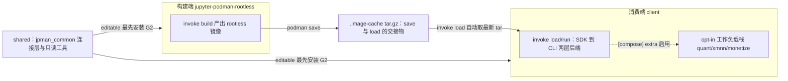

# 00 · 组全景：构建端 / 消费端 / 共享包

## 1. 三成员一览

| | jupyter-podman-rootless（构建端） | client（消费端） | shared（共享包） |
|---|---|---|---|
| 角色 | 生产 rootless Jupyter 镜像 | 加载镜像 + 管理容器生命周期 + opt-in 工作负载栈 | 两端共用的连接层与只读工具 |
| 发行名 | `jupyter-podman-rootless` | `jupyter-podman-client` | `jpman-common` 0.1.0 |
| import 名 | `jpman_builder` | `jpman_client` | `jpman_common` |
| 编排后端 | 三层：podman-compose → podman-py → CLI | 两层：podman-py → CLI（+ 三栈 podman-compose 子进程） | 无编排；`[sdk]` extra 提供 podman |
| Python | ≥ 3.14，镜像内为 3.14t（free-threading） | ≥ 3.14 | ≥ 3.14 |
| extras | sdk / compose / full / model | compose（三栈） | sdk |
| 人类文档 | [18 篇](../jupyter-podman-rootless/docs/README.md) | [13 篇](../client/docs/README.md) | 无（本组级文档代管） |
| AI 规则 | [7 个 rules](../jupyter-podman-rootless/.agents/README.md) | [6 个 rules + C1-C14](../client/AGENTS.md) | [shared-package.md](../.agents/rules/shared-package.md) |

三成员均为 scikit-build-core 纯 Python 包（src 布局），构建产物入各自 `build/` 目录。

## 2. 镜像流与依赖流

交接约定：

- 构建端镜像经 `podman save` 导出至 `jupyter-podman-rootless/.image-cache/`（git 忽略，pigz 压缩）；
  导出操作见构建端 [16-image-cache.md](../jupyter-podman-rootless/docs/16-image-cache.md)。
- 消费端 `invoke load` 自动从 `../jupyter-podman-rootless/.image-cache/` 取最新 tar 加载，
  含完整性校验；也支持 `invoke save/images` 做本地备份管理。
- shared 不产出镜像、不接触 daemon；它是两端 Python 进程内的库依赖（G1/G2）。

## 3. opt-in 工作负载栈速查（均在 client 内）

三栈平行于根运行路径、互不回流；均为 podman-compose 子进程层，**Windows 原生宿主门禁**
（需在 WSL2/Linux 内运行，client C11-C13），rootless 三必需经
[overlays/_shared/base-rootless.yaml](../client/overlays/_shared/base-rootless.yaml)
extends 统一继承。

| 命名空间 | 叠加层目录 | 用途 | SSH / Jupyter 端口 |
|----------|-----------|------|--------------------|
| `quant.*`（6 任务） | [overlays/onnx-quantized/](../client/overlays/onnx-quantized/README.md) | ONNX 量化工具链（dynamic int8 / fp16 / static QDQ 冒烟） | 2222 / 8888 |
| `xmnn.*`（8 任务） | [overlays/xmnn-dev/](../client/overlays/xmnn-dev/README.md) | XMNN 源码调试 + LLVM 22 + Nuitka 双 ABI 打 wheel | 2223 / 8890 |
| `monetize.*`（8 任务） | [overlays/agent-monetize-dev/](../client/overlays/agent-monetize-dev/README.md) | agent-monetize 源码 + apt clang/apache-tvm-ffi 原生编译 | 2224 / 8892 |

详细手册与裸 compose 用法见消费端 docs/10-12。

## 4. 我该用哪个入口？

| 你的意图 | 入口 |
|---------|------|
| 构建/重建镜像、改 Containerfile/entrypoint、管理 ML 模型（OMLMD/OLOT） | 构建端：`invoke build/run` 或零依赖 `bin/jpman`（[14-jpman-cli](../jupyter-podman-rootless/docs/14-jpman-cli.md)） |
| 已拿到镜像 tar，要快速启停/状态/清理 | 消费端：`invoke load/run/stop/status/clean` |
| 在其它 Python 代码里以 SDK 方式加载/运行镜像 | 消费端 SDK 用法：[05-sdk-usage](../client/docs/05-sdk-usage.md) |
| 在 Windows 11 原生 CPython 上连 Podman | 消费端：[03-windows-wsl](../client/docs/03-windows-wsl.md)（自动探测 WSL9P/Machine/tcp） |
| 跑量化 / XMNN 打包 / tvm-ffi 编译工作负载 | 消费端三栈（需 `[compose]` extra + WSL2/Linux） |
| 容器出故障要排查 | 消费端 [04-troubleshooting](../client/docs/04-troubleshooting-guide.md)（W-I1~W-I4 / C-I1~C-I5 速查）；构建端 [13-faq](../jupyter-podman-rootless/docs/13-faq.md) |

## 5. 全组共同契约（摘要）

- **rootless 三必需**：`--device /dev/fuse` + `--security-opt label=disable` + `--cgroupns=host`；
  **严禁 `--privileged`**。三处代码事实源与 G3 全文见 [../AGENTS.md](../AGENTS.md)。
- **连接层唯一事实源**：`import podman` 只允许出现在 `jpman_common.connection`；
  两端经垫片再导出（G1）。
