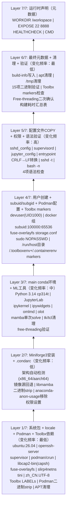

# jupyter-podman-rootless

> 基于 Podman rootless 模式的 Jupyter 开发容器：Python 3.14t (free-threading) + Miniforge3 + SSH + rootless Podman，通过 supervisord 管理多服务。三层后端编排（podman-compose 声明式 → podman-py SDK → CLI fallback），内置 OMLMD 模型 artifact 分发、OLOT KServe ModelCar 打包、Toolbx 透传兼容。

---

## 特性一览

| 特性 | 说明 |
|------|------|
| **基础镜像** | Ubuntu 26.04 |
| **Python** | 3.14 cp314t (free-threading，无GIL)，Miniforge3 + libmamba solver |
| **Jupyter** | JupyterLab ≥4.4 + Notebook ≥7.3，端口 8888 |
| **SSH** | OpenSSH Server，端口 22，支持密码/公钥认证 |
| **Podman** | Rootless 模式（fuse-overlayfs + crun），容器内可运行容器（DinP） |
| **服务管理** | supervisord 管理 sshd + jupyter，tini 作为 PID 1 |
| **非root用户** | devuser (UID 1000)，sudo 默认关闭（`--grant-sudo`/`GRANT_SUDO=yes` 开启） |
| **中文环境** | zh_CN.UTF-8 locale + Asia/Shanghai 时区 |
| **镜像源** | APT/Conda/PIP 均支持 official / tuna / aliyun |
| **构建优化** | 7层镜像分层（按变化频率），内置计时器 + 语法验证 |
| **运行时检测** | 自动检测 podman/docker，WSL2 路径自动转换 |
| **编排方式** | 三层后端自动降级：podman-compose 声明式（优先）→ podman-py SDK → CLI；也可直接使用 `podman-compose up -d` |
| **配置管理** | `.env` 环境变量文件 + `compose.yaml` 标准声明式配置，自动生成密码/token |
| **ML 模型分发** | OMLMD 集成：`model.push`/`model.pull`/`model.config` 实现 OCI artifact 版本化模型管理 |
| **ModelCar 打包** | OLOT 集成：`model.pack`/`model.extract` 遵循 KServe ModelCar 标准，模型作为 OCI 镜像层分发 |
| **模型仓库** | 内置 `model-registry` 服务（compose profile: `registry`），本地 OCI 仓库用于开发测试 |
| **Toolbx 兼容** | 镜像满足 Toolbx 规范（LABEL + /run/host + markers + capsh），可直接 `toolbox create/enter` |
| **开发透传** | `compose.dev.yaml` 覆盖文件：一键透传 SSH agent、git config、SSH keys、X11 GUI、pip cache（opt-in） |

---

## 快速开始

### 前置条件

- **Podman**（推荐）或 **Docker** 已安装
- **Python ≥3.10**（用于运行 invoke 任务）
- Linux 宿主机需要 FUSE 支持（`--device /dev/fuse`）
- **可选**：`podman-compose`（声明式编排，推荐安装）
- **可选**：`podman-py`（SDK 后端，比 CLI 更高效）
- **可选**：`omlmd` + `olot[oras-py]`（ML 模型 OCI artifact 管理，容器内预装）

### 安装 invoke

```bash
# 基础安装（CLI fallback模式）
pip install -e .

# 安装 podman-compose 支持（推荐，声明式编排）
pip install -e ".[compose]"

# 安装完整功能（podman-py SDK + podman-compose）
pip install -e ".[full]"
```

> ML 模型工具（omlmd/olot）预装在容器镜像内，宿主机无需安装。如需在宿主机直接使用：
> ```bash
> pip install -e ".[model]"
> ```

### 三种使用方式

#### 方式一：invoke 封装（推荐，自动密码生成 + 路径转换 + 三层后端）

```bash
# 1. 构建镜像（使用清华镜像源加速）
invoke build --apt-mirror tuna --conda-mirror tuna --pip-mirror tuna

# 2. 启动容器（自动生成密码和token，自动创建.env）
invoke run

# 3. 查看访问信息（启动时会打印）
# SSH:  ssh -p 2222 devuser@localhost
# Jupyter Lab: http://localhost:8888/lab?token=<自动生成的token>
```

#### 方式二：直接使用 podman-compose（标准 Compose Spec）

```bash
# 1. 复制环境变量模板
cp .env.example .env
# 编辑 .env 设置密码、端口、镜像源等

# 2. 构建并启动（后台运行）
podman-compose up -d --build

# 3. 查看状态
podman-compose ps

# 4. 查看日志
podman-compose logs -f

# 5. 进入容器
podman-compose exec jupyter bash

# 6. 停止并删除
podman-compose down
```

#### 方式三：开发透传模式（Toolbx-style "透传优于隔离"）

```bash
# 启动时叠加 compose.dev.yaml，启用SSH agent + git config + X11 GUI + pip cache透传
podman-compose -f compose.yaml -f compose.dev.yaml up -d

# 同时启动本地模型仓库（用于OMLMD开发测试）
podman-compose -f compose.yaml -f compose.dev.yaml --profile registry up -d

# 容器内可直接使用主机SSH密钥push/pull代码
podman-compose exec jupyter git clone git@github.com:your/repo.git

# 容器内可运行GUI应用（需主机有X11/Wayland）
podman-compose exec jupyter xclock
```

### 进入容器

```bash
# SSH方式
ssh -p 2222 devuser@localhost

# 或直接进入shell
invoke shell

# 在容器中执行命令
invoke exec --command "python --version"
```

### 作为 Toolbx 容器使用

镜像满足 Toolbx 兼容规范，可直接被 `toolbox` 命令使用：

```bash
# 使用已构建的镜像创建Toolbx容器
toolbox create -i jupyter-podman-rootless:latest -c jupyter-dev

# 进入Toolbx容器（自动透传HOME/cwd/Wayland/X11/SSH agent等）
toolbox enter jupyter-dev
```

---

## Invoke 任务参考

所有任务通过 `invoke <命令>` 执行，支持 `--help` 查看参数。

### 核心命令

| 命令 | 说明 | 示例 |
|------|------|------|
| `invoke build` | 构建镜像 | `invoke build --apt-mirror aliyun --no-cache` |
| `invoke run` | 启动容器 | `invoke run --grant-sudo --ssh-port 2222` |
| `invoke stop` | 停止并删除容器 | `invoke stop` |
| `invoke status` | 查看容器状态 | `invoke status` |
| `invoke shell` | 进入容器Shell | `invoke shell --user root` |
| `invoke logs` | 查看容器日志 | `invoke logs --follow --tail 50` |
| `invoke exec` | 在容器中执行命令 | `invoke exec --command "pip list"` |
| `invoke clean` | 清理资源 | `invoke clean --image` |

> **子命令集合**：所有核心命令也可通过 `invoke container.<命令>` 访问（如 `invoke container.build`、`invoke container.run`），用于命名空间隔离。

### ML 模型命令

| 命令 | 说明 | 示例 |
|------|------|------|
| `invoke model.push` | 推送模型到 OCI registry（OMLMD） | `invoke model.push ./my-model --ref localhost:5000/models/llm:v1` |
| `invoke model.pull` | 从 OCI registry 拉取模型（OMLMD） | `invoke model.pull --ref localhost:5000/models/llm:v1 --output ./models` |
| `invoke model.config` | 查询 OCI 模型元数据配置 | `invoke model.config --ref localhost:5000/models/llm:v1` |
| `invoke model.pack` | 打包模型为 KServe ModelCar 镜像（OLOT） | `invoke model.pack ./my-model --base jupyter-podman-rootless:latest --ref localhost:5000/models/car:v1` |
| `invoke model.extract` | 从 ModelCar 镜像提取模型目录 | `invoke model.extract --ref localhost:5000/models/car:v1 --output ./models` |

> ML 模型命令需要容器内预装 omlmd/olot（默认已包含），或宿主机安装 `pip install omlmd 'olot[oras-py]'`。
> 使用本地模型仓库时先启动：`podman-compose --profile registry up -d`。

### build 参数

| 参数 | 默认值 | 说明 |
|------|--------|------|
| `--tag` | `jupyter-podman-rootless:latest` | 镜像标签 |
| `--apt-mirror` | `official` | APT 镜像源：`official` / `tuna` / `aliyun` |
| `--conda-mirror` | `official` | Conda 镜像源：`official` / `tuna` / `aliyun` |
| `--pip-mirror` | `official` | PIP 镜像源：`official` / `tuna` / `aliyun` |
| `--no-cache` | `false` | 不使用构建缓存 |

### run 参数

| 参数 | 默认值 | 说明 |
|------|--------|------|
| `--name` | `jupyter-podman` | 容器名 |
| `--tag` | `jupyter-podman-rootless:latest` | 使用的镜像 |
| `--ssh-port` | `2222` | SSH 映射端口 |
| `--jupyter-port` | `8888` | Jupyter 映射端口 |
| `--workspace` | `./workspace` | 工作目录挂载路径 |
| `--user-password` | 自动生成16位 | devuser 密码 |
| `--jupyter-token` | 自动生成32位 | Jupyter 访问 token |
| `--ssh-public-key` | 无 | SSH 公钥内容（注入 authorized_keys） |
| `--grant-sudo` | `false` | 授予 devuser 无密码 sudo |
| `--detach/--no-detach` | `detach` | 后台/前台运行 |

### interact 参数

| 命令 | 参数 | 说明 |
|------|------|------|
| `invoke shell` | `--name`, `--user`（默认 devuser） | 进入交互式 Shell |
| `invoke logs` | `--name`, `--follow`, `--tail`（默认100） | 查看日志 |
| `invoke exec` | `--command`（必填）, `--name`, `--user` | 执行命令 |

### model 参数

| 命令 | 关键参数 | 说明 |
|------|---------|------|
| `model.push` | `--ref`（必填）, `--path`（模型目录）, `--name`, `--user` | 推送模型到 OCI registry |
| `model.pull` | `--ref`（必填）, `--output`（输出目录）, `--name`, `--user` | 从 OCI registry 拉取模型 |
| `model.config` | `--ref`（必填）, `--name`, `--user` | 查询模型元数据 |
| `model.pack` | `--ref`（必填）, `--path`（模型目录）, `--base`（基础镜像）, `--name`, `--user` | 打包为 ModelCar 镜像并推送 |
| `model.extract` | `--ref`（必填）, `--output`（输出目录）, `--name`, `--user` | 从 ModelCar 镜像提取模型 |

### clean 参数

| 参数 | 默认值 | 说明 |
|------|--------|------|
| `--name` | `jupyter-podman` | 容器名 |
| `--tag` | `jupyter-podman-rootless:latest` | 镜像标签 |
| `--volume` | `false` | 清理未使用的卷 |
| `--image` | `false` | 删除镜像 |

---

## 环境变量参考

### 运行时环境变量（`podman run -e` / `.env` 文件）

| 变量 | 默认值 | 说明 |
|------|--------|------|
| `USER_PASSWORD` | 随机生成16位 | devuser 用户密码 |
| `JUPYTER_TOKEN` | 随机生成32位 | Jupyter 访问 token |
| `JUPYTER_PASSWORD` | 无 | Jupyter 密码（与 token 二选一） |
| `SSH_PUBLIC_KEY` | 无 | SSH 公钥（追加到 authorized_keys） |
| `GRANT_SUDO` | `no` | 是否授予 devuser 无密码 sudo（`yes`/`no`） |
| `ALLOW_ROOT_SSH` | `no` | 是否允许 root SSH 登录（`yes`/`no`） |
| `ROOT_PASSWORD` | 随机生成 | root 密码（仅 ALLOW_ROOT_SSH=yes 时生效） |
| `APT_MIRROR` | `official` | 运行时 APT 源（容器内 apt 使用） |
| `DEBUG` | `0` | 设为 `1` 启用 entrypoint 调试输出（set -x） |
| `REGISTRY_URL` | `localhost:5000` | ML 模型 OCI registry 地址 |
| `REGISTRY_PORT` | `5000` | 本地 model-registry 服务端口 |
| `REGISTRY_PLAIN_HTTP` | `true` | 本地 registry 使用 HTTP（非 HTTPS） |

### 构建时环境变量（`--build-arg`）

| 变量 | 默认值 | 说明 |
|------|--------|------|
| `APT_MIRROR` | `official` | APT 镜像源：`official` / `tuna` / `aliyun` |
| `CONDA_MIRROR` | `official` | Conda 镜像源：`official` / `tuna` / `aliyun` |
| `PIP_MIRROR` | `official` | PIP 镜像源：`official` / `tuna` / `aliyun` |
| `PYTHON_VERSION` | `3.14` | Python 版本 |
| `PYTHON_BUILD` | `cp314t` | Python 构建类型（cp314t = free-threading） |

---

## 镜像架构

### 7层构建设计（Containerfile）



### 7步启动流程（entrypoint.sh）

```
print_banner()
  │
  ├─ [1/7] setup_passwords()     → 配置用户密码（支持环境变量/随机生成）
  ├─ [2/7] generate_host_keys()  → 生成 SSH host keys（ed25519 + rsa）
  ├─ [3/7] configure_sshd()      → 配置 sshd（PermitRootLogin 控制）
  ├─ [4/7] setup_podman()        → 初始化 rootless Podman 环境
  │    ├─ /dev/fuse 权限
  │    ├─ ~/.config/containers/ 配置
  │    ├─ XDG_RUNTIME_DIR 设置
  │    └─ podman info 触发初始化
  ├─ [5/7] setup_ssh_keys()      → 注入 SSH 公钥（SSH_PUBLIC_KEY）
  ├─ [6/7] setup_jupyter()       → 生成 Jupyter 运行时配置
  │    ├─ 密码 hash（JUPYTER_PASSWORD）或 token
  │    ├─ 端口/根目录/CORS 配置
  │    └─ 运行时配置写入 jupyter_server_config.d/
  ├─ [7/7] print_access_info()   → 打印访问信息（SSH/Jupyter/Podman/ML工具）
  │
  └─ exec supervisord -n         → 启动 supervisord（sshd + jupyter）
```

### 服务管理（supervisord）

| 服务 | 用户 | 优先级 | 说明 |
|------|------|--------|------|
| sshd | root | 100 | SSH 守护进程，端口 22 |
| jupyter | root | 200 | Jupyter Lab，端口 8888，工作目录 /workspace |

- `tini` 作为 PID 1 处理信号转发和僵尸进程回收
- `supervisord` nodaemon 模式运行，日志输出到 stdout/stderr
- 服务异常自动重启（autorestart=true，startretries=3）

### Compose 服务架构

| 服务 | Profile | 说明 |
|------|---------|------|
| `jupyter` | 默认 | JupyterLab + SSHd + Podman 主服务 |
| `model-registry` | `registry` | 本地 OCI registry（zot 镜像），端口 5000，用于 OMLMD/OLOT 开发测试 |

---

## Rootless Podman 说明

容器内预装 rootless Podman 环境，devuser 可在容器内运行容器（Docker-in-Podman 模式）：

```bash
# 进入容器后验证
podman info
podman run --rm docker.io/library/hello-world
```

关键配置：
- **存储驱动**：fuse-overlayfs（需要宿主机传 `--device /dev/fuse`）
- **运行时**：crun
- **Cgroup 管理器**：cgroupfs
- **subuid/subgid**：`devuser:100000:65536`
- **安全选项**：`--security-opt label=disable`（禁用 SELinux 标签，避免 FUSE 权限问题）
- **Cgroup 命名空间**：`--cgroupns=host`

---

## ML 模型管理（OMLMD + OLOT）

容器内集成了两套 ML 模型 OCI 分发工具，实现模型版本化管理和标准化部署。

### OMLMD — ML 模型 OCI Artifact 分发

OMLMD（OCIFactory AI Model Management）将 ML 模型作为 OCI artifact 存储和分发，支持模型元数据配置和版本管理：

```bash
# 启动本地模型仓库（开发测试用）
podman-compose --profile registry up -d

# 推送模型到本地仓库
invoke model.push ./my-model --ref localhost:5000/models/bert:v1

# 从仓库拉取模型
invoke model.pull --ref localhost:5000/models/bert:v1 --output ./models

# 查询模型元数据
invoke model.config --ref localhost:5000/models/bert:v1
```

模型以自定义媒体类型 `application/mlmodel` 存储在 OCI registry 中，支持版本标签、配置元数据和跨 registry 复制。

### OLOT — KServe ModelCar 标准镜像打包

OLOT（OCI Layers On Top）遵循 KServe ModelCar 标准，将模型文件作为 OCI 镜像层附加到基础镜像（通常是推理服务器镜像）上，实现"模型即镜像"的部署模式：

```bash
# 打包模型为 ModelCar 镜像并推送
invoke model.pack ./my-model \
  --base jupyter-podman-rootless:latest \
  --ref localhost:5000/models/car:v1

# 从 ModelCar 镜像提取模型目录
invoke model.extract \
  --ref localhost:5000/models/car:v1 \
  --output ./extracted-models
```

ModelCar 镜像标准让 KServe/Serving Runtime 可以直接拉取并挂载模型，无需额外的模型下载步骤。

### 三层后端架构

ML 命令同样遵循三层后端优先级：
1. **podman-compose 后端**（优先，当 `podman-compose` 可用时）：通过 compose 服务编排模型操作
2. **podman-py SDK 后端**（其次）：直接通过 Podman Unix socket API 操作容器
3. **CLI fallback**（保底）：通过 subprocess 调用 `podman`/`docker` 命令

所有后端对用户透明，`invoke model.*` 命令自动选择最优后端。

---

## Toolbx 透传开发模式

本容器镜像满足 [Toolbx](https://containertoolbx.org/) 自定义镜像规范，吸收 Toolbx "透传优于隔离"（pass-through over isolation）的设计哲学，提供灵活的开发体验。

### 镜像兼容标记

镜像内置以下 Toolbx 兼容特性，使其可直接被 `toolbox create/enter` 命令识别和使用：

| 兼容项 | 实现 |
|--------|------|
| LABEL 标记 | `com.github.containers.toolbox=true` |
| /run/host 挂载点 | 预创建目录，用于 bind-mount 主机根文件系统 |
| Marker 文件 | `/run/.toolboxenv` + `/run/.containerenv` |
| capsh 工具 | libcap2-bin 包提供能力边界工具 |
| sudo NOPASSWD | devuser 无密码 sudo（`GRANT_SUDO=yes` 时启用） |
| UID 匹配 | devuser 固定 UID 1000（与 Linux 主机默认用户 UID 一致） |

### 透传配置（compose.dev.yaml）

`compose.dev.yaml` 提供开箱即用的开发透传配置，覆盖以下主机资源：

| 透传资源 | 挂载方式 | 用途 |
|---------|---------|------|
| SSH agent socket | `$SSH_AUTH_SOCK` → `/tmp/ssh-auth.sock:ro` | 复用主机 SSH agent，容器内 git push/pull 不输密码 |
| Git 配置 | `~/.gitconfig` → `/home/devuser/.gitconfig:ro` | 复用主机 git 用户配置 |
| SSH 密钥 | `~/.ssh` → `/home/devuser/.ssh:ro` | 只读挂载 SSH 密钥 |
| X11 套接字 | `/tmp/.X11-unix:rw` | GUI 应用显示（matplotlib 交互式窗口、firefox 等） |
| Pip 缓存 | `~/.cache/pip` | 加速容器内 pip install |
| 文件描述符 | `ulimits nofile 65536` | 大型 ML 工作负载 |
| DISPLAY 环境变量 | `${DISPLAY:-:0}` | X11 显示 |
| XDG_RUNTIME_DIR | `/tmp/runtime-user` | Wayland/系统运行时 |

### 可选透传（注释式 opt-in）

`compose.yaml` 中还以注释形式提供了更多可选透传配置，取消注释即可启用：

- **Wayland 套接字**：`$XDG_RUNTIME_DIR/$WAYLAND_DISPLAY`
- **/run/host 逃生口**：`/:/run/host:rslave`（挂载主机完整根文件系统）
- **Host 网络模式**：`network_mode: host`（共享主机网络栈，免端口映射）
- **GPU 透传**：`/dev/dri`（Intel/AMD Mesa GPU）、NVIDIA CDI 设备
- **USB 透传**：`/dev/bus/usb`
- **D-Bus 会话总线**：系统集成

### 安全设计

- **默认隔离**：所有透传均为 opt-in，默认 `compose.yaml` 配置保持完全隔离
- **只读挂载**：SSH keys、gitconfig 默认以只读方式挂载
- **无 secret 泄漏**：不挂载主机 credential store、GPG 密钥等高敏感资源
- **/run/host 默认关闭**：主机文件系统逃生口需显式启用

---

## 目录结构

```
jupyter-podman-rootless/
├── Containerfile              # 7层镜像构建定义（含Toolbx兼容标记）
├── entrypoint.sh              # 7步启动脚本
├── compose.yaml               # podman-compose 声明式编排（jupyter + model-registry服务）
├── compose.dev.yaml           # 开发透传覆盖文件（SSH/git/X11/pip cache）
├── .env.example               # 环境变量模板（含REGISTRY/DEV透传配置说明）
├── pyproject.toml             # Python 项目配置（invoke 依赖，含[compose]/[full]/[model] extras）
├── .containerignore           # 构建忽略规则
├── .gitignore                 # Git忽略规则
├── README.md                  # 本文档
├── AGENTS.md                  # AI 协作者入口（SpecWeave 路由）
│
├── tasks/                     # invoke 任务定义
│   ├── __init__.py            # 任务入口与命名空间配置（核心命令+model.*命令）
│   ├── utils.py               # 工具函数（运行时检测/路径转换/随机字符串）
│   ├── client.py              # Podman/Docker client wrapper（三层后端优先级检测）
│   ├── compose_backend.py     # podman-compose 后端封装
│   ├── build.py               # 镜像构建任务
│   ├── manage.py              # 容器生命周期管理（run/stop/status/clean）
│   ├── interact.py            # 容器交互（shell/logs/exec）
│   ├── model.py               # ML模型管理任务（push/pull/config/pack/extract）
│   └── container.py           # 向后兼容聚合模块（re-export所有子模块任务）
│
├── config/                    # 配置文件
│   ├── supervisord.conf       # supervisord 主配置
│   ├── sshd_config            # SSH 服务配置
│   ├── jupyter_notebook_config.py  # Jupyter 基础配置
│   ├── containers/
│   │   └── storage.conf       # Podman 系统级存储配置（fuse-overlayfs）
│   └── supervisor/
│       └── conf.d/
│           ├── sshd.conf      # supervisord sshd 服务配置
│           └── jupyter.conf   # supervisord jupyter 服务配置
│
├── scripts/                   # 辅助脚本
│   ├── healthcheck.sh         # 健康检查脚本（sshd + jupyter + podman）
│   ├── olot_car.py            # 容器内OLOT ModelCar辅助脚本
│   └── lib/
│       └── logging.sh         # 彩色日志库
│
├── conda-lock/
│   └── environment.yml        # Conda 环境定义（Python 3.14t + Jupyter + omlmd + olot）
│
└── workspace/                 # 工作目录挂载点（容器内 /workspace）
    └── .gitkeep
```

---

## 三层后端编排架构

```
┌─────────────────────────────────────────────────────────┐
│                    invoke 任务层                         │
│  build / run / stop / shell / exec / model.push/...     │
└─────────────────────┬───────────────────────────────────┘
                      │ 自动检测可用后端
                      ▼
┌─────────────────────────────────────────────────────────┐
│  Tier 1: podman-compose 后端（优先）                     │
│  通过声明式 YAML 管理服务生命周期                         │
│  支持 compose.yaml 多文件覆盖、profiles、环境变量         │
└─────────────────────┬───────────────────────────────────┘
                      │ 降级（podman-compose 未安装）
                      ▼
┌─────────────────────────────────────────────────────────┐
│  Tier 2: podman-py SDK 后端                              │
│  通过 Podman Unix socket 直接调用 API                    │
│  比 CLI 更高效，支持流式输出、事件监听                    │
└─────────────────────┬───────────────────────────────────┘
                      │ 降级（podman-py 未安装）
                      ▼
┌─────────────────────────────────────────────────────────┐
│  Tier 3: CLI fallback（保底）                            │
│  通过 subprocess 调用 podman/docker 命令                 │
│  零依赖，任何有 podman/docker 的环境都能工作              │
└─────────────────────────────────────────────────────────┘
```

后端选择对用户完全透明——同一 `invoke` 命令根据宿主机环境自动选择最优后端。

---

## 直接使用 Podman/Docker 命令（不通过 invoke）

如果不想用 invoke，也可以直接使用容器运行时命令：

### 构建镜像

```bash
# Podman
podman build -t jupyter-podman-rootless \
  --build-arg APT_MIRROR=tuna \
  --build-arg CONDA_MIRROR=tuna \
  --build-arg PIP_MIRROR=tuna \
  .

# Docker（兼容）
docker build -t jupyter-podman-rootless \
  --build-arg APT_MIRROR=tuna \
  --build-arg CONDA_MIRROR=tuna \
  --build-arg PIP_MIRROR=tuna \
  .
```

### 运行容器

```bash
podman run -d \
  --name jupyter-podman \
  --device /dev/fuse \
  --security-opt label=disable \
  --cgroupns=host \
  -p 2222:22 \
  -p 8888:8888 \
  -v ./workspace:/workspace \
  -e USER_PASSWORD=yourpassword \
  -e JUPYTER_TOKEN=yourtoken \
  jupyter-podman-rootless
```

### 调试模式

```bash
# 直接进入 bash，不启动服务
podman run -it --rm \
  --device /dev/fuse \
  --security-opt label=disable \
  jupyter-podman-rootless bash
```

---

## Python Free-Threading 说明

本容器使用 Python 3.14 的 **free-threading** 构建（cp314t），GIL（全局解释器锁）在运行时被禁用：

```python
import sys, sysconfig
assert sysconfig.get_config_var('Py_GIL_DISABLED') == 1  # free-threading 构建
assert not sys._is_gil_enabled()  # GIL 在运行时禁用
```

**注意事项**：
- 部分 C 扩展可能不兼容 free-threading，如遇问题可切换到标准构建
- free-threading 模式在 CPU 密集型多线程场景下性能提升显著
- Jupyter 核心和主流数据科学库已逐步支持 free-threading
- omlmd/olot 官方支持 Python ≤3.12，已通过 `--ignore-requires-python` fallback 兼容 cp314t

如需切换到标准 Python 构建，直接使用 podman/docker build 命令：
```bash
podman build -t jupyter-podman-rootless:cp314 \
  --build-arg PYTHON_BUILD=cp314 \
  --build-arg APT_MIRROR=tuna \
  --build-arg CONDA_MIRROR=tuna \
  --build-arg PIP_MIRROR=tuna \
  .
```
（需要同时修改 Containerfile 中的 conda 包匹配规则）

---

## 健康检查

容器内置 HEALTHCHECK，每 30 秒检查一次：

1. **sshd 进程检查**：pgrep sshd
2. **sshd 端口检查**：TCP 连接到 127.0.0.1:22
3. **Jupyter 进程检查**：pgrep -f jupyter
4. **Jupyter HTTP 检查**：请求 http://127.0.0.1:8888/api，期望 200/302/401/403
5. **Podman 可用性检查**：podman --version（非致命）

```bash
# 手动执行健康检查
podman exec jupyter-podman /usr/local/bin/healthcheck.sh

# 查看健康状态
podman healthcheck run jupyter-podman
```

---

## 常见问题

### Q: 构建时下载 Miniforge 很慢？

使用国内镜像源构建：
```bash
invoke build --conda-mirror tuna --apt-mirror tuna --pip-mirror tuna
```

### Q: Podman 报错 "fuse: device not found"？

运行容器时必须添加 `--device /dev/fuse` 参数。invoke 的 `run` 命令已自动添加。

### Q: WSL2 下挂载路径不对？

invoke 的 `utils.to_posix_path()` 会自动将 Windows 路径（如 `D:\project`）转换为 WSL2 路径（`/mnt/d/project`）。直接使用 podman 命令时需手动转换。

### Q: 如何在容器中使用 sudo？

启动时添加 `--grant-sudo` 参数：
```bash
invoke run --grant-sudo
```

### Q: 如何设置 SSH 公钥登录？

```bash
invoke run --ssh-public-key "$(cat ~/.ssh/id_ed25519.pub)"
```

### Q: 容器内的 Podman 无法拉取镜像？

确保宿主机已配置 `--device /dev/fuse` 和 `--security-opt label=disable`。某些环境可能需要 `--cgroupns=host`。

### Q: 如何使用开发透传模式（SSH agent/GUI）？

使用 `compose.dev.yaml` 覆盖文件：
```bash
podman-compose -f compose.yaml -f compose.dev.yaml up -d
```
详见 [Toolbx 透传开发模式](#toolbx-透传开发模式) 章节。

### Q: 如何启动本地模型仓库？

```bash
podman-compose --profile registry up -d
```
然后使用 `localhost:5000` 作为 OMLMD/OLOT 的 registry 地址。

### Q: model.push/pack 报错 omlmd/olot 未安装？

omlmd 和 olot 已预装在容器镜像内。如果通过 invoke 调用宿主机 Python 直接执行，需要安装：
```bash
pip install omlmd 'olot[oras-py]'
```

### Q: compose.dev.yaml 中的透传安全吗？

所有透传均为 opt-in（默认不启用）。SSH keys 和 gitconfig 以只读方式挂载，/run/host 逃生口默认关闭。详见安全设计说明。

---
