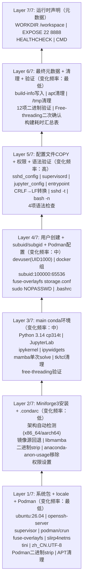

# jupyter-podman-rootless

> 基于 Podman rootless 模式的 Jupyter 开发容器：Python 3.14t (free-threading) + Miniforge3 + SSH + rootless Podman，通过 supervisord 管理多服务。支持三层后端编排：podman-compose 声明式编排（优先）→ podman-py SDK → CLI 直接调用。

---

## 特性一览

| 特性 | 说明 |
|------|------|
| **基础镜像** | Ubuntu 26.04 |
| **Python** | 3.14 cp314t (free-threading，无GIL)，Miniforge3 + libmamba solver |
| **Jupyter** | JupyterLab ≥4.4 + Notebook ≥7.3，端口 8888 |
| **SSH** | OpenSSH Server，端口 22，支持密码/公钥认证 |
| **Podman** | Rootless 模式（fuse-overlayfs + crun），容器内可运行容器 |
| **服务管理** | supervisord 管理 sshd + jupyter，tini 作为 PID 1 |
| **非root用户** | devuser (UID 1000)，默认无 sudo（可通过环境变量开启） |
| **中文环境** | zh_CN.UTF-8 locale + Asia/Shanghai 时区 |
| **镜像源** | APT/Conda/PIP 均支持 official / tuna / aliyun |
| **构建优化** | 7层镜像分层（按变化频率），内置计时器 + 语法验证 |
| **运行时检测** | 自动检测 podman/docker，WSL2 路径自动转换 |
| **编排方式** | 三层后端：podman-compose 声明式（优先）→ podman-py SDK → CLI；也可直接使用 `podman-compose up -d` |
| **配置管理** | `.env` 环境变量文件 + `compose.yaml` 标准声明式配置，自动生成密码/token |

---

## 快速开始

### 前置条件

- **Podman**（推荐）或 **Docker** 已安装
- **Python ≥3.10**（用于运行 invoke 任务）
- Linux 宿主机需要 FUSE 支持（`--device /dev/fuse`）
- **可选**：`podman-compose`（声明式编排，推荐安装）

### 安装 invoke

```bash
# 基础安装（CLI fallback模式）
pip install -e .

# 安装 podman-compose 支持（推荐，声明式编排）
pip install -e ".[compose]"

# 安装完整功能（podman-py SDK + podman-compose）
pip install -e ".[full]"
```

### 两种使用方式

#### 方式一：invoke 封装（推荐，自动密码生成 + 路径转换）

```bash
# 1. 构建镜像（使用清华镜像源加速）
invoke build --apt-mirror tuna --conda-mirror tuna --pip-mirror tuna

# 2. 启动容器（自动生成密码和token，自动创建.env）
invoke run

# 3. 查看访问信息（启动时会打印）
# SSH:  ssh -p 2222 devuser@localhost
# Jupyter Lab: http://localhost:8888/lab?token=<自动生成的token>
```

#### 方式二：直接使用 podman-compose（标准Compose Spec）

```bash
# 1. 复制环境变量模板
cp .env.example .env
# 编辑 .env 设置密码、端口、镜像源等

# 2. 构建并启动（后台运行）
podman-compose up -d --build

# 3. 查看状态
podman-compose ps

# 4. 查看日志
podman-compose logs -f

# 5. 进入容器
podman-compose exec jupyter bash

# 6. 停止并删除
podman-compose down
```

### 进入容器

```bash
# SSH方式
ssh -p 2222 devuser@localhost

# 或直接进入shell
invoke shell

# 在容器中执行命令
invoke exec --command "python --version"
```

---

## Invoke 任务参考

所有任务通过 `invoke <命令>` 执行，支持 `--help` 查看参数。

### 核心命令

| 命令 | 说明 | 示例 |
|------|------|------|
| `invoke build` | 构建镜像 | `invoke build --apt-mirror aliyun --no-cache` |
| `invoke run` | 启动容器 | `invoke run --grant-sudo --ssh-port 2222` |
| `invoke stop` | 停止并删除容器 | `invoke stop` |
| `invoke status` | 查看容器状态 | `invoke status` |
| `invoke shell` | 进入容器Shell | `invoke shell --user root` |
| `invoke logs` | 查看容器日志 | `invoke logs --follow --tail 50` |
| `invoke exec` | 在容器中执行命令 | `invoke exec --command "pip list"` |
| `invoke clean` | 清理资源 | `invoke clean --image` |

> **子命令集合**：所有核心命令也可通过 `invoke container.<命令>` 访问（如 `invoke container.build`、`invoke container.run`），用于命名空间隔离。

### build 参数

| 参数 | 默认值 | 说明 |
|------|--------|------|
| `--tag` | `jupyter-podman-rootless:latest` | 镜像标签 |
| `--apt-mirror` | `official` | APT 镜像源：`official` / `tuna` / `aliyun` |
| `--conda-mirror` | `official` | Conda 镜像源：`official` / `tuna` / `aliyun` |
| `--pip-mirror` | `official` | PIP 镜像源：`official` / `tuna` / `aliyun` |
| `--no-cache` | `false` | 不使用构建缓存 |

### run 参数

| 参数 | 默认值 | 说明 |
|------|--------|------|
| `--name` | `jupyter-podman` | 容器名 |
| `--tag` | `jupyter-podman-rootless:latest` | 使用的镜像 |
| `--ssh-port` | `2222` | SSH 映射端口 |
| `--jupyter-port` | `8888` | Jupyter 映射端口 |
| `--workspace` | `./workspace` | 工作目录挂载路径 |
| `--user-password` | 自动生成16位 | devuser 密码 |
| `--jupyter-token` | 自动生成32位 | Jupyter 访问 token |
| `--ssh-public-key` | 无 | SSH 公钥内容（注入 authorized_keys） |
| `--grant-sudo` | `false` | 授予 devuser 无密码 sudo |
| `--detach/--no-detach` | `detach` | 后台/前台运行 |

### interact 参数

| 命令 | 参数 | 说明 |
|------|------|------|
| `invoke shell` | `--name`, `--user`（默认 devuser） | 进入交互式 Shell |
| `invoke logs` | `--name`, `--follow`, `--tail`（默认100） | 查看日志 |
| `invoke exec` | `--command`（必填）, `--name`, `--user` | 执行命令 |

### clean 参数

| 参数 | 默认值 | 说明 |
|------|--------|------|
| `--name` | `jupyter-podman` | 容器名 |
| `--tag` | `jupyter-podman-rootless:latest` | 镜像标签 |
| `--volume` | `false` | 清理未使用的卷 |
| `--image` | `false` | 删除镜像 |

---

## 环境变量参考

### 运行时环境变量（`podman run -e`）

| 变量 | 默认值 | 说明 |
|------|--------|------|
| `USER_PASSWORD` | 随机生成16位 | devuser 用户密码 |
| `JUPYTER_TOKEN` | 随机生成32位 | Jupyter 访问 token |
| `JUPYTER_PASSWORD` | 无 | Jupyter 密码（与 token 二选一） |
| `SSH_PUBLIC_KEY` | 无 | SSH 公钥（追加到 authorized_keys） |
| `GRANT_SUDO` | `no` | 是否授予 devuser 无密码 sudo（`yes`/`no`） |
| `ALLOW_ROOT_SSH` | `no` | 是否允许 root SSH 登录（`yes`/`no`） |
| `ROOT_PASSWORD` | 随机生成 | root 密码（仅 ALLOW_ROOT_SSH=yes 时生效） |
| `APT_MIRROR` | `official` | 运行时 APT 源（容器内 apt 使用） |
| `DEBUG` | `0` | 设为 `1` 启用 entrypoint 调试输出（set -x） |

### 构建时环境变量（`--build-arg`）

| 变量 | 默认值 | 说明 |
|------|--------|------|
| `APT_MIRROR` | `official` | APT 镜像源：`official` / `tuna` / `aliyun` |
| `CONDA_MIRROR` | `official` | Conda 镜像源：`official` / `tuna` / `aliyun` |
| `PIP_MIRROR` | `official` | PIP 镜像源：`official` / `tuna` / `aliyun` |
| `PYTHON_VERSION` | `3.14` | Python 版本 |
| `PYTHON_BUILD` | `cp314t` | Python 构建类型（cp314t = free-threading） |

---

## 镜像架构

### 7层构建设计（Containerfile）



### 7步启动流程（entrypoint.sh）

```
print_banner()
  │
  ├─ [1/7] setup_passwords()     → 配置用户密码（支持环境变量/随机生成）
  ├─ [2/7] generate_host_keys()  → 生成 SSH host keys（ed25519 + rsa）
  ├─ [3/7] configure_sshd()      → 配置 sshd（PermitRootLogin 控制）
  ├─ [4/7] setup_podman()        → 初始化 rootless Podman 环境
  │    ├─ /dev/fuse 权限
  │    ├─ ~/.config/containers/ 配置
  │    ├─ XDG_RUNTIME_DIR 设置
  │    └─ podman info 触发初始化
  ├─ [5/7] setup_ssh_keys()      → 注入 SSH 公钥（SSH_PUBLIC_KEY）
  ├─ [6/7] setup_jupyter()       → 生成 Jupyter 运行时配置
  │    ├─ 密码 hash（JUPYTER_PASSWORD）或 token
  │    ├─ 端口/根目录/CORS 配置
  │    └─ 运行时配置写入 jupyter_server_config.d/
  ├─ [7/7] print_access_info()   → 打印访问信息（SSH/Jupyter/Podman）
  │
  └─ exec supervisord -n         → 启动 supervisord（sshd + jupyter）
```

### 服务管理（supervisord）

| 服务 | 用户 | 优先级 | 说明 |
|------|------|--------|------|
| sshd | root | 100 | SSH 守护进程，端口 22 |
| jupyter | root | 200 | Jupyter Lab，端口 8888，工作目录 /workspace |

- `tini` 作为 PID 1 处理信号转发和僵尸进程回收
- `supervisord` nodaemon 模式运行，日志输出到 stdout/stderr
- 服务异常自动重启（autorestart=true，startretries=3）

---

## Rootless Podman 说明

容器内预装 rootless Podman 环境，devuser 可在容器内运行容器（Docker-in-Podman 模式）：

```bash
# 进入容器后验证
podman info
podman run --rm docker.io/library/hello-world
```

关键配置：
- **存储驱动**：fuse-overlayfs（需要宿主机传 `--device /dev/fuse`）
- **运行时**：crun
- **Cgroup 管理器**：cgroupfs
- **subuid/subgid**：`devuser:100000:65536`
- **安全选项**：`--security-opt label=disable`（禁用 SELinux 标签，避免 FUSE 权限问题）
- **Cgroup 命名空间**：`--cgroupns=host`

---

## 目录结构

```
jupyter-podman-rootless/
├── Containerfile              # 7层镜像构建定义
├── entrypoint.sh              # 7步启动脚本
├── pyproject.toml             # Python 项目配置（invoke 依赖）
├── .containerignore           # 构建忽略规则
├── README.md                  # 本文档
├── AGENTS.md                  # AI 协作者入口（SpecWeave 路由）
│
├── tasks/                     # invoke 任务定义
│   ├── __init__.py            # 任务入口与命名空间配置（核心命令提升到根+container子集合）
│   ├── utils.py               # 工具函数（运行时检测/路径转换/随机字符串）
│   ├── build.py               # 镜像构建任务
│   ├── manage.py              # 容器生命周期管理（run/stop/status/clean）
│   ├── container.py           # 向后兼容聚合模块（re-export所有子模块任务）
│   └── interact.py            # 容器交互（shell/logs/exec）
│
├── config/                    # 配置文件
│   ├── supervisord.conf       # supervisord 主配置
│   ├── sshd_config            # SSH 服务配置
│   ├── jupyter_notebook_config.py  # Jupyter 基础配置
│   ├── containers/
│   │   └── storage.conf       # Podman 系统级存储配置
│   └── supervisor/
│       └── conf.d/
│           ├── sshd.conf      # supervisord sshd 服务配置
│           └── jupyter.conf   # supervisord jupyter 服务配置
│
├── scripts/                   # 辅助脚本
│   ├── healthcheck.sh         # 健康检查脚本（sshd + jupyter + podman）
│   └── lib/
│       └── logging.sh         # 彩色日志库
│
├── conda-lock/
│   └── environment.yml        # Conda 环境定义（Python 3.14t + Jupyter）
│
└── workspace/                 # 工作目录挂载点（容器内 /workspace）
    └── .gitkeep
```

---

## 直接使用 Podman/Docker 命令（不通过 invoke）

如果不想用 invoke，也可以直接使用容器运行时命令：

### 构建镜像

```bash
# Podman
podman build -t jupyter-podman-rootless \
  --build-arg APT_MIRROR=tuna \
  --build-arg CONDA_MIRROR=tuna \
  --build-arg PIP_MIRROR=tuna \
  .

# Docker（兼容）
docker build -t jupyter-podman-rootless \
  --build-arg APT_MIRROR=tuna \
  --build-arg CONDA_MIRROR=tuna \
  --build-arg PIP_MIRROR=tuna \
  .
```

### 运行容器

```bash
podman run -d \
  --name jupyter-podman \
  --device /dev/fuse \
  --security-opt label=disable \
  --cgroupns=host \
  -p 2222:22 \
  -p 8888:8888 \
  -v ./workspace:/workspace \
  -e USER_PASSWORD=yourpassword \
  -e JUPYTER_TOKEN=yourtoken \
  jupyter-podman-rootless
```

### 调试模式

```bash
# 直接进入 bash，不启动服务
podman run -it --rm \
  --device /dev/fuse \
  --security-opt label=disable \
  jupyter-podman-rootless bash
```

---

## Python Free-Threading 说明

本容器使用 Python 3.14 的 **free-threading** 构建（cp314t），GIL（全局解释器锁）在运行时被禁用：

```python
import sys, sysconfig
assert sysconfig.get_config_var('Py_GIL_DISABLED') == 1  # free-threading 构建
assert not sys._is_gil_enabled()  # GIL 在运行时禁用
```

**注意事项**：
- 部分 C 扩展可能不兼容 free-threading，如遇问题可切换到标准构建
- free-threading 模式在 CPU 密集型多线程场景下性能提升显著
- Jupyter 核心和主流数据科学库已逐步支持 free-threading

如需切换到标准 Python 构建，直接使用 podman/docker build 命令：
```bash
podman build -t jupyter-podman-rootless:cp314 \
  --build-arg PYTHON_BUILD=cp314 \
  --build-arg APT_MIRROR=tuna \
  --build-arg CONDA_MIRROR=tuna \
  --build-arg PIP_MIRROR=tuna \
  .
```
（需要同时修改 Containerfile 中的 conda 包匹配规则）

---

## 健康检查

容器内置 HEALTHCHECK，每 30 秒检查一次：

1. **sshd 进程检查**：pgrep sshd
2. **sshd 端口检查**：TCP 连接到 127.0.0.1:22
3. **Jupyter 进程检查**：pgrep -f jupyter
4. **Jupyter HTTP 检查**：请求 http://127.0.0.1:8888/api，期望 200/302/401/403
5. **Podman 可用性检查**：podman --version（非致命）

```bash
# 手动执行健康检查
podman exec jupyter-podman /usr/local/bin/healthcheck.sh

# 查看健康状态
podman healthcheck run jupyter-podman
```

---

## 常见问题

### Q: 构建时下载 Miniforge 很慢？

使用国内镜像源构建：
```bash
invoke build --conda-mirror tuna --apt-mirror tuna --pip-mirror tuna
```

### Q: Podman 报错 "fuse: device not found"？

运行容器时必须添加 `--device /dev/fuse` 参数。invoke 的 `run` 命令已自动添加。

### Q: WSL2 下挂载路径不对？

invoke 的 `utils.to_posix_path()` 会自动将 Windows 路径（如 `D:\project`）转换为 WSL2 路径（`/mnt/d/project`）。直接使用 podman 命令时需手动转换。

### Q: 如何在容器中使用 sudo？

启动时添加 `--grant-sudo` 参数：
```bash
invoke run --grant-sudo
```

### Q: 如何设置 SSH 公钥登录？

```bash
invoke run --ssh-public-key "$(cat ~/.ssh/id_ed25519.pub)"
```

### Q: 容器内的 Podman 无法拉取镜像？

确保宿主机已配置 `--device /dev/fuse` 和 `--security-opt label=disable`。某些环境可能需要 `--cgroupns=host`。

---
