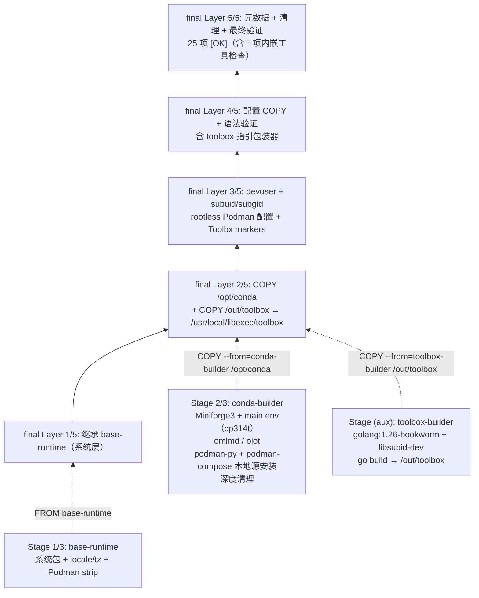

# 镜像架构

## 构建架构与运行时层（Containerfile）

镜像采用「3 阶段运行时链 + toolbox-builder aux 阶段」的多阶段构建；final 阶段按变化频率从低到高组织 5 层运行时分层，最大化构建缓存复用：



阶段与分层要点：

- **构建阶段不进 final**：conda-builder 与 toolbox-builder 为构建态，仅产物经 `COPY --from` 进入 final（`/opt/conda`、`/usr/local/libexec/toolbox`），构建工具链与源树均不进入最终镜像；
- **内嵌编排工具**：podman-py/podman-compose 在 conda-builder 阶段以本地源 pip 装入 `main` env；toolbox 由 toolbox-builder（golang:1.26-bookworm）`go build` 产出真二进制落入 `/usr/local/libexec/toolbox`，`/usr/local/bin/toolbox` 为 Layer 4/5 安装的指引包装器（无 `TOOLBOX_PATH` 时输出可执行指引）；三者源树经构建前 stage 机制来自 SpecWeave 根 `vendor/` 子模块（详见 [17-upstream-tools.md](17-upstream-tools.md)）；
- **最终验证**：Layer 5/5 共 **25 项 [OK] 检查**，含三项内嵌工具检查（`podman-compose --version`、`python -c "import podman"`、`toolbox --version`）与 Toolbx 运行前提/优雅降级断言（`flatpak-spawn` 存在性、裸跑 `toolbox` 退出码 1 且含包装器指引）。

Containerfile编写规范详见 [.agents/rules/containerfile.md](../.agents/rules/containerfile.md)。

## 7步启动流程（entrypoint.sh）

容器启动时entrypoint.sh按以下7步初始化：

```
print_banner()
  │
  ├─ [1/7] setup_passwords()     → 配置用户密码（支持环境变量/随机生成）
  ├─ [2/7] generate_host_keys()  → 生成 SSH host keys（ed25519 + rsa）
  ├─ [3/7] configure_sshd()      → 配置 sshd（PermitRootLogin 控制）
  ├─ [4/7] setup_podman()        → 初始化 rootless Podman 环境
  │    ├─ /dev/fuse 权限
  │    ├─ ~/.config/containers/ 配置
  │    ├─ XDG_RUNTIME_DIR 设置
  │    └─ podman info 触发初始化
  ├─ [5/7] setup_ssh_keys()      → 注入 SSH 公钥（SSH_PUBLIC_KEY）
  ├─ [6/7] setup_jupyter()       → 生成 Jupyter 运行时配置
  │    ├─ 密码 hash（JUPYTER_PASSWORD）或 token
  │    ├─ 端口/根目录/CORS 配置
  │    └─ 运行时配置写入 jupyter_server_config.d/
  ├─ [7/7] print_access_info()   → 打印访问信息（SSH/Jupyter/Podman/ML工具）
  │
  └─ exec supervisord -n         → 启动 supervisord（sshd + jupyter）
```

Entrypoint编写规范详见 [.agents/rules/entrypoint.md](../.agents/rules/entrypoint.md)。

## 服务管理（supervisord）

通过supervisord管理多个服务，tini作为PID 1处理信号转发：

| 服务 | 用户 | 优先级 | 端口 | 说明 |
|------|------|--------|------|------|
| sshd | root | 100 | 22 | SSH 守护进程 |
| jupyter | root（su到devuser） | 200 | 8888 | Jupyter Lab，工作目录 /workspace |

关键特性：
- `tini` 作为 PID 1 处理信号转发和僵尸进程回收
- `supervisord` nodaemon 模式运行，日志输出到 stdout/stderr
- 服务异常自动重启（autorestart=true，startretries=3）

服务配置规范详见 [.agents/rules/services.md](../.agents/rules/services.md)。

## Compose 服务架构

podman-compose定义两个服务：

| 服务 | Profile | 端口 | 说明 |
|------|---------|------|------|
| `jupyter` | 默认 | 2222:22, 8888:8888 | JupyterLab + SSHd + Podman 主服务 |
| `model-registry` | `registry` | 5000:5000 | 本地 OCI registry（zot 镜像），用于 OMLMD/OLOT 开发测试 |

使用profile控制服务启动：
```bash
# 仅启动jupyter（默认）
podman-compose up -d

# 启动jupyter + model-registry
podman-compose --profile registry up -d
```

Compose编排规范详见 [.agents/rules/compose.md](../.agents/rules/compose.md)。
