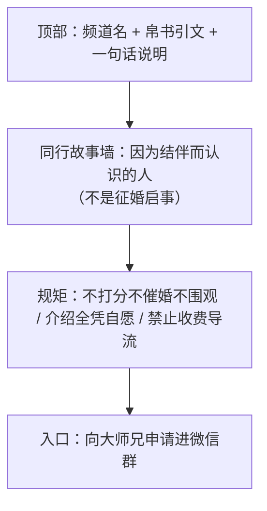

# 恒与·伴

> 「天道无亲，恒与善人。」——帛书《老子》第七十九章

熟人互助式认识朋友。没有猎杀式速配。

## 页面结构

```mermaid
flowchart TD
    Top["顶部：频道名 + 帛书引文 + 一句话说明"]
    Wall["同行故事墙：因为结伴而认识的人<br/>（不是征婚启事）"]
    Rules["规矩：不打分不催婚不围观 / 介绍全凭自愿 / 禁止收费导流"]
    Entry["入口：向大师兄申请进微信群"]

    Top --> Wall --> Rules --> Entry
```

## 用户路径

```mermaid
flowchart LR
    A["看故事"] -->|"觉得真诚"| B["申请进群"]
    B --> C["群里聊天"]
    C --> D["认识朋友"]
    D --> E["故事征得同意后上墙"]
    E --> F["新人看到故事"]
```

## 设计要点

- 故事不是资料卡，是"两个普通人怎么自然认识了"
- 反猎奇点写在最显眼处
- 不做匹配机制/左右滑/推荐算法
- 故事上墙必须当事人同意
