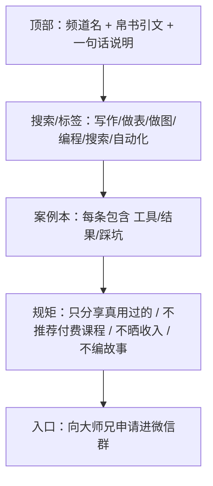
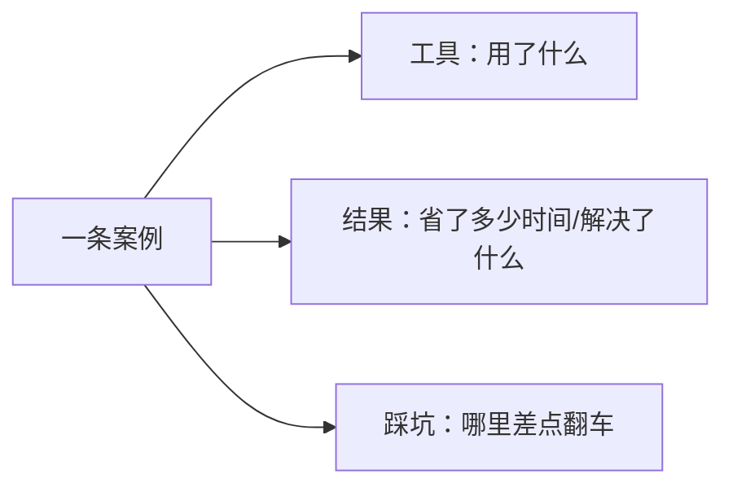
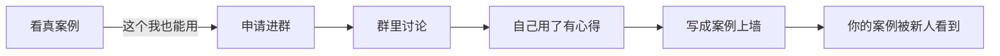

# 愈多·业

> 「既以予人矣，己愈多。」——帛书乙本《老子》末章

普通人的AI实战小组。真案例、真工具、拒绝割韭菜。

## 页面结构

```mermaid
flowchart TD
    Top["顶部：频道名 + 帛书引文 + 一句话说明"]
    Search["搜索/标签：写作/做表/做图/编程/搜索/自动化"]
    Book["案例本：每条包含 工具/结果/踩坑"]
    Rules["规矩：只分享真用过的 / 不推荐付费课程 / 不晒收入 / 不编故事"]
    Entry["入口：向大师兄申请进微信群"]

    Top --> Search --> Book --> Rules --> Entry
```

## 案例结构

```mermaid
flowchart LR
    Case["一条案例"] --> Tool["工具：用了什么"]
    Case --> Result["结果：省了多少时间/解决了什么"]
    Case --> Pit["踩坑：哪里差点翻车"]
```

## 用户路径

```mermaid
flowchart LR
    A["看真案例"] -->|"这个我也能用"| B["申请进群"]
    B --> C["群里讨论"]
    C --> D["自己用了有心得"]
    D --> E["写成案例上墙"]
    E --> F["你的案例被新人看到"]
```

## 设计要点

- 案例本是默认首页，不是教程目录
- 每条案例必须有"踩坑"部分——这是和割韭菜内容的核心区别
- 分享案例 = 学习闭环的费曼输出练习
- 禁晒收入（公约第四条的延伸）
