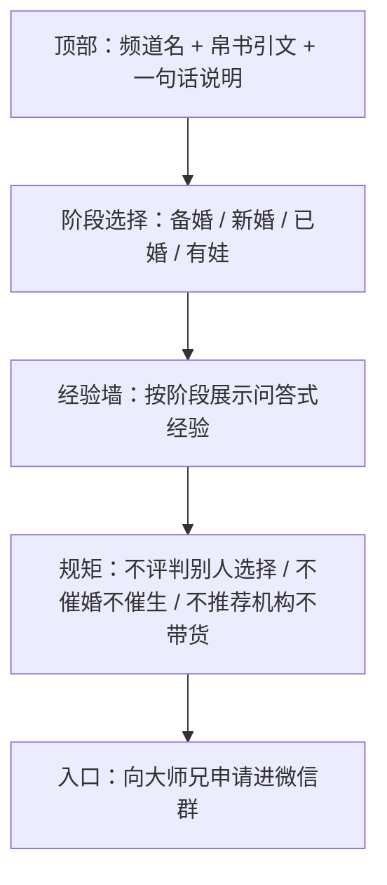
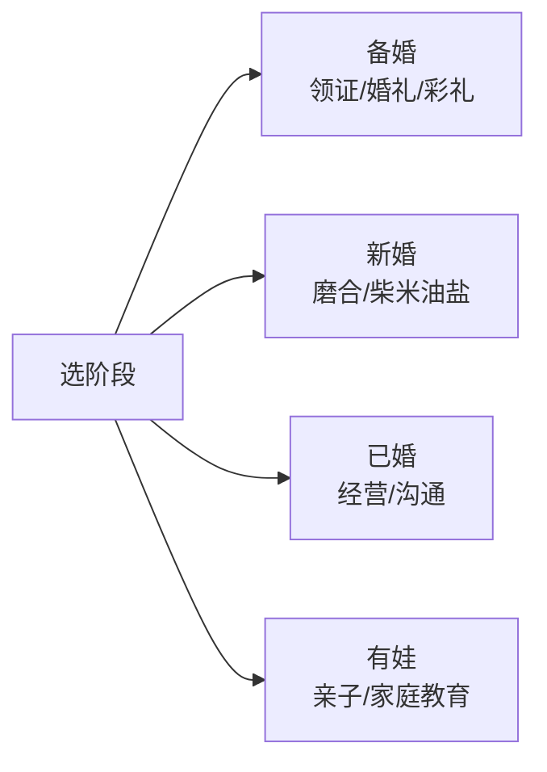
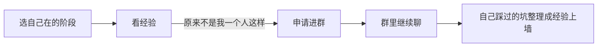

# 知和·家

> 「和曰常，知和曰明。」——帛书甲本《老子》第五十五章

婚姻全周期的经验互助站。

## 页面结构

```mermaid
flowchart TD
    Top["顶部：频道名 + 帛书引文 + 一句话说明"]
    Stage["阶段选择：备婚 / 新婚 / 已婚 / 有娃"]
    Wall["经验墙：按阶段展示问答式经验"]
    Rules["规矩：不评判别人选择 / 不催婚不催生 / 不推荐机构不带货"]
    Entry["入口：向大师兄申请进微信群"]

    Top --> Stage --> Wall --> Rules --> Entry
```

## 阶段分支

```mermaid
flowchart LR
    Stage["选阶段"] --> A["备婚<br/>领证/婚礼/彩礼"]
    Stage --> B["新婚<br/>磨合/柴米油盐"]
    Stage --> C["已婚<br/>经营/沟通"]
    Stage --> D["有娃<br/>亲子/家庭教育"]
```

## 用户路径

```mermaid
flowchart LR
    A["选自己在的阶段"] --> B["看经验"]
    B -->|"原来不是我一个人这样"| C["申请进群"]
    C --> D["群里继续聊"]
    D --> E["自己踩过的坑整理成经验上墙"]
```

## 设计要点

- 按阶段分区，用户选自己在的阶段
- 经验是问答式："这个问题大家怎么说"
- 和家庭教育专题页（jiaoyu.md）联动
- 不做心理咨询/诊断，只做经验分享
