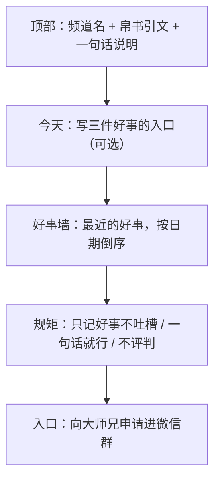
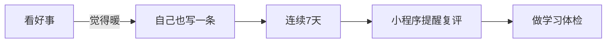

# 知足·心

> 「知足者富也。」——帛书《老子》第三十三章

每天三件好事，训练看见善意的眼睛。不打鸡血，只认真生活。

## 页面结构

```mermaid
flowchart TD
    Top["顶部：频道名 + 帛书引文 + 一句话说明"]
    Today["今天：写三件好事的入口（可选）"]
    Wall["好事墙：最近的好事，按日期倒序"]
    Rules["规矩：只记好事不吐槽 / 一句话就行 / 不评判"]
    Entry["入口：向大师兄申请进微信群"]

    Top --> Today --> Wall --> Rules --> Entry
```

## 用户路径

```mermaid
flowchart LR
    A["看好事"] -->|"觉得暖"| B["自己也写一条"]
    B --> C["连续7天"]
    C --> D["小程序提醒复评"]
    D --> E["做学习体检"]
```

## 设计要点

- 好事墙是默认首页，进来就看到别人记的好事
- 每条好事一句话，不写小作文
- 匿名展示（"知足的朋友"或小图标）
- 写好事 = 学习闭环的积极心理练习
