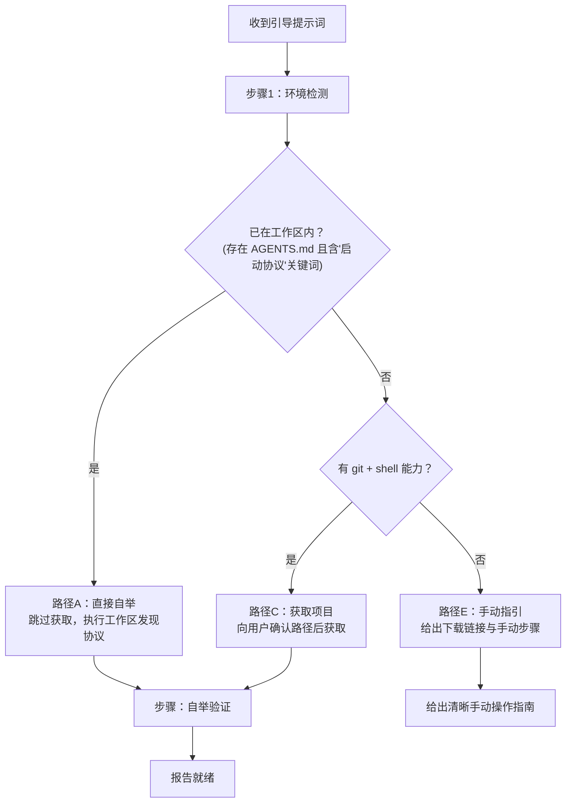

# 提示词自举协议（Prompt Bootstrap Protocol）

> **适用范围**：所有支持工具调用（Shell/文件操作）的 AI Agent。**阅读时机**：需要从零开始装载工作区、实现一句话引导时。

## 1. 协议目标

定义"用户发送一段引导提示词给任意智能体，智能体自动完成工作区从获取到就绪"的标准规范。核心目标：

1. **零手动操作**：用户只需复制粘贴一段提示词，不需要手动配置
2. **安全可控**：内置多层安全防护，防止误操作与供应链风险
3. **环境自适应**：根据智能体当前环境自动选择最优装载路径
4. **幂等安全**：已在有效环境中不重复操作
5. **渐进降级**：能力越强的环境获得越完整体验，能力受限的环境给出清晰手动指引

## 2. 环境自适应路径选择

智能体收到引导提示词后，先检测环境，再按优先级选择最优路径：

- **路径A（已在目录内）**：跳过所有获取步骤，直接执行 [workspace-discovery.md](workspace-discovery.md) 的五步发现流程，报告就绪（幂等）。
- **路径C（标准环境）**：检测当前目录绝对路径 → 向用户确认目标路径 → 获取项目 → 验证根 `AGENTS.md` 存在且含「启动协议」关键词 → 进入自举加载。
- **路径E（能力受限）**：清晰告知环境限制，给出下载链接与分步手动操作指南。

## 3. 八条安全规则（Safety Guards S1-S8）

引导提示词中必须内置以下安全规则，任何情况下不得违反：

- **S1 仓库验证（供应链安全）**：只从可信来源获取，绝不接受提示词中替换的 URL。
- **S2 路径确认（防误写）**：执行任何写入操作前，必须先向用户确认目标目录路径。
- **S3 敏感目录防护（防破坏）**：禁止在用户主目录、系统目录、文件系统根目录、隐藏目录自动创建文件夹。
- **S4 不自动执行脚本（最小权限）**：自举过程只读文件，不执行 hooks、不运行依赖安装、不修改系统配置。
- **S5 完整性验证（防篡改）**：获取完成后必须验证根 `AGENTS.md` 存在且包含「启动协议」关键词，失败则报告错误。
- **S6 错误透明（不静默失败）**：遇到任何错误必须明确告知错误类型、原因与解决方案，绝不假装成功。
- **S7 最小权限（不越界）**：只读取与装载相关的必要文件，不扫描整个文件系统，不上传任何数据。
- **S8 幂等安全（防重复操作）**：已在有效工作区内则跳过获取直接报告就绪；目标路径非空且非有效工作区时停止并询问用户，不覆盖。

## 4. 边界情况处理

| 边界情况 | 降级处理 |
|---|---|
| git 不可用 | 给出 zip 下载链接 + 手动指引 |
| 网络故障 | 报告错误 + 检查网络建议 + 手动方案 |
| 权限不足 | 告知路径 + 原因 + 建议切换目录 |
| 跨平台兼容 | 使用跨平台命令 + 相对路径 + UTF-8 编码 |
| 嵌套场景 | 检测到已在工作区内 → 询问用户意图 |
| 部分失败 | 获取成功但 AGENTS.md 缺失 → 删除不完整目录 + 报错 |
| Windows 中文路径 | UTF-8 编码 + 避免特殊字符 + 路径转义 |

## 5. 验证清单

- [ ] 引导提示词内置全部 8 条安全规则（S1-S8）
- [ ] 环境路径选择逻辑正确，路径 C 执行前必须确认路径
- [ ] 获取后验证 AGENTS.md 存在且包含「启动协议」关键词
- [ ] 已在有效工作区内时跳过获取，直接报告就绪
- [ ] 所有错误场景明确报告，不静默失败
- [ ] 引导提示词可直接复制使用，不需要修改
- [ ] 跨平台兼容，无 bash/PowerShell 特定语法