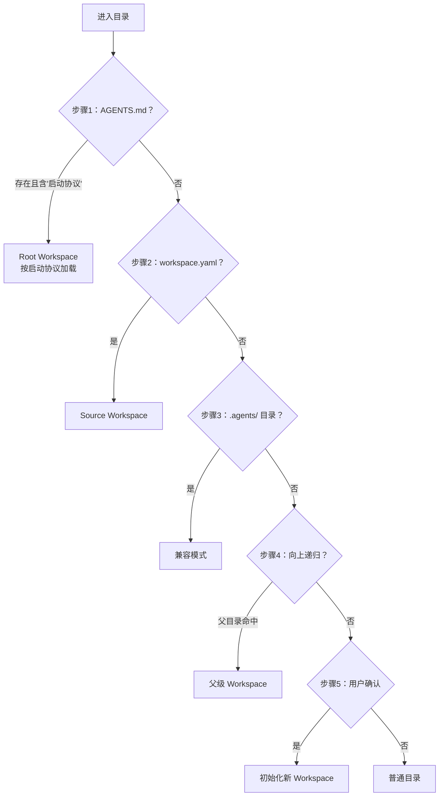

# 工作区发现协议（Workspace Discovery Protocol）

> **适用范围**：所有进入任意目录的 AI Agent。**阅读时机**：需识别工作区类型、实现零安装自举时。

## 1. 协议目标

定义 AI Agent 进入任意目录后，自动识别"这是否是一个 Agent Workspace"及"是哪种类型"的标准流程。核心目标：①**零安装可用**——含规范 `AGENTS.md` 的项目获取后无需安装即可协作；②**优先级明确**——按确定性从高到低顺序检查；③**递归向上查找**——支持子目录识别父工作区；④**可审计**——过程可追踪。

## 2. 五步发现流程

智能体进入任意目录后，**必须严格按以下优先级顺序**执行检查，前一步命中则直接返回：

- **步骤1**：检查 `AGENTS.md` 是否含"启动协议"关键词（防误判同名文件）。命中即 **Root Workspace**，按启动协议执行，无需任何安装命令。
- **步骤2**：`workspace.yaml` 存在且为合法 manifest（含 id/name/version）→ **Source Workspace**。
- **步骤3**：`.agents/` 目录存在且含 `roles/`、`skills/` → **兼容模式**，按现有结构推断可用能力。
- **步骤4**：均未命中时向上递归检查父目录，最多 10 层，遇跨用户目录边界或嵌套 git 仓库时停止并提示。
- **步骤5**：仍无命中则报告当前目录非工作区并询问用户意图，**禁止静默创建文件**。

## 3. 根工作区自举流程

读 `AGENTS.md` 全文 → 验证含"启动协议"关键词 → 按路由表加载核心规则与上下文路由表 → 列出 `roles/` 可用角色 → 列出可用技能 → 执行启动协议自检清单 → 报告就绪。整个过程应在 **30 秒内**完成，只列目录索引、按需读取。

## 4. AGENTS.md 最小可行子集

最小可行 `AGENTS.md` 必含区块：

| 区块 | 必要性 | 说明 |
|------|--------|------|
| **启动协议** | 🔴 必须 | 明确的 4 步启动流程（读 AGENTS.md → 按路由表加载规范 → 自检 → 开始工作） |
| **上下文路由表** | 🔴 必须 | 至少包含核心规范入口的映射表 |
| **核心规范入口表** | 🔴 必须 | 列出 `.agents/` 下关键规范的路径 |

推荐区块：快速开始/引导提示词、开发规范概要；可选区块：知识库索引。

## 5. 常见反模式

| 反模式 | 正确做法 |
|--------|---------|
| 跳过 AGENTS.md 直接遍历 `.agents/` | 始终先检查 AGENTS.md（唯一权威入口） |
| AGENTS.md 塞入大量实现细节 | AGENTS.md 只做路由，细节放 `.agents/` |
| 进入子目录不向上递归 | 始终执行向上递归查找 |
| 未找到 Workspace 时静默创建 | 必须先询问用户确认 |