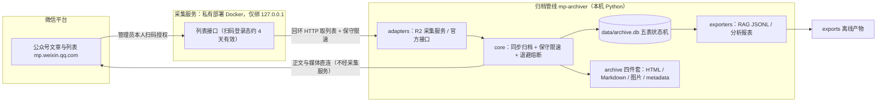

# wechat-mp-archiver

微信公众号全量内容归档工具：通过**私有部署的开源采集服务**（R2 主路线）获取指定公众号的历史文章列表，由本 Python 管线完成正文/富媒体下载、元数据管理、断点续采与增量更新，产出三种形态：

- **离线归档**：原始 HTML 快照 + 本地化图片 + Markdown，按 `archive/<账号>/<年>/<日期_标题>/` 组织；
- **RAG 语料**：带 YAML frontmatter 的 Markdown 导出（Task 10）；
- **分析报表**：更新趋势、失败/对账清单（Task 11）。

技术选型与合规边界见 [技术方案文档](../../../docs/knowledge/operations/wechat-mp-full-archive-solution.md)。
**仅供个人学习研究与本地存档使用，请勿商用或公开再分发归档内容；完整条款见文末「合规声明」。**

## 架构



采集服务承载微信登录态、向管线提供文章列表接口；管线只通过回环地址取列表，正文与媒体下载由管线直连 `mp.weixin.qq.com` 完成（剥离采集服务 Token），数据全部落地本机。派生产物（RAG/报表）为纯离线任务，不触网。

## 安装

要求 **Python ≥ 3.14** 与 Docker（用于采集服务，NAS 可用多架构镜像）。

```bash
cd apps/dev-tools/wechat-mp-archiver
python -m venv .venv && . .venv/Scripts/activate   # Windows PowerShell: .venv\Scripts\Activate.ps1；Linux/macOS: . .venv/bin/activate
pip install -e ".[dev]"
```

## 快速开始（从零到单篇演练）

1. **准备专用账号**：注册一个**采集专用微信订阅号**（个人主体即可），不要使用主力号；采集只能由该号管理员本人扫码授权（账号注册与扫码前提见 [deploy/README.md](deploy/README.md) 第 1–3 节）。
2. **部署采集服务并扫码**：在 `deploy/` 目录 `docker compose up -d`（服务仅绑 `127.0.0.1:5000`，切勿暴露公网），浏览器打开 <http://127.0.0.1:5000/login.html> 扫码确认。完整步骤、Token 设置与升级备份见 [deploy/README.md](deploy/README.md) 第 1–3、6 节。
3. **配置管线**：

   ```bash
   copy .env.example .env   # PowerShell；bash: cp .env.example .env
   ```

   默认采集服务地址 `http://127.0.0.1:5000` 即可；若服务端设置了静态 Token，在 `.env` 填同一值。归档根目录、数据库路径、限速参数均可在 `.env` 调整（默认值已是保守档，见下文「默认限速」）。**凭证只走环境变量/.env，`.env` 已被 gitignore。**
4. **建库与自检**：

   ```bash
   mp-archiver init-db
   mp-archiver doctor     # 预期「采集服务在线：OpenAPI 文档可访问」
   ```
5. **列表小批量试跑**（只翻 2 页，不触发下架对账）：

   ```bash
   mp-archiver list -a 意识食谱 --max-pages 2
   ```
6. **单篇下载演练**：

   ```bash
   mp-archiver fetch -a 意识食谱 --limit 1
   ```

   成功后检查 `archive/意识食谱/<年>/<日期_标题>/` 下四件套（`article.html` 可离线打开、图片已本地化）。
7. **转入日常**：每日执行 `mp-archiver sync -a 意识食谱`（增量、幂等）；每周至多一次 `mp-archiver run -a 意识食谱 --full`（全量回溯+下架对账）。计划任务配置见 [deploy/README.md](deploy/README.md) 第 12 节。

## 账号准备与凭证管理

| 凭证 | 用途 | 获取方式 | 有效期与失效处置 |
|---|---|---|---|
| 采集服务扫码登录态 | 文章列表与下载（主路线） | 专用订阅号管理员扫码，deploy 第 2–3 节 | 经验约 4 天；`doctor` 提示需要授权或命令退出码 2 时，按第 4–5 节重新扫码，无需全量重采 |
| `MP_ARCHIVER_EXPORTER_TOKEN` | 管线访问采集服务（非独占环境建议设置） | 与 `deploy/collector.env` 的静态 Token 取同一值 | 随部署变更 |
| `appmsg_token` / `pass_ticket`（另需 `key`/`wxuin` 视接口形态） | 评论、阅读/点赞等互动数据，**默认关闭** | 本机抓包，自担风险，deploy 第 8 节 | 仅数小时至数天；失效后该篇互动行记 `skipped_no_credential`（非 failed），正文归档不受影响 |
| AppID / AppSecret（+IP 白名单） | 自有认证号官方清单交叉补全（可选） | 公众号后台「设置与开发」，deploy 第 11 节 | 个人/未认证主体返回 48001 时自动降级退出码 0；日配额默认 90 次 |

凭证安全：所有凭证只存于本地 `.env`（已在 `.gitignore`），日志对凭证脱敏；不共享账号、不转售凭证。官方接口仅用于自己管理的认证服务号，2025-07 权限收紧事实与适用边界见 deploy 第 11 节。

## 命令

```bash
mp-archiver doctor     # 环境自检（数据库、归档目录、采集服务连通性）
mp-archiver init-db    # 初始化 SQLite 元数据库
mp-archiver list -a 意识食谱          # 同步指定公众号全量文章列表
mp-archiver list -a 意识食谱 --max-pages 2   # 调试：仅翻 2 页（不做下架对账）
mp-archiver fetch -a 意识食谱         # 归档正文（HTML/Markdown/图片/metadata 四件套）
mp-archiver fetch -a 意识食谱 --limit 10     # 先小批量试跑
mp-archiver fetch -a 意识食谱 --include-failed  # 同时重试此前失败的文章
mp-archiver sync -a 意识食谱          # 日常增量：列表追平 + 归档新文章（幂等，可重复执行）
mp-archiver run -a 意识食谱 --full    # 全量回溯：完整翻页 + 下架对账 + 归档（可加 --include-failed）
mp-archiver sync-official -a 意识食谱  # 可选：自有认证号官方清单交叉补全（见 deploy/README.md 第 11 节）
mp-archiver official-doctor -a 意识食谱  # 官方接口分阶段探针（配置/网络/token/batchget/biz；--network-only 免凭证）
mp-archiver resolve-biz "文章链接"        # 从文章 URL（含 /s/ 短链）解析 __biz，供 MP_ARCHIVER_WECHAT_OFFICIAL_BIZ 使用
mp-archiver export-rag                    # 离线导出 RAG JSONL 语料（全部账号 → exports/rag.jsonl）
mp-archiver export-rag -a 意识食谱 --no-clean --with-raw  # 单账号/不清洗/附清洗前原文对照
mp-archiver report                    # 离线生成分析报表（全部账号 → exports/report/）
mp-archiver report -a 意识食谱 --top 20   # 单账号 + 合集 Top 20
pytest                 # 运行测试
```

`sync` 与 `run` 是统一编排命令，一次完成「列表 → 正文/富媒体 →（可选）互动」：增量模式从最新页向后翻，遇到整页全已知即停，只下载 pending 新文章；全量模式翻到历史尾页并执行下架对账（未显式加 `--full` 不会执行，防止误触发长任务）。两者均幂等可中断：进程随时终止后重跑，已归档文章按状态自动跳过、失败文章随后续任务补齐，不产生重复文件。退出码：`0` 成功；`1` 存在失败文章或参数错误；`2` 登录态失效需重新扫码；`3` 账号未找到（`sync-official` 路径亦表示 biz 未配置）；`4` 环境/风控异常（采集服务不可达、端点发现失败、R2 列表 biz 不可得，或正文阶段触发熔断——均有现场保留，可按下方「故障处置与断点续跑」直接重跑）。每日增量与每周全量的计划任务配置（Windows 任务计划程序 pwsh7 脚本、NAS cron）见 [deploy/README.md 第 12 节](deploy/README.md)。

`list` 会自动发现采集服务的搜索/历史端点（可由环境变量覆写），翻页采集元数据并幂等入库；完整翻到尾页后执行下架/不可见文章对账，凭证失效时返回退出码 2 并提示重新扫码。

`fetch` 直连 `mp.weixin.qq.com` 逐篇下载：正文图片（含微信懒加载 `data-src`）全部本地化并改写为相对路径，单图失败保留远程引用并登记进 `metadata.json`；平台明确删除/违规的文章标记 skipped；单篇错误（如单篇 404）标记 failed 并隔离继续。归档产物位于 `archive/<账号>/<YYYY>/<YYYY-MM-DD_标题>/`。

### 故障处置与断点续跑（韧性设计）

归档按故障作用域分流，目标是**退避不猛打、失败可隔离、现场可续跑**：

| 故障 | 行为 | 处置 |
|---|---|---|
| 文章页 403/429（账号或 IP 级风控） | 请求级指数退避（`2/4/8/…` 秒 + 抖动，封顶 60 秒，退避日志可见且只记主机名不记链接参数）用尽后，当前篇置 failed（原因 `risk_abort:` 可查），**立即熔断**：本批后续文章保持 pending、零请求 | 退出码 4；加大限速/更换网络/稍后直接重跑续采 pending，加 `--include-failed` 重试本篇 |
| 验证码/环境异常页（含无正文容器的未知拦截页变体） | 显式判为风控（基于页面结构：正文容器 `#js_content` 缺失或为空，不会误杀正文恰好包含这些词的正常文章），当前篇 failed 并立即熔断，不产生空壳归档 | 同上；确认为正常文章被误判时可用 `--include-failed` 复核重试 |
| 超时/连接错误、文章页 5xx | 单篇先退避重试；重试用尽后置 failed 隔离；**连续 2 篇**（可用 `MP_ARCHIVER_TRANSPORT_ABORT_THRESHOLD` 调整）传输/服务故障才熔断，成功篇或业务失败篇会重置连续计数，偶发抖动不熔断 | 退出码 4；网络/服务恢复后重跑 |
| 单篇 404 / 解析异常 | 不重试，置 failed 并输出失败清单，批次继续，末尾给成功/跳过/失败分类计数 | 退出码 1；按需 `--include-failed` |
| 图片/语音等媒体链接失效 | 单资源失败登记 media 表与 `metadata.json` 例外表（保留远程引用），文章仍正常 downloaded | 退出码 0（有告警）；重跑可补齐 |
| 采集服务凭证过期（401/403） | 不落任何归档重试，凭证状态写库 `expired` 并立即终止 | 退出码 2；重新扫码后续跑 |

熔断与中断（含 kill -9）都不破坏幂等：每篇成功/失败即时落库，半成目录重跑时整体清空重建；普通重跑只采 pending，`--include-failed` 才重试失败篇，不产生重复文件。

`export-rag` 是纯派生离线命令（不触网、幂等，临时文件 + 原子覆盖），仅导出 `downloaded` 文章：从本地化 `article.html` 的 `#js_content` 提取段落结构完整的纯文本（块级换行、列表转 `- `、代码块保留缩进、语音转「［音频：标题］」、视频转「［视频：标题］」、音乐转「［音乐：标题］」（无标题时不带冒号）、图片节点移除），默认保守清洗微信排版噪声（文末关注/在看/扫码引导短行、纯装饰行、相邻重复行、文章后半部平台推荐块）。每行一个 JSON、UTF-8、`ensure_ascii=False`，字段：

| 字段 | 说明 |
|---|---|
| `id` | articles 表行 id |
| `account` | 账号别名（`account_alias`） |
| `title` / `author` / `publish_time` / `url` | 文章元数据（取自 DB） |
| `original` | 是否原创（布尔） |
| `album` / `digest` | 所属合集与摘要 |
| `text` | 清洗后纯文本；加 `--with-raw` 时另附 `text_raw`（清洗前原文，供逐行对照评阅） |

选项：`-a/--account`（默认全部账号）、`-o/--out`（默认 `exports/rag.jsonl`，可用 `MP_ARCHIVER_EXPORT_ROOT` 改根目录）、`--no-clean`（关清洗）、`--with-raw`（附原文对照）、`--limit`（调试限量）。DB 标记 downloaded 但 HTML 缺失/路径越界的单篇计入失败、不阻断其余导出，存在失败时退出码为 1。

`report` 是纯派生离线命令（不触网、幂等，HTML/CSV 均临时文件 + 原子覆盖），产出到 `exports/report/`：`report.html` 为单文件报表（内联 CSS，无 JS/外链/CDN，断网可开），含五项统计——①发文量时间序列（年/月）、②星期×时段（0–23 时）发布热力、③原创占比、④合集 Top N、⑤含音频/视频文章占比；`report.csv` 为逐篇明细（UTF-8 BOM，Excel 直接打开），含发布时间 UTC 原文与北京时间派生列（年/年月/星期/小时），可自行透视复核。统计口径在报表页首明确声明：前四项基于**有发布时间的全部文章**（未归档也参与），音视频占比基于**已归档（downloaded）文章**（富媒体仅在正文归档时识别）；所有时间按**北京时间（UTC+8）**聚合（SQL 侧 `strftime(..., '+8 hours')`）。报表页脚附每项数字对应的对账 SQL（`:biz` 为占位参数），可直接在 SQLite 上核对。选项：`-a/--account`（默认全部账号）、`-o/--out`（输出目录，默认 `exports/report/`）、`--top`（合集 Top N，默认 10）。空库/单篇/无合集等边界渲染空态而非报错；退出码 `0` 成功、`3` 账号未找到。

## 默认限速（保守档与核定依据）

| 参数 | 默认值 | 含义 |
|---|---|---|
| `MP_ARCHIVER_REQUEST_DELAY_MIN/MAX` | 2.0 / 5.0 秒 | 每两次请求间随机间隔（均匀采样，天然带抖动） |
| `MP_ARCHIVER_MAX_RETRIES` | 5 | 单请求失败最大重试次数 |
| `MP_ARCHIVER_BACKOFF_BASE/CAP` | 2.0 / 60.0 秒 | 指数退避 `min(60, 2·2ⁿ)+抖动` |
| `MP_ARCHIVER_TIMEOUT` | 30 秒 | 单请求超时 |
| `MP_ARCHIVER_TRANSPORT_ABORT_THRESHOLD` | 2 | 连续传输故障熔断阈值（403/验证码为账号级风控，1 次即熔断） |
| `MP_ARCHIVER_OFFICIAL_DAILY_CALL_CAP` | 90 次/日 | 官方 batchget 配额守护（经验日限约 100，预留余量） |

核定依据（2026-09）：① 方案文档（[技术方案文档](../../../docs/knowledge/operations/wechat-mp-full-archive-solution.md) 3.2 节失效模式、第六节合规边界）已实证「高频请求触发验证码/临时封禁」，要求默认保守限速并带抖动——**保守方向来自平台事实，2–5 秒/篇的具体区间为本项目据此取的工程判断**（贴近人工浏览节奏，非平台公布阈值）；② 登录态经验约 4 天有效，每日一次增量足以追平、全量每周至多一次即满足对账需要，没有更快默认值的收益（deploy 第 12 节频率建议）；③ 重试以指数退避封顶 60 秒并配合熔断，保证异常时不空转猛打。默认值即推荐值，确需下调请自行承担风控风险。

## 存储布局

```text
apps/dev-tools/wechat-mp-archiver/
├── .env                         # 凭证与运行配置（gitignore，从 .env.example 复制）
├── data/
│   ├── archive.db               # SQLite 元数据库：articles/media/comments/metrics/sync_state 五表
│   └── official_api_quota.json  # 官方接口日配额计数（按 UTC 日滚动，自动生成）
├── archive/<账号别名>/<YYYY>/<YYYY-MM-DD_标题>/
│   ├── article.html             # 正文快照：图片本地化、链接相对化，可离线打开
│   ├── article.md               # 正文 Markdown（标题/列表/代码/引用结构保留）
│   ├── metadata.json            # 文章元数据 + 媒体下载清单（含失败例外表）
│   ├── images/                  # 正文图片（含懒加载 data-src）
│   └── media/                   # 语音/视频等富媒体（已迁移视频号的内容只登记外链）
├── exports/                     # 派生产物（gitignore）：rag.jsonl、report/report.{html,csv}
└── logs/                        # 定时任务运行日志（调度脚本自动创建）
```

采集服务侧的登录凭证不在本目录，持久化在 Docker 命名卷 `mp_archiver_collector_data`（备份/迁移见 deploy 第 6 节）。

## 故障排查（速查索引）

| 现象 | 处置 |
|---|---|
| 403/验证码页/超时/5xx 触发熔断，退出码 4 | 见上方「故障处置与断点续跑」：现场已保留，恢复后直接重跑 pending，加 `--include-failed` 重试失败篇 |
| 退出码 2 / `doctor` 提示「采集服务需要授权」 | 登录态过期（约 4 天），按 deploy 第 4–5 节重新扫码后续跑，无需全量重采 |
| `doctor` 输出「采集服务未响应：无法连接…」告警 | 容器是否 healthy、5000 端口占用、本地代理拦截回环；deploy 第 10 节。doctor 自身退出码仍为 0 |
| `list`/`sync`/`run` 连不上采集服务 | 先经约 1 分钟指数退避（5 次重试）才以退出码 4 返回，非卡死；确认容器启动后重跑即可 |
| 图片/语音下载失败 | 单资源登记 media 表与 `metadata.json` 例外表、保留远程引用，文章仍算成功；重跑可补齐；防盗链/视频号迁移属于平台侧不可得，见方案文档 3.2 节 |
| 互动数据（评论/阅读数）缺失或为空 | 互动票据仅数小时至数天有效，正常记 `skipped_no_credential`；更新抓包凭证后重跑（deploy 第 8 节），不影响正文 |
| `sync-official` 报 48001 / 配额触顶 / 无法解析 biz | 主体无权限（2025-07 后常态）自动降级；配额 UTC 0 点恢复；先做一次 R2 `list` 或用 `resolve-biz` 配置 biz（deploy 第 10–11 节） |

## 合规声明

1. **个人学习与存档限定**：本工具与归档内容仅限个人学习、研究与本地备份（含个人离线 RAG）使用；不得用于任何商业用途，不得公开再分发归档的文章、图片或音视频，不得据其重建替代性公众号内容服务。
2. **不绕付费与权限**：不绕过付费阅读、会员、赞赏等任何访问控制或技术保护措施；仅归档账号管理员本人有权阅读的内容；官方接口能力只用于自己管理的认证公众号，不利用本工具突破平台权限边界。
3. **尊重版权**：文章与媒体著作权归原作者及公众号主体所有；合理引用须标注作者、出处与原文链接；不得单独传播归档图片/音视频。
4. **频率自律**：使用默认保守限速（2–5 秒/篇随机间隔 + 指数退避，每日增量至多一次、全量每周至多一次），不对平台造成额外压力；一旦出现验证码或封禁信号立即停止，恢复后再续跑。
5. **凭证与数据安全**：仅使用管理员本人扫码授权的登录态；凭证只存本地 `.env`（不入库、日志脱敏）；不共享账号、不转售凭证、不扩散归档数据；采集服务不得暴露公网。
6. **24 小时删除义务**：归档属于临时性个人学习副本；收到权利人（作者或公众号主体）主张、投诉或其他合规要求时，在 **24 小时内**删除对应本地归档（含正文、媒体与 RAG/报表等派生产物），不保留副本。

## 结构

```
src/mp_archiver/
├── config.py          # pydantic-settings 配置（MP_ARCHIVER_ 前缀）
├── models.py          # 采集状态枚举与文章模型
├── logging_utils.py   # 凭证脱敏日志
├── naming.py          # 跨平台安全文件名
├── http_client.py     # 保守限速 + 指数退避 HTTP 客户端
├── db/                # SQLite 五表（articles/media/comments/metrics/sync_state）
├── adapters/          # 采集源适配器（采集服务 R2 / 官方接口）
├── core/              # 列表同步、正文/富媒体/互动归档、pipeline 统一编排
└── exporters/         # 派生产物导出（RAG JSONL：rag.py；分析报表：report.py；提取清洗：core/text_extract.py）
```
