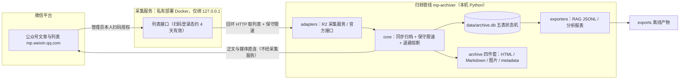

# wechat-mp-archiver 定位与架构

微信公众号全量内容归档工具：通过**私有部署的开源采集服务**（R2 主路线）获取指定公众号的历史文章列表，由本 Python 管线完成正文/富媒体下载、元数据管理、断点续采与增量更新。

**仅供个人学习研究与本地存档使用，请勿商用或公开再分发归档内容**；完整条款见 [05-compliance.md](05-compliance.md)。

## 三种产出形态

| 形态 | 内容 | 落盘位置 | 详解 |
|---|---|---|---|
| 离线归档 | 原始 HTML 快照 + 本地化图片 + Markdown | `archive/<账号>/<年>/<日期_标题>/` | [04-storage-and-layout.md](04-storage-and-layout.md) |
| RAG 语料 | 带 YAML frontmatter 的纯文本 JSONL 导出 | `exports/rag.jsonl` | [02-commands.md](02-commands.md) 的 `export-rag` |
| 分析报表 | 更新趋势、失败/对账清单 | `exports/report/` | [02-commands.md](02-commands.md) 的 `report` |

技术选型与合规边界见 [技术方案文档](../../../../docs/knowledge/operations/wechat-mp-full-archive-solution.md)。

## 架构

## 职责边界

采集服务承载微信登录态、向管线提供文章列表接口；管线只通过回环地址取列表，正文与媒体下载由管线直连 `mp.weixin.qq.com` 完成（剥离采集服务 Token），数据全部落地本机。派生产物（RAG/报表）为纯离线任务，不触网。

## 相关文档

- [文档索引](README.md)
- [快速开始（从零到单篇）](01-quickstart.md)
- [命令参考](02-commands.md)