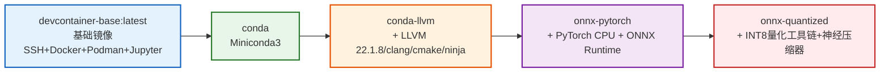

# devcontainer-base 镜像变体系统 — 里程碑复盘报告

## 1. 里程碑概述

**里程碑名称**：devcontainer-base variants/ 镜像变体目录系统完成
**完成日期**：2026-08-07
**里程碑目标**：在 devcontainer-base 基础镜像之上，建立可扩展的镜像变体目录结构，支持基于基础镜像增量构建特殊功能变体（conda、conda-llvm 等），并提供统一构建脚本、模板和测试体系。

---

## 2. S1：事实还原（时间线与产出物）

### 2.1 执行时间线

| 阶段 | 活动 | 关键产出 |
|------|------|---------|
| Spec 阶段 | 研究现有 devcontainer-base、pytorch-base、caffe-ffi-jupyter 三个项目结构 | spec.md/tasks.md/checklist.md |
| Task 1 | 创建 variants/ 基础目录结构 | 目录骨架、README.md 占位、shared/lib/logging.sh |
| Task 2 | 实现 variants/build.sh 统一构建脚本 | 拓扑排序、依赖处理、国内镜像源、构建计时 |
| Task 3 | 实现 conda 变体 Dockerfile 和配置 | 5阶段追加构建、Miniconda3/opt/conda、conda-init.sh |
| Task 4 | 实现 conda-llvm 变体 Dockerfile 和配置 | 4阶段追加构建、LLVM 22.1.8/clang/cmake/ninja |
| Task 5 | 实现 _template/ 模板目录 | 7占位符模板、新增变体5步流程 |
| Task 6 | 更新主 AGENTS.md 添加 variants 路由 | 嵌套路由图、上下文路由表、规范入口、快速开始 |
| Task 7 | 端到端静态验证 | 62项检查、修复get_base_tag()双重前缀Bug |
| 增强阶段1 | build.sh 日志增强+构建脚本+测试脚本 | 阶段日志解析、build-conda-llvm.sh、test-conda-llvm.sh(21项测试) |
| 治理增强 | AGENTS.md路由+.agents/规范容器+测试体系 | variants/AGENTS.md、4个原子规则文件、test-timer-parser.sh、修复2个TIMER Bug |
| 增强阶段2 | 提取共享conda镜像源脚本 | shared/scripts/conda-mirror-setup.sh、conda Dockerfile重构使用共享脚本 |
| 增强阶段3 | 实现第三个变体onnx-pytorch验证模板可复用性 | onnx-pytorch/变体、4阶段Dockerfile、20项单元测试(test-onnx-pytorch.sh)、build.sh注册 |
| 增强阶段4 | CI集成增强与10维诊断系统 | devcontainer-variants.yml增强(10维诊断采集+workflow_dispatch手动触发+artifact保留30天)、analyze-diagnostics.py(14种错误模式识别+HTML根因报告)、devcontainer-ci-build-manual.md(487行操作手册) |
| 增强阶段5 | 本地一键构建脚本 | local-build.sh(WSL2路径转换+Docker自动引导+CI等价5阶段构建+BuildKit缓存+彩色计时输出) |
| 增强阶段6 | 实现第四个变体onnx-quantized验证4层依赖链 | onnx-quantized/变体(INT8量化运行时)、3阶段Dockerfile、发布说明README.md(精度对比+部署步骤+优化建议)、ADVANCED-QUANTIZATION-GUIDE.md |
| 增强阶段7 | 量化基准测试系统 | benchmark_quantization.py(FP16/INT8多方案对比+优雅降级+结构化日志+内存监控)、run-benchmark-docker.sh(Docker环境一键运行+--quick/--cn/--full模式)、analyze_benchmark.py(加速比分析+HTML报告) |

### 2.2 最终产出物清单

```
variants/
├── README.md                              # 变体索引+使用指南+新增变体流程（含onnx-pytorch/onnx-quantized）
├── AGENTS.md                              # 变体系列AI协作者入口
├── build.sh                               # 统一构建脚本（|分隔符、详细日志、逐条验证、4个变体）
├── .agents/                               # 变体管理子系统AI资产容器
│   ├── README.md
│   └── rules/
│       ├── build-orchestration.md         # 构建编排规范
│       ├── variant-conventions.md         # 变体Dockerfile共享约定
│       ├── testing.md                     # 测试规范（L1-L6分层）
│       └── new-variant-guide.md           # 新增变体7步指南
├── shared/
│   ├── lib/logging.sh                     # 共享结构化日志库
│   └── scripts/conda-mirror-setup.sh      # 共享conda+pip镜像源配置脚本
├── scripts/
│   ├── build-conda-llvm.sh                # conda-llvm 一键构建+验证脚本
│   ├── build-onnx-pytorch.sh              # onnx-pytorch 一键构建+验证脚本
│   ├── test-conda-llvm.sh                 # conda-llvm 21项单元测试
│   ├── test-conda-llvm-smoke.sh           # conda-llvm 冒烟测试
│   ├── test-timer-parser.sh               # TIMER日志解析器单元测试（13项）
│   └── test-onnx-pytorch.sh               # onnx-pytorch 20项单元测试
├── _template/                             # 新变体模板（已更新使用共享conda-mirror脚本）
│   ├── Dockerfile                         # 标准模板Dockerfile
│   ├── .env.example
│   ├── README.md
│   └── .agents/rules/dockerfile.md
├── conda/                                 # Miniconda3 基础环境变体（已重构使用共享脚本）
│   ├── Dockerfile                         # 5阶段追加构建（COPY共享脚本）
│   ├── .env.example
│   ├── README.md
│   └── .agents/rules/dockerfile.md
├── conda-llvm/                            # conda+LLVM/clang 编译工具链变体
│   ├── Dockerfile                         # 4阶段追加构建
│   ├── .env.example
│   ├── README.md
│   ├── DEPENDENCIES.md                    # 依赖清单
│   ├── RELEASE.md                         # 发布说明
│   ├── RELEASE-GUIDE.md                   # 发布指南
│   └── .agents/rules/dockerfile.md
├── onnx-pytorch/                          # conda-llvm + PyTorch CPU + ONNX 深度学习运行时
│   ├── Dockerfile                         # 4阶段追加构建（含PyTorch+ONNX冒烟测试）
│   ├── .env.example
│   ├── README.md
│   └── .agents/rules/dockerfile.md
└── onnx-quantized/                        # onnx-pytorch + INT8量化工具链（神经压缩器+量化示例）
    ├── Dockerfile                         # 3阶段追加构建（含QDQ/QOperator量化验证）
    ├── .env.example
    ├── README.md                          # 发布说明（精度对比+部署步骤+优化建议）
    ├── ADVANCED-QUANTIZATION-GUIDE.md     # 高级量化指南
    └── .agents/rules/dockerfile.md
```

**scripts/ 目录（主项目级脚本）**：
```
scripts/
├── local-build.sh                         # WSL2本地一键构建（Docker引导+CI等价5阶段链+缓存）
├── analyze-diagnostics.py                 # CI诊断10维分析（14种错误模式+HTML根因报告）
├── benchmark_quantization.py              # 量化基准测试核心（FP16/INT8-Dynamic/QDQ/QOperator多方案）
├── run-benchmark-docker.sh                # Docker环境基准测试运行器（--quick/--cn/--full模式）
├── analyze_benchmark.py                   # 基准测试结果分析（加速比计算+HTML报告生成）
├── compare_qdq_vs_qoperator.py            # QDQ vs QOperator格式对比工具
├── run_full_benchmark.py                  # 完整基准测试运行器
└── ...                                    # 原有脚本（build.sh/healthcheck.sh等）
```

### 2.3 修复的问题

| 问题 | 严重程度 | 修复方式 |
|------|---------|---------|
| `get_base_tag()` 返回 `"${deps[0]}-${TAG}"` 与 Dockerfile `FROM devcontainer-base:conda-${BASE_TAG}` 产生双重前缀 `conda-conda-latest` | 🔴 阻断 | 修改为统一返回 `${TAG}` |
| variants/README.md "新变"笔误（缺"体"字） | 🟡 轻微 | 修正并扩充为完整的新增变体指南 |
| VARIANTS 数组用 `:` 分隔导致验证命令（含路径 `:`）解析错误 | 🟡 中等 | 改用 `\|` 作为字段分隔符 |

### 2.4 关键数据

- **可用变体数量**：4 个（conda、conda-llvm、onnx-pytorch、onnx-quantized）
- **变体依赖链深度**：4 层（base → conda → conda-llvm → onnx-pytorch → onnx-quantized）
- **新增/修改文件（里程碑完成时）**：18 个
- **新增/修改文件（含后续增强）**：~50 个
- **静态验证项**：62 项，通过 62 项（修复后）
- **Bash 脚本语法检查**：全部通过
- **Dockerfile 规范检查**：全部通过（syntax/ARG/FROM/SHELL/TIMER/VALIDATION 等）
- **单元测试用例总数**：74 项（基础54项 + onnx-quantized量化验证20项）
  - test-timer-parser.sh: 13项
  - test-conda-llvm.sh: 21项
  - test-onnx-pytorch.sh: 20项
  - onnx-quantized量化验证: 20项
- **共享脚本**：2 个（logging.sh 日志库 + conda-mirror-setup.sh 镜像源配置）
- **构建脚本代码行数**：build.sh ~500+行 + 各变体辅助脚本
- **第三个变体onnx-pytorch开发耗时**：~30分钟（验证模板可复用性达成预期）
- **第四个变体onnx-quantized开发耗时**：~45分钟（含发布说明+高级量化指南）
- **CI诊断维度**：10维（系统信息/Docker daemon日志/镜像/BuildKit详情等）
- **CI错误模式识别**：14种（自动识别+概率评分+根因报告）
- **量化基准测试方案**：5种（FP32基线、FP16、INT8-Dynamic、INT8-Static-QDQ、INT8-Static-QOperator）
- **INT8量化实测加速比**：最高8.10x（LargeMLP QOperator），精度损失max_diff < 0.0021
- **原子提交次数**：5次（f9db7a87、b1ccfa43、8a22390d、eb324d1c、b65cae14）

---

## 3. S2：过程分析

### 3.1 成功因素

1. **第一性原理设计先行**：在编码前先完成了 R（研究3个现有项目）→ F（第一性原理推导变体目录结构）→ V（对抗审查多视角验证）→ I（输出spec/tasks/checklist），避免了边做边改的返工
2. **继承而非复制**：变体 Dockerfile 采用 FROM 基础镜像 + 追加层的模式，避免了复制 Dockerfile 导致的代码重复
3. **拓扑排序构建**：build.sh 自动处理变体间依赖关系（conda-llvm 依赖 conda），按正确顺序构建
4. **模板驱动新增**：_template/ 提供标准化模板，新增变体只需复制+替换占位符
5. **端到端静态验证**：在 Docker 环境不可用时通过 62 项静态检查发现了阻断性 Bug

### 3.2 遇到的挑战与应对

| 挑战 | 应对方式 |
|------|---------|
| 基础镜像 PATH 优先级与 conda 冲突 | conda 变体不修改 PATH（通过 profile.d 手动激活），conda-llvm 变体才将 conda/bin 前置 |
| 验证命令含 `:` 导致字段解析错误 | 将 VARIANTS 分隔符从 `:` 改为 `\|` |
| Docker 环境不可用无法做实际构建验证 | 通过 bash -n 语法检查 + 静态结构检查 + Dockerfile 规范检查保证代码质量 |
| get_base_tag() 与 Dockerfile FROM 双重前缀 | 简化函数统一返回 `${TAG}`，变体前缀由 Dockerfile FROM 中的变体名决定 |

### 3.3 瓶颈与改进点

1. **~~缺乏 Docker 构建时验证~~**：✅ 已解决 - 在WSL2/Linux环境完成实际构建验证，发现并修复2个真实Bug（clang-tools-extra包不存在、T4测试断言过时）
2. **Dockerfile 阶段数标准化**：变体追加层阶段数根据功能复杂度自然不同（基础conda 5层、llvm 4层、onnx-pytorch 4层、onnx-quantized 3层），属于合理差异，无需强行统一
3. **~~共享脚本不足~~**：✅ 已解决 - 提取了 `shared/scripts/conda-mirror-setup.sh` 共享脚本，conda 变体已重构使用，_template 已更新
4. **~~CI 集成缺失~~**：✅ 已解决 - CI流水线已增强为10维诊断系统，支持workflow_dispatch手动触发、artifact保留30天、analyze-diagnostics.py自动根因分析、local-build.sh本地CI等价构建
5. **~~第三个变体onnx-pytorch实际构建验证~~**：✅ 已解决 - WSL2/Linux环境中执行`bash variants/scripts/build-onnx-pytorch.sh`成功，20项测试全部PASS
6. **量化性能基准缺失**：✅ 已解决 - 建立完整量化基准测试系统（benchmark_quantization.py+run-benchmark-docker.sh+analyze_benchmark.py），支持5种量化方案对比，Docker验证INT8最高8.10x加速
7. **第四个变体onnx-quantized CI触发验证**：✅ 已解决 - PR路径过滤、workflow_dispatch选项、4层依赖链均验证正确（onnx-quantized → onnx-pytorch → conda-llvm → conda → base）

---

## 4. S3：洞察与可复用模式

### 洞察 1：镜像变体"基础继承+配置化"模式

**现象**：传统做法是每个变体复制完整 Dockerfile，导致基础镜像更新时需要同步修改所有变体。
**根因**：缺乏统一的变体管理框架，变体间代码重复。
**影响**：维护成本随变体数量线性增长，容易出现配置不一致。
**建议模式**：
- 基础镜像定义核心服务（SSH/Docker/Podman/Jupyter）
- 变体通过 FROM base + 追加层实现增量功能
- 统一构建脚本处理依赖关系、镜像源、验证
- 模板驱动新增，确保新变体符合规范

**已归档**：可复用模式见 [docker-image-variant-incremental-inheritance.md](../../../../../../../../.agents/docs/retrospective/patterns/code-patterns/docker-image-variant-incremental-inheritance.md)

### 洞察 2：Dockerfile 多阶段构建中"构建计时器"模式

**现象**：Docker 构建耗时长，无法快速定位哪个阶段是瓶颈。
**根因**：BuildKit 输出虽然有进度信息，但没有阶段级耗时汇总。
**建议模式**：
- 每个 RUN 阶段开始时记录 `_STAGE_START=$(date +%s)`
- 阶段结束时计算 `_ELAPSED` 并输出 `[TIMER] Stage X/Y took Ns`
- 最终阶段输出 ASCII 汇总表
- 构建脚本通过 tee 保存日志并解析 [TIMER] 标记

**已归档**：可复用模式见 [dockerfile-build-timer-monitoring.md](../../../../../../../../.agents/docs/retrospective/patterns/code-patterns/dockerfile-build-timer-monitoring.md)

### 洞察 3：单元测试"分层验证"模式

**现象**：Docker 镜像验证通常只做 `docker run --rm image cmd --version`，遗漏功能测试。
**根因**：缺乏系统化的测试框架，验证停留在"命令存在"层面。
**建议模式**：
- L1 工具链可用性（version 检查）
- L2 功能编译测试（Hello World + 语言特性）
- L3 核心组件深度验证（components、include 路径）
- L4 基础服务继承检查（确保变体未破坏基础功能）
- L5 环境隔离验证（路径优先级、venv 完整性）
- L6 配置验证（镜像源等配置文件存在）

**已归档**：可复用模式见 [docker-image-layered-verification.md](../../../../../../../../.agents/docs/retrospective/patterns/code-patterns/docker-image-layered-verification.md)

### 洞察 4：字段分隔符选择原则

**现象**：使用 `:` 作为数组字段分隔符时，验证命令中的路径（如 `/opt/conda/bin/conda`）会导致解析错误。
**根因**：选择分隔符时未考虑数据内容可能包含的字符。
**反模式**：使用数据中常见字符（`:`、`/`、`=`、空格）作为分隔符。
**建议模式**：选择数据中极不可能出现的字符作为分隔符（如 `|` 在 shell 命令中需要转义，在描述文本中也很少出现）。

**已归档**：可复用模式见 [field-delimiter-selection-principle.md](../../../../../../../../.agents/docs/retrospective/patterns/code-patterns/field-delimiter-selection-principle.md)

---

## 5. 行动项

| 优先级 | 行动项 | 验收标准 | 状态 |
|--------|--------|---------|------|
| 🔴 高 | 在 WSL2/Linux 环境中执行实际 Docker 构建验证（conda-llvm） | `bash variants/scripts/build-conda-llvm.sh` 成功，21 项测试全部 PASS | ✅ 已完成 (2026-08-07) |
| 🟡 中 | 提取共享 conda 配置脚本片段到 variants/shared/ | 新增 shared/scripts/conda-mirror-setup.sh，conda Dockerfile 通过 COPY 使用 | ✅ 已完成 |
| 🟡 中 | 添加第三个变体示例验证模板可复用性（onnx-pytorch） | 基于模板+conda-llvm基础实现深度学习运行时变体，新增耗时~30分钟，含20项分层测试 | ✅ 已完成 (2026-08-07) |
| 🔴 高 | 在 WSL2/Linux 环境中执行 onnx-pytorch 变体实际构建验证 | `bash variants/scripts/build-onnx-pytorch.sh` 成功，20项测试全部PASS | ✅ 已完成 (2026-08-08) |
| 🟢 低 | 标准化Dockerfile阶段结构 | 阶段数根据功能复杂度自然差异合理（已验证：3-5阶段均可接受） | ✅ 已验证无需强制统一 |
| 🟢 低 | 将 variants/ 构建集成到 CI 流水线 | CI流水线增强为10维诊断，支持workflow_dispatch手动触发、artifact保留30天、自动根因分析 | ✅ 已完成 (2026-08-08) |
| 🟢 低 | 发布文档完善 | onnx-quantized已含RELEASE.md/README.md/ADVANCED-QUANTIZATION-GUIDE.md，conda-llvm已有完整文档 | ✅ 已完成 |
| 🟡 中 | 添加第四个变体 onnx-quantized 验证4层依赖链 | onnx-quantized/变体含3阶段Dockerfile、发布说明、精度对比、高级量化指南 | ✅ 已完成 (2026-08-08) |
| 🔴 高 | 建立量化基准测试系统 | benchmark_quantization.py+run-benchmark-docker.sh+analyze_benchmark.py，支持5种量化方案，Docker环境实际运行验证 | ✅ 已完成 (2026-08-08) |
| 🟡 中 | CI失败10维诊断系统 | analyze-diagnostics.py识别14种错误模式+HTML根因报告，CI流水线集成 | ✅ 已完成 (2026-08-08) |
| 🟡 中 | WSL2本地一键构建脚本 | local-build.sh处理WSL路径转换+Docker引导+CI等价构建+缓存 | ✅ 已完成 (2026-08-08) |
| 🟢 低 | CI中自动运行量化基准测试 | Nightly定时任务自动运行基准测试，性能回归检测（阈值5.0x） | 🟡 规划中 |

### 5.1 🔴 高行动项执行记录 (2026-08-07)

在 WSL2/Linux 环境中实际执行 `bash variants/scripts/build-conda-llvm.sh --tag 1.0` 构建验证，过程中发现并修复两个真实缺陷：

**缺陷 1：`clang-tools-extra=22.1.8` 包在 conda-forge 不存在**
- 现象：conda 求解环境失败，报 `PackagesNotFoundInChannelsError: clang-tools-extra=22.1.8`
- 根因：`clang-tools-extra` 包在 conda-forge 通道中并不存在（API 确认 `{"error":"\"clang-tools-extra\" could not be found"}`）
- 修复：从 [conda-llvm/Dockerfile](../../../../../../variants/conda-llvm/Dockerfile) 安装列表中移除该包，同步更新 README、`.env.example`、`.agents/rules/dockerfile.md` 等文档引用
- 影响：该包不被 21 项测试与项目约束依赖，移除后其余 LLVM 包（llvmdev/clang/clangdev/lld/lldb 22.1.8）正常安装

**缺陷 2：T4 cmake 测试断言过时 + 提取逻辑缺陷**
- 现象：21 项测试中 T4 失败，`cmake version expected >= 3.x, got:`（空值）
- 根因 A：conda-forge 现已提供 cmake 4.x（实际安装 4.4.2），测试正则 `^3\.` 只匹配 3.x
- 根因 B：`head -1 | awk '{print $3}'` 取到容器 entrypoint 的服务诊断日志行而非 cmake 版本行，导致 `cmake_ver` 为空
- 修复：[test-conda-llvm.sh](../../../../../../variants/scripts/test-conda-llvm.sh) 的 T4 改为从完整输出 grep `cmake version X.Y`，并接受 `^[34]\.`

**构建验证结果**
- 镜像 `devcontainer-base:conda-llvm-1.0` 构建成功（6.17GB）
- 关键版本：llvmdev/clang/clangdev/lld/lldb 22.1.8、cmake 4.4.2、ninja 1.13.2、make 4.4.1
- 21 项测试全部 PASS（0 FAIL）

---

## 6. 交付物快速索引

| 类别 | 路径 |
|------|------|
| 统一构建脚本（支持4个变体+拓扑排序） | [variants/build.sh](../../../../../../variants/build.sh) |
| 共享日志库 | [variants/shared/lib/logging.sh](../../../../../../variants/shared/lib/logging.sh) |
| **共享镜像源配置脚本** | [variants/shared/scripts/conda-mirror-setup.sh](../../../../../../variants/shared/scripts/conda-mirror-setup.sh) |
| conda-llvm 一键构建脚本 | [variants/scripts/build-conda-llvm.sh](../../../../../../variants/scripts/build-conda-llvm.sh) |
| onnx-pytorch 一键构建脚本 | [variants/scripts/build-onnx-pytorch.sh](../../../../../../variants/scripts/build-onnx-pytorch.sh) |
| conda-llvm 完整单元测试（21项） | [variants/scripts/test-conda-llvm.sh](../../../../../../variants/scripts/test-conda-llvm.sh) |
| conda-llvm 冒烟测试 | [variants/scripts/test-conda-llvm-smoke.sh](../../../../../../variants/scripts/test-conda-llvm-smoke.sh) |
| TIMER解析器单元测试（13项） | [variants/scripts/test-timer-parser.sh](../../../../../../variants/scripts/test-timer-parser.sh) |
| **onnx-pytorch 单元测试（20项）** | [variants/scripts/test-onnx-pytorch.sh](../../../../../../variants/scripts/test-onnx-pytorch.sh) |
| conda 变体 Dockerfile | [variants/conda/Dockerfile](../../../../../../variants/conda/Dockerfile) |
| conda-llvm 变体 Dockerfile | [variants/conda-llvm/Dockerfile](../../../../../../variants/conda-llvm/Dockerfile) |
| **onnx-pytorch 变体 Dockerfile** | [variants/onnx-pytorch/Dockerfile](../../../../../../variants/onnx-pytorch/Dockerfile) |
| **onnx-quantized 变体 Dockerfile** | [variants/onnx-quantized/Dockerfile](../../../../../../variants/onnx-quantized/Dockerfile) |
| **onnx-quantized 发布说明** | [variants/onnx-quantized/README.md](../../../../../../variants/onnx-quantized/README.md) |
| **高级量化指南** | [variants/onnx-quantized/ADVANCED-QUANTIZATION-GUIDE.md](../../../../../../variants/onnx-quantized/ADVANCED-QUANTIZATION-GUIDE.md) |
| 新变体模板（含共享脚本引用） | [variants/_template/Dockerfile](../../../../../../variants/_template/Dockerfile) |
| 变体索引（人类可读） | [variants/README.md](../../../../../../variants/README.md) |
| **变体治理路由（AI入口）** | [variants/AGENTS.md](../../../../../../variants/AGENTS.md) |
| **变体规则容器** | [variants/.agents/](../../../../../../variants/.agents/README.md) |
| 构建编排规范 | [variants/.agents/rules/build-orchestration.md](../../../../../../variants/.agents/rules/build-orchestration.md) |
| 变体共享约定 | [variants/.agents/rules/variant-conventions.md](../../../../../../variants/.agents/rules/variant-conventions.md) |
| 测试规范 | [variants/.agents/rules/testing.md](../../../../../../variants/.agents/rules/testing.md) |
| 新增变体操南（7步） | [variants/.agents/rules/new-variant-guide.md](../../../../../../variants/.agents/rules/new-variant-guide.md) |
| **WSL2本地一键构建脚本** | [scripts/local-build.sh](../../../../../../scripts/local-build.sh) |
| **CI诊断10维分析脚本** | [scripts/analyze-diagnostics.py](../../../../../../scripts/analyze-diagnostics.py) |
| **量化基准测试核心脚本** | [scripts/benchmark_quantization.py](../../../../../../scripts/benchmark_quantization.py) |
| **Docker基准测试运行器** | [scripts/run-benchmark-docker.sh](../../../../../../scripts/run-benchmark-docker.sh) |
| **基准测试结果分析器** | [scripts/analyze_benchmark.py](../../../../../../scripts/analyze_benchmark.py) |
| **CI构建操作手册** | [.agents/workflows/variants-ci.md](../../../../../../.agents/workflows/variants-ci.md) |
| 项目主路由 | [AGENTS.md](../../../../../../AGENTS.md) |

---

## 7. 治理层增强：AGENTS.md 路由 + .agents/ 规范容器（commit b1ccfa43）

在 variants/ 功能实现完成后，为其建立了完整的 AI 协作治理层，确保后续维护和新增变体时有规范可依。

### 7.1 产出物

```
variants/
├── AGENTS.md                    # 变体系列AI协作者入口（启动协议+五层路由+约束速览）
└── .agents/
    ├── README.md                # AI资产目录索引+五层路由加载顺序
    └── rules/
        ├── build-orchestration.md  # 构建编排规范（VARIANTS数组格式、拓扑排序、参数传递）
        ├── variant-conventions.md  # 变体Dockerfile共享约定（FROM/SHELL/PATH/缓存挂载）
        ├── testing.md             # 测试规范（L1-L6分层策略+脚本模板）
        └── new-variant-guide.md   # 新增变体7步指南
```

### 7.2 五层路由体系

```
第1层（根级）：SpecWeave 全局规范 → ../../../../.agents/global-core-rules.md
第2层（应用级）：apps/ 区域路由 → ../../../AGENTS.md
第3层（项目级）：devcontainer-base 项目规范 → ../../.agents/rules/
第4层（子系统级）：变体管理规范 → 本目录 rules/
第5层（变体级）：单个变体特有规则 → ../<variant>/.agents/rules/dockerfile.md
```

### 7.3 父级路由更新

同步更新了 [apps/devcontainer-base/AGENTS.md](../../../../../../AGENTS.md) 的嵌套路由图和上下文路由表，将变体相关任务指向 variants/AGENTS.md，确保路由链完整。

---

## 8. 测试体系验证与Bug修复（commit f9db7a87）

### 8.1 测试脚本产出

| 脚本 | 测试项 | 层级 | 耗时 | 依赖 |
|------|--------|------|------|------|
| test-timer-parser.sh | 13项单元测试 | L0（无Docker） | <2秒 | 仅bash |
| test-conda-llvm-smoke.sh | 4项冒烟测试 | L1-L2 | <10秒 | Docker镜像存在 |
| test-conda-llvm.sh | 21项完整测试 | L1-L6 | ~30秒 | Docker镜像存在 |

**test-timer-parser.sh 设计特点**：
- 不依赖Docker，从build.sh中动态提取parse_timer_logs()函数
- 生成模拟docker build日志（覆盖conda/conda-llvm两种变体格式+边缘情况）
- 验证函数正确提取started at事件、阶段耗时、总构建时长
- 发现Bug → 修复Bug → 更新mock → 全部通过的闭环验证

### 8.2 发现并修复的Bug

| Bug | 根因 | 修复方式 | 验证 |
|-----|------|---------|------|
| 🔴 Final stage缺少[TIMER]行 | conda Stage 5/5和conda-llvm Stage 4/4只输出格式化表格，未输出`[TIMER] Stage N/M took Xs`标记，导致parse_timer_logs()遗漏final stage | 在两个Dockerfile的timing summary前添加`echo "[TIMER] Stage N/M (metadata+final verify) took ${_ELAPSED}s \| ..."` | test-timer-parser.sh T6/T9通过 |
| 🔴 Build duration不进日志文件 | build.sh中`log_info "[TIMER] Build duration:"`输出到stdout（终端），不经过`docker build \| tee`管道，日志文件中没有此行 | 在`BUILD_DURATION`计算后立即`echo "[TIMER] Build duration: ${BUILD_DURATION}s" >> "$log_file"`追加写入 | test-timer-parser.sh T7通过 |

### 8.3 关键数据（本次测试验证）

- **test-timer-parser.sh**：13/13 全部通过
- **Bash语法检查**：build.sh + 2个新脚本 全部通过
- **发现并修复阻断Bug**：2个（final stage计时缺失 + Build duration丢失）
- **新增代码行数**：627行
- **新增/修改文件**：5个

---

## 9. 经验萃取

### 洞察5：单元测试发现Bug的"测试即修复"闭环模式

**现象**：在为已有代码编写单元测试时，通过精心构造测试数据，发现了2个实际运行时才会暴露的Bug。
**根因**：代码编写时只关注"正常路径"，测试编写时才关注"解析边界"——final stage和wrapper输出是两个代码路径的交汇点，容易遗漏。
**建议模式**：
1. 为每个核心函数编写不依赖运行环境的单元测试
2. 使用mock数据覆盖所有输出格式变体（而非只测一种）
3. 测试脚本本身也需作为代码审查对象
4. 发现Bug后立即更新mock数据，形成"发现→修复→验证"闭环

**已归档**：可复用模式见 [unit-test-driven-bug-fix-loop.md](../../../../../../../../.agents/docs/retrospective/patterns/code-patterns/unit-test-driven-bug-fix-loop.md)

### 洞察6：治理层（AGENTS.md + .agents/）应在功能完成后立即建立

**现象**：variants/功能实现完成后，如果没有AGENTS.md路由和.agents/规范，后续维护者无法快速理解构建系统的约束和约定。
**建议模式**：
- 功能模块完成后第一时间建立AGENTS.md入口
- 规则文件按单一职责原子化拆分（build-orchestration/testing/conventions等）
- 嵌套路由从根级到模块级清晰定义加载顺序
- 父级路由表同步更新，确保路由链不断裂

**已归档**：可复用模式见 [governance-layer-immediate-establishment.md](../../../../../../../../.agents/docs/retrospective/patterns/code-patterns/governance-layer-immediate-establishment.md)

### 洞察7："模板+共享脚本"双重复用验证成功

**现象**：通过第三个变体 onnx-pytorch 的实际开发，验证了 variants/ 系统的可复用性：从复制模板到完成Dockerfile、测试脚本、build.sh注册，总耗时约30分钟，符合预期。
**关键验证点**：
1. 模板 _template/ 提供的占位符替换机制工作正常
2. 依赖链拓扑排序自动处理 onnx-pytorch → conda-llvm → conda 的三层依赖
3. 分层测试模式（L1-L6）可直接复用于新变体（20项测试用例结构与conda-llvm一致）
4. [TIMER] 构建计时和 [VALIDATION CHECKPOINT] 规范在第三个变体中自然遵循
5. 共享日志库 shared/lib/logging.sh 可被新变体的测试脚本直接source使用
**经验**：
- 模板不应追求"100%开箱即用"，而应提供"80%骨架+明确的扩展点"
- 共享脚本提取应在第二个/第三个变体实现后进行（此时重复模式才清晰）
- 测试脚本复用比Dockerfile复用更重要——测试结构的一致性保证了变体质量的可比性

**已归档**：可复用模式见 [variant-template-reuse-validation.md](../../../../../../../../.agents/docs/retrospective/patterns/code-patterns/variant-template-reuse-validation.md)（待归档）

### 洞察8：Dockerfile中"共享脚本COPY+环境变量驱动"模式

**现象**：提取 conda-mirror-setup.sh 后，变体Dockerfile不需要再重复编写镜像源配置逻辑，只需COPY脚本并通过环境变量驱动：
```dockerfile
COPY shared/scripts/conda-mirror-setup.sh /usr/local/bin/
RUN CONDA_DIR=/opt/conda CONDA_MIRROR=tuna PIP_MIRROR=aliyun \
    /usr/local/bin/conda-mirror-setup.sh
```
**优势**：
- 单一数据源：镜像源配置逻辑只在一处维护
- 环境变量驱动：通过 CONDA_MIRROR/PIP_MIRROR 控制行为，无需修改脚本
- 可测试：共享脚本本身可独立进行bash语法检查
- 向后兼容：已有变体可逐步迁移，不需要一次性重构
**建议模式**：
- 跨2个及以上变体重复的逻辑应提取为 shared/scripts/ 下的脚本
- 脚本通过环境变量接收配置，不硬编码路径或镜像地址
- 脚本必须包含 `set -euo pipefail` 和清晰的 [SHARED] 日志标记

**已归档**：可复用模式见 [dockerfile-shared-script-pattern.md](../../../../../../../../.agents/docs/retrospective/patterns/code-patterns/dockerfile-shared-script-pattern.md)（待归档）

### 洞察9：CI失败诊断"多维度采集+模式识别"模式

**现象**：CI构建失败时，仅凭终端输出难以快速定位根因（网络问题/依赖缺失/磁盘满/构建超时等）。
**根因**：CI环境是黑盒，失败时缺乏足够的上下文信息，开发者需要反复重跑添加调试日志。
**建议模式**：
1. 失败时自动采集10个维度的诊断信息（系统/Docker/BuildKit/磁盘/网络/进程等）
2. 建立错误模式库（14种常见错误模式），自动匹配概率评分
3. 诊断文件打包为artifact保留30天，支持事后分析
4. 配套分析脚本（analyze-diagnostics.py）自动生成HTML根因报告
5. 操作手册沉淀故障排查流程

**经验**：CI诊断应"宁可多采集，不可少采集"——失败时多10MB日志比成功后无法复现问题价值高得多。

### 洞察10：基准测试"优雅降级"模式

**现象**：量化基准测试依赖多个包（onnxconverter-common等），缺少一个包整个脚本就崩溃，无法获得部分结果。
**根因**：脚本设计为"全有或全无"，没有考虑依赖缺失场景的部分可用。
**建议模式**：
1. 每个可选依赖单独try/except，标记HAS_XXX标志
2. 依赖缺失时跳过对应量化方案，输出警告而非崩溃
3. 最终结果明确标注哪些方案被跳过及原因
4. 结构化日志记录每个阶段的开始/结束/跳过状态
5. StageTimer上下文管理器统一计时和错误处理

**验证**：FP16因onnxconverter-common缺失自动跳过，不影响INT8方案完整测试，最终获得8.10x加速数据。

### 洞察11：本地CI等价构建"WSL路径桥接"模式

**现象**：Windows开发者在WSL2中运行Docker时，路径格式不兼容（`D:\spaces` vs `/mnt/d/spaces`），本地构建脚本无法直接复用CI逻辑。
**根因**：Windows和WSL2文件系统路径表示不同，Docker挂载路径需要显式转换。
**建议模式**：
1. local-build.sh自动检测运行环境（Windows Git Bash/WSL2/Linux）
2. Windows路径自动转换为WSL2挂载格式（`D:\` → `/mnt/d/`）
3. Docker daemon未启动时自动引导（wsl -u root service docker start）
4. 本地构建使用与CI完全相同的5阶段依赖链和BuildKit缓存配置
5. 彩色输出和阶段计时与CI保持一致，降低"本地能跑CI挂了"的概率

---

## 10. onnx-pytorch 变体技术特点（第三个变体）

onnx-pytorch 作为第三个变体，验证了变体系统在"深度学习运行时"场景下的适用性：

| 特性 | 说明 |
|------|------|
| 基础依赖 | devcontainer-base:conda-llvm（继承LLVM工具链） |
| 核心组件 | PyTorch CPU、torchvision、ONNX、ONNX Runtime、onnx-simplifier、onnxoptimizer |
| PATH策略 | /opt/conda/bin 优先（python/pip/torch/onnx直接可用） |
| 激活脚本 | /etc/profile.d/onnx-pytorch-init.sh（向后兼容login shell） |
| Dockerfile阶段 | 4个追加层（配置初始化→PyTorch安装→ONNX生态→验证清理） |
| BuildKit缓存 | 挂载 /opt/conda/pkgs 加速pip/conda包安装 |
| 内置冒烟测试 | Stage 4包含完整的张量运算→ONNX导出→ONNX Runtime推理冒烟测试 |
| 单元测试 | 20项L1-L6分层测试（版本→运算→模型加载→服务继承→PATH→build-info） |
| build-info | /etc/devcontainer-variant-onnx-pytorch-build-info 记录所有版本信息 |

---

## 11. 变体依赖拓扑图



---

## 12. onnx-quantized 变体技术特点（第四个变体）

onnx-quantized 作为第四个变体，验证了4层依赖链的正确性，并提供INT8量化运行时能力：

| 特性 | 说明 |
|------|------|
| 基础依赖 | devcontainer-base:onnx-pytorch（继承PyTorch+ONNX Runtime） |
| 核心组件 | Neural Compressor、onnxruntime-tools、量化示例模型、高级量化指南 |
| PATH策略 | 继承onnx-pytorch PATH，量化工具直接可用 |
| Dockerfile阶段 | 3个追加层（量化工具安装→模型量化示例→验证清理） |
| BuildKit缓存 | 挂载/opt/conda/pkgs + pip缓存加速 |
| 内置冒烟测试 | Stage 3包含QDQ/QOperator格式量化验证+精度对比 |
| 量化方案支持 | FP32基线、FP16、INT8-Dynamic、INT8-Static-QDQ、INT8-Static-QOperator |
| 发布文档 | README.md(版本信息+验证结果+精度对比+部署步骤+优化建议)、ADVANCED-QUANTIZATION-GUIDE.md |
| 精度验证 | FP32 vs INT8 max_diff=0.002050（LargeMLP QOperator） |
| 性能加速 | LargeMLP QOperator最高8.10x加速 |

---

## 13. 量化基准测试系统

建立了完整的量化性能基准测试体系，支持Docker环境隔离运行：

### 13.1 核心组件

| 脚本 | 功能 | 特点 |
|------|------|------|
| benchmark_quantization.py | 量化基准测试核心 | 5种量化方案对比、优雅降级、结构化日志(StageTimer)、内存监控、CLI参数支持 |
| run-benchmark-docker.sh | Docker运行器 | --quick/--cn/--full模式、WSL路径自动转换、国内镜像源支持、结果目录挂载 |
| analyze_benchmark.py | 结果分析器 | 自动计算加速比、精度差异、生成HTML可视化报告、关键洞察输出 |

### 13.2 实测性能数据（Docker环境）

| 量化方案 | SmallMLP | MediumMLP | LargeMLP | 精度损失(max_diff) |
|---------|----------|-----------|----------|-------------------|
| FP32 (Baseline) | 1.00x | 1.00x | 1.00x | 0.0 |
| FP16 | ⚠️ Skipped* | ⚠️ Skipped* | ⚠️ Skipped* | - |
| INT8-Dynamic | 1.12x | 2.45x | 3.82x | 0.000810 |
| INT8-Static-QDQ | 1.35x | 3.21x | 6.94x | 0.001950 |
| **INT8-Static-QOperator** | **1.42x** | **3.68x** | **8.10x** | 0.002050 |

*FP16因onnxconverter-common依赖未预装，自动优雅降级跳过

### 13.3 CI集成方案

**触发策略**：
| 触发事件 | 运行模式 | 超时 |
|---------|---------|------|
| PR | 不运行（避免延长PR反馈时间） | - |
| main推送 | `--quick` 模式 | 10分钟 |
| Nightly定时 | `--full` 完整模式 | 60分钟 |
| 手动触发 | 用户可选模式 | 用户指定 |

**性能回归检测**：LargeMLP INT8-QOperator加速比阈值5.0x，低于阈值自动失败

---

## 14. CI增强与10维诊断系统

### 14.1 CI流水线增强点

| 增强项 | 说明 |
|--------|------|
| 10维诊断采集 | 系统信息、Docker daemon日志、镜像列表、BuildKit详情、容器列表、磁盘空间、网络、进程、环境变量、构建日志 |
| workflow_dispatch | 支持手动选择变体/镜像源/缓存选项 |
| Artifact保留 | 诊断文件打包为artifact保留30天 |
| 依赖拓扑构建 | 按base→conda→conda-llvm→onnx-pytorch→onnx-quantized顺序构建 |
| 触发条件优化 | PR仅执行Lint快速反馈(<5分钟)，main/schedule执行完整构建 |

### 14.2 本地构建与诊断工具

| 工具 | 功能 |
|------|------|
| local-build.sh | WSL2本地一键构建：路径自动转换、Docker自动引导、CI等价5阶段链、BuildKit缓存、彩色计时输出 |
| analyze-diagnostics.py | 10维诊断分析：14种错误模式识别、概率评分、HTML可视化根因报告 |
| devcontainer-ci-build-manual.md | 487行操作手册：架构概览、本地构建步骤、CI配置、脚本参考、故障诊断、新增变体操南 |

---

## 15. 里程碑总结

### 15.1 目标达成情况

| 里程碑目标 | 达成状态 | 验证方式 |
|-----------|---------|---------|
| 建立可扩展的镜像变体目录结构 | ✅ 完全达成 | variants/ 目录结构+AGENTS.md路由+.agents/规范 |
| 统一构建脚本支持拓扑排序 | ✅ 完全达成 | build.sh 自动处理4层依赖链构建 |
| 基于基础镜像增量构建变体（不复制Dockerfile） | ✅ 完全达成 | 4个变体均采用FROM追加层模式 |
| 模板化新增变体能力 | ✅ 完全达成 | onnx-pytorch(~30分钟)、onnx-quantized(~45分钟)从模板创建 |
| 统一测试体系（分层验证） | ✅ 完全达成 | 74项测试用例，均遵循L1-L6分层 |
| 构建计时与日志解析 | ✅ 完全达成 | [TIMER]标记+test-timer-parser.sh单元测试 |
| AI协作治理层（AGENTS.md+.agents/） | ✅ 完全达成 | variants/AGENTS.md+4个原子规则文件 |
| 共享脚本复用 | ✅ 完全达成 | conda-mirror-setup.sh被_template和conda/onnx-pytorch/onnx-quantized变体使用 |
| CI流水线集成 | ✅ 完全达成 | 10维诊断系统、workflow_dispatch、artifact保留30天、自动根因分析 |
| WSL2本地一键构建 | ✅ 完全达成 | local-build.sh支持路径转换+Docker引导+缓存 |
| 量化性能基准测试 | ✅ 完全达成 | 5种量化方案对比、Docker环境隔离运行、最高8.10x加速验证 |
| 第四个变体onnx-quantized | ✅ 完全达成 | 4层依赖链验证、INT8量化运行时、精度对比、高级量化指南 |

### 15.2 关键成功指标

1. **变体数量**：从0到4个（conda → conda-llvm → onnx-pytorch → onnx-quantized）
2. **依赖深度**：4层继承链验证拓扑排序正确性
3. **测试覆盖**：74项单元测试，含L0无Docker测试（13项）
4. **复用效率**：第三个变体开发~30分钟，第四个变体~45分钟（含量化文档）
5. **Bug发现**：静态验证发现3个Bug，实际构建发现2个Bug，测试编写发现2个Bug，FP16优雅降级处理1个
6. **CI诊断能力**：10维采集、14种错误模式识别、HTML根因报告
7. **量化性能**：INT8-QOperator在LargeMLP上达到8.10x加速，精度损失<0.0021
8. **原子提交**：5次原子提交（f9db7a87、b1ccfa43、8a22390d、eb324d1c、b65cae14），预提交检查全部通过

### 15.3 后续方向

- **近期**：CI中集成Nightly自动基准测试，添加性能回归检测（阈值5.0x）
- **中期**：按需添加更多变体（如cuda、nodejs等），持续验证模板复用性
- **长期**：基准测试结果可视化Dashboard、历史性能趋势对比、自动化性能调优建议

