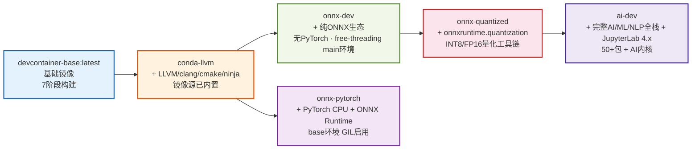
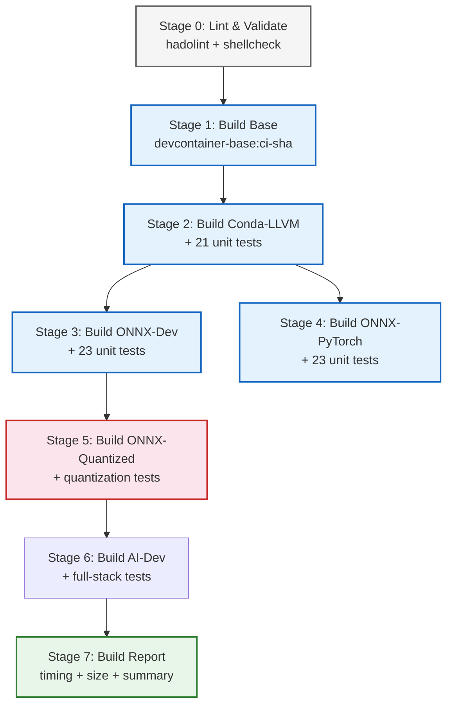

# DevContainer 变体 CI 集成方案

## 1. 概述

本文档定义 devcontainer-base 镜像变体系列的 CI（持续集成）流水线配置，基于依赖拓扑图实现自动构建、测试和验证。

### 1.1 变体依赖拓扑



**构建顺序必须遵循**：`base → conda-llvm → onnx-dev/onnx-pytorch → onnx-quantized → ai-dev`（拓扑排序）。其中 `onnx-dev` 与 `onnx-pytorch` 为平行分支（均基于 conda-llvm），`onnx-quantized` 只依赖 `onnx-dev`（纯 ONNX 链），`ai-dev` 是链末端。

---

## 2. 触发条件

### 2.1 Pull Request 触发（PR 检查）

**触发路径过滤**：
```
apps/docker-images/devcontainer-base/Dockerfile
apps/docker-images/devcontainer-base/entrypoint.sh
apps/docker-images/devcontainer-base/scripts/**
apps/docker-images/devcontainer-base/config/**
apps/docker-images/devcontainer-base/variants/**
apps/docker-images/devcontainer-base/.agents/**
!apps/docker-images/devcontainer-base/**/*.md
```

**触发动作**：
- `opened`：PR 创建时
- `synchronize`：PR 有新提交时
- `reopened`：PR 重新打开时
- `ready_for_review`：从 Draft 转为 Ready 时

**PR 检查内容**：
1. Dockerfile 语法检查（hadolint）
2. Bash 脚本语法检查（shellcheck）
3. 变体 build.sh 拓扑排序逻辑验证（test-timer-parser.sh）
4. **不进行完整 Docker 构建**（PR 阶段快速反馈，完整构建在 main 分支进行）

### 2.2 Main 分支推送触发（完整构建）

**触发分支**：`main`（仅主分支）

**触发条件**：
- 直接推送到 main（受限，需保护分支规则）
- PR 合并到 main 后

**构建矩阵**：
| 参数 | 值 | 说明 |
|------|-----|------|
| MIRROR | `official` | 官方源构建（用于发布验证） |
| MIRROR | `cn` | 国内源构建（加速国内用户使用） |
| VARIANT | `base, conda-llvm, onnx-dev, onnx-pytorch, onnx-quantized, ai-dev` | 按依赖顺序构建 |

**完整构建内容**：
1. 按拓扑顺序构建所有镜像
2. 运行所有变体的单元测试脚本
3. 镜像大小统计
4. 构建耗时分析（解析 [TIMER] 标记）

### 2.3 定时触发（Nightly Build）

**触发时间**：每日 UTC 00:00（北京时间 08:00）

**目的**：
- 基础镜像（ubuntu:26.04）安全更新验证
- conda/pip 包版本升级验证
- 捕获依赖包的 breaking changes

**构建内容**：同 main 分支完整构建，附加：
- 镜像安全扫描（trivy）
- 更全面的集成测试

### 2.4 手动触发（workflow_dispatch）

**可选参数**：
- `variant`：选择构建单个变体（base/conda-llvm/onnx-dev/onnx-pytorch/onnx-quantized/ai-dev/all）
- `mirror`：选择镜像源（official/cn）
- `no_cache`：是否禁用缓存
- `run_tests`：是否运行测试

---

## 3. CI 流水线阶段设计

### 3.1 Stage 0: 前置检查（Lint & Validate）

**所有触发条件都执行**，快速失败机制：

| 检查项 | 工具 | 超时 | 说明 |
|--------|------|------|------|
| Dockerfile 语法检查 | hadolint | 30s | 检查所有 Dockerfile（包括变体） |
| Bash 脚本语法检查 | shellcheck | 30s | 检查所有 .sh 脚本 |
| build.sh 拓扑逻辑验证 | test-timer-parser.sh | 30s | 验证 VARIANTS 配置和计时器解析 |
| 共享脚本语法验证 | bash -n | 10s | conda-mirror-setup.sh, logging.sh |

### 3.2 Stage 1: 基础镜像构建（base）

**仅在基础镜像相关文件变更时构建**：

```yaml
- name: Build base image
  run: |
    cd apps/docker-images/devcontainer-base
    if [ "${{ inputs.mirror }}" = "cn" ]; then
      bash scripts/build.sh --cn --tag ci-${{ github.sha }}
    else
      bash scripts/build.sh --tag ci-${{ github.sha }}
    fi
```

**缓存策略**：
- 使用 Docker Buildx 缓存挂载（已在 Dockerfile 中配置）
- GHA cache 导出/导入（type=gha）加速跨 run 构建

### 3.3 Stage 2: Conda-LLVM 变体构建

**依赖 Stage 1 成功完成**（conda-llvm 直接基于基础镜像，镜像源已内置，无独立 conda 阶段）：

```yaml
- name: Build conda-llvm variant
  needs: build-base
  run: |
    cd apps/docker-images/devcontainer-base
    bash variants/build.sh --variant conda-llvm --tag ci-${{ github.sha }} $([ "${{ inputs.mirror }}" = "cn" ] && echo "--cn")
- name: Run conda-llvm tests
  run: |
    cd apps/docker-images/devcontainer-base
    bash variants/scripts/test-conda-llvm.sh --tag ci-${{ github.sha }}
```

**验证**：
- 运行 conda 版本检查（容器内 conda --version）
- 确认 /opt/conda 存在且 /opt/conda/envs/main/bin/python 可用（Python 3.14.6 cp314t，free-threading，GIL 禁用）；base 环境 /opt/conda/bin/python 为标准构建（GIL 启用）
- 确认 LLVM/clang/cmake/ninja 版本
- 确认 PATH 优先级正确

**测试**：运行 test-conda-llvm.sh 的21项单元测试。

### 3.4 Stage 3: ONNX-Dev 变体构建

**依赖 Stage 2 成功完成**：

```yaml
- name: Build onnx-dev variant
  needs: build-conda-llvm
  run: |
    cd apps/docker-images/devcontainer-base
    bash variants/build.sh --variant onnx-dev --tag ci-${{ github.sha }} $([ "${{ inputs.mirror }}" = "cn" ] && echo "--cn")
- name: Run onnx-dev tests
  run: |
    cd apps/docker-images/devcontainer-base
    bash variants/scripts/test-onnx-dev.sh --tag ci-${{ github.sha }}
```

**测试**：运行 test-onnx-dev.sh 的23项单元测试，包含纯 ONNX 生态导入、free-threading GIL 禁用验证、torch/onnxoptimizer 缺席负向验证。

### 3.5 Stage 4: ONNX-PyTorch 变体构建

**依赖 Stage 2 成功完成**（与 onnx-dev 平行的独立分支，均基于 conda-llvm）：

```yaml
- name: Build onnx-pytorch variant
  needs: build-conda-llvm
  run: |
    cd apps/docker-images/devcontainer-base
    bash variants/build.sh --variant onnx-pytorch --tag ci-${{ github.sha }} $([ "${{ inputs.mirror }}" = "cn" ] && echo "--cn")
- name: Run onnx-pytorch tests
  run: |
    cd apps/docker-images/devcontainer-base
    bash variants/scripts/test-onnx-pytorch.sh --tag ci-${{ github.sha }}
```

**测试**：运行 test-onnx-pytorch.sh 的23项单元测试，包含 PyTorch 张量运算 + ONNX 导出 + ONNX Runtime 推理冒烟测试 + GIL 启用守卫。

### 3.6 Stage 5: ONNX-Quantized 变体构建

**依赖 Stage 3 成功完成**（基于 onnx-dev，纯 ONNX 无 PyTorch）：

```yaml
- name: Build onnx-quantized variant
  needs: build-onnx-dev
  run: |
    cd apps/docker-images/devcontainer-base
    bash variants/build.sh --variant onnx-quantized --tag ci-${{ github.sha }} $([ "${{ inputs.mirror }}" = "cn" ] && echo "--cn")
- name: Run onnx-quantized tests
  run: |
    cd apps/docker-images/devcontainer-base
    bash variants/scripts/test-onnx-quantized.sh --tag ci-${{ github.sha }}
```

**测试**：运行 test-onnx-quantized.sh 的量化工具链单元测试，包含：
- onnxruntime.quantization API导入验证（quantize_dynamic/quantize_static/quantize_qat等）
- 动态INT8量化冒烟测试
- FP16半精度转换验证
- onnx_quantize_kit包导入与API可用性检查
- torch/onnxoptimizer 缺席负向验证

**额外CI门禁**（onnx-quantize-ci.yml独立流水线）：
- Python 3.10/3.11/3.12 多版本测试矩阵
- G1-G11 回归测试（test_ort_quantization_regression.py）
- CI量化门禁脚本（ci_quantization_gate.py）：cosine_sim ≥ 0.90 精度阈值
- 性能基准测试（benchmark阶段，仅定时/手动触发）

### 3.7 Stage 6: AI-Dev 变体构建

**依赖 Stage 5 成功完成**（ai-dev 是链末端，基于 onnx-quantized）：

```yaml
- name: Build ai-dev variant
  needs: build-onnx-quantized
  run: |
    cd apps/docker-images/devcontainer-base
    bash variants/build.sh --variant ai-dev --tag ci-${{ github.sha }} $([ "${{ inputs.mirror }}" = "cn" ] && echo "--cn")
- name: Run ai-dev tests
  run: |
    cd apps/docker-images/devcontainer-base
    bash variants/scripts/test-ai-dev.sh --tag ci-${{ github.sha }}
```

**测试**：运行 test-ai-dev.sh 的全栈单元测试，包含 AI/ML/NLP 核心包导入（transformers/datasets/fastapi等）、可视化/CLI 工具、NLP/文档处理、数据库驱动、JupyterLab 4.x 与 AI 内核注册验证、量化继承验证。

### 3.8 Stage 7: 构建报告与清理

| 项 | 说明 |
|----|------|
| 构建耗时汇总 | 解析 [TIMER] 日志，输出各阶段耗时表格 |
| 镜像大小报告 | docker images 列出所有构建镜像大小 |
| 测试结果汇总 | 汇总所有变体测试 PASS/FAIL 数量 |
| 日志上传 | 构建日志作为 artifact 保留（7天） |
| 镜像清理 | （可选）删除 CI 构建的镜像（不推送则自动清理） |

---

## 4. 变体构建作业依赖图



**关键设计点**：
- 分层依赖链：onnx-dev 与 onnx-pytorch 是 conda-llvm 的平行子变体，可并行构建
- 线性主链：base → conda-llvm → onnx-dev → onnx-quantized → ai-dev（ai-dev 为链末端）
- 失败快速终止：前置阶段失败则后续阶段跳过
- 并行优化空间：base镜像可与lint并行；onnx-dev 与 onnx-pytorch 可并行；变体其余部分按顺序构建（层缓存依赖）

---

## 5. Docker 镜像推送策略（可选扩展）

### 5.1 标签策略

| 触发 | 标签格式 | 示例 |
|------|---------|------|
| main 分支 | `:latest-<variant>` | `devcontainer-base:conda-latest` |
| Tag 发布 | `:v<version>-<variant>` | `devcontainer-base:onnx-quantized-v1.0.0` |
| PR 构建 | `:pr-<prnum>-<sha>` | `devcontainer-base:conda-pr-123-abc123`（不推送，仅本地验证） |
| Nightly | `:nightly-<date>-<variant>` | `devcontainer-base:conda-nightly-20260807` |

### 5.2 镜像仓库

- **GitHub Container Registry (ghcr.io)**：推荐，与 GitHub Actions 原生集成
- **Docker Hub**：可选，需配置 DOCKERHUB_USERNAME/DOCKERHUB_TOKEN secrets

---

## 6. 共享脚本模式落实检查清单

基于「共享脚本 COPY + 环境变量驱动」模式，各变体 Dockerfile 符合度：

| 变体 | 共享脚本使用 | 状态 | 备注 |
|------|-------------|------|------|
| conda-llvm | ➖ 继承自基础镜像 | ✅ 符合 | 镜像源已内置于基础镜像，无需重复配置 |
| onnx-dev | ➖ 继承自conda-llvm | ✅ 符合 | 镜像源已在conda-llvm层配置 |
| onnx-pytorch | ➖ 继承自conda-llvm | ✅ 符合 | 镜像源已在conda-llvm层配置 |
| onnx-quantized | ✅ 继承共享脚本模式 | ✅ 符合 | 量化工具链零额外重量级依赖 |
| ai-dev | ✅ 继承共享脚本模式 | ✅ 符合 | 50+包全栈安装，继承量化工具链 |
| _template | ✅ 注释说明共享脚本用法 | ✅ 符合 | Stage 2注释包含COPY指令提示 |

### 6.1 共享脚本扩展建议

未来新增共享脚本时遵循：

1. **位置**：`variants/shared/scripts/<script-name>.sh`
2. **模式**：COPY 到 `/usr/local/bin/`，通过环境变量驱动行为
3. **规范**：
   - 开头 `#!/bin/bash` + `set -euo pipefail`
   - 日志前缀使用 `[SHARED]`
   - 通过环境变量接收参数（不是位置参数）
   - 包含 `--help` 支持（可选）
   - bash -n 语法检查通过

**当前共享脚本清单**：
| 脚本 | 位置 | 用途 | 使用方 |
|------|------|------|--------|
| conda-mirror-setup.sh | shared/scripts/ | conda + pip镜像源配置 | conda变体、_template |
| logging.sh | shared/lib/ | 结构化日志函数 | 所有变体脚本 |

---

## 7. 新增变体 CI  Checklist

当添加新变体（如 `cuda`、`nodejs`）时，CI 需更新：

- [ ] 在 `variants/build.sh` 的 VARIANTS 数组中注册新变体（含 deps）
- [ ] 在 GitHub Actions workflow 中添加对应的 build job
- [ ] 设置正确的 `needs:` 依赖（直接父变体）
- [ ] 添加对应的 test 脚本运行步骤
- [ ] 更新拓扑图文档
- [ ] 更新镜像标签矩阵（如果需要推送）

---

## 8. GitHub Actions Workflow 文件位置

实际 workflow 文件应放在：
```
.github/workflows/devcontainer-variants.yml    # 变体构建流水线（Docker-based）
.github/workflows/onnx-quantize-ci.yml         # ONNX量化工具包CI（Python-based）
```

### 8.1 onnx-quantize-ci.yml 独立流水线

专门为 `scripts/onnx_quantize_kit/` 设计的Python CI，与Docker构建流水线分离：

| 项 | 说明 |
|----|------|
| 触发条件 | onnx_quantize_kit代码/测试/Dockerfile/CI配置变更（push/main + PR）；每周日定时全量回归；手动触发 |
| 测试矩阵 | Python 3.10 / 3.11 / 3.12 |
| 阶段 | ①install → ②unit-tests（test_quantize_kit.py）→ ③regression-tests（G1-G11 test_ort_quantization_regression.py）→ ④ci-gate（cosine_sim≥0.90精度门禁）→ ⑤benchmark（仅定时/手动） |
| 依赖 | onnxruntime, onnx, numpy, onnxconverter-common, psutil（ci-requirements.txt） |
| 门禁 | 量化后模型 cosine_similarity ≥ 0.90，失败阻断合并 |

（本设计文档在 `.agents/workflows/variants-ci.md`，是人类可读的设计说明）

---

## 9. Free-threading Jupyter GIL 守卫规范（PYTHON_GIL）

> **来源**：2026-08-19 故障排查报告 `troubleshooting-devcontainer-jupyter-gil-20260819.md`。本规范定义 free-threading（cp314t）镜像中 Jupyter 进程的 GIL 保持禁用**不变式**，CI 与变体构建必须遵守。

### 9.1 不变式

**base 镜像的 `/etc/supervisor/conf.d/jupyter.conf` 中 `environment=` 行必须包含 `PYTHON_GIL="0"`。**

违反后果：Jupyter 栈依赖的 C 扩展 `_brotli` 未声明 `Py_MOD_GIL_USED`，free-threading 下 import 时经 `PyUnstable_Module_SetGIL` 自动拉起 GIL——表现为 **bash 上下文 `_is_gil_enabled()=False`、Jupyter kernel 内 `=True`** 的不一致，kernel 多线程静默退化为串行（无报错、无警告）。

### 9.2 配置逻辑（幂等注入片段）

源文件：`config/supervisor/conf.d/jupyter.conf`（base 镜像 `COPY config/supervisor/conf.d/` 进入镜像）。

变体层防御（如 `variants/conda-llvm/Dockerfile`，对**从旧 base tag 构建**的场景生效；base 已含时走幂等跳过分支）：

```dockerfile
# ── Free-threading Jupyter fix: keep GIL disabled in Jupyter kernel ──
# Without PYTHON_GIL=0, importing _brotli (used by jupyter stack) auto-enables
# the GIL in free-threading Python, silently nullifying FT concurrency benefits.
if [ -f /etc/supervisor/conf.d/jupyter.conf ]; then
    if ! grep -q "PYTHON_GIL" /etc/supervisor/conf.d/jupyter.conf; then
        sed -i 's|^environment=\(.*\)$|environment=\1,PYTHON_GIL="0"|' /etc/supervisor/conf.d/jupyter.conf
        variant_log_ok "jupyter.conf: injected PYTHON_GIL=0 (free-threading GIL fix)"
    else
        variant_log_ok "jupyter.conf: PYTHON_GIL already set, skip"
    fi
fi
```

### 9.3 优先级语义（易踩坑）

- **supervisord `environment=` 优先级高于 `docker run -e`**：仅 `-e PYTHON_GIL=1` 启动**不能**把 Jupyter 切回 GIL 兼容模式——需同步修改 supervisord 配置（`environment=` 会覆盖继承的进程环境变量）。
- **GIL 是进程级一次性保险丝**：`PYTHON_GIL=0` 只设定进程初始状态；运行中 import 未声明 `Py_MOD_GIL_USED` 的 C 扩展仍会拉起 GIL 且无法在当前进程内关闭。因此必须在 supervisord 启动 Jupyter 时锁定，而非事后补救。
- **entrypoint 不冲突**：`entrypoint.sh` 运行时仅 sed 修改 jupyter.conf 的 `directory=` 行，不触碰 `environment=` 行，不会覆盖本注入。

### 9.4 验证命令（CI 门禁建议）

在 Stage 2/3 测试中增加以下守卫（放入 `test-conda-llvm.sh` / `test-onnx-dev.sh`）：

```bash
# ① 配置级：jupyter.conf 必须含 PYTHON_GIL（幂等断言）
grep -q 'PYTHON_GIL="0"' /etc/supervisor/conf.d/jupyter.conf \
    || { echo "FAIL: jupyter.conf missing PYTHON_GIL"; exit 1; }

# ② 运行时级：kernel 内 _is_gil_enabled() 必须为 False（E2E）
#    ——一键脚本 variants/scripts/fix-jupyter-gil.sh --verify
bash variants/scripts/fix-jupyter-gil.sh --verify
```

### 9.5 排查速查

| 症状 | 结论 | 处置 |
|------|------|------|
| bash GIL=False、kernel GIL=True | jupyter.conf 缺 `PYTHON_GIL="0"` 或未重启服务 | `bash fix-jupyter-gil.sh --all` |
| 单进程 import 后 GIL 被拉起 | 该 C 扩展未声明 `Py_MOD_GIL_USED` | `scripts/check_gil_state.py --audit <mod>` 定位肇事模块；等待上游修复或剔除 |
| 需为 Jupyter 切回 GIL 兼容模式 | supervisord 配置未改 | 修改 `environment=` 中 `PYTHON_GIL="1"` 并重启（`-e` 无效） |
