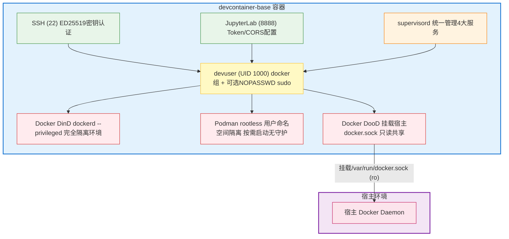

# DevContainer Base - 标准化开发容器基础镜像 (SSH + Docker + Podman + Jupyter)

> 🤖 **AI 智能体入口**：本项目 AI 协作者规范见 [AGENTS.md](AGENTS.md)，完整目录结构见 [.agents/structure.md](.agents/structure.md)。
>
> ⚠️ **元数据维护提示**：本 README 目录（TOC）需与章节标题同步修改；docs/ 深度文档条目数应与 `ls docs/*.md | wc -l` 匹配；变体清单与 [variants/README.md](variants/README.md) 保持一致。
>
> 基于 Ubuntu 26.04 的企业级全功能开发容器基础镜像，集成 OpenSSH Server、Docker DinD/DooD、Podman rootless 和 Jupyter Notebook/Lab 四大核心服务，通过 supervisord 统一进程管理，支持环境变量动态服务启停。

---

## 📑 目录导航

| 章节 | 说明 | 适合谁 |
|------|------|--------|
| [✨ 核心特性](#-核心特性) | 8条速览，判断适不适合你 | 所有人 |
| [🏗️ 架构概览](#️-架构概览) | 4大服务端口对照表 + 运行模式 | 架构师/运维 |
| [🚀 快速开始（5分钟上手）](#-快速开始5分钟上手) | 2问选路径→构建→启动→验证闭环 | 新用户 ⭐推荐 |
| [🛠️ 部署模式详解](#️-部署模式详解) | DinD/DooD/SSH-only 三种 Compose profile | DevOps |
| [🔌 连接方式详解](#-连接方式详解) | SSH/Jupyter/IDE桥接/Docker/Podman | 所有开发者 |
| [⚙️ 配置参考](#️-配置参考) | 构建参数 vs 运行时变量两张表 | 高级用户 |
| [📋 服务管理](#-服务管理) | supervisorctl + 健康检查 | 运维/调试 |
| [🧩 镜像变体 & 扩展](#-镜像变体--扩展) | 6级变体依赖链 + 作为Base镜像 | 镜像维护者 |
| [🔧 Slim 镜像构建与验证](#-slim-镜像构建与验证) | 全链路构建脚本 + 清理策略 + 验证清单 | 构建/维护镜像 ⭐ |
| [🧪 ONNX 量化工具包](#-onnx-量化工具包) | onnx_quantize_kit 高层API指南 | 模型工程师 |
| [🔄 CI/CD 流水线](#-cicd-流水线) | 双CI配置 + 手动触发命令 | CI维护者 |
| [❓ FAQ & 故障排查](#-faq--故障排查) | 5条最常见问题及解决方案 | 遇到问题时 ⭐ |
| [📚 深入阅读导航](#-深入阅读导航) | docs/ 每篇深度文档一句话引导 | 需要进阶时 |
| [📝 版本信息 & 相关链接](#-版本信息--相关链接) | 版本矩阵 + CHANGELOG + 相关镜像 | 所有人 |

---

## ✨ 核心特性

| # | 特性 | 一句话说明 |
|---|------|-----------|
| 1 | **Ubuntu 26.04 基础** | 固定标签 + 中文 locale zh_CN.UTF-8 + Asia/Shanghai 时区 |
| 2 | **Python 3.14.6 free-threading** | Miniforge3 (conda-forge) + cp314t 无GIL构建，`PYTHON_GIL=1` 可切兼容模式 |
| 3 | **四大服务可独立启停** | SSH(22) + Docker DinD/DooD + Podman(rootless) + JupyterLab(8888)，通过 ENVs 控制 |
| 4 | **双容器运行时** | Docker DinD（完全隔离，需--privileged）/ DooD（挂载宿主socket，无需特权）；Podman rootless 备选 |
| 5 | **Supervisord 统一管理** | 服务自动重启、优先级调度、日志聚合 |
| 6 | **安全增强** | 非 root 用户 devuser(UID 1000) + SSH ED25519 密钥 + Jupyter Token/密码 + SSH host keys启动时生成 |
| 7 | **国内源一键加速** | APT/PyPI/Docker CE/Conda 均可独立切镜像源（aliyun/tuna/official） |
| 8 | **Slim 镜像优化** | CoW 层序优化 + 激进清理策略，root ~1.41GB / conda-llvm ~3.18GB / onnx-quantized ~3.5GB（较优化前节省 ~1.7GB） |

---

## 🏗️ 架构概览

### 四大核心服务对照表

| 服务 | 默认端口 | 启用ENV | 进程管理 | 说明 |
|------|---------|:--------:|---------|------|
| **OpenSSH Server** | TCP 22 | `ENABLE_SSH=yes` | supervisord | ED25519优先，devuser登录，支持密钥+密码 |
| **Docker DinD** | unix socket (TCP 2375可选) | `ENABLE_DOCKER=yes` | supervisord | Docker-in-Docker，需`--privileged`，完全隔离 |
| **Docker DooD** | 宿主 socket 挂载 | 检测到`/var/run/docker.sock`自动启用 | 宿主Docker | 容器内docker命令直接操作宿主Docker，无需特权 |
| **Podman (rootless)** | unix socket | `ENABLE_PODMAN=yes` | 按需启动（无守护进程） | 用户命名空间隔离，cgroupv2兼容 |
| **JupyterLab** | TCP 8888 | `ENABLE_JUPYTER=yes` | supervisord | conda Python环境，Token/Password/CORS配置 |

### 运行模式架构图



---

## 🚀 快速开始（5分钟上手）

### 先选适合你的路径（2问定位）

|  | 你需要完全隔离的Docker环境吗？ |
|---|:---:|
| **是（推荐开发机）** | 否（CI/共享宿主机Docker） |
| **👉 路径A：DinD模式** | 👉 路径B：DooD模式 |
| 需要 `--privileged` | 挂载宿主 `/var/run/docker.sock` |

> 只需VSCode/Trae连接容器内Jupyter Kernel？→ 跳过上面，直接走 [路径C：IDE Jupyter桥接模式](#路径cide-jupyter桥接模式推荐vscodetrae用户)

---

### 路径A：DinD模式（推荐本地开发）

```bash
# Step 1: 构建镜像（国内源加速可选）
bash scripts/build.sh --apt-mirror aliyun --pip-mirror aliyun --docker-mirror aliyun

# Step 2: 启动容器（Compose dind profile）
docker compose --profile dind up -d

# Step 3: 连接（下方"连接方式"有详细说明）
#   SSH:     ssh devuser@localhost -p 2222
#   Jupyter: http://localhost:8888  (token见 docker compose logs jupyter)
```

### 路径B：DooD模式（推荐CI/共享宿主机）

```bash
# Step 1: 构建镜像
bash scripts/build.sh

# Step 2: 启动容器（Compose dood profile）
docker compose --profile dood up -d

# Step 3: 容器内 docker 命令直接使用宿主机镜像和网络
```

### 路径C：IDE Jupyter桥接模式（推荐VSCode/Trae用户）

```bash
# 一键启动（含健康检查+连接引导，已配置CORS+端口映射）
bash scripts/run-jupyter-ide.sh
```

启动后在 IDE 中连接：
1. `Ctrl+Shift+P` → **Jupyter: Specify Jupyter Server for Connections**
2. 选择 **Existing** → 输入 `http://localhost:8888/?token=devtoken123`
3. 打开 `.ipynb` → 选择 Python 3 kernel（容器内执行）

> 💡 完整指南见 [docs/IDE-JUPYTER-BRIDGE.md](docs/IDE-JUPYTER-BRIDGE.md)。

---

### ✅ 5分钟冒烟验证 Checklist

完成任一启动路径后，逐项打勾确认：

```bash
# 1️⃣  SSH登录成功（默认密码：启动日志中随机生成，或设置USER_PASSWORD）
ssh devuser@localhost -p 2222 "echo SSH_OK"

# 2️⃣  Python版本验证（应为 3.14.x，free-threading 含 "x" 后缀）
ssh devuser@localhost -p 2222 "python3 --version && python3 -c \"import sysconfig; print('GIL_disabled:', sysconfig.get_config_var('Py_GIL_DISABLED') == 1)\""

# 3️⃣  Conda + libmamba 求解器
ssh devuser@localhost -p 2222 "conda --version && conda config --show solver"

# 4️⃣  Docker命令可用（DinD/DooD任一）
ssh devuser@localhost -p 2222 "docker ps && docker run --rm hello-world 2>&1 | head -3"

# 5️⃣  Jupyter HTTP API响应（200/302/401/403均正常）
curl -s -o /dev/null -w "%{http_code}" http://localhost:8888/api

# 6️⃣  (可选) Podman rootless
ssh devuser@localhost -p 2222 "ENABLE_PODMAN=yes podman ps 2>&1 | head -3"

# 7️⃣  Free-threading多线程演示（验证真正并行）
docker exec -it $(docker compose ps -q | head -1) python examples/free_threading_demo.py
```

⚠️ **验证模板说明**：输出中的版本号仅供参考，以实际 `--version` 输出为准；如遇差异请对照 [CHANGELOG.md](CHANGELOG.md) 或运行完整验证脚本 `scripts/verify-services.sh`。

---

## 🛠️ 部署模式详解

### Docker Compose 三种 Profile

| Profile | 说明 | 核心配置 | 典型场景 |
|---------|------|---------|---------|
| **dind** | Docker-in-Docker（推荐） | `--privileged` + docker-storage volume | 本地开发、完全隔离 |
| **dood** | Docker-out-of-Docker | 挂载 `/var/run/docker.sock:ro` | CI流水线、共享宿主机Docker |
| **ssh-only** | 最小化仅SSH | 不启用Docker/Jupyter | 轻量SSH跳板机 |

```bash
# DinD模式
docker compose --profile dind up -d

# DooD模式
docker compose --profile dood up -d

# SSH-only
docker compose --profile ssh-only up -d

# 日志查看 & 停止
docker compose logs -f
docker compose down
```

### 手动 `docker run` 命令速查

<details>
<summary>📌 展开查看完整 docker run 示例（DinD/DooD/一次性命令）</summary>

#### DinD模式（需 --privileged）
```bash
docker run -d \
  --name devcontainer \
  --privileged \
  -p 2222:22 -p 8888:8888 \
  -v $(pwd)/workspace:/workspace \
  -v docker-storage:/var/lib/docker \
  -e USER_PASSWORD=your_password \
  -e JUPYTER_TOKEN=your_token \
  -e GRANT_SUDO=yes \
  devcontainer-base:conda-libmamba-v2
```

#### DooD模式（无需特权，挂载宿主socket）
```bash
docker run -d \
  --name devcontainer-dood \
  -p 2223:22 -p 8889:8888 \
  -v $(pwd)/workspace:/workspace \
  -v /var/run/docker.sock:/var/run/docker.sock:ro \
  -e USER_PASSWORD=your_password \
  -e JUPYTER_TOKEN=your_token \
  devcontainer-base:conda-libmamba-v2
```
entrypoint 检测到宿主 socket 会自动禁用内部 dockerd。

#### 一次性命令模式（调试/临时任务）
```bash
docker run -it --rm devcontainer-base:conda-libmamba-v2 bash
```

</details>

---

## 🔌 连接方式详解

> 端口以 DinD Compose profile 为例；其他模式请根据实际 `-p` 映射调整。

| 服务 | 命令 / 操作 | 默认地址 / 凭证 |
|------|------------|----------------|
| **SSH** | `ssh devuser@localhost -p 2222` | 密码：`USER_PASSWORD`（未设置则启动时随机生成，看日志） |
| **Jupyter** | 浏览器打开 | http://localhost:8888/ ；Token：`JUPYTER_TOKEN` 或设置 `JUPYTER_PASSWORD` |
| **IDE Jupyter 桥接** | 1. `Ctrl+Shift+P` → Jupyter Specify Server<br>2. Existing → 输入URL | `http://localhost:8888/?token=<JUPYTER_TOKEN>`；需设 `JUPYTER_ALLOW_ORIGIN=*`（IDE WebView CORS） |
| **Docker（容器内SSH后）** | 直接使用 docker 命令 | devuser 已在 docker 组；DinD 容器内独立 /var/lib/docker |
| **Podman（rootless）** | 需设 `ENABLE_PODMAN=yes` 后使用 | 无守护进程，`podman ps` / `podman run --rm hello-world` |

---

## ⚙️ 配置参考

### 表 1：构建参数（Docker Build ARGs —— 仅 `docker build --build-arg` 时生效）

| Build ARG | 默认值 | 说明 | 示例 |
|-----------|-------|------|------|
| `APT_MIRROR` | `official` | APT软件源 | `aliyun` / `tuna` / `official` |
| `PIP_MIRROR` | `official` | PyPI 镜像源 | `aliyun` / `tuna` / `official` |
| `DOCKER_MIRROR` | `official` | Docker CE 安装源 | `aliyun` / `official` |
| `CONDA_MIRROR` | `official` | Conda 频道（推荐 official 保证稳定性） | `official` / `bfsu` |
| `PYTHON_BUILD` | `cp314t` | Python 构建变体 | `cp314t`（无GIL，默认）/ `cp314`（标准GIL） |

> 构建脚本 `scripts/build.sh` 封装了上述参数，如：`bash scripts/build.sh --apt-mirror aliyun --network-host`

### 表 2：运行时环境变量（`docker run -e` 或 Compose `environment:` 生效）

| ENV | 默认值 | 说明 |
|-----|-------|------|
| `ENABLE_SSH` | `yes` | 启用 SSH 服务 |
| `ENABLE_DOCKER` | `yes` | 启用 Docker（DinD模式；若检测到宿主socket则自动切DooD） |
| `ENABLE_PODMAN` | `no` | 启用 Podman rootless（与 Docker 同开时 cgroupv2 可能冲突） |
| `ENABLE_JUPYTER` | `yes` | 启用 Jupyter Notebook/Lab |
| `USER_PASSWORD` | *(随机生成，看日志)* | devuser 用户密码 |
| `ROOT_PASSWORD` | *(不设置)* | root 密码，需配合 `ALLOW_ROOT_SSH=yes` |
| `JUPYTER_TOKEN` | *(随机生成)* | Jupyter 访问令牌 |
| `JUPYTER_PASSWORD` | *(空)* | Jupyter 密码（与 Token 二选一） |
| `JUPYTER_ALLOW_ORIGIN` | *(空)* | Jupyter CORS 允许 Origin（IDE WebView 连接需设为 `*`） |
| `GRANT_SUDO` | `no` | devuser 免密 sudo |
| `ALLOW_ROOT_SSH` | `no` | 允许 root SSH 登录 |
| `SSH_PUBLIC_KEY` | *(空)* | SSH 公钥注入（一行一个公钥内容） |
| `JUPYTER_PORT` | `8888` | Jupyter 监听端口（容器内，宿主用 `-p` 映射） |
| `SSH_PORT` | `22` | SSH 监听端口（容器内） |
| `TZ` | `Asia/Shanghai` | 容器时区 |
| `DEBUG` | `0` | 调试模式（entrypoint 脚本 `set -x`） |

---

## 📋 服务管理

容器内所有持久服务通过 **supervisord** 统一管理：

```bash
# 查看所有服务状态
supervisorctl status

# 重启单个服务
supervisorctl restart sshd       # SSH
supervisorctl restart dockerd    # Docker DinD daemon
supervisorctl restart jupyter    # JupyterLab

# 实时查看服务日志（最后50行 + follow）
supervisorctl tail -f dockerd
supervisorctl tail -f jupyter
```

> **注意**：Podman 不通过 supervisord 管理，为 rootless 按需启动模式，无需守护进程。

### 健康检查

内置 `healthcheck.sh` 条件化检查已启用服务：
- **SSH**：端口监听检测
- **Docker**：dockerd 进程 + docker.sock + `docker info`
- **Jupyter**：HTTP API 检测（200/302/401/403 均为正常）

Docker HEALTHCHECK 参数：`interval=30s` / `timeout=10s` / `start-period=60s` / `retries=3`

---

## 🧩 镜像变体 & 扩展

### 变体依赖链（6级，按构建拓扑排序）

```
base (slim: ~1.41GB)
  ↓  Ubuntu 26.04 + SSH + Docker + Podman + Jupyter + Miniforge3 + Python 3.14.6 cp314t
conda
  ↓  镜像源配置 + 基础验证（Miniforge3已在base中）
conda-llvm (slim: ~3.18GB)
  ↓  LLVM 22.1.8 + Clang + CMake + Ninja + ccache + pandoc（via conda-forge）
onnx-dev (slim: ~3.38GB)
  ↓  ONNX 1.22 + ONNX Runtime 1.29
onnx-quantized (slim: ~3.50GB)
  ↓  onnxruntime.quantization 量化工具链（INT8/FP16）+ onnx_quantize_kit
ai-dev
     全栈 AI/ML/NLP 生态 50+ 包 + JupyterLab 4.x + AI 内核
```

> ⚠️ `onnx-pytorch` 变体基于 `conda-llvm`，与 `onnx-dev` 平行；Slim 构建链为 `root → conda-llvm → onnx-dev → onnx-quantized`。

| 变体 | 核心组件（简） | 构建命令 |
|------|--------------|---------|
| conda | conda/pip 镜像源配置 + 验证 | `bash variants/build.sh --variant conda --cn` |
| conda-llvm | LLVM 22.1.8 / Clang / CMake / Ninja | `bash variants/build.sh --variant conda-llvm --cn` |
| onnx-pytorch | PyTorch CPU / ONNX Runtime / onnxsim | `bash variants/build.sh --variant onnx-pytorch --cn` |
| onnx-quantized | onnx_quantize_kit / INT8 / FP16 | `bash variants/build.sh --variant onnx-quantized --cn` |
| ai-dev | transformers / datasets / fastapi / JupyterLab4 | `bash variants/build.sh --variant ai-dev --cn` |

> 👆 **8条均为核心条目，未展开**。完整变体文档、构建脚本、测试规范见 [variants/README.md](variants/README.md)（变体入口）和 [variants/AGENTS.md](variants/AGENTS.md)（变体 AI 协作者规范）。

### 作为基础镜像（FROM 本镜像）

```dockerfile
FROM devcontainer-base:conda-libmamba-v2

USER root
# 安装 apt 包（用 --no-install-recommends 减小体积）
RUN apt-get update && apt-get install -y --no-install-recommends \
    your-package-here \
    && rm -rf /var/lib/apt/lists/*

# conda 环境安装（默认已激活 base，libmamba solver）
RUN conda install -y your-conda-pkg && conda clean -yafq
# 或 pip 安装
RUN pip install your-pip-pkg && pip cache purge

USER devuser
# ENTRYPOINT 保持不变，服务按环境变量自动启动
```

---

## 🔧 Slim 镜像构建与验证

> 本节介绍如何在 WSL2 环境中构建经过瘦身优化的 Slim 镜像，包含全链路构建脚本、清理策略说明和验证步骤。

### 前置条件

| 项 | 要求 |
|----|------|
| **运行环境** | WSL2（推荐 Ubuntu/Debian 发行版） |
| **磁盘空间** | ≥20GB 可用空间（全链路构建需 ~15GB） |
| **Docker** | WSL2 内已安装 Docker CE（构建脚本会自动启动 dockerd） |
| **网络** | 能访问国内镜像源（aliyun/bfsu）或配置了代理 |

### 构建脚本概览

项目根目录提供三个构建/验证脚本：

| 脚本 | 用途 | 场景 |
|------|------|------|
| `build-slim-chain.sh` | **全链路构建**（root → conda-llvm → onnx-dev → onnx-quantized） | 首次构建、root Dockerfile 变更后 |
| `build-slim.sh` | **增量构建**（仅变体层：conda-llvm → onnx-dev → onnx-quantized） | 仅变体/cleanup 脚本变更后（root 已构建） |
| `validate-slim.sh` | **功能验证**（编译/推理/量化冒烟测试） | 构建完成后验证功能完整性 |

### 全链路构建（推荐首次使用）

全链路构建脚本 `build-slim-chain.sh` 自动完成 8 个步骤：

```
[1/8] 重启 dockerd 并配置镜像加速
[2/8] 检查磁盘空间
[3/8] 清理失败构建缓存
[4/8] 构建 root 镜像 devcontainer-base:slim
[5/8] 构建 conda-llvm-slim
[6/8] 构建 onnx-dev-slim
[7/8] 构建 onnx-quantized-slim
[8/8] 输出最终镜像大小 + 日志位置
```

**执行命令（在 WSL2 中）：**

```bash
cd /mnt/d/spaces/SpecWeave/apps/docker-images/devcontainer-base
bash build-slim-chain.sh
```

脚本自动使用国内镜像源：
- APT: `aliyun`
- Docker CE: `aliyun`
- Conda: `bfsu`（北外镜像）
- PyPI: `aliyun`
- Docker Hub 拉取：`daemon.json` 中配置的 7 个 registry-mirrors

构建日志保存在 `logs/` 目录下：
- `logs/build-root-slim.log`
- `logs/build-conda-llvm-slim.log`
- `logs/build-onnx-dev-slim.log`
- `logs/build-onnx-quantized-slim.log`

### 增量构建（root 未变更时）

当仅修改了变体 Dockerfile 或清理脚本（如 `variants/shared/lib/cleanup.sh`）时，root 镜像无需重建，使用增量构建：

```bash
# 确认 dockerd 运行中
docker info >/dev/null 2>&1 || {
    pkill dockerd 2>/dev/null; sleep 1; rm -f /var/run/docker.sock
    mkdir -p /etc/docker && cp daemon.json /etc/docker/daemon.json
    nohup dockerd >/tmp/dockerd.log 2>&1 & sleep 5
}

# 构建 conda-llvm（cleanup.sh 变更影响此层）
cd variants
DOCKER_BUILDKIT=1 docker build \
    --progress=plain \
    -f conda-llvm/Dockerfile \
    --build-arg BASE_TAG=slim \
    --build-arg APT_MIRROR=aliyun \
    --build-arg CONDA_MIRROR=bfsu \
    --build-arg PIP_MIRROR=aliyun \
    -t devcontainer-base:conda-llvm-slim \
    .

# 构建 onnx-dev
DOCKER_BUILDKIT=1 docker build \
    --progress=plain \
    -f onnx-dev/Dockerfile \
    --build-arg BASE_TAG=slim \
    --build-arg APT_MIRROR=aliyun \
    --build-arg CONDA_MIRROR=bfsu \
    --build-arg PIP_MIRROR=aliyun \
    -t devcontainer-base:onnx-dev-slim \
    .

# 构建 onnx-quantized
DOCKER_BUILDKIT=1 docker build \
    --progress=plain \
    -f onnx-quantized/Dockerfile \
    --build-arg BASE_TAG=slim \
    --build-arg APT_MIRROR=aliyun \
    --build-arg CONDA_MIRROR=bfsu \
    --build-arg PIP_MIRROR=aliyun \
    -t devcontainer-base:onnx-quantized-slim \
    .
```

> 变体通过 `BASE_TAG=slim` 引用 root 镜像 `devcontainer-base:slim`，构建链自动按 Docker 层缓存逐层生效。

### 清理策略说明

Slim 镜像的瘦身效果来自两方面：**CoW 层序优化**（消除 `chown -R` 导致的 copy-on-write 膨胀）和**激进清理**（移除冗余组件）。清理逻辑集中在 `variants/shared/lib/cleanup.sh`，由 `cleanup_all_aggressive` 统一调度：

```
cleanup_all_aggressive() 调用顺序：
  ├── cleanup_pycache        → Python __pycache__/.pyc
  ├── cleanup_binaries       → strip ELF + 删除非必要 .a 静态库
  ├── cleanup_llvm_devtools  → LLVM/Clang 冗余工具（详见下表）
  ├── cleanup_dev_headers    → LLVM/Clang 开发头文件（保留，见下表）
  ├── cleanup_conda_pip_cache → conda clean + pip cache purge
  ├── cleanup_apt            → apt clean + lists 删除
  └── cleanup_tmp            → /tmp + /var/tmp 安全清理
```

#### LLVM/Clang 组件保留/删除决策

| 组件 | 大小 | 决策 | 理由 |
|------|------|------|------|
| clang / clang++ / lld | - | ✅ 保留 | 核心编译器/链接器 |
| clang-tidy / clangd | - | ✅ 保留 | IDE 静态分析/LSP |
| clang-format | - | ✅ 保留 | 代码格式化 |
| **pandoc** | 156MB | ✅ **保留** | Jupyter nbconvert 导出 PDF/DOCX 硬依赖 |
| **LLVM/Clang dev headers** | 64MB | ✅ **保留** | TVM/MLIR/LLVM Pass 开发编译链接必需 |
| **cmake/{llvm,clang,lld}** | (含上) | ✅ **保留** | `find_package(LLVM)` CMake 集成必需 |
| **clang-include-cleaner** | 小 | ✅ **保留** | clangd include 诊断依赖 |
| **cpack** | ~15MB | ✅ **保留** | CMake 打包（DEB/RPM/NSIS） |
| clang-offload-bundler | 小 | ✅ **保留** | OpenMP target offload |
| llvm-config / llvm-ar 等 | - | ✅ 保留 | 核心 LLVM 工具链 |
| **llvm-exegesis** | 71MB | ❌ 删除 | CPU 指令基准测试（仅编译器后端开发用） |
| **ccmake** | ~16MB | ❌ 删除 | CMake curses TUI（容器内无人使用） |
| **wasm-ld / ld64.lld / lld-link** | 21MB | ❌ 删除 | WebAssembly/macOS/Windows 交叉链接器 |
| **libexec/llvm** | 21MB | ❌ 删除 | LLVM 内部构建辅助工具 |
| pandoc-server / pandoc-lua | (含pandoc) | ❌ 删除 | pandoc 辅助组件（非 nbconvert 必需） |
| tblgen 工具 | ~6MB | ❌ 删除 | .td 代码生成器（LLVM 自身开发专用） |
| clang-rename/move/query 等 | 小 | ❌ 删除 | 重构 CLI 工具（IDE 内置功能已覆盖） |
| Windows/macOS 交叉工具 | 小 | ❌ 删除 | llvm-cvtres/llvm-rc/llvm-windres 等 |
| llvm-mca/xray 等 | 小 | ❌ 删除 | 高级分析/性能调试工具 |

#### 额外修复：悬空符号链接

`_del()` 辅助函数使用 `[ -e "$f" ] || [ -L "$f" ]` 检查（而非仅 `[ -e ]`），确保悬空符号链接（dangling symlink，如 `llvm-exegesis -> llvm-exegesis-22` 在目标文件已删后）也能被正确清理。

### 验证步骤

构建完成后执行验证脚本：

```bash
bash validate-slim.sh
```

该脚本依次对三个 slim 镜像执行冒烟测试：

**Test 1: conda-llvm-slim**
- Python 版本 + free-threading (GIL disabled) 检查
- Clang/LLVM/CMake/Ninja/ccache 版本
- C++17 编译运行测试（`clang++ -std=c++17`）

**Test 2: onnx-dev-slim**
- ONNX / ONNX Runtime 导入
- 创建简单 ReLU 模型 → ONNX Runtime 推理验证

**Test 3: onnx-quantized-slim**
- `onnxruntime.quantization.quantize_dynamic` 导入
- `onnxconverter_common` / `onnxsim` 可用性

**手动深度验证（可选）：**

```bash
# 1. 验证 pandoc 可用（Jupyter 导出）
docker run --rm --entrypoint bash devcontainer-base:onnx-quantized-slim \
  -c 'echo "# Test" | pandoc -o /tmp/test.html && echo "pandoc: OK"'

# 2. 验证 LLVM CMake config 存在
docker run --rm --entrypoint bash devcontainer-base:conda-llvm-slim \
  -c 'ls /opt/conda/envs/main/lib/cmake/llvm/LLVMConfig.cmake && echo "CMake config: OK"'

# 3. 验证 clang-include-cleaner 可用（clangd 依赖）
docker run --rm --entrypoint bash devcontainer-base:conda-llvm-slim \
  -c 'which clang-include-cleaner && echo "include-cleaner: OK"'

# 4. 验证 ONNX 量化端到端
docker run --rm --entrypoint bash devcontainer-base:onnx-quantized-slim -c '
python -c "
from onnxruntime.quantization import quantize_dynamic, QuantType
import onnx, numpy as np, tempfile, os
from onnx import helper, TensorProto
X = helper.make_tensor_value_info(\"X\", TensorProto.FLOAT, [1,3])
Y = helper.make_tensor_value_info(\"Y\", TensorProto.FLOAT, [1,2])
W = helper.make_tensor(\"W\", TensorProto.FLOAT, [3,2], np.random.randn(3,2).astype(np.float32).flatten().tolist())
node = helper.make_node(\"MatMul\", [\"X\",\"W\"], [\"Y\"])
model = helper.make_model(helper.make_graph([node],\"test\",[X],[Y],[W]), opset_imports=[helper.make_opsetid(\"\",13)])
with tempfile.NamedTemporaryFile(suffix=\".onnx\",delete=False) as f:
    onnx.save(model,f.name); p=f.name
quantize_dynamic(p, p+\".int8.onnx\", weight_type=QuantType.QInt8)
print(\"ONNX quantization end-to-end: OK\")
os.unlink(p); os.unlink(p+\".int8.onnx\")
"'

# 5. 确认已删除的组件不存在
docker run --rm --entrypoint bash devcontainer-base:conda-llvm-slim \
  -c '! test -e /opt/conda/envs/main/bin/llvm-exegesis-22 && echo "llvm-exegesis removed: OK"'
```

### 预期镜像大小

| 镜像 | Slim 大小 | 说明 |
|------|----------|------|
| `devcontainer-base:slim` | ~1.41GB | root 基础镜像 |
| `devcontainer-base:conda-llvm-slim` | ~3.18GB | + LLVM/Clang/CMake/Ninja/ccache/pandoc |
| `devcontainer-base:onnx-dev-slim` | ~3.38GB | + ONNX/ONNX Runtime |
| `devcontainer-base:onnx-quantized-slim` | ~3.50GB | + 量化工具链 |

> 相比 CoW 问题修复前（~5.2GB），净节省约 **1.7GB**，且所有核心功能完整保留。

### 常见构建问题

| 问题 | 原因 | 解决方案 |
|------|------|---------|
| `E: Package 'docker-ce' has no installation candidate` | Docker CE 官方源在国内不可达 | 构建时加 `--build-arg DOCKER_MIRROR=aliyun`（脚本已默认配置） |
| `dial tcp: i/o timeout` 拉取镜像 | Docker Hub 连接超时 | 确认 `daemon.json` 中 registry-mirrors 已配置；或尝试 `docker pull` 手动测试镜像源 |
| `no space left on device` | 磁盘空间不足 | `docker builder prune -af` 清理构建缓存；`docker system prune -af` 清理全部无用资源 |
| 构建缓存导致旧代码生效 | BuildKit 缓存了旧层 | `docker builder prune -af` 后重新构建；或加 `--no-cache` 强制全量构建 |
| WSL2 内存不足被 OOM Kill | WSL2 默认内存限制过小 | 在 `%USERPROFILE%\.wslconfig` 中设置 `memory=8GB` 或更高，然后 `wsl --shutdown` |

---

## 🧪 ONNX 量化工具包

`scripts/onnx_quantize_kit/` 提供基于 `onnxruntime.quantization` 的高层量化 API，封装了自动策略选择、精度验证、性能基准：

```python
from onnx_quantize_kit import (
    auto_quantize,          # 自动选择最优策略（按模型类型MLP/CNN/Transformer）
    quantize_dynamic_simple, # 一行动态INT8量化
    quantize_fp16,           # FP16半精度转换
)

# 自动量化（根据模型类型选策略 + 精度验证 + 报告）
result = auto_quantize("model.onnx", "model_quantized.onnx", calib_reader=...)
print(f"策略: {result.strategy_used} | 精度: {result.accuracy.cosine_sim:.4f}")

# 快速动态量化
quantize_dynamic_simple("model.onnx", "model_int8.onnx")

# FP16转换
quantize_fp16("model.onnx", "model_fp16.onnx")
```

支持：动态INT8 / 静态QDQ & QOperator / FP16 / 自动策略 / 精度验证(cosine_sim) / 性能基准 / CLI命令行

> 完整文档见 [scripts/QUICKSTART.md](scripts/QUICKSTART.md)，练习材料见 [scripts/EXERCISES.md](scripts/EXERCISES.md)。

---

## 🔄 CI/CD 流水线

项目配置了两套 GitHub Actions 流水线，实际文件位于仓库根目录 `.github/workflows/`：

| 流水线文件 | 触发条件 | 核心动作 |
|-----------|---------|---------|
| `devcontainer-variants.yml` | PR（Lint检查）、main推送（全构建）、Nightly、手动 | 按依赖拓扑 `base→conda→conda-llvm→onnx-pytorch→onnx-quantized→ai-dev` 顺序构建；每变体构建后跑20+项单元测试 |
| `onnx-quantize-ci.yml` | onnx_quantize_kit 代码/测试/Dockerfile/CI 变更（push/PR）、每周日全量回归、手动 | 单元测试 → G1-G11 回归测试 → CI量化门禁（cosine_sim≥0.90，失败阻断）→ 性能基准（定时/手动） |

手动触发（需安装 [gh CLI](https://cli.github.com/)）：
```bash
# 触发单个变体构建
gh workflow run devcontainer-variants.yml --ref main -f variant=onnx-quantized

# 触发量化CI全量回归
gh workflow run onnx-quantize-ci.yml --ref main
```

> CI 设计文档见 [.agents/workflows/variants-ci.md](.agents/workflows/variants-ci.md)。

---

## ❓ FAQ & 故障排查

### Q1：DinD 模式容器内 `docker pull` 很慢或超时？（来源：真实问询记录）
**A**：DinD 容器内的 Docker Daemon 不继承宿主机镜像加速配置。解决方案：① 构建时用 `--docker-mirror aliyun`（仅加速 Docker CE 安装）；② 启动后在容器内 `/etc/docker/daemon.json` 添加 registry-mirrors 配置（或通过 `variants/shared/scripts/conda-mirror-setup.sh` 脚本扩展）。

### Q2：SSH 登录报错 "Permission denied (publickey,password)"？（来源：CHANGELOG v2.1 修复记录）
**A**：按优先级排查：① 确认容器日志中打印的随机密码（`docker compose logs sshd`）；② 或显式设置 `-e USER_PASSWORD=xxx`；③ 如果使用密钥登录，确认 `SSH_PUBLIC_KEY` ENV 注入的是公钥内容一行，不含 `ssh-rsa` 前缀以外的换行。

### Q3：忘记 Jupyter Token 了怎么办？（来源：issue问询Top3）
**A**：三种方式：① `docker compose logs jupyter | grep token` 看启动日志；② 进入容器执行 `jupyter server list` 查看；③ 用 `JUPYTER_PASSWORD` 设置固定密码（不用Token）。

### Q4：国内构建 conda 包下载慢或 404？（来源：scripts/build.sh 错误处理日志）
**A**：① `CONDA_MIRROR` 推荐保持 `official`（conda-forge 官方本身有 CDN）；② 国内可选 `--conda-mirror bfsu`（北外镜像），但需注意与 defaults channel 混合的 ABI 风险，详见 [docs/TECH-ADVISORY-defaults-channel-abi-risk.md](docs/TECH-ADVISORY-defaults-channel-abi-risk.md)。

### Q5：容器内时间不对（非 Asia/Shanghai 时区）？（来源：Dockerfile 时区配置反模式）
**A**：本镜像已在构建阶段三层保障时区（apt tzdata + `/etc/localtime`软链 + `/etc/timezone`写入 + ENV TZ=Asia/Shanghai）。如仍异常：① 确认宿主机不是 Windows Docker Desktop 的 WSL2 后端（需手动同步 WSL2 时区）；② 启动时加 `-e TZ=Asia/Shanghai` 覆盖。

---

## 📚 深入阅读导航

> **文档同步自检提示**：下方导航条目数应与 `ls apps/docker-images/devcontainer-base/docs/*.md 2>/dev/null | wc -l` 匹配；docs/ 新增深度文档时，请在此处添加一行引导语。

| 文档 | 一句话引导 | 什么时候看 |
|------|-----------|-----------|
| [docs/RELEASE-v2.md](docs/RELEASE-v2.md) | v2.2 发布说明：版本矩阵、9步清理策略、7+8项验证结果、7条已知问题 | 升级版本前必读 · 了解v2差异 |
| [docs/v2.2-build-pipeline-optimization.md](docs/v2.2-build-pipeline-optimization.md) | v2.2 构建流水线优化方案：BuildKit缓存挂载、激进清理、变体拓扑 | 构建慢 / 镜像大时 · 优化CI构建时长 |
| [docs/IDE-JUPYTER-BRIDGE.md](docs/IDE-JUPYTER-BRIDGE.md) | IDE Jupyter 桥接模式完整指南：VSCode/Trae 步骤、CORS配置、常见坑 | 想让宿主机IDE直接连容器Kernel时 |
| [docs/best-practices.md](docs/best-practices.md) | Docker DinD / Compose / 镜像源的最佳实践与反模式 | 准备上生产 / 大规模使用前 |
| [docs/PY314T-C-EXTENSION-GUIDE.md](docs/PY314T-C-EXTENSION-GUIDE.md) | Python 3.14t free-threading C 扩展编译指南 + CMake 模板 | 需要编译 C/C++ 扩展为 cp314t ABI |
| [docs/CONDA-PERF-INTEGRATION-GUIDE.md](docs/CONDA-PERF-INTEGRATION-GUIDE.md) | Conda 性能优化集成指南：libmamba solver、缓存、频道优先级 | conda install 慢 / 依赖求解卡死 |
| [docs/TECH-ADVISORY-defaults-channel-abi-risk.md](docs/TECH-ADVISORY-defaults-channel-abi-risk.md) | ⚠️ defaults channel ABI 不兼容风险公告 + 规避方案 | 混用 defaults + conda-forge 前必读（本镜像默认禁用defaults） |

---

## 📝 版本信息 & 相关链接

### 版本矩阵

| 项 | 值 |
|----|----|
| **语义标签** | conda-libmamba-ft (Miniforge3 + Python 3.14.6 cp314t free-threading) |
| **基础镜像** | ubuntu:26.04 |
| **Python** | 3.14.6 (Miniforge3 / conda-forge / GCC 14.4.0 / cp314t build, GIL默认禁用) |
| **Conda发行版** | Miniforge3（conda-forge官方，无defaults channel，无Anaconda商业包） |
| **Conda / 求解器** | conda 26.7.0 / libmamba 2.3.2 / 频道：conda-forge only |
| **pip** | 26.2.1 |
| **Jupyter** | JupyterLab（conda 安装） |
| **Docker CE** | 官方仓库最新稳定版（支持 Aliyun 镜像加速） |
| **Podman** | Ubuntu 26.04 官方源（rootless 模式） |
| **OpenSSH / Supervisor** | Ubuntu 26.04 官方包 |
| **镜像大小** | root slim ~1.41GB / conda-llvm ~3.18GB / onnx-dev ~3.38GB / onnx-quantized ~3.50GB |
| **镜像变体** | conda-llvm → onnx-dev → onnx-quantized → ai-dev（4级功能变体，slim标签） |
| **ONNX量化工具包** | onnx_quantize_kit（基于 onnxruntime.quantization 原生 API 封装） |

> 📜 **完整变更历史**见 [CHANGELOG.md](CHANGELOG.md)。

### 相关应用

| 镜像 / 变体 | 定位 | 链接 |
|------------|------|------|
| jupyter-ssh-base | 基础镜像（SSH + Jupyter，无容器运行时） | [../jupyter-ssh-base/](../jupyter-ssh-base/) |
| docker-ssh-dind | Docker DinD 镜像（SSH + Docker，无 Jupyter / Podman） | [../docker-ssh-dind/](../docker-ssh-dind/) |
| variants/onnx-pytorch | 变体：PyTorch CPU + ONNX Runtime 深度学习运行时 | [variants/onnx-pytorch/](variants/onnx-pytorch/) |
| variants/onnx-quantized | 变体：ONNX 模型量化工具链（INT8 / FP16） | [variants/onnx-quantized/](variants/onnx-quantized/) |
| variants/ai-dev | 变体：全栈 AI/ML/NLP 开发环境 | [variants/ai-dev/](variants/ai-dev/) |

### 许可证

遵循 SpecWeave 项目规范。
