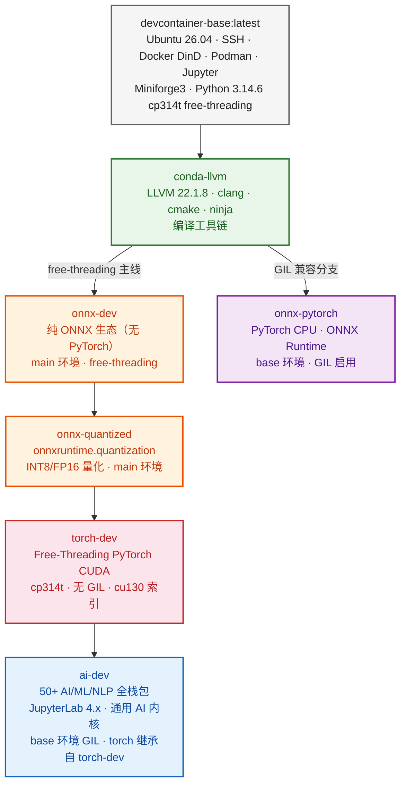

# devcontainer-base 镜像变体

本目录包含基于 devcontainer-base 基础镜像的特殊功能变体。

## 变体依赖拓扑



**图例说明：**
- ⚫ 灰色：基础镜像层（系统级服务）
- 🟢 绿色：编译工具链层（LLVM/clang/cmake/ninja）
- 🟠 橙色：free-threading 主线（main 环境，cp314t，无 GIL）
- 🟣 紫色：GIL 兼容分支（base 环境，GIL 启用）
- 🟡 黄色：量化工具链层
- 🔴 红色：CUDA 加速层（free-threading PyTorch）
- 🔵 蓝色：全栈 AI 开发层（50+ 包 + JupyterLab）

## 可用变体

| 变体名称 | 描述 | 基础镜像 | 额外组件 |
|---------|------|---------|---------|
| conda-llvm | 基础镜像 + LLVM编译工具链 | devcontainer-base:latest | Miniforge3(main环境, Python 3.14.6 cp314t free-threading), LLVM 22.1.8, clang 22.1.8, cmake, ninja |
| onnx-dev | conda-llvm + 纯ONNX生态（无PyTorch） | devcontainer-base:conda-llvm | onnx, onnxruntime, onnx-simplifier, onnxscript（main环境安装；torch/torchvision一等排除；onnxoptimizer因free-threading不兼容排除） |
| onnx-pytorch | conda-llvm + PyTorch CPU + ONNX 运行时 | devcontainer-base:conda-llvm | PyTorch CPU (base环境, GIL), torchvision, ONNX, ONNX Runtime, onnx-simplifier, onnxoptimizer |
| onnx-quantized | onnx-dev + ONNX量化工具链 | devcontainer-base:onnx-dev | onnxruntime.quantization(INT8/FP16,纯ONNX无PyTorch), onnxconverter-common, onnxsim(main环境free-threading); neural-compressor可选(PyTorch-only,需自装torch) |
| torch-dev | onnx-quantized + free-threading PyTorch | devcontainer-base:onnx-quantized | PyTorch + torchvision (main环境, cp314t free-threading, cu130索引, GIL禁用); 是ai-dev的直接基础; onnxoptimizer排除 |
| ai-dev | torch-dev + 完整AI/ML/NLP全栈生态 | devcontainer-base:torch-dev | 50+ Python包(NLP/数据/可视化/文档/Web/数据库, base环境GIL), JupyterLab 4.x, 通用AI内核; 继承torch-dev的free-threading PyTorch |

## 快速开始

```bash
# 列出可用变体
bash variants/build.sh --list

# 构建单个变体
bash variants/build.sh --variant onnx-dev

# 使用国内镜像源构建
bash variants/build.sh --variant onnx-dev --cn

# 构建所有变体（按依赖顺序）
bash variants/build.sh --all
```

## 如何新增变体

使用 `_template/` 模板快速创建新变体：

1. **复制模板目录**：`cp -r variants/_template variants/<your-variant-name>`
2. **修改 Dockerfile**：替换所有 `__XXX__` 占位符，添加自定义安装逻辑
   - `__VARIANT_NAME__`：变体名称（如 `cuda`）
   - `__VARIANT_DESCRIPTION__`：变体描述
   - `__BASE_VARIANT__`：基础变体前缀（如直接基于基础镜像留空，基于 conda 变体填 `conda-`）
   - `__EXTRA_BUILD_ARGS__`：额外的 ARG 声明
   - `__EXTRA_INSTALL_STEPS__`：自定义安装步骤
   - `__EXTRA_VALIDATION__`：构建后验证命令
3. **更新配置文件**：修改 `.env.example` 添加变体特有参数，更新 `README.md` 使用说明
4. **更新 .agents/rules/dockerfile.md**：记录变体特有 Dockerfile 规范
5. **在 variants/build.sh 中注册**：在 `VARIANTS` 数组中添加变体定义，格式（`|` 分隔）：
   ```bash
   "<name>|<description>|<deps>|<verify-commands>"
   # name:     变体名称（与目录名一致）
   # desc:     一句话描述
   # deps:     依赖的变体名（逗号分隔，无依赖留空）
   # verify:   验证命令（用 `|||` 三管道分隔多条命令，禁止使用 `;` 避免与Python `-c "a;b"` 命令内部分号冲突）
   ```
   详见 [构建编排规范](.agents/rules/build-orchestration.md) 中的「安全命令列表分隔符模式」
6. **在本 README.md 变体列表中添加新条目**
