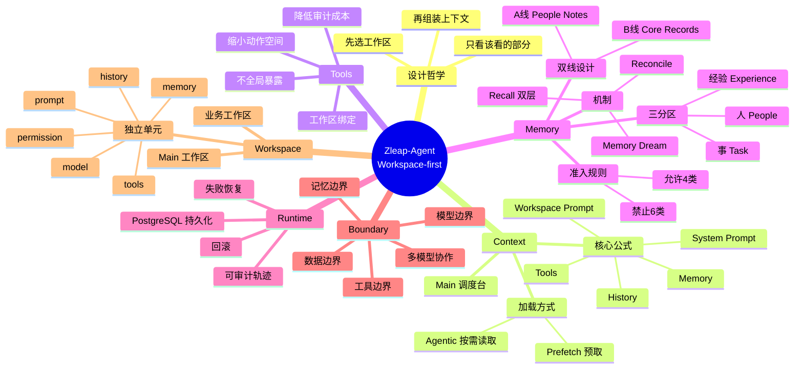

# Zleap-Agent 核心概念思维导图

> 基于 Zleap-Agent Harness 设计学习笔记，将核心概念整理为结构化思维导图（Mermaid mindmap 形式）。

## Mermaid 思维导图



## 文本缩进结构（备选）

```
Zleap-Agent (Workspace-first)
├── 设计哲学
│   ├── 先选工作区
│   ├── 再组装上下文
│   └── 只看该看的部分
├── Context（上下文工程）
│   ├── 核心公式：System + Workspace + Tools + Memory + History
│   ├── 加载方式：Prefetch 预取 / Agentic 按需
│   └── Main 调度台设计
├── Tools（工具绑定）
│   ├── 工具与工作区绑定
│   ├── 不全局暴露
│   ├── 缩小动作空间
│   └── 降低审计成本
├── Memory（记忆治理）
│   ├── 三分区：人 / 事 / 经验
│   ├── 双线：A线 People Notes / B线 Core Records
│   ├── 经验准入规则：允许4类 / 禁止6类
│   └── 机制：Memory Dream / Recall / Reconcile
├── Runtime（可审计运行时）
│   ├── 运行轨迹记录
│   ├── PostgreSQL 持久化
│   ├── 失败恢复
│   └── 回滚
├── Boundary（四类边界）
│   ├── 数据边界（不出内网）
│   ├── 工具边界（按工作区可见）
│   ├── 模型边界（按工作区绑定）
│   └── 记忆边界（不跨用户/任务）
└── Workspace（工作区单元）
    ├── 独立单元：prompt/tools/memory/history/model/permission
    ├── Main 工作区（调度台）
    └── 业务工作区
```

## 对照案例（思维导图补充）

```
对照案例
├── OpenClaw——长上下文压力样本（system prompt 38,412字符 + tool schemas 31,988字符）
├── Hermes Agent——Channel Fracture 记忆写入故障警示
├── WildClawBench——Harness 差异 18 个百分点证据
└── Agentic Harness Engineering——Terminal-Bench 2 从 69.7% 到 77.0%
```

## 方法论演进

```
Prompt → Loop → Harness
（单轮提示词）→（循环脚手架）→（装备工程）
```