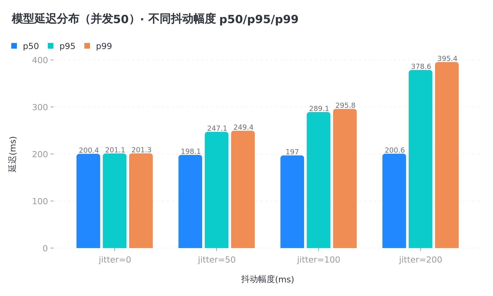

# Workspace-first 架构演进说明：多模型路由与延迟量测

> 汇总多模型路由扩展（P0→P1）的关键结论与新增接口，供架构演进追踪。
> 日期：2026-08-03 | 状态：P1 进行中

## 1. 架构演进脉络

```
P0 骨架 ──► P1 模型适配层 ──► P2 整合（规划中）
```

| 阶段 | 核心交付 | 验证 |
|------|---------|------|
| P0 | `router.py` ModelRouter + 4 种策略 | 12 用例通过（`test_router.py`） |
| P1 | `model_provider.py` 模型适配层 + 延迟量测 | 53 用例通过 + 2 个压测脚本 |
| P2 | 接入 `main.py` 完整流程 + 边界联调 | 规划中 |

## 2. 关键压测结论（路由延迟）

针对规划风险2（路由延迟），`stress_router_latency.py` 压测结果：

| 配置 | 路由判定开销 | 吞吐 |
|------|------------|------|
| 并发 1 | 1.13us/次 | 503,236 QPS |
| 并发 4 | 1.63us/次 | 428,640 QPS |
| 并发 16 | 1.41us/次 | 455,021 QPS |

**结论**：路由判定为纯内存决策，开销 ~1-2us、与并发无关，吞吐 43-50 万 QPS，**绝非瓶颈**。作为对比，真实模型推理延迟为 100ms~数秒，路由判定在端到端延迟中占比可忽略（<0.3%）。

**架构含义**：正常模式（完整策略评估）可放心用于多数任务，无需频繁切换到直通模式；直通模式作为简单任务的可选优化保留。

### 2.1 真实模型延迟量测（抖动扫描）

`stress_model_latency.py` 集成 ModelProvider，测量模型推理延迟（200ms 基准），并发 50 扫描不同抖动幅度：

| 抖动(ms) | mean | p50 | p95 | p99 | stdev | max |
|:---:|:---:|:---:|:---:|:---:|:---:|:---:|
| 0 | 200.4 | 200.4 | 201.1 | 201.3 | 0.3 | 201.6 |
| 50 | 198.9 | 198.1 | 247.1 | 249.4 | 29.3 | 250.1 |
| 100 | 199.2 | 197.0 | 289.1 | 295.8 | 56.7 | 298.8 |
| 200 | 202.9 | 200.6 | 378.6 | 395.4 | 115.0 | 399.2 |

**结论**：抖动幅度越大，延迟分布越分散（stdev 34→115ms），p99 越远离均值（201→397ms）。**真实网络场景下应以 p99 而非均值作为延迟预算依据**，否则 5% 的慢请求会超预算。

### 图表区：延迟分布可视化（并发 50）



> 图表数据源：`stress_model_latency.py --concurrency 50` 压测结果，见 `docs/latency-conclusion.md`。

## 3. ModelProvider 接口定义（P1 新增）

`model_provider.py` 提供统一模型调用抽象，屏蔽供应商差异：

### 3.1 抽象基类

```python
class ModelProvider:
    def invoke(self, model: str, prompt: str, **kwargs: Any) -> str:
        """调用指定模型，返回生成的文本。"""
        raise NotImplementedError

    def get_latency_ms(self) -> float:
        """返回最近一次 invoke 调用的耗时（毫秒）。"""
        raise NotImplementedError
```

### 3.2 核心实现

| 实现 | 用途 | 关键参数 |
|------|------|---------|
| `LocalProvider` | 本地 mock，压测可控复现 | `latency_ms`（固定延迟）、`response_prefix` |
| `RemoteProvider` | 远程 LLM，模拟真实网络波动 | `latency_ms`（基准）、`jitter_ms`（抖动） |

### 3.3 网络延迟模拟（RemoteProvider）

```python
# 模拟真实网络：200ms 基准 ± 50ms 抖动
provider = RemoteProvider(
    base_url="http://localhost:8000",
    latency_ms=200,
    jitter_ms=50,
)
```

每次调用实际延迟 = 基准 + 均匀随机抖动（[−jitter, +jitter]），实测 8 样本落在 150.8~250.5ms、均值 198.5ms，符合 200±50 预期。

### 3.4 工厂函数

```python
build_default_provider(
    provider_type="local" | "remote",
    latency_ms=0,
    jitter_ms=0,          # 仅 remote 生效
    **kwargs,             # base_url / api_key / timeout 等透传
) -> ModelProvider
```

## 4. 延迟量测体系（加计包装）

`_TimedProviderMixin` 提供非侵入式计时：执行 `invoke` 时用 `perf_counter` 记录耗时，存储于 `_last_latency_ms`，经 `get_latency_ms()` 读取。路由逻辑与供应商调用均不感知量测，实现"量测与业务解耦"。

## 5. 测试覆盖

| 测试文件 | 覆盖 | 用例数 |
|---------|------|:---:|
| `test_router.py` | 路由三种风险对抗 | 12 |
| `test_model_provider.py` | Local 固定延迟 + Remote 抖动 | 8 |
| `test_workspace_context.py` | 工作区/上下文/工具边界 | 33 |
| **合计** | | **53** |

压测脚本：`stress_router_latency.py`（路由判定延迟）、`stress_model_latency.py`（真实模型延迟抖动扫描）。

## 6. 后续演进（P2）

- 接入 `main.py`：`router.route()` → `provider.invoke()` 完整链路
- 复用 `BoundaryChecker.check_model_boundary()` 校验路由结果
- 以 p99 为延迟预算接入真实模型，替换 mock 占位