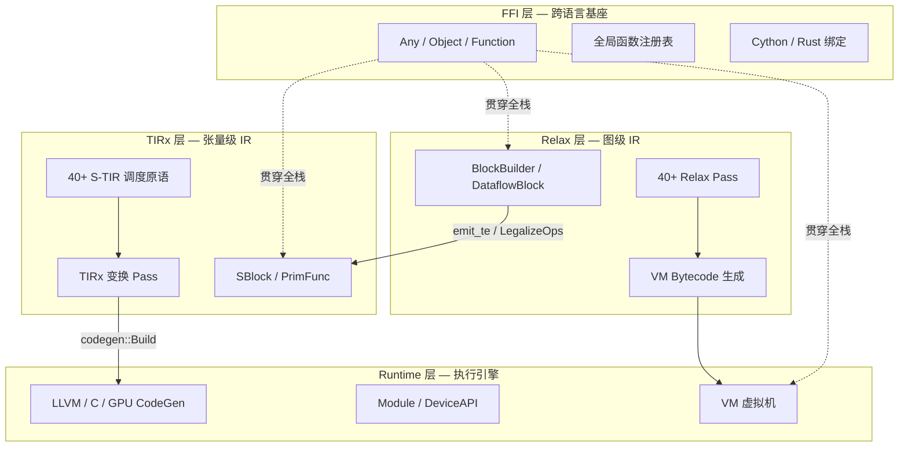
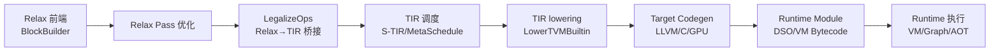

# TVM 整体架构与编译流水线

Apache TVM 是一个面向深度学习工作负载的全栈编译器框架，其核心目标是将高层神经网络模型描述自动优化并部署到多样化的硬件后端（CPU、GPU、专用加速器）。TVM 采用严格分层的四层编译栈架构，自底向上依次为 TVM-FFI 跨语言基座、TIRx 张量级中间表示、Relax 图级中间表示、Runtime 执行引擎。这种分层使得高层图优化与低层内核优化可独立演进，同时通过 IRModule 容器实现跨层函数共存。

## 四层栈架构

TVM 的四层架构可以用以下结构表示：

**第一层：TVM-FFI 跨语言基座**。TVM-FFI（当前版本 0.1.13）是一个独立版本化的跨语言互操作层 [F-001]。它提供类型擦除的 `Any` 标签联合体（16 字节栈上表示）、`Object` 引用计数基类、`Function` 统一函数抽象，以及全局函数注册表 `GlobalFunctionTable`。所有跨语言函数签名统一为 `int(TVMFFIAnyView* args, int32_t nargs, TVMFFIAny* rv)`，返回 0 成功/-1 错误 [F-140]。FFI 层的设计原则是最小高效、跨编译器版本稳定、ML 原生支持、可扩展动态类型注册。它不依赖 C++ RTTI，而是使用自定义 type_index 系统，使得 `-fno-rtti` 编译和嵌入式部署成为可能。

**第二层：TIRx 张量级 IR**。TIRx（命名空间 `tvm::tirx`）在 FFI 之上构建标量/缓冲区级计算描述。其核心包括 `PrimFuncNode`（继承自 `BaseFuncNode`，包含 params/buffer_map/body）[F-153]、`SBlockNode`（声明式调度块，显式声明 iter_vars/reads/writes）[F-146]、`BufferNode`（13 字段多维内存布局描述）[F-122]。TIRx 还包含 S-TIR 调度系统，提供 40+ 调度原语（Split/Fuse/ComputeAt/Tensorize/Parallel/Vectorize 等），支持 RV（随机变量）和 Trace 可追踪调度，是 MetaSchedule 自动调优的基础设施。

**第三层：Relax 图级 IR**。Relax（命名空间 `tvm::relax`）在 TIRx 之上构建张量算子图与数据流模型。`FunctionNode` 继承自 `BaseFuncNode`，包含 params/body/ret_ty/is_pure [F-25]，与 TIRx 的 `PrimFuncNode` 共享同一基类。Relax 的 BlockBuilder 将逐语句发射的命令式构建体验与数据流图的声明式语义统一起来：Emit 调用 Normalize 执行形状和类型推导，将表达式转为 A-norm 形式；DataflowVar 标记纯计算中间结果；`emit_te` 桥接 TE/TIR [F-49]。Relax 层提供 40+ 个 Pass，包括算子融合、合法化、内存规划、混合精度、自动微分等。

**第四层：Runtime 执行引擎**。Runtime 层消费编译产物并执行。它包含基于寄存器的 VM 虚拟机（`VirtualMachine` 类）[F-060]、Module 系统（支持 imports 树和动态库加载）[F-030]、DeviceAPI 抽象（统一 CPU/GPU 内存管理）[F-006]、以及代码生成后端（LLVM/C/CUDA/Metal/OpenCL/Vulkan 等）。VM 支持 NAIVE 和 POOLED 两种分配器，内置 PagedKVCache 和 AttentionBackend 为 LLM 推理提供一等支持。

## IRModule：跨层函数容器

IRModule 是 TVM 架构中的核心数据结构，它使四层栈能够协同工作。`IRModuleNode` 持有 `functions`（`GlobalVar→BaseFunc` 映射）、`source_map`、`attrs`、`global_infos` 等成员 [F-049]。这意味着同一个 IRModule 可以同时包含 Relax 层的 `FunctionNode` 和 TIRx 层的 `PrimFuncNode`，因为它们都继承自 `BaseFuncNode`。

IRModule 的结构相等和哈希经过特殊设计：SEqual 对 functions 按 GlobalVar 名称重映射后比较，SHash 先按名称排序函数再依次哈希，确保哈希与函数顺序无关 [F-051][F-052]。Python 层的 IRModule 支持字典式接口（`__setitem__`/`__getitem__`/`__contains__`），字符串键自动转换为 GlobalVar [F-056][F-057]。

这种跨层容器设计使得 Relax→TIR 的桥接 Pass（如 `LegalizeOps`）可以在同一 IRModule 内将高层算子替换为 `call_tir` 调用及对应 TIR PrimFunc，而无需在模块间传递数据。

## 编译流水线

TVM 的完整编译流水线从前端模型描述到可执行产物，经历以下阶段：

**阶段一：Relax 前端构建**。用户通过 BlockBuilder 逐语句发射 Relax 表达式，或通过 TVMScript 解析。BlockBuilder 的 Emit/Normalize 管线在构建时即完成 A-norm 转换和形状类型推导 [F-49][F-51]。TE 张量表达式可通过 `emit_te` 直接进入 Relax 图，自动生成 TIR PrimFunc。

**阶段二：Relax Pass 优化**。预定义的 `default_build_pipeline` 按序应用 13 个 Pass [F-148]：DispatchSampling、LegalizeOps、RewriteDataflowReshape、ToNonDataflow、RemovePurityChecking、CallTIRRewrite、StaticPlanBlockMemory、RewriteCUDAGraph、LowerAllocTensor、KillAfterLastUse、LowerRuntimeBuiltin、ComputePrimValue、VMShapeLower、AttachGlobalSymbol。其中 LegalizeOps 是关键桥接点——它调用每个算子注册的 `FLegalize` 函数，将高层 Relax 算子替换为 `call_tir` 及对应 TIR PrimFunc [F-118]。FuseOps 按 OpPatternKind（elemwise/broadcast/injective/reduce/out_ewise_fusable）在 DataflowBlock 内融合算子，FuseTIR 将融合后的子函数编译为单个 TIR PrimFunc。

**阶段三：TIR 调度与优化**。TIR PrimFunc 进入 S-TIR 调度系统。用户可手写调度原语，或通过 MetaSchedule 自动搜索最优调度。调度原语操作 RV（LoopRV/SBlockRV/ExprRV）而非直接修改 IR 节点，Trace 记录所有决策序列，支持序列化和重放 [F-200][F-201]。调度后的 TIR 经过 30+ 个变换 Pass（CanonicalizeLoop、LowerCrossThreadReduction、InjectSoftwarePipeline、InjectDoubleBuffer、StorageRewrite、VectorizeLoop、UnrollLoop 等）[F-269][F-272]。

**阶段四：Target 代码生成**。`codegen::Build(mod, target)` 是统一的代码生成入口，通过全局函数 `"target.build."+target->kind->name` 分派到具体后端 [F-161][F-162]。LLVM 后端（CodeGenLLVM/CodeGenCPU）处理 x86/AArch64/ARM CPU 和 PTX/AMDGPU；C 源码后端（CodeGenC/CodeGenCHost）为 CUDA/OpenCL/Metal/Vulkan SPIR-V 等 C 变体提供基础设施。编译产物为 Module 导入树，支持 PackImportsToC/PackImportsToLLVM 序列化。

**阶段五：Runtime 执行**。编译产物有两种执行路径：VM 字节码（Relax 函数经 ExecBuilder 降级）和 DSO 模块（TIR PrimFunc 经 CodeGen 编译为机器码）。两者可在同一 Module 导入树中共存。VM 是基于寄存器的字节码引擎，支持动态形状和控制流；DSO 模块通过动态链接器加载并以 `ffi::Function` 形式调用。

## Driver 层路由

`compile()` 函数是 Driver 层的统一入口，它自动检测 IRModule 内容：若包含 Relax 函数则路由到 `tvm.relax.build`，否则调用 `tvm.tirx.build` [F-340]。Target 上下文通过 thread_local 栈在整个编译过程中可用，Pass 可通过 `Target::Current()` 查询当前目标属性以决定优化策略。

## 关键目录结构

TVM 源码树的组织直接映射四层架构：

| 目录 | 对应层 | 说明 |
|------|--------|------|
| `include/tvm/ffi/`、`src/ffi/` | FFI 基座 | C ABI、Object、Any、Function、容器、反射 |
| `include/tvm/ir/`、`src/ir/` | IR 核心 | 跨层基础设施：Expr/Type/BaseFunc/IRModule/Pass |
| `include/tvm/tirx/`、`src/tirx/` | TIRx | 张量级 IR：Stmt/Expr/Buffer/PrimFunc |
| `include/tvm/s_tir/`、`src/s_tir/` | S-TIR | 调度系统：Schedule/RV/Trace/MetaSchedule |
| `include/tvm/relax/`、`src/relax/` | Relax | 图级 IR：BlockBuilder/算子/Pass/VM 后端 |
| `include/tvm/te/`、`src/te/` | TE | 张量表达式：Compute/Placeholder/Scan |
| `include/tvm/topi/`、`src/topi/` | TOPI | 算子库：NN/vision/tensor 算子集合 |
| `include/tvm/runtime/`、`src/runtime/` | Runtime | VM/Module/DeviceAPI/NDArray/RPC/线程池 |
| `include/tvm/target/`、`src/target/` | Target | Target/CodeGen/LLVM/C/GPU 后端 |
| `include/tvm/arith/`、`src/arith/` | Arith | 编译期证明引擎：Analyzer/ConstIntBound/ModularSet |
| `python/tvm/` | 全部层 | Python 绑定，目录结构与 C++ 对应 |

TVM 版本号为 `0.26.dev0`，定义于 `include/tvm/runtime/base.h`。整个编译器本体构建在 TVM-FFI 之上，Python 前端和 Rust 工具链共享同一 C ABI，实现了真正的跨语言可扩展性。

## 相关概念

- [TVM-FFI 跨语言基础](/concepts/01-ffi-foundation.md)
- [Object/Node/ObjectRef 对象系统](/concepts/02-object-system.md)
- [Pass 基础设施](/concepts/03-pass-infrastructure.md)
- [Target 与代码生成](/concepts/04-target-codegen.md)
