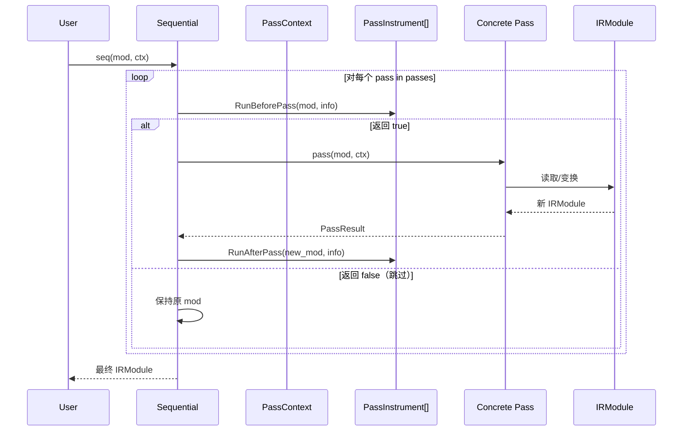

# Pass 基础设施

Pass 是 TVM 编译器中对 IR 进行分析和变换的基本单元。无论是 Relax 层的算子融合、常量折叠，还是 TIRx 层的循环向量化、存储重写，均以 Pass 为单位组织和执行。TVM 在 IR 核心层（`include/tvm/ir/transform.h`）定义了统一的 Pass 基础设施，使不同 IR 层次的变换可以共享组合、配置、观测和注册机制，同时允许各层定义自己的 Pass 构造器和优化流水线。

## 三级模型：Pass / PassInfo / PassResult

TVM Pass 框架由三个核心类构成三级模型：

### PassInfo

`PassInfoNode` 持有 Pass 的元数据 [F-085]：
- `name`（String）：Pass 的唯一名称，用于注册查找、配置覆盖和诊断。
- `opt_level`（int）：优化级别，控制该 Pass 在何种优化等级下启用。
- `required`（Array<String>）：该 Pass 依赖的前置 Pass 名称列表，框架保证在执行前先运行依赖 Pass。

PassInfo 是不可变的值对象，在 Pass 构造时确定，执行过程中不改变。

### PassResult

`PassResult` 是 Pass 执行后的返回值，本质是 `IRModule` 的封装。它允许 Pass 返回变换后的模块，也可在分析类 Pass 中携带额外信息。当前实现中，Module-to-Module 变换是最主要的 Pass 形态。

### Pass

`PassNode` 是一个抽象基类，继承自 `Object`，核心方法为：

```cpp
virtual PassResult operator()(IRModule mod, const PassContext& pass_ctx) const = 0;
```

每个具体 Pass 子类实现此 `operator()`，接收 IRModule 和 PassContext，返回变换后的 PassResult。PassNode 持有一个 `PassInfo info_` 成员。`Pass` 是对应的 ObjectRef 子类，重载了 `operator()` 使 Pass 对象可以像函数一样调用：`Pass mod_out = pass(mod_in, pass_ctx)`。

这种设计将 Pass 本身建模为可组合的一等值——Pass 可以存储在数组中、按名查找、动态注册、作为参数传递。

## PassContext：线程局部配置栈

`PassContext` 管理 Pass 执行期间的配置和状态，是编译过程中的"环境变量"。它使用 **thread-local 栈** 管理嵌套作用域 [F-086]：

```cpp
class PassContext {
    static PassContext Current();  // 获取当前线程栈顶
    void EnterWithScope();         // 压栈
    void ExitWithScope();          // 出栈
};
```

Python 端支持上下文管理器协议 [F-087]：

```python
with tvm.transform.PassContext(opt_level=3, config={"tir.disable_vectorize": True}):
    mod = seq(mod)
```

PassContext 携带的关键信息包括：

| 字段 | 类型 | 说明 |
|------|------|------|
| `opt_level` | int | 当前优化级别（0-4），Pass 可根据自身 opt_level 决定是否执行 |
| `config` | Dict<String, ObjectRef> | Pass 特定配置，键通常为 `"tir.xxx"` 或 `"relax.xxx"` |
| `instruments` | Array<PassInstrument> | 该上下文中激活的观测器列表 |
| `trace_stack` | Array | Pass 执行追踪栈，用于调试和报告 |
| `memory_pool` | — | 编译期内存池 |

`PassConfigManager` 提供配置的全局默认值和类型校验机制。Pass 通过 `pass_ctx->GetConfig<T>("key", default_value)` 查询配置，未设置时返回默认值。

PassContext 的线程局部设计意味着每个编译线程可以拥有独立的配置栈，嵌套的 `with` 块可以临时覆盖配置而不影响外层。这种设计在并行编译多个函数时尤为重要。

## Sequential：Pass 组合器

`Sequential`（`SequentialNode`）是一个特殊的 Pass，它持有一个 `Array<Pass>` 列表，按顺序依次执行 [F-088]。其 `operator()` 实现为：

```cpp
PassResult operator()(IRModule mod, const PassContext& pass_ctx) const {
    for (const Pass& pass : passes) {
        mod = pass(mod, pass_ctx);
    }
    return mod;
}
```

Sequential 本身也是一个 Pass，因此可以嵌套组合，形成树状的优化流水线。C++ 端通过 `Sequential(Array<Pass>, ...)` 构造，Python 端通过 `tvm.transform.Sequential([pass1, pass2, ...])` 构造。

Sequential 在执行每个 Pass 前后会调用 PassInstrument 的回调，并将 Pass 名称推入 trace_stack 以便追踪。如果某个 Pass 的 required 依赖尚未执行，Sequential 会先运行依赖 Pass。

### 预定义 Pipeline

Relax 层预定义了 `default_build_pipeline()`，返回一个 Sequential，包含从高层 IR 到可执行形式的完整 Pass 序列 [F-148]：

```text
DispatchSampling → LegalizeOps → RewriteDataflowReshape → ToNonDataflow
→ RemovePurityChecking → CallTIRRewrite → StaticPlanBlockMemory
→ RewriteCUDAGraph → LowerAllocTensor → KillAfterLastUse
→ LowerRuntimeBuiltin → ComputePrimValue → VMShapeLower → AttachGlobalSymbol
```

TIRx 层的编译流水线（`tvm.tirx.build` 内部）则包含：存储重写、向量化、循环展开、线程绑定、内建函数降级、平坦化缓冲等 Pass。

## PassInstrument：观测与干预

`PassInstrument`（`PassInstrumentNode`）是 Pass 执行的观测点接口，允许外部代码在不修改 Pass 逻辑的情况下插入统计、验证、可视化和调试行为 [F-089]。它定义了四个回调时机：

| 方法 | 调用时机 | 典型用途 |
|------|---------|---------|
| `RunBeforePass(mod, info)` | 每个 Pass 执行前 | 记录输入 IR、启动计时器、前置校验 |
| `RunAfterPass(mod, info)` | 每个 Pass 执行后 | 记录输出 IR、停止计时器、后置校验 |
| `EnterPassContext()` | 进入 PassContext 时 | 初始化资源 |
| `ExitPassContext()` | 退出 PassContext 时 | 生成报告、清理资源 |

`RunBeforePass` 返回 bool 值，返回 false 可跳过该 Pass 的执行——这为 A/B 测试和条件优化提供了机制。Instrument 列表在 PassContext 中配置，按顺序调用。内置的 instrument 包括 PassTiming（耗时统计）和 PassPrint（IR 打印）。用户可实现自定义 Instrument 进行性能分析、IR diff 对比或结构性校验。

## IRModule 变换入口

所有 Pass 的统一入口是 `IRModule`。Module-to-Module 变换意味着 Pass 可以看到模块中的所有函数（包括 Relax Function 和 TIR PrimFunc），并可以进行跨函数优化。例如：

- `LegalizeOps` 遍历所有 Relax 函数，将高层算子替换为 `call_tir`，同时在同一模块中添加生成的 TIR PrimFunc。
- `FuseTIR` 分析 Relax 函数中的 `call_tir` 调用关系，将多个相关 TIR 函数融合为一个。
- `DeadCodeElimination` 从模块中移除未被引用的函数。

### Function-to-Function 与 Module-to-Module

尽管基础设施基于 Module-to-Module，框架提供了便捷构造器将简单的函数级变换提升为模块级 Pass：

- **Relax 层**：`transform::CreateFunctionPass(pass_func)` 接收一个 `Function -> Function` 的 lambda，自动包装为遍历所有 Relax 函数的 Module Pass [F-139]。
- **Relax 层**：`transform::CreateDataflowBlockPass(pass_func)` 接收 `DataflowBlock -> DataflowBlock` 的 lambda，自动遍历所有 DataflowBlock [F-140]。
- **TIRx 层**：`tirx::transform::CreatePrimFuncPass(pass_func)` 类似地包装 `PrimFunc -> PrimFunc` 变换。

这种分层设计使得简单 Pass 的编写极为简洁，同时复杂 Pass 仍可直接操作 IRModule 进行跨函数分析。

## Relax Pass 与 TIR Pass 的区别

虽然共享底层 Pass 基础设施，Relax Pass 和 TIR Pass 在抽象层次、变换粒度和典型操作上有显著差异：

### 抽象层次

| 维度 | Relax Pass | TIRx Pass |
|------|-----------|-----------|
| IR 单元 | Function（图级函数）、DataflowBlock | PrimFunc（张量级函数）、Stmt |
| 操作对象 | 算子调用（Call）、绑定（Binding）、数据流边 | 循环嵌套、Buffer 访问、线程绑定 |
| 优化目标 | 图级融合、内存规划、形状推导、自动微分 | 循环变换、向量化、存储分配、并行化 |
| 访问者基类 | ExprVisitor/ExprMutator（relax 命名空间） | StmtVisitor/StmtMutator、ExprVisitor/ExprMutator（tirx 命名空间） |

### 构造器差异

Relax 提供三种 Pass 构造器 [F-138]：

```cpp
Pass CreateFunctionPass(PassFunc pass_func, int opt_level,
                        String name, Array<String> required);
Pass CreateDataflowBlockPass(PassBlockFunc pass_func, int opt_level,
                             String name, Array<String> required);
Pass CreateModulePass(PassFunc mod_pass_func, int opt_level,
                      String name, Array<String> required);
```

TIRx 层在 `include/tvm/tirx/transform.h` 中提供 `CreatePrimFuncPass`。S-TIR 层在 `include/tvm/s_tir/transform.h` 中提供更多变换声明，这些变换直接操作 Schedule 后的 TIR。

### 典型 Relax Pass

- **LegalizeOps**：调用每个算子注册的 `FLegalize` 函数，将高层算子（如 `relax.nn.conv2d`）替换为 `call_tir` + 生成的 TIR PrimFunc [F-118]。这是 Relax→TIR 桥接的关键 Pass。
- **FuseOps**：按 OpPatternKind（kElemWise/kBroadcast/kInjective/kCommReduce/kOutEWiseFusable/kTuple/kOpaque）在 DataflowBlock 内融合连续算子。
- **FoldConstant**：对常量输入的子图进行求值并替换为常量。
- **ToMixedPrecision**：自动将 fp32 计算转换为 fp16/bf16，插入必要的 cast。
- **Gradient**：为 Relax 函数生成反向自动微分代码。
- **VMShapeLower**：将符号形状表达式降级为 VM 可执行的形状计算指令。

### 典型 TIRx Pass

- **VectorizeLoop**：将符合条件的循环转换为向量指令。
- **StorageRewrite**：重新规划 Buffer 的内存分配，复用不重叠生命周期的缓冲区。
- **UnrollLoop**：展开标注为 unroll 的循环。
- **LowerTVMBuiltin**：将 TIRx 内建函数（如 `tirx.ret`、`tirx.thread_bind`）降级为目标特定的调用。
- **InjectDoubleBuffer**：为共享内存插入双缓冲。
- **InjectSoftwarePipeline**：注入软件流水线调度。
- **LoopPartition**：循环分区（如 if-else 外提）。
- **Simplify**：使用 Arith Analyzer 化简索引表达式。

## Pass 注册机制

Pass 通过 FFI 全局函数注册表暴露给 Python 和其他语言。注册方式为：

```cpp
namespace refl = tvm::ffi::reflection;
refl::GlobalDef().def("relax.transform.LegalizeOps", LegalizeOps);
```

Python 端通过 `tvm.relax.transform.LegalizeOps()` 直接调用，返回的 Pass 对象可加入 Sequential。Pass 的注册名称遵循 `<层>.transform.<Pass名>` 的约定（如 `relax.transform.FuseOps`、`tirx.transform.VectorizeLoop`），便于在全局注册表中按层组织和发现。

Pass 注册与 Op 注册表（`OpRegistry`）是两套独立但协作的机制：Op 注册表存储算子的属性函数（FInferType/FLegalize 等），Pass 注册表存储可执行的变换。Pass 在执行时通过 Op 的属性函数查询算子特定的逻辑，实现了变换框架与算子语义的解耦。

## Pass 执行模型

Pass 的完整执行流程如下：



PassContext 在整个 Sequential 执行期间保持在栈顶，每个 Pass 可通过 `PassContext::Current()` 访问。Instrument 在每个 Pass 前后被同步调用，形成完整的执行观测链。

## 相关概念

- [TVM 整体架构与编译流水线](/concepts/00-overview.md)
- [Object/Node/ObjectRef 对象系统](/concepts/02-object-system.md)
- [Target 与代码生成](/concepts/04-target-codegen.md)
