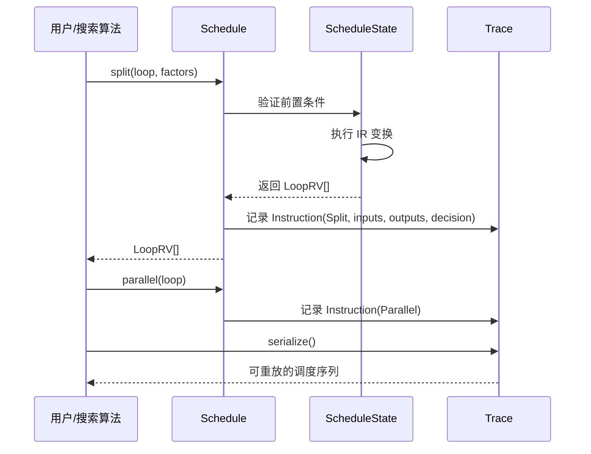

# SBlock 声明式调度

S-TIR（Schedule-TIR）是 TIRx 的调度系统，其核心设计理念是将"计算什么"（SBlock 声明）与"如何调度"（Schedule 变换）显式分离。Schedule 通过随机变量（RV）作为符号句柄操作 IR，而非直接修改节点；ScheduleState 维护调度状态与 IR 的映射；Instruction/Trace 机制记录每次调度决策，支持序列化和重放。这套机制是 MetaSchedule 自动调优的基础设施。

## Schedule 核心类

`ScheduleNode` 是调度系统的核心，持有以下成员 [F-180]：

- **state**：`ScheduleState`，调度状态数据结构
- **trace**：`Trace`，调度指令追踪记录
- **mod**：`IRModule`，被调度的 IR 模块
- **func_working_on**：当前工作的 `GlobalVar`

`Schedule` 类是用户面向的调度接口，提供循环变换、缓存插入、计算位置管理、张量化等 40+ 个方法 [F-181]。

### 两种构造模式

Schedule 有两种构造模式 [F-182]：

1. **ConcreteSchedule**（无追踪）：通过 `Schedule::Concrete()` 创建，不记录 Trace，适用于手写调度场景，减少内存开销。
2. **TracedSchedule**（有追踪）：通过 `Schedule::Traced()` 创建，记录所有调度决策到 Trace，是 MetaSchedule 自动调优的必需模式。

Python 层 `Schedule` 默认使用 `TracedSchedule` 构造（带追踪），`_create_non_traced()` 静态方法使用 `ConcreteSchedule` [F-183]。Python 层构造函数接收 `mod`（PrimFunc 或 IRModule）、`seed`、`debug_mask`、`error_render_level`、`enable_check` 参数 [F-184]。

### 错误渲染级别

`error_render_level` 支持三个级别 [F-185]：

- `"detail"`（0）：详细错误信息，包含完整的 IR 上下文
- `"fast"`（1）：快速错误信息，最小化渲染开销
- `"none"`（2）：无错误信息渲染

### SRef 查找

`ScheduleNode::GetSRef(stmt)` 通过 `stmt2ref` 映射查找语句对应的 StmtSRef，找不到时抛出 IndexError [F-186]。SRef（Statement Reference）是调度状态中对 IR 语句的稳定引用，在 IR 变换后仍然有效。

## 随机变量（RV）体系

随机变量（Random Variable, RV）是 S-TIR 调度系统的核心抽象，它作为调度操作的符号句柄，而非直接持有 IR 节点。这种设计使得调度序列可以被序列化、重放和搜索。

### 三种 RV 类型

| 类型 | 注册键 | 语义 | get() 结果 |
|------|--------|------|-----------|
| `LoopRV` | `"s_tir.LoopRV"` | 表示循环的随机变量 | `For` 节点 [F-190] |
| `SBlockRV` | `"s_tir.SBlockRV"` | 表示块的随机变量 | `SBlock` 节点 [F-190] |
| `ExprRV` | - | 表示整数值的随机变量（类型别名为 `Expr`） | `int`（IntImm 自动解包）[F-190] |

Python 层 `LoopRV` 和 `SBlockRV` 分别注册为 `"s_tir.LoopRV"` 和 `"s_tir.SBlockRV"` [F-188]。`RAND_VAR_TYPE` 定义为 `ExprRV | SBlockRV | LoopRV` 的联合类型 [F-189]。

### RV 的评估

`Schedule.get()` 方法评估随机变量 [F-190]：

- `SBlockRV` → `SBlock`：返回块节点
- `LoopRV` → `For`：返回循环节点
- `ExprRV` → `int`：IntImm 自动解包为 Python int
- `StmtSRef` → `stmt`：返回引用的语句

`Schedule.get_sref()` 方法返回随机变量或语句对应的 StmtSRef [F-191]。`Schedule.remove_rv()` 从符号表中移除随机变量 [F-192]。

### RV 设计动机

使用 RV 而非直接 IR 节点的优势：

1. **可追踪性**：每次调度原语调用接收 RV 作为输入、产生 RV 作为输出，Trace 记录完整的数据流。
2. **可重放性**：RV 是符号引用，Trace 可在新的 IR 上重新应用。
3. **搜索友好**：自动调优算法在 RV 空间中采样决策，不需要理解 IR 节点结构。
4. **变换安全**：调度原语通过 state 间接操作 IR，避免悬空引用。

## ScheduleState 状态管理

`ScheduleStateNode` 是调度的核心数据结构，持有 [F-193]：

- IR module
- sref 树
- 块信息（依赖、标志）
- `stmt2ref` 映射
- 调试设置

### sref 树

sref 树（Statement Reference Tree）是 IR 语句的树形索引结构。每个 IR 语句（For、SBlock 等）在 sref 树中有一个对应的 `StmtSRef` 节点，维护父子关系。sref 树在 IR 变换时增量更新，确保对语句的引用在变换后仍然有效。

### stmt2ref 映射

`stmt2ref` 是从 IR 语句指针到 StmtSRef 的映射。C++ 层 `SMap` 类型别名为使用 `ffi::ObjectPtrHash` 和 `ffi::ObjectPtrEqual` 的 `std::unordered_map` [F-194]。

### UpdateSRef 更新

`UpdateSRef()` 更新 sref 指向的语句：更新 `stmt2ref` 映射（删除旧条目、添加新条目）并更新 `sref->stmt`，仅允许 SBlockNode 和 ForNode [F-198]。这是调度原语修改 IR 后保持 sref 一致性的关键机制。

### 区域分析

ScheduleState 提供两个核心区域分析函数：

**AnalyzeRegionUpperBound()**：在 sref 树路径上分析缓冲区区域的上界，使用 `LoopDomainOfSRefTreePath` 和 `EstimateRegionUpperBound` [F-195]。上界分析确定循环嵌套中缓冲区访问的最大范围。

**AnalyzeRegionLowerBound()**：分析缓冲区区域下界，失败时返回全 `IntSet::Nothing()` 的数组 [F-196]。下界分析确定缓冲区访问的精确范围。

### ProducerCoversConsumer 覆盖证明

`ProducerCoversConsumer()` 检查产生区域是否覆盖消费区域，逐维使用算术分析器证明包含关系 [F-197]。这是 ComputeAt 合法性的核心检查：只有当生产者块的写入区域覆盖消费者块的读取区域时，ComputeAt 才是合法的。

### SBlockInfoCollector 块信息收集

`SBlockInfoCollector` 是私有继承自 `StmtVisitor` 的辅助类，用于收集 SBlockInfo，包括 [F-199]：

- **scope**：块作用域信息
- **affine_binding**：是否仿射绑定
- **region_cover**：区域覆盖标志
- **stage_pipeline**：流水线阶段标志

这些信息用于调度原语的前置条件检查。

## Instruction 与 Trace

### Instruction 指令

`InstructionKind` 枚举表示调度原语种类（如 Split、Reorder 等），`Instruction` 包含 [F-200]：

- **属性**：指令的参数和决策值
- **输入**：输入 RV 列表
- **输出**：输出 RV 列表
- **应用函数**：将指令应用到 ScheduleState 的函数

Instruction 是调度操作的不可变记录，每个调度原语调用对应一个 Instruction 实例。

### Trace 追踪

`Trace` 记录调度指令和决策序列，提供三个核心方法 [F-201]：

1. **apply**：将 Trace 应用到新的 IR 或 Schedule，重放所有调度决策。
2. **serialize**：将 Trace 序列化为可存储格式（如 JSON 或 TVMScript）。
3. **simplify**：简化 Trace，移除冗余指令（如被后续操作覆盖的决策）。

Python 层 `Schedule.trace` 属性返回内部维护的调度追踪 [F-202]。

### Trace 的工作流程

### 采样原语与决策记录

采样原语生成带决策记录的 ExprRV，是自动调优搜索空间的入口：

- **SampleInt()**：在给定范围内采样随机整数 [F-203]
- **SampleWithoutReplacement()**：从 0 到 n-1 中无放回采样 k 个 [F-203]
- **SampleCategorical()**：根据候选列表和概率权重进行分类采样 [F-204]
- **MakeMultinomialSampler()**：创建多项式采样函数 [F-205]
- **SamplePerfectTile()**：采样完美分块因子，有三个重载版本 [F-206]
- **SamplePartitionedTile()**：采样分区分块因子 [F-207]
- **SampleComputeLocation()**：采样给定块的 compute-at 位置 [F-208]

采样原语在 TracedSchedule 中不仅返回采样值，还将采样决策记录到 Trace，使得 Trace 重放时可以恢复相同的决策。

## 查询接口

Schedule 提供丰富的查询接口，用于在调度过程中获取块和循环信息。

### 块查询

- **GetSBlocks()**：按名称和函数获取块 [F-209]
- **GetChildBlocks()**：获取块/循环的叶子块 [F-210]
- **GetProducers()**：获取生产者块（写入当前块读取的缓冲区的块）[F-210]
- **GetConsumers()**：获取消费者块（读取当前块写入的缓冲区的块）[F-210]
- **GetOutputBlocks()**：获取写入未在 PrimFunc 内分配的输出缓冲区的块 [F-211]

### 循环查询

- **GetLoops()**：获取块的外层循环（从外到内）[F-209]

### Python 层查询

Python 层 `Schedule.get_sblock(name, func_name)` 按名称获取块，默认在当前工作的函数中搜索 [F-291]。`Schedule.work_on(func_name)` 切换当前调度工作的函数 [F-286]。

## 分析接口

S-TIR 提供独立于调度状态的分析接口，定义在 `include/tvm/s_tir/analysis.h`。

### 区域分析

- **GetSBlockAccessRegion()**：自动检测块的读区域、写区域和不透明区域（三个 BufferRegion 数组）[F-257]
- **GetSBlockReadWriteRegion()**：检测块的读写区域，不透明访问同时计为读和写 [F-258]
- **DetectBufferAccessLCA()**：检测缓冲区访问的最低公共祖先（LCA），同时处理高级访问和低级访问 [F-259]

### 性能分析

- **EstimateTIRFlops()**：估计 TIR 片段或整个 IRModule 的 FLOPs [F-261]
- **FindAnchorBlock()**：查找模块的"锚点块"：有 init 语句且 flops 最大的块（如 conv2d）[F-260]
- **CalculateAllocatedBytes()**：计算 PrimFunc 或 IRModule 中每个存储范围的分配字节数 [F-265]

### 正确性验证

- **VerifyGPUCode()**：根据约束字典验证 GPU 代码正确性 [F-263]
- **VerifyVTCMLimit()**：验证 VTCM 使用是否在限制内 [F-266]
- **IsPureFunction()**：检查函数纯度 [F-262]
- **IdentifyMemCpy()**：识别 For 循环是否语义等价于 MemCpy [F-264]

## Schedule 副本与种子管理

### copy() 深拷贝

Python 层 `Schedule.copy()` 返回调度的深拷贝，保证 [F-287]：

- SRef 树完全重建
- IRModule 不变
- 所有随机变量在拷贝中有效

这在自动调优中至关重要——搜索算法需要 fork 多个调度分支进行探索。

### 随机种子管理

- **seed(seed)**：设置随机种子 [F-288]
- **fork_seed()**：返回分叉的随机种子 [F-288]

`_parse_seed(seed)` 验证种子范围为 [1, 2147483647]，None 转换为 -1（使用设备随机）[F-293]。

### show() 调试显示

Python 层 `Schedule.show()` 同时显示 IRModule 和 Trace 的 TVMScript [F-289]，是调试调度变换的重要工具。

## S-TIR 变换 Pass

调度完成后的 TIR 需要经过一系列变换 Pass 进行降级和优化。

### RenewDefs 定义更新

`RenewDefs()` 为 TIR 重新生成定义节点（Var、Buffer、IterVar），相当于深拷贝但行为相同 [F-268]。MetaSchedule 在自动调优后调用此函数，确保调度结果的定义节点与原始 IR 独立。

### 核心变换 Pass

S-TIR 变换 Pass 包括 [F-269]：

- **CanonicalizeLoop()**：规范化循环结构
- **LowerCrossThreadReduction()**：降级跨线程归约
- **LowerInitBlock()**：降级初始化块
- **PlanAndUpdateBufferAllocationLocation()**：规划缓冲区分配位置
- **ConvertBlocksToOpaque()**：将块转换为不透明形式（调度后处理）
- **LiftThreadBinding()**：提升线程绑定
- **CompactBufferAllocation()**：压缩缓冲区访问区域 [F-270]
- **InjectSoftwarePipeline()**：注入软件流水线 [F-271]
- **InjectDoubleBuffer()**：注入双缓冲
- **ThreadSync()**：线程同步
- **LowerAsyncDMA()**：降级异步 DMA
- **MergeSharedMemoryAllocations()**：合并共享内存分配
- **DecorateDeviceScope()**：装饰设备作用域 [F-272]

### CompactBufferAllocation 缓冲区压缩

`CompactBufferAllocation(is_strict)` Pass 压缩缓冲区访问区域，移除未访问部分 [F-270]。`is_strict=true` 时保证压缩后形状不大于原始形状。此 Pass 依赖 Arith 子系统的边界分析来确定精确的访问区域。

### InjectSoftwarePipeline 软件流水线

`InjectSoftwarePipeline()` Pass 将注解循环转换为流水线循环，使用 `software_pipeline_stage` 和 `software_pipeline_order` 注解，生成 prologue/body/epilogue 三块 [F-271]。这是 GPU 内核优化的关键技术，通过重叠数据加载和计算来隐藏内存延迟。

## Python 绑定架构

S-TIR Python 包结构包含 [F-302]：

- `schedule/`：调度核心（schedule.py、state.py、trace.py、instruction.py）
- `analysis/`：分析接口
- `backend/`：后端集成
- `dlight/`：GPU 自动调度
- `meta_schedule/`：元调度（自动调优）

`python/tvm/s_tir/__init__.py` 导出 `StmtSRef`、`SBlockScope`、`ScheduleState`、`Schedule`、`ScheduleError`、`Trace` 等核心类 [F-281]。在非 runtime-only 构建中导入 `analysis`、`meta_schedule`、`dlight` 子模块 [F-283]。

`ScheduleError` 通过 `@register_error` 注册为 TVM 错误类型 [F-292]。`renew_defs(func)` 函数通过 `_ffi_api.RenewDefs` 重新生成 TIR 定义节点 [F-284]。

## 相关概念

- [TIRx 中间表示](/concepts/05-tirx-ir.md)
- [Buffer/Var/IterVar 核心类型](/concepts/06-buffer-var-itervar.md)
- [调度原语](/concepts/08-schedule-primitives.md)
- [MetaSchedule 自动调度](/concepts/09-meta-schedule.md)
- [Arith 整数分析器](/concepts/10-arith-analyzer.md)
