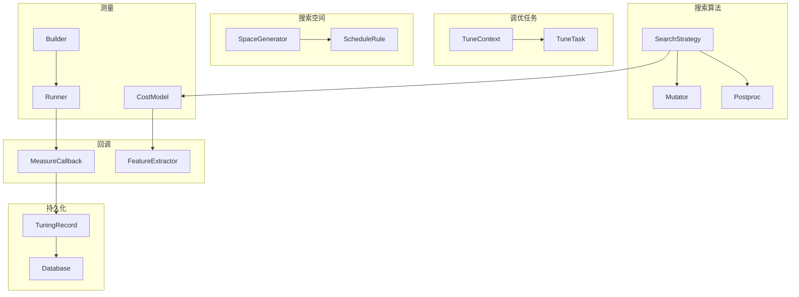
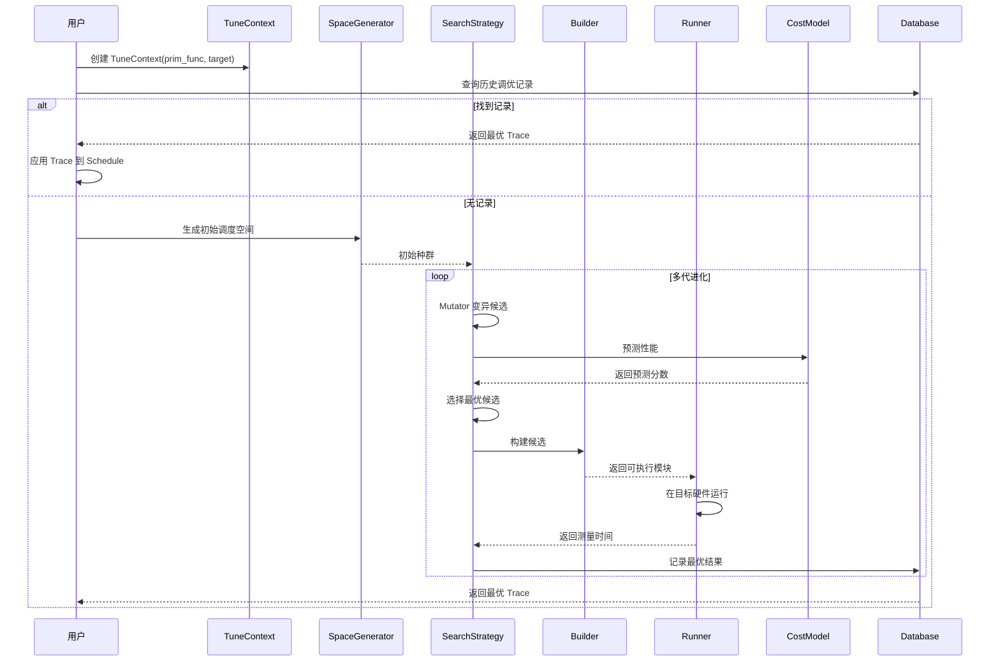

# MetaSchedule 自动调度

MetaSchedule 是 TVM 的自动调度框架，它在 S-TIR 调度原语之上构建了一套完整的自动调优系统。其核心思想是将调度过程建模为搜索问题：搜索算法在调度空间中采样决策序列（Trace），通过成本模型预测性能或实际运行测量，最终选择最优调度。MetaSchedule 的组件化设计使得每个环节（搜索策略、空间生成、构建、运行、成本预测、数据库）都可独立替换和扩展。

## 架构概览

MetaSchedule 的自动调优流水线包含以下核心组件 [F-304]：

Python 层 `s_tir.meta_schedule` 子模块包含 builder、cost_model、database、feature_extractor、measure_callback、mutator、post_optimization、postproc、runner、schedule_rule、search_strategy、space_generator、task_scheduler 等组件 [F-304]。

## TuneContext 与 TuneTask

### TuneContext 调优上下文

TuneContext 是一次调优会话的上下文容器，持有：

- 目标硬件的 Target 描述
- 待调优的 PrimFunc 或 IRModule
- 空间生成器、搜索策略、构建器、运行器等组件引用
- 随机数生成器状态
- 调优配置（如线程数、超时时间）

TuneContext 是所有调优组件共享的"黑板"，组件通过它访问目标信息和协调工作。

### TuneTask 调优任务

TuneTask 表示一个独立的调优任务单元，通常对应一个 PrimFunc。它封装了：

- 待调优的工作负载（workload）
- 目标 Target
- 任务权重（在多任务调度中用于资源分配）
- 任务名称和标识

TaskScheduler 负责在多个 TuneTask 之间分配调优资源。

## SearchStrategy 搜索策略

SearchStrategy 控制在调度空间中探索决策的方式。

### EvolutionarySearch 进化搜索

进化搜索是 MetaSchedule 的默认搜索策略，模拟生物进化过程：

1. **初始种群**：由 SpaceGenerator 生成一批初始调度
2. **变异**：通过 Mutator 对现有调度进行随机变异
3. **评估**：使用 CostModel 预测或实际运行测量性能
4. **选择**：保留性能最优的调度作为下一代
5. **重复**：迭代多代直到收敛或达到预算

### ReplayTrace 重放搜索

ReplayTrace 是一种简单的搜索策略，直接重放预定义的 Trace 或从数据库中加载历史调优记录。适用于：

- 复现已知的最优调度
- 在不同硬件上迁移调优经验
- 调试和验证

### 其他策略

MetaSchedule 还支持自定义搜索策略，用户可以通过实现 SearchStrategy 接口集成贝叶斯优化、强化学习等方法。

## SpaceGenerator 空间生成器

SpaceGenerator 定义调度搜索空间的结构。

### PostOrderApply 后序应用

PostOrderApply 是默认的空间生成器，它按后序遍历 SBlock 树，对每个块应用一组 ScheduleRule。这种方式保证了内层块先于外层块被调度，符合数据局部性优化的直觉。

### ScheduleFn 函数式生成

ScheduleFn 允许用户通过一个 Python 函数定义完整的调度草图。该函数接收一个 Schedule 对象，调用调度原语进行初始变换，然后搜索策略在此基础上进行变异和探索。

### ScheduleRule 调度规则

ScheduleRule 定义对单个块可应用的调度变换。常见的内置规则包括：

- **multi_level_tiling**：多级分块，将循环拆分为缓存层次对应的多级（如 GPU 的 shared/local/thread）
- **auto_inline**：自动内联符合条件的块（如逐元素操作）
- **auto_bind**：自动绑定循环到 GPU 线程轴
- **add_rfactor**：对归约块自动添加 rfactor 以实现并行归约

这些规则组合在一起定义了搜索空间的骨架，搜索算法在此基础上探索具体的参数选择（如分块大小）。

## Builder 构建器

Builder 负责将调度后的 TIR 编译为可执行的二进制模块。

### LocalBuilder 本地构建

LocalBuilder 在本地进程中调用 TVM 编译器（`tvm.tirx.build`）将 PrimFunc 编译为目标平台的可执行代码。它：

1. 将 Schedule 的最终状态转换为 PrimFunc
2. 应用 RenewDefs 生成独立的定义节点
3. 调用代码生成器编译为 Module
4. 返回构建结果（成功的模块或错误信息）

### 分布式构建

Builder 支持通过 RPC 将构建任务分发到远程机器，适用于交叉编译场景（如在 x86 主机上为 ARM 设备编译）。

## Runner 运行器

Runner 在目标硬件上执行编译后的模块并测量性能。

### LocalRunner 本地运行

LocalRunner 在本地直接运行模块，测量执行时间。适用于调优主机即为目标设备的场景。

### RPCRunner 远程运行

RPCRunner 通过 RPC 会话将模块发送到远程设备执行。这对于嵌入式设备、移动平台或多 GPU 服务器的调优至关重要：

1. 将编译好的模块上传到远程设备
2. 在远程设备上执行
3. 测量运行时间
4. 将结果返回本地

RPCRunner 支持设置重复次数、预热次数、超时等测量参数。

## CostModel 成本模型

CostModel 预测调度的性能而无需实际运行，显著加速搜索过程。

### XGBModel XGBoost 模型

XGBModel 使用梯度提升树（XGBoost）预测调度性能。它：

1. 通过 FeatureExtractor 从调度中提取数值特征
2. 使用历史测量数据训练模型
3. 在搜索过程中快速预测候选调度的运行时间
4. 随着测量数据增加不断更新模型

XGBModel 在预测精度和评估速度之间取得了良好平衡，是 MetaSchedule 的默认成本模型。

### RandomModel 随机模型

RandomModel 返回随机预测，主要用于：

- 调试和基准测试
- 搜索策略的消融实验
- 作为其他成本模型的回退

### MLPModel 多层感知机模型

MLPModel 使用神经网络预测性能，适合在大量训练数据可用时捕捉更复杂的性能模式。

## Database 数据库

Database 持久化调优经验，实现跨编译会话的知识复用。

### JSONDatabase JSON 数据库

JSONDatabase 将调优记录以 JSON 格式存储到磁盘，每条记录包含：

- 工作负载的哈希标识
- 最优调度的 Trace
- 测量的运行时间
- Target 信息

JSON 格式人类可读，便于版本控制和调试。

### MemoryDatabase 内存数据库

MemoryDatabase 将记录保存在内存中，适用于：

- 单次编译会话内的调优
- 测试和临时调优
- 不需要持久化的场景

### UnionDatabase 联合数据库

UnionDatabase 将多个数据库组合为一个逻辑数据库，支持查询时从多个源检索记录。例如，可以将一个全局共享数据库和一个项目特定数据库组合使用。

### TuningRecord 调优记录

TuningRecord 是数据库中的基本条目，包含：

- **workload**：工作负载的唯一标识（基于 IR 结构哈希）
- **trace**：最优调度的 Trace（可重放）
- **run_secs**：测量的运行时间（多次测量的数组）
- **target**：目标硬件信息
- **args_info**：参数信息（形状、类型等）

## MeasureCallback 测量回调

MeasureCallback 在每次测量完成后被调用，执行自定义逻辑：

- **记录结果**：将测量结果写入数据库
- **更新成本模型**：使用新数据重新训练
- **进度报告**：打印调优进度和统计信息
- **早期终止**：根据统计置信度判断是否已找到足够好的结果

## FeatureExtractor 特征提取器

FeatureExtractor 从调度后的 TIR 中提取数值特征供成本模型使用。特征通常包括：

- 循环嵌套结构和分块因子
- 内存访问模式（访问区域、步幅、对齐）
- 并行度和向量化信息
- 缓冲区分配大小和位置
- 算术强度（FLOPs/字节）

特征提取需要在信息丰富度和提取速度之间平衡，因为搜索过程中需要评估大量候选调度。

## Postproc 后处理器

Postproc 在调度生成后、测量前进行修正和规范化：

- **RewriteParallelVectorizeUnroll**：重写并行/向量化/展开标注
- **DisallowDynamicLoop**：禁止动态循环（某些后端不支持）
- **VerifyGPUCode**：验证 GPU 代码合法性（共享内存大小、线程数等）

后处理器确保生成的调度在目标硬件上合法，避免浪费时间构建和运行无效的候选。

## Mutator 变异器

Mutator 在进化搜索中对现有调度进行随机变异：

- **MutateTileSize**：变异分块大小
- **MutateParallel**：变异并行因子
- **MutateUnroll**：变异展开因子
- **MutateComputeLocation**：变异 ComputeAt 位置
- **MutateThreadBinding**：变异线程绑定

每个变异器定义了一种局部搜索操作，搜索策略通过组合不同的变异器探索调度空间。

## dlight GPU 自动调度

dlight 是 TVM 内置的 GPU 自动调度库，位于 `python/tvm/s_tir/dlight/` [F-302]。它提供基于规则的快速 GPU 调度，无需长时间的自动调优即可获得良好性能。

### dlight 的设计特点

与 MetaSchedule 的搜索式方法不同，dlight 使用预定义的启发式规则直接生成调度：

1. **快速执行**：无需编译和运行大量候选，调度生成时间极短
2. **硬件感知**：根据 Target 属性（如最大线程数、共享内存大小）选择参数
3. **模式匹配**：识别常见计算模式（GEMV、归约、矩阵乘法）并应用针对性优化

### GPU 调度规则

dlight 包含针对以下模式的 GPU 调度规则：

- **GEMV（矩阵-向量乘法）**：针对内存带宽受限的瘦矩阵操作，优化全局内存合并访问和线程块映射
- **Reduction（归约）**：跨线程归约，使用共享内存和 warp shuffle 指令
- **Matmul（矩阵乘法）**：分块矩阵乘法，利用共享内存和 Tensor Core（如可用）
- **通用 GPU 调度**：对任意计算应用合理的并行化和内存层次优化

### dlight 与 MetaSchedule 的关系

dlight 和 MetaSchedule 可以协同使用：

1. **快速路径**：dlight 作为默认调度器，在不需要极致性能时快速生成合理代码
2. **热启动**：dlight 生成的调度可作为 MetaSchedule 进化搜索的初始种群
3. **回退方案**：当 MetaSchedule 调优时间受限时，dlight 提供可靠的基线性能

在 Relax 编译流水线中，MetaSchedule 集成通过 `MetaScheduleApplyDatabase` Pass 实现：若存在 Database 则应用已调优的调度 [Relax F-147]，否则可使用 dlight 进行快速调度。

## 自动调优工作流程

完整的 MetaSchedule 自动调优流程如下：

## 与 Relax 编译流水线集成

MetaSchedule 在 Relax 编译流水线中的集成点：

1. **zero_pipeline**：按序执行 LegalizeOps → AnnotateTIROpPattern → FoldConstant → FuseOps → FuseTIR；若存在 MetaSchedule Database 则追加 MetaScheduleApplyDatabase [Relax F-147]
2. **SplitLayoutRewritePreproc**：将布局重写预处理块拆分为独立的 tirx::PrimFunc，用于 meta_schedule 调优后的预打包权重 [Relax F-121]
3. **FuseTIR**：将融合后的 Relax 子函数编译为单个 TIR PrimFunc，随后可进入 MetaSchedule 调优

这种集成使得用户在编写 Relax 程序时无需手动调度——编译器自动识别需要调优的 PrimFunc，从 Database 查找最优调度或触发自动调优。

## 相关概念

- [SBlock 声明式调度](/concepts/07-sblock-schedule.md)
- [调度原语](/concepts/08-schedule-primitives.md)
- [TIRx 中间表示](/concepts/05-tirx-ir.md)
- [Pass 基础设施](/concepts/03-pass-infrastructure.md)
- [Relax 变换 Pass](/concepts/14-relax-passes.md)
