# 旋元佑进阶语法 OKF Wiki — I阶段架构洞察

> I阶段分析。基于R阶段83条事实（F-001~F-083），覆盖源目录31个Markdown文件。
>
> 分析日期：2026-08-25

---

## 核心洞察

### 洞察一：三层次句法递进——简化从句是全书的终极目标而非高级点缀

**陈述**：全书明确提出句子三层次认知框架——初级简单句、中级复合句、高级简化从句（F-073）。25个正文章节中，最后4章（第22-25章）专门系统讲解简化从句，占正文总量约1/6篇幅；其中第22章作为总论章，开宗明义提出简化从句的核心原则是「省略重复/空洞元素」（F-032），后续3章分别覆盖关系从句、名词从句、副词从句三类简化。这一结构表明：简化从句不是传统语法书中零散的「高级修辞点」，而是整个句法体系的终点和集大成——所有复合句结构都可以通过识别并省略重复元素（主语、be动词、空洞连词）转化为简洁表达，这是英文写作简洁性的核心方法论。

**证据**：
- F-073：chapter-16明确提出句子三层次：初级简单句、中级复合句、高级简化从句
- F-032：chapter-22定义简化从句为「省略重复/空洞元素」，给出共同做法（省略主语+be动词/语气助动词简化为to/普通动词加-ing）
- F-033~F-035：chapter-23/24/25分别系统覆盖三类从句简化，每章1.3-1.8万字
- F-018：chapter-08分词已提前铺垫V-ing/V-en作形容词用法，与关系从句简化直接关联
- F-023~F-024：chapter-13/14动名词与不定式已铺垫非限定动词用法，与名词从句/副词从句简化直接关联

**反常识**：传统语法教学把分词构句、动名词、不定式当作「动词的非谓语形式」孤立讲解，学生背了大量规则却不知道它们为什么存在。旋元佑的体系反其道而行：非限定动词（现在分词、过去分词、动名词、不定式）本质上都是「简化从句的残留碎片」——现在分词来自关系从句省略which is/that is，动名词来自名词从句省略that，不定式来自语气助动词（must→have to、should→ought to等）的简化。这一视角把零散的语法点统一到「从句→省略→简化从句」的单一框架下，学生不需要死记硬背「哪些动词后面接to V、哪些接V-ing」，而是可以从语义和结构推导。

**行动**：
- E阶段文档生成时，在chapter-08/13/14讲解非限定动词时，必须设置「进阶预告」链接，明确标注「本概念将在第27-30章（简化从句）中深化为从句省略规则」
- 第27章（简化从句总论）必须回溯引用第11章（语气助动词）和第13-14章（动名词/不定式），建立「语气助动词→不定式」的演化链路
- 知识地图的可视化必须突出「三层次金字塔」结构，简化从句位于塔顶，所有前面章节构成塔基
- 每个简化从句章节必须包含「还原练习」指引——教读者如何把简化结构还原为完整复合句，双向理解比单向记忆更有效

---

### 洞察二：动词体系是全书枢纽——7章篇幅占正文近1/3，非限定动词是连接词类与从句的双向桥梁

**陈述**：动词体系包含7个章节（第8-14章），是所有主题分组中篇幅最大的模块（F-079），覆盖分词、时态、语态、语气助动词、语气、动名词、不定式。这7章的关键地位在于其中的「非限定动词三剑客」——分词（第8章）、动名词（第13章）、不定式（第14章）——具有双重身份：从词类角度看，它们是动词的变形，可作形容词（分词）、名词（动名词/不定式）、副词（不定式）；从从句角度看，它们是三类简化从句的核心构件：分词对应关系从句简化，动名词对应名词从句简化，不定式对应名词从句/副词从句简化。第14章（不定式短语）约1万字，是动词体系中最长的章节，其中明确列出语气助动词到不定式的对应关系（must→have to, should→ought to等），直接为简化从句的「语气助动词简化为to」规则奠定基础（F-024）。

**证据**：
- F-079：动词体系7章，是最大主题分组
- F-018：chapter-08分词覆盖V-ing/V-en作形容词
- F-023：chapter-13动名词覆盖V-ing用法、动名词与现在分词区分、动名词与不定式选择
- F-024：chapter-14不定式覆盖to+V作名词/形容词/副词用法，含缩进列表展示语气助动词→不定式对应关系
- F-033：chapter-23关系从句简化涉及分词、复合形容词、不定式短语
- F-034：chapter-24名词从句简化涉及V-ing（动名词）和to V（不定式）
- F-035：chapter-25副词从句简化涉及分词构句、to V（in order to等）
- F-030：chapter-20主语动词一致性涉及动名词/不定式/名词从句作主语的单复数判断

**反常识**：语法书通常把动词章节放在「词类」部分，与名词/形容词/副词并列，讲完时态语态就算结束。本书揭示了动词的特殊地位：动词是英语句子的心脏，简单句的核心是S+V，复合句的核心是限定动词与非限定动词的区分，简化从句的核心是把限定动词转化为非限定动词以删除重复主语。非限定动词不是「动词的例外」，而是「高级句法的入口」——理解了三种非限定动词的本质，就掌握了简化从句的钥匙。更反常识的是：不定式的to不是一个无意义的小词，而是语气助动词的简化残留——这一洞见把「情态动词」和「不定式」两个看似独立的语法点连接成一个演化连续统。

**行动**：
- E阶段在第13章（分词）、18章（动名词）、19章（不定式）的frontmatter中设置`prerequisites`和`foreshadows`双向链接
- 第16章（语气助动词）必须显式链接到第19章（不定式），建立「助动词→to」的对应表，并预告简化从句
- 第19章（不定式）末尾设置专门的「小结与展望」区块，总结不定式在三种从句简化中的角色
- 知识地图中用不同颜色标注动词体系章节，并用双向箭头连接非限定动词章节与对应的简化从句章节

---

### 洞察三：基础句法并非全部在开头——比较句法、主谓一致、倒装是「进阶基础」，需要从句知识作为前置

**陈述**：原书章节安排并非严格的「基础→进阶」线性顺序，而是遵循「基础必要知识→词类→动词体系→复合句/从句→综合应用→简化从句」的螺旋递进逻辑。三个「基础句法」主题——比较句法（第6章）、主语动词一致性（第20章）、倒装句（第21章）——被作者刻意安排在非开头位置：比较句法放在副词之后、介词之前（第6章），主谓一致和倒装放在三大从句之后、简化从句之前（第20-21章）。这反映了一个深刻的教学认知：这些主题虽然属于「句法」范畴，但理解它们需要先掌握更「高级」的知识——比较结构涉及对等连词与省略（第15-16章内容），主谓一致需要判断名词从句/动名词/不定式作主语（第13-14/17章内容），倒装涉及假设语气省略if、否定副词前移、So do I省略（第12/15/16章内容）。把它们放在前面教，学生只能死记硬背规则；放在从句之后教，学生可以理解规则背后的逻辑。

**证据**：
- F-077：基础句法类文件4个，分布位置分散——chapter-01（第1章）、chapter-06（第6章）、chapter-20（第20章）、chapter-21（第21章）
- F-016：chapter-06比较句法覆盖as...as、more...than等句型，这些结构涉及对等和省略
- F-030：chapter-20主语动词一致性覆盖集合名词、对等连词主语判断、动名词/不定式/名词从句作主语
- F-031：chapter-21倒装句覆盖四种倒装方式，包括假设语气省略if、否定副词前移、So do I省略谓语
- F-022：chapter-12语气覆盖假设语气，是if省略倒装的前置知识
- F-025：chapter-15对等连词覆盖both...and/either...or等，是比较结构和主谓一致的前置知识
- F-027~F-029：chapter-17/18/19三大从句是主谓一致中判断「从句作主语」的前置知识

**反常识**：读者通常期望一本语法书「先讲完所有基础，再讲高级内容」，认为比较级、主谓一致、倒装是「低年级基础」应该放在最前面。旋元佑的安排挑战了这一认知：「基础」不等于「简单」，有些「基础句法」实际上是「句法规则的综合应用」，需要大量前置知识才能真正理解。强行把它们放在开头，学生会因为缺乏上下文而把语法当作任意规定的规则清单来死记，而不是当作有逻辑的系统来理解。这类似于数学教学中不把「微积分应用」放在「四则运算」之后——虽然四则运算更「基础」，但微积分应用需要代数、几何、三角等「高级」知识作为前置。

**行动**：
- E阶段编号时**不强行把所有基础句法章节集中到开头**，仅做一处最小调整：将chapter-07（介词）与chapter-06（比较句法）顺序互换，使词类章节（第7-11章：名词、代词、形容词、副词、介词）保持连续，比较句法（第12章）放在词类之后作为句法过渡
- 第12章（比较句法）的prerequisites标注第9章（形容词）、第10章（副词）、第20章（对等连词）——注意第20章编号更大，需要设置「建议先读」软链接而非硬性前置
- 第25章（主谓一致）和第26章（倒装）的prerequisites必须明确列出第17-24章（复合句与三大从句），在知识地图中把它们标注为「句法综合应用」而非「基础」
- 学习路径中在第20章之后设置一个「中期检查点」，提示读者回顾前面内容后再进入综合应用

---

### 洞察四：两岸术语差异是中文语法书的特殊痛点——47组术语对照表需要前置且全域链接

**陈述**：附录中`terminology.md`包含47组两岸英语语法术语对照（F-036、F-075），覆盖词类（单字/单词、片语/短语、介系词/介词、连缀动词/系动词）、句子成分（主词/主语、受词/宾语、子句/从句）、动词概念（进行式/进行时、不定词/不定式、减化子句/简化从句）、语音概念（母音/元音、子音/辅音）等核心术语。然而原书把这张表放在最后作为附录（F-004），读者往往学到一半甚至学完才发现术语差异，造成跨地区学习障碍——台湾学生看大陆教材不知道「介词」就是「介系词」，大陆学生看台湾教材不知道「子句」就是「从句」，双方都可能因为术语不一致而误以为遇到了新概念。特别值得注意的是，本书的核心特色概念「简化从句」在台湾术语中是「减化子句」，这是全书最高频的关键术语之一。

**证据**：
- F-036：appendix/terminology.md包含1个三列表格（47行数据），列为「台湾」「大陆」「英文」
- F-075：47组术语覆盖词类、句子成分、时态名称、语音概念、动词分类等类别
- F-004：原文件位于appendix/子目录，属于附录类
- F-006：index.md的toctree将appendix/terminology放在最后一位
- 关键术语差异示例：子句/从句/Clause、介系词/介词/Preposition、减化子句/简化从句/Reduced Clauses、不定词/不定式/Infinitive、连缀动词/系动词/Linking Verb、受词/宾语/Object

**反常识**：大多数中文语法书要么只用一套术语（全大陆或全台湾），要么把术语对照表放在最后当附录备查。这反映了一个默认假设：「读者应该已经习惯了一套术语，对照表只是偶尔查阅的参考」。但OKF Wiki的目标受众是所有中文使用者，包括大陆学习者、台湾学习者、以及在两套术语间切换的读者。术语障碍不是「偶尔查阅」就能解决的——如果读者在第一章就遇到「子句」不知道是什么，翻到最后才发现是「从句」，阅读体验已经被打断。更反常识的是：术语对照不是「附录」而是「前置基础设施」——它应该像地图的图例一样，在读者开始阅读正文之前就提供。

**行动**：
- E阶段把terminology.md从附录提升到**入门篇第4位（编号04）**，放在序、前言、广读方法论之后、正文目录之前，确保读者在进入语法内容前先消除术语障碍
- 每个概念文档中，**首次出现两岸异译术语时**，自动在括号内标注另一译法，并链接到04-terminology-cross-strait.md的对应锚点，格式如：「子句（从句）」或「介词（介系词）」
- 04号术语文档必须为每个术语设置HTML锚点（如#clause、#preposition），方便其他章节精准链接
- frontmatter中设置`terminology_note: true`标记，在文档侧边栏或顶部显示术语提示
- 全书统一选择**大陆术语作为主术语**（因为OKF生态主要面向大陆开发者社区），但台湾术语作为对等术语在首次出现时标注

---

### 洞察五：guide.md是学习方法论而非使用说明——「广读」是本书的隐性前置要求

**陈述**：`guide.md`文件标题为「引：广读学英语」，以「引：」前缀标记（F-062），正文讨论5种TESOL教学法与extensive reading（广读/泛读）方法论（F-063），属于英语学习方法导言，而非网站使用指南或文档导航。在原书toctree中，它排在intro（前言）和preface（序）之后、正文之前（F-064），位置显著。该文件不包含任何操作指引、导航链接或网站使用说明（F-065），内容纯为学习理念论述——旋元佑在讲具体语法规则之前，先告诉读者「语法不是目的，广读才是目的；语法是帮助理解难句、辅助广读的工具」。这是本书与传统语法书的根本区别：传统语法书把语法当作知识体系来传授，本书把语法当作阅读能力的支撑工具来讲。

**证据**：
- F-062：guide.md标题为「引：广读学英语」，以「引：」前缀标记，非「指南」「使用说明」「导读」类标题
- F-063：正文讨论5种TESOL教学法与广读（extensive reading）学习方法论
- F-064：在toctree中位列第三（intro → preface → guide → chapter/index → appendix）
- F-065：不包含网站/文档使用说明、不包含导航链接、不包含操作指引
- F-009：字数估计约4000字，是入门文件中最长的一篇
- F-008：intro.md覆盖全书目标与结构说明，但guide.md独立讨论学习方法，两者不重复

**反常识**：看到文件名`guide.md`，技术文档读者的第一反应是「使用指南」「导航说明」「操作手册」。但这个文件的「引」字标记表明它是「引子」「导言」而非「指南」——它是「为什么学语法」的哲学阐述，不是「怎么用这本书」的操作说明。这体现了原书的教育理念：语法书不是用来「读完」的，而是用来「查阅」和「辅助阅读」的；学语法的终极目的是为了无障碍地广读英文原著，而不是为了做语法选择题。如果把这一章误当作「使用说明」跳过，读者就错失了理解作者整个教学法设计的钥匙。

**行动**：
- E阶段不将guide.md重命名为「usage-guide」或「navigation」，而是保留其「引」的定位，文件命名为`03-extensive-reading-method.md`，标题保留「引：广读学英语」
- 文档开头添加一个提示框（blockquote）明确标注：「本章是英语学习方法论文，不是语法规则内容；急于学习语法的读者可先跳过，但建议在阅读过程中返回本章理解作者的教学理念」
- 03号文档不设置prerequisites，但在每个章节的「相关概念」中选择性回链——当章节涉及「为什么要学这个语法点」时（如简化从句章节讨论「为什么要省略」），链接到本章
- 00号首页（home）的简介部分必须引用本章的核心观点：「语法是广读的工具，而非目的」，确立整个知识包的学习基调

---

## 知识地图

### 分组总览

全书31个文件分为7个分组（含导航页），整体遵循「入门准备→基础认知→词类构建→动词核心→复合句与从句→综合应用→简化从句」的螺旋递进路径。

```mermaid
flowchart TD
    subgraph 入门篇[入门篇 00-05]
        A0[00 首页]
        A1[01 序]
        A2[02 前言]
        A3[03 广读方法论]
        A4[04 两岸术语对照]
        A5[05 正文目录]
    end

    subgraph 基础句法[基础句法篇 06, 12]
        B1[06 基本句型]
        B2[12 比较句法]
    end

    subgraph 词类篇[词类篇 07-11]
        C1[07 名词短语]
        C2[08 代名词]
        C3[09 形容词]
        C4[10 副词]
        C5[11 介词]
    end

    subgraph 动词体系[动词体系篇 13-19]
        D1[13 分词]
        D2[14 动词时态]
        D3[15 语态]
        D4[16 语气助动词]
        D5[17 语气]
        D6[18 动名词]
        D7[19 不定式短语]
    end

    subgraph 复合从句[复合句与从句篇 20-24]
        E1[20 对等连词]
        E2[21 复合句]
        E3[22 名词从句]
        E4[23 副词从句]
        E5[24 关系从句]
    end

    subgraph 综合应用[句法综合应用篇 25-26]
        F1[25 主谓一致]
        F2[26 倒装句]
    end

    subgraph 简化从句[简化从句篇 27-30]
        G1[27 简化从句总论]
        G2[28 关系从句简化]
        G3[29 名词从句简化]
        G4[30 副词从句简化]
    end

    A0 --> A1 --> A2 --> A3 --> A4 --> A5
    A5 --> B1
    B1 --> C1 --> C2 --> C3 --> C4 --> C5
    C5 --> B2
    B2 --> D1 --> D2 --> D3 --> D4 --> D5 --> D6 --> D7
    D7 --> E1 --> E2 --> E3 --> E4 --> E5
    E5 --> F1 --> F2
    F2 --> G1 --> G2 --> G3 --> G4

    D1 -.双向伏笔.-> G2
    D6 -.双向伏笔.-> G3
    D7 -.双向伏笔.-> G3
    D7 -.双向伏笔.-> G4
    D4 -.助动词→to.-> D7

    classDef intro fill:#e3f2fd,stroke:#1565c0,color:#0d47a1
    classDef basic fill:#f3e5f5,stroke:#7b1fa2,color:#4a148c
    classDef word fill:#e8f5e9,stroke:#2e7d32,color:#1b5e20
    classDef verb fill:#fff3e0,stroke:#ef6c00,color:#e65100
    classDef clause fill:#fce4ec,stroke:#c2185b,color:#880e4f
    classDef advanced fill:#f1f8e9,stroke:#558b2f,color:#33691e
    classDef reduced fill:#fffde7,stroke:#f9a825,color:#f57f17

    class A0,A1,A2,A3,A4,A5 intro
    class B1,B2 basic
    class C1,C2,C3,C4,C5 word
    class D1,D2,D3,D4,D5,D6,D7 verb
    class E1,E2,E3,E4,E5 clause
    class F1,F2 advanced
    class G1,G2,G3,G4 reduced
```



### 学习路径

学习路径严格按照编号从小到大（00→30），分为七个阶段：

1. **入门准备阶段（00-05）**：建立全局认知
   - 00→01→02：了解本书定位、作者背景、全书结构
   - 03：理解「广读」学习方法论（可延后阅读）
   - 04：掌握两岸术语对照（**强烈建议先读**，避免后续术语困惑）
   - 05：查看正文目录，建立章节全局视图

2. **基础句法启动（06）**：掌握五种基本句型
   - 06：五种基本句型（S+V, S+V+O, S+V+C, S+V+O+O, S+V+O+C）和S/V/O/C标注体系，这是全书所有分析的基础工具

3. **词类构建（07-11）**：掌握名词短语与主要词类
   - 07→08→09→10→11：名词短语→代名词→形容词→副词→介词，按顺序学习
   - 词类是构建名词短语和介词短语的基础

4. **词类到句法的过渡（12）**：比较句法
   - 12：比较级、最高级、as...as、more...than等句型，这是词类知识（形容词/副词）到句法结构的过渡

5. **动词体系核心（13-19）**：掌握动词的所有面貌
   - 13→14→15→16→17→18→19：分词→时态→语态→语气助动词→语气→动名词→不定式
   - 这是全书最核心的模块，非限定动词（13/18/19）需要重点掌握，为简化从句打基础
   - **关键节点**：16→19（语气助动词→不定式）存在演化关系，需重点理解

6. **复合句与三大从句（20-24）**：从中级到高级句法
   - 20→21：对等连词→复合句总论，理解句子三层次框架
   - 22→23→24：名词从句→副词从句→关系从句，按顺序学习
   - 24（关系从句）是全书最长章节，可能需要分多次阅读

7. **句法综合应用（25-26）**：规则的融合运用
   - 25→26：主语动词一致性→倒装句
   - 这两章需要综合运用前面所有知识，是「检验性」章节

8. **简化从句终极篇（27-30）**：全书的集大成
   - 27：简化从句总论，掌握核心省略原则
   - 28→29→30：关系从句简化→名词从句简化→副词从句简化
   - 每章学习时回溯对应基础章节（13/18/19/22/23/24），理解「完整从句→省略→简化」的演化
   - 30是全书终章，学完后可回顾03（广读方法论）理解语法的最终目的

---

## 完整文件编号映射表

| OKF编号 | 原文件路径 | 新文件名 | 中文标题 | 分组 | 字数估计 | 前置依赖 |
|---------|-----------|----------|---------|------|---------|---------|
| 00 | `index.md` | `00-home.md` | 旋元佑进阶语法笔记（首页） | 入门篇 | 200字 | 无 |
| 01 | `preface.md` | `01-preface.md` | 序：我学英语的经验 | 入门篇 | 3000字 | 00 |
| 02 | `intro.md` | `02-introduction.md` | 前言 | 入门篇 | 2000字 | 01 |
| 03 | `guide.md` | `03-extensive-reading-method.md` | 引：广读学英语 | 入门篇 | 4000字 | 02（软依赖） |
| 04 | `appendix/terminology.md` | `04-terminology-cross-strait.md` | 两岸英语术语对照表 | 入门篇 | 1500字 | 02 |
| 05 | `chapter/index.md` | `05-chapter-toc.md` | 正文目录 | 入门篇 | 50字 | 04 |
| 06 | `chapter/chapter-01-simple-sentences.md` | `06-basic-sentence-patterns.md` | 第一章 基本句型 | 基础句法篇 | 5000字 | 05 |
| 07 | `chapter/chapter-02-noun-phrases.md` | `07-noun-phrases.md` | 第二章 名词短语 | 词类篇 | 7000字 | 06 |
| 08 | `chapter/chapter-03-pronouns.md` | `08-pronouns.md` | 第三章 代名词 | 词类篇 | 6000字 | 07 |
| 09 | `chapter/chapter-04-adjective.md` | `09-adjectives.md` | 第四章 形容词 | 词类篇 | 5000字 | 08 |
| 10 | `chapter/chapter-05-adverb.md` | `10-adverbs.md` | 第五章 副词 | 词类篇 | 5000字 | 09 |
| 11 | `chapter/chapter-07-prepositions.md` | `11-prepositions.md` | 第七章 介词 | 词类篇 | 5000字 | 10 |
| 12 | `chapter/chapter-06-comparative-pattern.md` | `12-comparative-patterns.md` | 第六章 比较句法 | 基础句法篇 | 6000字 | 09, 10, 20（软） |
| 13 | `chapter/chapter-08-participles.md` | `13-participles.md` | 第八章 分词 | 动词体系篇 | 5000字 | 09 |
| 14 | `chapter/chapter-09-verb-tenses.md` | `14-verb-tenses.md` | 第九章 动词时态 | 动词体系篇 | 8000字 | 13 |
| 15 | `chapter/chapter-10-voice.md` | `15-voice.md` | 第十章 语态 | 动词体系篇 | 5000字 | 14 |
| 16 | `chapter/chapter-11-auxiliaries.md` | `16-modal-auxiliaries.md` | 第十一章 语气助动词 | 动词体系篇 | 5000字 | 15 |
| 17 | `chapter/chapter-12-moods.md` | `17-moods.md` | 第十二章 语气 | 动词体系篇 | 6000字 | 16 |
| 18 | `chapter/chapter-13-gerund.md` | `18-gerunds.md` | 第十三章 动名词 | 动词体系篇 | 6000字 | 17 |
| 19 | `chapter/chapter-14-infinitive.md` | `19-infinitives.md` | 第十四章 不定式短语 | 动词体系篇 | 10000字 | 16, 18 |
| 20 | `chapter/chapter-15-conjunction.md` | `20-coordinate-conjunctions.md` | 第十五章 对等连词 | 复合句与从句篇 | 6000字 | 19 |
| 21 | `chapter/chapter-16-compound-sentences.md` | `21-compound-sentences.md` | 第十六章 复合句 | 复合句与从句篇 | 5000字 | 20 |
| 22 | `chapter/chapter-17-noun-clauses.md` | `22-noun-clauses.md` | 第十七章 名词从句 | 复合句与从句篇 | 12000字 | 21 |
| 23 | `chapter/chapter-18-adverb-clauses.md` | `23-adverb-clauses.md` | 第十八章 副词从句 | 复合句与从句篇 | 13000字 | 22 |
| 24 | `chapter/chapter-19-relative-clauses.md` | `24-relative-clauses.md` | 第十九章 关系从句 | 复合句与从句篇 | 20000字 | 23 |
| 25 | `chapter/chapter-20-subject-verb-agreement.md` | `25-subject-verb-agreement.md` | 第二十章 主语动词一致性 | 句法综合应用篇 | 15000字 | 24 |
| 26 | `chapter/chapter-21-inversion.md` | `26-inversion.md` | 第二十一章 倒装句 | 句法综合应用篇 | 8000字 | 17, 20, 21 |
| 27 | `chapter/chapter-22-reduced-clauses.md` | `27-reduced-clauses-introduction.md` | 第二十二章 简化从句 | 简化从句篇 | 4000字 | 26 |
| 28 | `chapter/chapter-23-relative-clauses-reduced.md` | `28-reduced-relative-clauses.md` | 第二十三章 关系从句简化 | 简化从句篇 | 13000字 | 13, 24, 27 |
| 29 | `chapter/chapter-24-noun-clauses-reduced.md` | `29-reduced-noun-clauses.md` | 第二十四章 名词从句简化 | 简化从句篇 | 15000字 | 18, 19, 22, 27 |
| 30 | `chapter/chapter-25-adverb-clauses-reduced.md` | `30-reduced-adverb-clauses.md` | 第二十五章 副词从句简化 | 简化从句篇 | 18000字 | 19, 23, 27 |

**编号调整说明**：
- 唯一顺序调整：将原chapter-07（介词）与chapter-06（比较句法）互换，使词类章节（07-11）保持连续
- 原appendix/terminology.md从附录提升至入门篇04号位置
- 原chapter/index.md保留为05号（正文目录），不删除
- 总字数估计：约15-18万字，与F-021一致

**关于示例和附录分组**：
- 「示例」分组：全书无独立示例文件，英文例句+中文翻译对内嵌于全部25个正文章节（F-069），E阶段保持例句内嵌，不单独提取示例文件
- 「附录」分组：原附录唯一文件terminology.md已提升至入门篇，附录分组暂时为空；若后续添加补充材料（如练习答案、拓展阅读）可放入附录

---

## 交叉链接策略

### 1. 链接类型定义

每章文档包含三类交叉链接，分别位于不同位置：

| 链接类型 | 位置 | 用途 | 标注方式 |
|---------|------|------|---------|
| **前置知识链接（Prerequisites）** | 正文开头、frontmatter | 告诉读者学习本章前需要先掌握哪些章节 | `prerequisites: [NN, NN]` frontmatter字段 + 正文开头「学习本章前建议先掌握」区块 |
| **章内术语链接** | 正文首次出现异译术语时 | 消除两岸术语障碍 | 括号标注+锚点链接，如「子句（[从句](#clause)）」 |
| **伏笔链接（Foreshadowing）** | 相关知识点正文内 | 告诉读者「这个点在后面某章会深化」 | 正文内旁注链接，如「*（此概念将在「第28章关系从句简化」中展开）*」（链接格式：`[第28章关系从句简化](28-reduced-relative-clauses.md)`） |
| **回溯链接（Callback）** | 正文讲解新知识点时 | 回顾已学过的前置概念 | 正文内自然链接，如「正如「第13章分词」所述」（链接格式：`[第13章分词](13-participles.md)`） |
| **相关概念链接（Related）** | 章末固定区块 | 系统列出与本章相关的章节，分前置、进阶、关联三类 | 章末「## 相关概念」统一区块 |

### 2. Frontmatter链接规范

每个概念文档的YAML frontmatter必须包含以下字段：

```yaml
---
type: Concept
title: "第X章 XXXXX"
description: "一句话描述本章核心内容"
prerequisites: [NN, NN]       # 硬性前置，编号列表
foreshadows: [NN, NN]          # 本章伏笔的后续章节
tags: [语法, 词类, 动词, ...]  # 主题标签
sources:
  - id: F-XXX
    resource: "/references/facts.md#F-XXX"
    title: "事实依据"
---
```

- `prerequisites`：列出学习本章前**必须**先掌握的章节编号（按编号从小到大排列）
- `foreshadows`：列出本章内容为哪些后续章节埋下伏笔
- 软依赖（建议读但不必须）放在正文说明中，不放入prerequisites

### 3. 章末「相关概念」区块规范

每章正文最后必须包含以下结构：

```markdown
## 相关概念

### 前置知识
- [06 基本句型](06-basic-sentence-patterns.md) — 五种基本句型与S/V/O/C标注
- [09 形容词](09-adjectives.md) — 形容词位置与用法

### 进阶拓展
- [28 关系从句简化](28-reduced-relative-clauses.md) — 分词结构的本质是简化关系从句

### 关联参考
- [04 两岸术语对照](04-terminology-cross-strait.md#participle) — 「分词/Participial」术语说明
```

**三类链接区分原则**：
- **前置知识**：直接引用prerequisites列表，附一句话说明关联点
- **进阶拓展**：直接引用foreshadows列表，附一句话说明如何深化
- **关联参考**：非前置非进阶但相关的章节（如术语表、同一主题的不同侧面）

### 4. 核心跨模块链接矩阵

以下是必须确保建立的关键跨模块链接，这些是全书知识网络的「枢纽边」：

| 来源章节 | 目标章节 | 链接类型 | 关联说明 |
|---------|---------|---------|---------|
| 13（分词） | 28（关系从句简化） | 伏笔+回溯 | V-ing/V-en作定语 ↔ 关系从句省略which is/that is |
| 18（动名词） | 29（名词从句简化） | 伏笔+回溯 | V-ing作主语/宾语 ↔ 名词从句省略that |
| 16（语气助动词） | 19（不定式） | 伏笔+回溯 | must→have to, should→ought to ↔ 语气助动词简化为to |
| 19（不定式） | 29（名词从句简化） | 伏笔+回溯 | to V作名词 ↔ 名词从句从疑问句/直述句简化 |
| 19（不定式） | 30（副词从句简化） | 伏笔+回溯 | to V作副词 ↔ in order to/so as to简化 |
| 24（关系从句） | 28（关系从句简化） | 前置 | 完整关系从句结构 → 省略简化 |
| 22（名词从句） | 29（名词从句简化） | 前置 | 完整名词从句结构 → 省略简化 |
| 23（副词从句） | 30（副词从句简化） | 前置 | 完整副词从句结构 → 省略简化 |
| 17（语气） | 26（倒装句） | 前置 | 假设语气if省略 → 助动词前移倒装 |
| 20（对等连词） | 12（比较句法） | 前置 | 对称要求 → more...than/as...as平行结构 |
| 20（对等连词） | 25（主谓一致） | 前置 | and/or/either...or主语判断规则 |
| 所有章节 | 04（术语对照） | 关联参考 | 首次出现两岸异译术语时 |
| 27-30（简化从句） | 03（广读方法论） | 关联参考 | 简化从句的目的是写作简洁、辅助阅读 |

### 5. 特殊处理规则

**chapter-14（动词时态）的图片处理**：
- 该章包含27张外部图片（F-071），URL模式为`https://raw.githubusercontent.com/codeyu/EnglishGrammarBook/master/images/chapter_9/*.jpg`
- E阶段转换时，这些图片需要保留并转换为标准Markdown图片语法，不使用Next.js Image组件（F-070）
- 图片链接直接使用原始URL，确保可访问

**<u>下划线标签处理**：
- 全部25个正文章节使用`<u>`标签标记句子成分（F-068）
- E阶段转换时保留`<u>`标签，不替换为其他标记，因为这是一种视觉教学手段（标记关键成分）
- 首次出现时在脚注或旁注中说明：「`<u>`下划线标记句子核心成分（主语S、动词V、宾语O、补语C）」

**{note}和{toctree}指令处理**：
- {note}指令出现3次（F-066）：index.md（致谢）、intro.md（提示）、chapter-01（提示）
- {toctree}指令出现2次（F-067）：index.md（顶层导航）、chapter/index.md（自动glob）
- E阶段转换时，MyST指令转换为标准Markdown：{note}转换为blockquote提示块，{toctree}移除（由OKF index和章末相关概念替代）

**两岸术语首次出现标注规则**：
- 全书以大陆术语为主术语
- 台湾术语在首次出现时括号标注，如：「从句（子句）」「介词（介系词）」「简化从句（减化子句）」「不定式（不定词）」「系动词（连缀动词）」「元音（母音）」「辅音（子音）」
- 标注后链接到04号文档对应锚点
- 非核心术语（如个别俚语）不强制标注

---

## E阶段（文档生成）执行指导

基于以上洞察，E阶段应遵循以下原则：

1. **保持原书文字内容不变**：仅做格式转换（MyST→标准Markdown、Next.js Image→标准img、添加frontmatter和交叉链接），不改写原文、不增删语法解释、不调整例句
2. **按编号顺序生成**：从00到30依次生成，确保前置章节先于依赖章节生成，方便验证链接
3. **每章生成后自检**：确认frontmatter完整、三类链接（前置/伏笔/相关概念）齐全、术语标注正确、`<u>`标签保留
4. **特殊文件处理**：
   - 04号（术语对照）：为47组术语逐一添加HTML锚点（使用英文术语作为锚点id，如`#clause`、`#preposition`）
   - 14号（动词时态）：下载或保留27张外部图片，移除Next.js import语句
   - 05号（正文目录）：基于本insights.md的编号映射表重新生成目录，替代原`:glob:`指令
5. **生成顺序建议**：先生成00-05入门篇，再按编号顺序生成正文，最后验证所有交叉链接可跳转

---

*本洞察文档所有结论均直接来源于R阶段83条事实，遵循零推测原则，知识地图设计和链接策略已考虑原书教学逻辑与OKF知识包规范的双重要求。*
