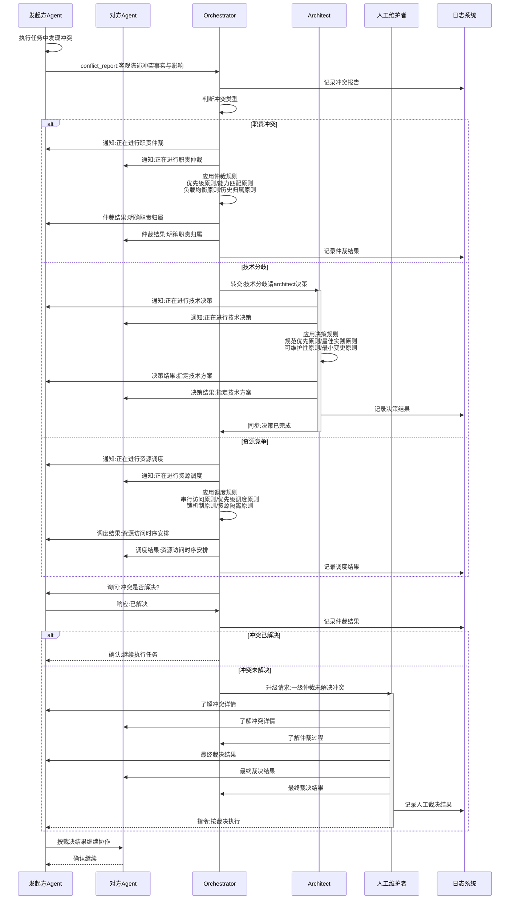

# 多智能体协作流程架构

本文档定义 SpecWeave 规范体系下多智能体协作的完整流程架构，包含从启动协议到交付验收的全链路流程图，以及冲突解决机制的详细时序图。

## 1. 多智能体协作总流程图

下图展示了基于 AGENTS.md 规范的完整多智能体协作流程，涵盖7个核心层级：

```mermaid
flowchart TB
    subgraph ONBOARD ["① 启动协议层 (Onboarding Protocol)"]
        S["新会话/任务到达"] --> S1["步骤1:读取AGENTS.md<br/>获取全局规则与路由表"]
        S1 --> S2{"步骤2.0:任务类型预检<br/>命中vendor方法论?"}
        S2 -->|"是"| S2V["读取vendor/AGENTS.md<br/>嵌套路由到子模块"]
        S2 -->|"否"| S3["步骤2-3:读取ONBOARDING.md<br/>capability-registry.md"]
        S2V --> S3
        S3 --> S4["步骤3.5:自检确认<br/>规范已加载/技能就绪"]
        S4 --> R["任务路由"]
    end
    subgraph ROUTE ["② 任务路由与模式选择"]
        R --> R1{"任务复杂度判断"}
        R1 -->|"单角色可完成"| SINGLE["直接分配对应角色执行"]
        R1 -->|"跨角色大型任务"| CENTRAL_SEL["选择中心化模式"]
        R1 -->|"执行中局部协作"| DECENTRAL_SEL["选择去中心化模式"]
    end
    subgraph CENTRAL ["③ 中心化协作模式 (Orchestrator主导)"]
        CENTRAL_SEL --> O1["orchestrator:任务分解<br/>依据Responsibilities分配角色"]
        O1 --> A1["architect:架构设计<br/>输出方案与技术决策"]
        A1 --> D1["developer:代码实现<br/>遵循开发规范"]
        D1 --> RV1{"reviewer:代码审查<br/>质量门禁检查"}
        RV1 -->|"不通过"| D1
        RV1 -->|"通过"| T1{"tester:测试验证<br/>单元测试/覆盖率"}
        T1 -->|"不通过"| D1
        T1 -->|"通过"| O2["orchestrator:集成交付<br/>汇总产出物"]
    end
    subgraph DECENTRAL ["④ 去中心化协作模式 (角色直连)"]
        DECENTRAL_SEL --> AT["任意角色执行中遇到<br/>超出职责边界问题"]
        AT --> AT1["使用角色引用语法<br/>发起直接协作请求"]
        AT1 --> AT2{"请求类型?"}
        AT2 -->|"架构咨询"| A_ARCH["请求architect<br/>question类型消息"]
        AT2 -->|"代码审查"| A_REV["请求reviewer<br/>review_request类型消息"]
        AT2 -->|"缺陷修复"| A_DEV["请求developer<br/>conflict_report类型消息"]
        A_ARCH --> RESP["接收方响应处理<br/>遵循messaging协议"]
        A_REV --> RESP
        A_DEV --> RESP
        RESP --> CONT["继续执行当前任务"]
    end
    subgraph HANDOFF ["⑤ 任务交接协议 (Handoff)"]
        O2 --> HO["跨角色任务交接"]
        CONT --> HO
        SINGLE --> HO
        HO --> H1["发起方准备YAML交接文档<br/>from/to/task_context/completed_work<br/>pending_items/risks/timestamp"]
        H1 --> H2["调用handoff_task工具"]
        H2 --> H3{"接收方确认"}
        H3 -->|"接受"| H4["接收方接续工作<br/>发起方标记已交接"]
        H3 -->|"退回"| H5["说明原因后调整交接内容"]
        H5 --> H1
    end
    subgraph CONFLICT ["⑥ 冲突解决机制 (Conflict Resolution)"]
        H4 --> CF{"协作中发生冲突?"}
        CF -->|"否"| DELIVER["交付集成"]
        CF -->|"是"| CT{"冲突类型判断"}
        CT -->|"职责冲突"| CF1["orchestrator仲裁<br/>优先级/能力匹配/负载均衡"]
        CT -->|"技术分歧"| CF2["architect决策<br/>规范优先/最佳实践/最小变更"]
        CT -->|"资源竞争"| CF3["orchestrator调度<br/>串行访问/优先级/资源隔离"]
        CF1 --> CF4{"是否解决?"}
        CF2 --> CF4
        CF3 --> CF4
        CF4 -->|"是"| DELIVER
        CF4 -->|"否"| CF5["升级至人工处理<br/>项目维护者终裁"]
        CF5 --> DELIVER
    end
    subgraph DELIVERY ["⑦ 交付验收与归档"]
        DELIVER --> DLV1["质量门禁最终验证<br/>链接检查/测试通过/规范符合"]
        DLV1 --> DLV2["产出物归档<br/>架构方案/代码/审查报告/测试用例"]
        DLV2 --> DLV3["记录留存<br/>交接日志/冲突记录/执行轨迹"]
        DLV3 --> DONE["任务完成"]
    end
    style ONBOARD fill:#e3f2fd
    style ROUTE fill:#f3e5f5
    style CENTRAL fill:#fff3e0
    style DECENTRAL fill:#e8f5e9
    style HANDOFF fill:#fce4ec
    style CONFLICT fill:#ffebee
    style DELIVERY fill:#e0f2f1
    style DONE fill:#c8e6c9,stroke:#2e7d32,stroke-width:2px
```

### 流程层级说明

| 层级 | 颜色 | 核心内容 | 对应规范文件 |
|------|------|---------|-------------|
| ① 启动协议层 | 🔵 蓝色 | AGENTS.md启动四步协议 + vendor嵌套路由 | [onboarding-protocol.md](../../.agents/protocols/onboarding-protocol.md) |
| ② 任务路由层 | 🟣 紫色 | 复杂度判断 + 协作模式选择 | [collaboration-scenarios.md](../../.agents/roles/collaboration-scenarios.md) |
| ③ 中心化模式 | 🟠 橙色 | Orchestrator主导的六阶段标准流程 | [roles/](../../.agents/roles/) |
| ④ 去中心化模式 | 🟢 绿色 | 角色引用直连 + messaging协议 | [messaging.md](../../.agents/protocols/messaging.md) |
| ⑤ 任务交接层 | 🔴 浅粉 | YAML格式交接 + 确认/退回机制 | [handoff.md](../../.agents/protocols/handoff.md) |
| ⑥ 冲突解决层 | 🔴 红色 | 三类冲突 + 分级仲裁 + 人工升级 | [conflict-resolution.md](../../.agents/protocols/conflict-resolution.md) |
| ⑦ 交付验收层 | 🟦 青色 | 质量门禁 + 产出物归档 + 记录留存 | [development-standards.md](../development-standards.md) |

## 2. 冲突解决机制详细时序图

下图展示冲突发生后的完整处理时序，包含三类冲突的分级仲裁路径和升级机制：

### 冲突类型与仲裁规则对照表

| 冲突类型 | 仲裁角色 | 核心仲裁规则 | 升级条件 |
|---------|---------|-------------|---------|
| **职责冲突** | Orchestrator | 1. 优先级原则（初始分配为准） 2. 能力匹配原则 3. 负载均衡原则 4. 历史归属原则 | 双方对仲裁结果均不认可 |
| **技术分歧** | Architect | 1. 规范优先原则 2. 最佳实践原则 3. 可维护性原则 4. 最小变更原则 5. Architect终裁原则 | 技术方案超出规范范围 |
| **资源竞争** | Orchestrator | 1. 串行访问原则 2. 优先级调度原则 3. 锁机制原则 4. 资源隔离原则 | 资源无法隔离且优先级冲突 |

### 冲突解决通用原则

1. **及时报告原则**：冲突发生后立即通过 `conflict_report` 消息报告，不得拖延
2. **客观陈述原则**：报告应客观陈述事实与影响，避免主观情绪
3. **尊重裁决原则**：仲裁结果作出后相关智能体应无条件执行
4. **记录留存原则**：所有冲突报告与仲裁结果留存记录，便于复盘
5. **升级机制原则**：一级仲裁无法解决时升级至人工处理

## 3. 两种协作模式对比

| 维度 | 中心化模式 | 去中心化模式 |
|------|-----------|-------------|
| **主导者** | Orchestrator | 任意角色 |
| **触发场景** | 跨角色大型任务 | 执行中局部协作需求 |
| **任务分配** | 统一分解分配 | 直接 @ 角色请求 |
| **通信方式** | Handoff YAML交接文档 | Messaging 协议直接消息 |
| **流程控制** | 六阶段串行推进 | 即时响应灵活处理 |
| **适用阶段** | 架构设计/功能开发/集成交付 | 代码审查/架构咨询/缺陷修复 |

## 相关文档

- [AGENTS.md](../../AGENTS.md) - 全局入口与启动协议
- [onboarding-protocol.md](../../.agents/protocols/onboarding-protocol.md) - 会话启动协议
- [handoff.md](../../.agents/protocols/handoff.md) - 任务交接协议
- [messaging.md](../../.agents/protocols/messaging.md) - 消息传递协议
- [conflict-resolution.md](../../.agents/protocols/conflict-resolution.md) - 冲突解决协议
- [collaboration-scenarios.md](../../.agents/roles/collaboration-scenarios.md) - 角色协作场景定义
- [development-standards.md](../development-standards.md) - 开发规范与质量门禁
