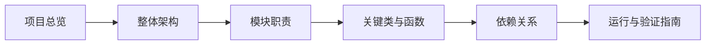

# Code Wiki：AI 智能体开发规范体系

## 文档定位

本 Code Wiki 面向希望快速理解、维护或扩展本仓库的开发者与 AI 智能体，系统说明项目整体架构、主要模块职责、关键类与函数、依赖关系、运行与验证方式。

本仓库不是单一业务应用，而是由两类资产组成的复合型项目：

1. **智能体开发规范体系**：以 `AGENTS.md` 为入口，以 `.agents/` 为规范容器，定义多智能体协作开发中的角色、协议、工作流、工具规范、治理规则与验证脚本。
2. **提示词萃取系统**：位于 `prompt_extraction/` 的 Python 子项目，提供从提示词文本或文件中抽取结构化特征、评估质量、生成优化结果和可视化展示的完整流水线。

## 文档目录

| 文档 | 内容 |
|---|---|
| [项目总览](project-overview.md) | 项目定位、目录结构、核心设计理念 |
| [整体架构](architecture.md) | 入口路由架构、规范体系架构、提示词萃取流水线架构 |
| [模块职责](modules.md) | `.agents/`、`docs/`、`.trae/specs/`、`prompt_extraction/` 等主要模块职责 |
| [关键类与函数](key-apis.md) | `PromptRecord`、`Pipeline`、解析、清洗、提取、评分、优化等关键 API |
| [依赖关系](dependencies.md) | Python 依赖、模块依赖、文档资产依赖与治理脚本依赖 |
| [运行与验证指南](runtime.md) | 环境准备、运行 Streamlit UI、执行测试、运行治理脚本 |

## 快速理解路径

如果你是首次接触该项目，建议按以下顺序阅读：

## 核心结论

- `AGENTS.md` 是全仓库智能体上下文路由入口，负责全局规则、角色索引、协议索引和任务路由。
- `.agents/` 是机器可读规范容器，保存角色、提示词、工具规范、协议、工作流、模板、脚本、团队与环境管理规范。
- `docs/` 是面向人类读者的文档、知识库和复盘资产集合。
- `.trae/specs/` 保存 Spec-driven 开发过程中的规格、任务与检查清单。
- `prompt_extraction/` 是可执行 Python 子项目，核心采用流水线架构，以 `PromptRecord` 贯穿输入解析、文本清洗、特征提取、质量评估、优化生成和结果导出。
- 项目验证分为两类：规范体系验证脚本与 Python 子项目测试套件。

## 主要源码入口

| 入口 | 说明 |
|---|---|
| [`AGENTS.md`](../../AGENTS.md) | 智能体全局契约与上下文路由入口 |
| [`.agents/README.md`](../../.agents/README.md) | 智能体规范容器说明 |
| [`README.md`](../../README.md) | 面向读者的项目主入口 |
| [`prompt_extraction/pipeline.py`](../../prompt_extraction/pipeline.py) | 提示词萃取系统流水线编排器 |
| [`prompt_extraction/models.py`](../../prompt_extraction/models.py) | 提示词萃取系统核心数据模型 |
| [`prompt_extraction/ui/app.py`](../../prompt_extraction/ui/app.py) | Streamlit 可视化主应用 |
| [`.agents/scripts/README.md`](../../.agents/scripts/README.md) | 自动化验证脚本索引 |

## 维护建议

- 当 `.agents/` 规范、`prompt_extraction/` 源码或运行方式发生变化时，应同步更新本 Code Wiki。
- 架构图、流程图和依赖图优先使用 Mermaid，便于版本化和审查。
- 新增文档建议继续使用 kebab-case 文件名，并保持模块化、可导航的组织方式。
