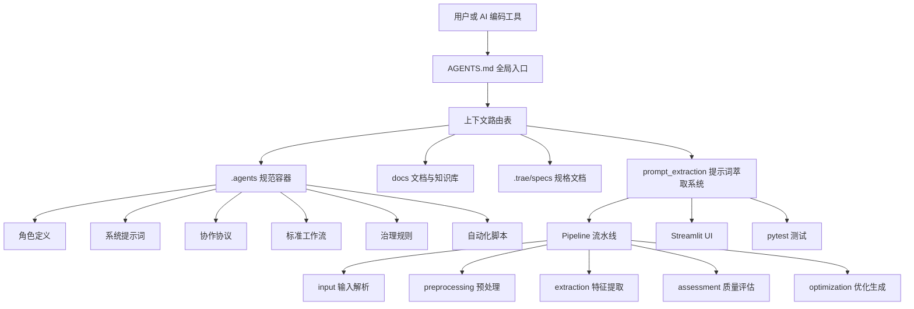
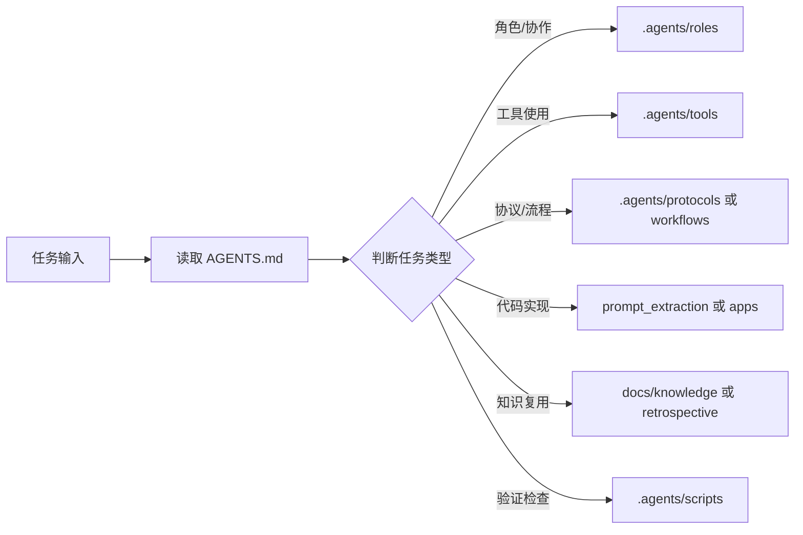
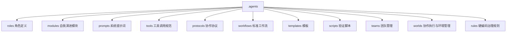
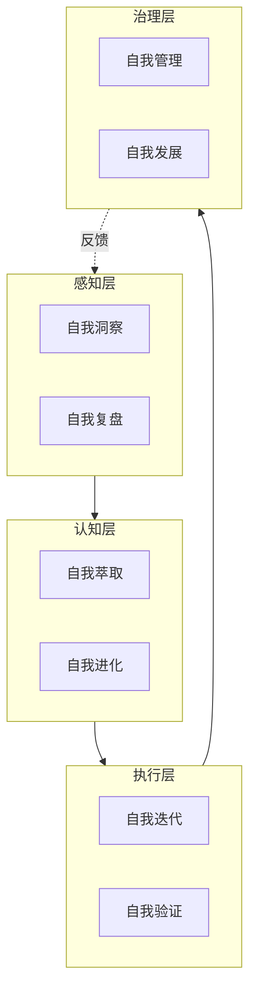
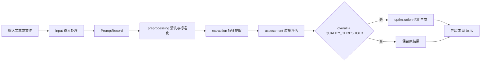
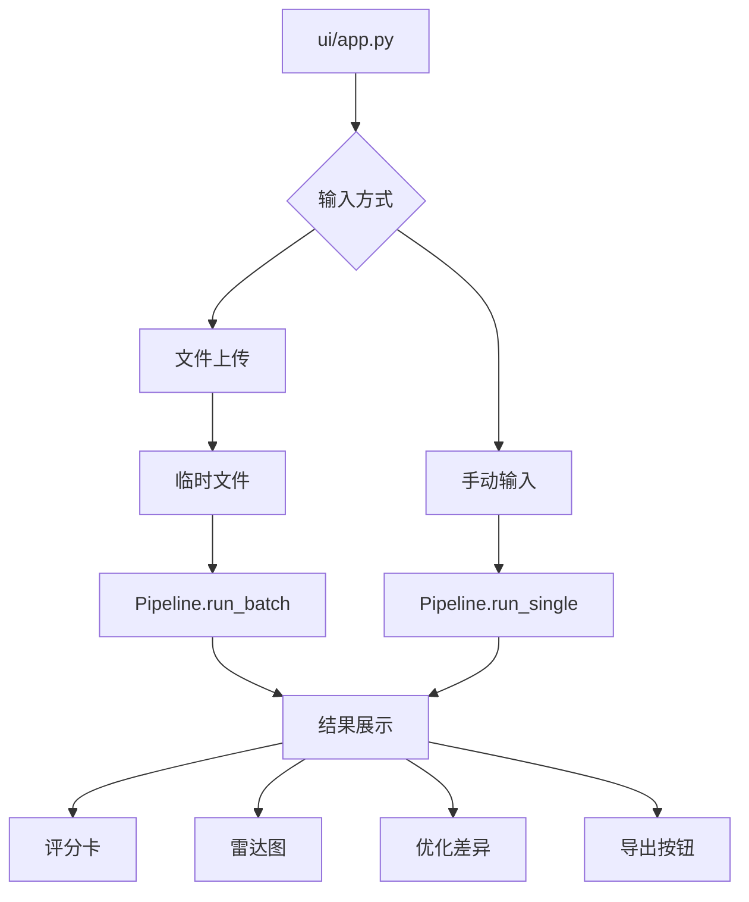
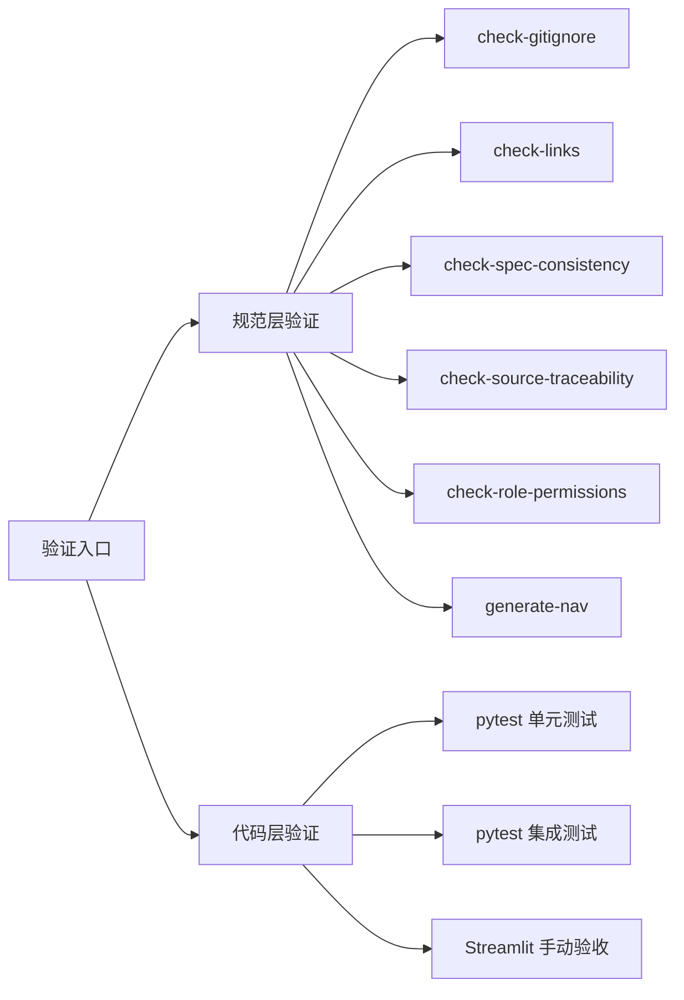

# 整体架构

## 架构总览

本仓库采用“入口路由 + 规范容器 + 可执行子系统 + 知识沉淀 + 自动化验证”的组合架构。

## 入口路由架构

`AGENTS.md` 是仓库的最高优先级入口，承担三个职责：

1. **定义全局规则**：沟通语言、按需读取、Mermaid 优先、代码修改约束、临时依赖管理、知识库查阅等。
2. **建立索引**：角色、协议、规则、工具、工作流、模板、提示词、自我演进模块、团队模块等。
3. **提供上下文路由表**：根据任务类型指向相关规范文件或目录。

## `.agents/` 规范体系架构

`.agents/` 是具体规范容器，内部以职责域拆分子目录。

该架构的核心优势是“入口与细节分离”：

- `AGENTS.md` 保持轻量但具备完整路由能力。
- `.agents/` 承载所有可扩展的角色、协议、规则与工作流细节。
- 新增能力时优先增加或调整 `.agents/` 子模块，再同步入口索引。

## 自我演进四层闭环

项目定义了感知、认知、执行、治理四层闭环，用于描述规范体系如何持续演进。

## 提示词萃取系统架构

`prompt_extraction/` 采用典型流水线架构，核心编排器为 `Pipeline`，核心数据载体为 `PromptRecord`。

### 流水线步骤

| 步骤 | 模块 | 输入 | 输出 |
|---|---|---|---|
| 1 | `input` | 单条文本或批量文件 | `PromptRecord` 或 `list[PromptRecord]` |
| 2 | `preprocessing.cleaner` | 原始文本 | 清洗文本、Markdown 结构、元数据 |
| 3 | `preprocessing.normalizer` | 清洗文本 | 标准化文本 |
| 4 | `extraction.extractor` | 标准化文本、Markdown 结构 | `FeatureSet` |
| 5 | `assessment.evaluator` | 文本、`FeatureSet` | `QualityScore` |
| 6 | `optimization.optimizer` | `PromptRecord` | `OptimizationResult` |
| 7 | `pipeline.export_results` 或 UI | 处理结果 | CSV、可视化结果 |

## UI 架构

Streamlit UI 是 `Pipeline` 的前端封装，提供两种输入方式：

- 文件上传：支持 CSV、JSON、TXT、Markdown。
- 手动输入：处理单条提示词。

## 验证架构

项目验证体系分为规范层验证和代码层验证。

