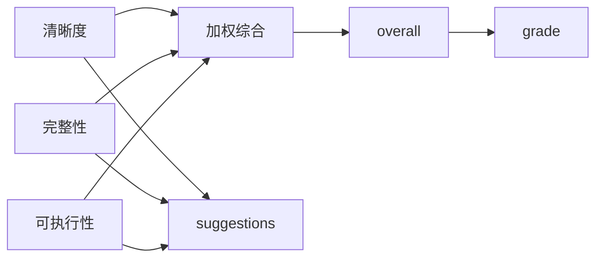
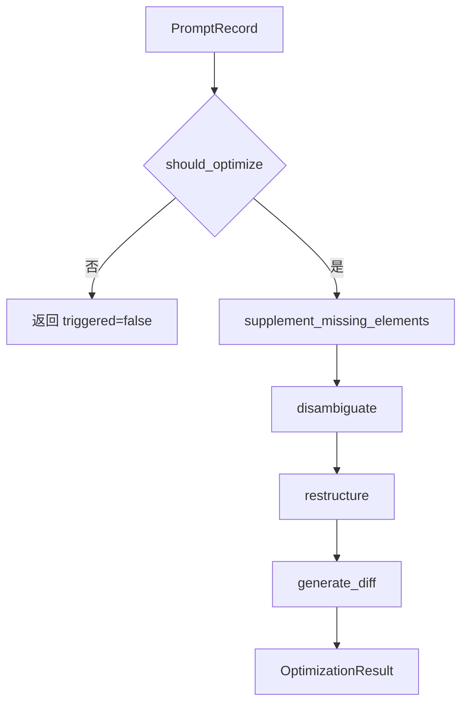

# 关键类与函数

本文档包含两部分核心API说明：
1. **提示词萃取系统**（`prompt_extraction/`）：从提示词文本中抽取结构化特征、评估质量、生成优化结果的流水线
2. **共享工具库**（`.agents/scripts/lib/`）：多智能体冲突解决、测试模板、链接修复等自动化脚本共享库

---

## 提示词萃取系统：核心数据模型

提示词萃取系统的核心数据结构定义在 `prompt_extraction/models.py`。这些 dataclass 组成了流水线各阶段之间的数据契约。

### `FeatureSet`

位置：[`prompt_extraction/models.py`](../../prompt_extraction/models.py)

用于保存从提示词中提取的结构化特征。

| 字段 | 类型 | 说明 |
|---|---|---|
| `instructions` | `list[str]` | 核心指令列表 |
| `constraints` | `list[dict]` | 约束条件列表，通常包含约束类型和原文 |
| `expected_output` | `Optional[str]` | 期望输出描述或输出示例 |
| `output_type` | `Optional[str]` | 推断出的输出类型，如 JSON、Markdown、代码等 |

### `QualityScore`

位置：[`prompt_extraction/models.py`](../../prompt_extraction/models.py)

用于保存提示词质量评估结果。

| 字段 | 类型 | 说明 |
|---|---|---|
| `clarity` | `float` | 清晰度评分 |
| `completeness` | `float` | 完整性评分 |
| `executability` | `float` | 可执行性评分 |
| `overall` | `float` | 综合评分 |
| `grade` | `str` | 等级，取值为“优、良、中、差” |
| `suggestions` | `list[str]` | 改进建议列表 |

### `OptimizationResult`

位置：[`prompt_extraction/models.py`](../../prompt_extraction/models.py)

用于保存提示词优化结果。

| 字段 | 类型 | 说明 |
|---|---|---|
| `triggered` | `bool` | 是否触发优化 |
| `optimized_text` | `str` | 优化后的提示词文本 |
| `improvements` | `list[str]` | 本次优化采取的改进项 |
| `diff` | `str` | 优化前后的逐行差异 |

### `PromptRecord`

位置：[`prompt_extraction/models.py`](../../prompt_extraction/models.py)

贯穿整个流水线的核心载体。

| 字段 | 类型 | 说明 |
|---|---|---|
| `id` | `str` | 提示词记录唯一标识 |
| `original_text` | `str` | 原始提示词文本 |
| `cleaned_text` | `str` | 清洗和标准化后的文本 |
| `markdown_structure` | `Optional[dict]` | Markdown 标题、列表、代码块等结构信息 |
| `features` | `FeatureSet` | 提取后的结构化特征 |
| `quality` | `QualityScore` | 质量评分结果 |
| `optimization` | `OptimizationResult` | 优化结果 |
| `error` | `Optional[str]` | 当前记录处理失败时的错误信息 |

## 流水线编排器

### `Pipeline`

位置：[`prompt_extraction/pipeline.py`](../../prompt_extraction/pipeline.py)

`Pipeline` 负责串联输入处理、文本清洗、标准化、特征提取、质量评估、优化和导出。

```mermaid
sequenceDiagram
    participant Caller as "调用方"
    participant Pipeline as Pipeline
    participant Input as input
    participant Clean as cleaner/normalizer
    participant Extract as extractor
    participant Eval as evaluator
    participant Opt as optimizer
    Caller->>Pipeline: run_single(text) 或 run_batch(file_path)
    Pipeline->>Input: 构造 PromptRecord
    Pipeline->>Clean: clean_text + normalize_text
    Pipeline->>Extract: extract_features
    Pipeline->>Eval: evaluate
    alt 评分低于阈值
        Pipeline->>Opt: optimize
    end
    Pipeline-->>Caller: PromptRecord 或 list[PromptRecord]
```

#### `_process_record(record)`

内部核心处理函数，执行步骤：

1. 调用 `clean_text` 获得清洗文本、Markdown 结构和元数据。
2. 调用 `normalize_text` 标准化文本。
3. 调用 `extract_features` 提取结构化特征。
4. 调用 `evaluate` 计算质量评分。
5. 当 `quality.overall < QUALITY_THRESHOLD` 时调用 `optimize`。
6. 任一阶段异常时写入 `record.error`，避免单条记录失败影响批量流程。

#### `run_single(text)`

处理单条提示词文本。

- 输入：字符串。
- 输出：一个 `PromptRecord`。
- 空文本或纯空白文本会在输入阶段失败，并通过 `error` 字段返回错误。

#### `run_batch(file_path)`

处理批量输入文件。

- 输入：文件路径。
- 输出：`list[PromptRecord]`。
- 支持 CSV、JSON、TXT、Markdown。
- 单条记录失败不会中断后续记录处理。

#### `export_results(records, output_path)`

将处理结果导出为 CSV。

- 使用 `pandas.DataFrame` 构造结果表。
- 列表和字典字段会以 JSON 字符串形式写入。
- 使用 `utf-8-sig` 编码，以便 Excel 兼容中文。

## 输入解析函数

位置：[`prompt_extraction/input/parser.py`](../../prompt_extraction/input/parser.py)

| 函数 | 职责 |
|---|---|
| `detect_format(file_path)` | 根据扩展名识别 csv、json、txt、markdown |
| `_detect_prompt_column(headers)` | 从 CSV 表头中自动识别提示词列 |
| `_detect_prompt_key(records)` | 从 JSON 对象数组中自动识别提示词字段 |
| `_generate_id()` | 生成短 ID |
| `parse_csv(file_path)` | 解析 CSV 文件 |
| `parse_json(file_path)` | 解析 JSON 对象数组 |
| `parse_txt(file_path)` | 按非空行解析 TXT 文件 |
| `parse_markdown(file_path)` | 按 Markdown 一级/二级标题拆分区块 |
| `parse_file(file_path)` | 根据格式分发到具体解析函数 |

位置：[`prompt_extraction/input/input_handler.py`](../../prompt_extraction/input/input_handler.py)

| 函数 | 职责 |
|---|---|
| `process_single_input(text)` | 将单条文本转换为 `PromptRecord` |
| `process_batch_input(file_path)` | 将文件解析结果转换为 `PromptRecord` 列表 |
| `process_input(input_data, is_file)` | 统一输入入口 |

## 预处理函数

位置：[`prompt_extraction/preprocessing/cleaner.py`](../../prompt_extraction/preprocessing/cleaner.py)

| 函数 | 职责 |
|---|---|
| `normalize_whitespace(text)` | 将连续空白压缩为单个空格并去除首尾空白 |
| `strip_markup(text)` | 去除 Markdown 和 HTML 标记，保留纯文本内容 |
| `extract_markdown_structure(text)` | 提取标题、列表项、代码块等 Markdown 结构 |
| `identify_metadata(text)` | 识别 URL、email、代码块等元数据 |
| `clean_text(text)` | 清洗统一入口，返回清洗文本、Markdown 结构、元数据 |

位置：[`prompt_extraction/preprocessing/normalizer.py`](../../prompt_extraction/preprocessing/normalizer.py)

| 函数 | 职责 |
|---|---|
| `normalize_fullwidth(text)` | 全角字符转半角 |
| `normalize_punctuation(text)` | 中文标点标准化 |
| `normalize_text(text)` | 标准化统一入口 |

## 特征提取函数

位置：[`prompt_extraction/extraction/extractor.py`](../../prompt_extraction/extraction/extractor.py)

| 函数 | 职责 |
|---|---|
| `_split_sentences(text)` | 按常见中英文句末标点和换行拆分句子 |
| `_is_imperative_sentence(sentence)` | 判断是否为动词开头的祈使句 |
| `extract_instructions(text)` | 基于指令关键词和祈使句提取核心指令 |
| `_classify_constraint(text)` | 基于关键词判断约束类型 |
| `extract_constraints(text)` | 提取格式、内容、风格等约束 |
| `extract_expected_output(text)` | 提取预期输出描述和输出类型 |
| `extract_from_markdown_structure(md_structure)` | 从 Markdown 标题、列表、代码块补充提取特征 |
| `_merge_features(base, extra)` | 合并文本特征与 Markdown 结构特征并去重 |
| `extract_features(text, md_structure)` | 特征提取统一入口 |

## 质量评估函数

位置：[`prompt_extraction/assessment/evaluator.py`](../../prompt_extraction/assessment/evaluator.py)

| 函数 | 职责 | 评分方式 |
|---|---|---|
| `evaluate_clarity(text)` | 评估清晰度 | 100 起扣，考虑长度、结构、歧义词 |
| `evaluate_completeness(text, features)` | 评估完整性 | 0 起加，指令、约束、上下文、示例、输出格式各占一定分值 |
| `evaluate_executability(text, features)` | 评估可执行性 | 0 起加，考虑动作动词、约束可验证性、输出可判定性 |
| `evaluate(text, features)` | 综合评估 | 按权重合成综合分，并判定等级 |

综合评分逻辑：



## 优化函数

位置：[`prompt_extraction/optimization/optimizer.py`](../../prompt_extraction/optimization/optimizer.py)

| 函数 | 职责 |
|---|---|
| `should_optimize(quality)` | 判断综合评分是否低于质量阈值 |
| `_infer_output_format(text)` | 根据文本内容推断输出格式说明 |
| `_detect_implicit_constraints(text)` | 检测隐含约束并显式化 |
| `supplement_missing_elements(text, features)` | 补充缺失输出格式和约束 |
| `disambiguate(text)` | 替换模糊词，增强表达确定性 |
| `_extract_context(text)` | 提取背景或上下文行 |
| `restructure(text, features)` | 重组为标准 Markdown 结构 |
| `generate_diff(original, optimized)` | 生成优化前后逐行 diff |
| `optimize(record)` | 优化统一入口 |

优化流程：



## UI 入口与组件

位置：[`prompt_extraction/ui/app.py`](../../prompt_extraction/ui/app.py)

主应用职责：

- 初始化页面配置。
- 在侧边栏选择输入方式。
- 调用 `Pipeline.run_batch` 或 `Pipeline.run_single`。
- 统计处理结果。
- 展示结果表格与单条详情。
- 调用 UI 组件展示评分、雷达图、优化 diff 和导出按钮。

组件职责：

| 文件 | 职责 |
|---|---|
| `components/score_card.py` | 渲染评分卡 |
| `components/radar_chart.py` | 渲染 Plotly 雷达图 |
| `components/diff_viewer.py` | 渲染优化差异 |
| `components/export_button.py` | 渲染导出按钮 |

## `.agents/scripts/lib` 共享工具库 API

### 多智能体冲突解决模块

位置：[`lib/collaboration/conflict_resolution.py`](../../.agents/scripts/lib/collaboration/conflict_resolution.py)

提供多智能体系统中职责冲突、技术冲突、资源冲突三类冲突的仲裁机制，包含死锁预防和冲突升级能力。

#### 核心数据模型

| 类 | 说明 |
|---|---|
| `ConflictType` | 冲突类型枚举：`RESPONSIBILITY`/`TECHNICAL`/`RESOURCE` |
| `ConflictReport` | 冲突报告，包含冲突双方、类型、描述、任务ID、所需能力 |
| `ArbitrationResult` | 仲裁结果，包含状态(RESOLVED/ESCALATED)、winner、仲裁者、原因 |
| `ResolutionStatus` | 仲裁状态枚举：`RESOLVED`(已解决)/`ESCALATED`(需人工介入) |

#### 核心类：`ConflictResolver`

| 方法 | 职责 |
|---|---|
| `resolve(report, agents)` | 仲裁入口，根据冲突类型分发到具体解决方法 |
| `_resolve_responsibility(...)` | 职责冲突仲裁：能力匹配→优先级→历史归属→负载均衡 |
| `_resolve_technical(...)` | 技术冲突仲裁：规范优先→最佳实践→可维护性→最小变更→架构师终裁 |
| `_resolve_resource(...)` | 资源冲突仲裁：串行访问→优先级调度→锁机制→资源隔离 |

**关键规则**：
- 职责冲突中如果指定了`required_capability`，只有具备该能力的agent才能被选为winner
- 无agent匹配所需能力时返回`ESCALATED`状态，`needs_human=True`，升级人工处理
- **负载值范围校验**（P0修复）：负载均衡比较前过滤负载异常的agent，load必须为int/float且在`[0, 100]`闭区间内；负值、超100、缺失、非数值类型的负载均被视为无效
- **全异常负载升级**：所有候选agent负载均无效时返回`ESCALATED`，升级人工处理
- 异常负载过滤时输出`[WARNING]`日志便于监控
- 双方连续拒绝仲裁结果触发升级
- 所有锁操作有超时机制防止死锁

### 测试辅助工具库（lib.testing）

位置：[`lib/testing/__init__.py`](../../.agents/scripts/lib/testing/__init__.py)
详细API文档：[lib/docs/15-testing.md](../../.agents/scripts/lib/docs/15-testing.md)

为仲裁/调度类并发模块提供标准化的多agent测试场景生成器，一键覆盖边界场景、异常输入、边缘案例。

#### 常量

| 常量 | 值 | 用途 |
|---|---|---|
| `BOUNDARY_AGENT_COUNTS` | `(1, 2, 3, 5, 10)` | 标准边界场景agent数量 |
| `EXTREME_AGENT_COUNTS` | `(0, 1, 2, 3, 5, 10, 50, 100)` | 扩展极端场景（含空/超大规模） |
| `BOUNDARY_ASSERTIONS` | 字典 | 边界场景标准断言说明文档，共10项 |

#### 核心数据类：`MultiAgentScenario`

| 字段 | 类型 | 说明 |
|---|---|---|
| `name` | `str` | 场景唯一标识 |
| `agent_count` | `int` | agent数量 |
| `agents` | `dict` | 预生成的agent字典 |
| `description` | `str` | 场景中文描述 |
| `expected_winner` | `Optional[str]` | 预期胜出agent ID（可预测场景） |
| `metadata` | `dict` | 元数据（策略类型、边缘类型等） |

#### 基础场景生成函数

| 函数 | 用途 |
|---|---|
| `generate_agents(count, ...)` | 生成指定数量的agent字典，支持多种优先级/负载策略 |
| `agent_scenarios(...)` | 生成策略组合场景矩阵（数量×优先级策略×负载策略笛卡尔积） |
| `parametrize_agent_counts(...)` | pytest装饰器，一键参数化N=1,2,3,5,10个agent场景 |

**`generate_agents` 策略选项**：

| priority_strategy | 说明 | load_strategy | 说明 |
|---|---|---|---|
| `"uniform"` | 所有agent优先级相同(2) | `"uniform"` | 所有agent负载相同(50) |
| `"ascending"` | 优先级递增（第一个最高） | `"ascending"` | 负载递增（第一个最低，测负载均衡） |
| `"descending"` | 优先级递减（最后一个最高） | `"descending"` | 负载递减（最后一个最低） |
| `"random"` | 随机优先级1-5 | `"extremes"` | 极端分布：第一个99，最后一个1，测饥饿问题 |

#### 边缘场景生成函数

| 函数 | 用途 |
|---|---|
| `generate_malformed_agents(variant, ...)` | 生成9种畸形数据场景（缺字段/负值/超范围/混合角色等） |
| `generate_tie_scenario(count)` | 生成完全平局场景（所有agent优先级负载相同），测平局打破确定性 |
| `generate_partial_capability_match(count, cap, matching_count)` | 生成部分能力匹配场景，测能力过滤逻辑；matching_count=0测无匹配升级 |
| `edge_scenarios()` | 一键生成全套18个边缘场景（空/单/平局/大规模/9种畸形/3种能力匹配） |

**`edge_scenarios()` 包含18个场景分类**：

| 类别 | 场景数 | 测试目标 |
|---|---|---|
| 空/单输入 | 2 | 空字典、单agent无竞争的优雅处理 |
| 完全平局 | 2 | 平局打破机制的确定性（5和10个agent） |
| 大规模 | 2 | 50/100个agent性能（<5秒） |
| 畸形数据 | 9 | 缺字段/负值/超范围/空capabilities/混合角色等容错性 |
| 能力匹配 | 3 | 部分匹配选择正确子集、无匹配触发ESCALATED、全匹配正常负载均衡 |

#### 快速开始示例

```python
import pytest
from lib.collaboration.conflict_resolution import ConflictResolver, ConflictReport, ConflictType, ResolutionStatus
from lib.testing import (
    generate_agents, parametrize_agent_counts, edge_scenarios,
    BOUNDARY_AGENT_COUNTS
)

@pytest.fixture
def resolver():
    return ConflictResolver()

# 一键参数化边界数量测试
@parametrize_agent_counts(skip_single=True)
def test_load_balancing_selects_lowest_load(resolver, n_agents):
    """N个agent场景下，负载均衡应选择真正负载最低的匹配agent"""
    agents = generate_agents(n_agents, load_strategy="ascending")
    ids = list(agents.keys())
    report = ConflictReport(
        reporter_id=ids[0], opponent_id=ids[-1],
        conflict_type=ConflictType.RESPONSIBILITY,
        description="负载均衡测试", task_id=f"TEST-LB-{n_agents}",
        required_capability="coding",
    )
    result = resolver.resolve(report, agents=agents)
    loads = {aid: info["load"] for aid, info in agents.items()}
    assert loads[result.winner] == min(loads.values())

# 综合边缘场景测试
@pytest.mark.parametrize("scenario", edge_scenarios(), ids=lambda s: s.name)
def test_all_edge_scenarios_no_crash(resolver, scenario):
    """所有边缘场景必须正常返回，不崩溃"""
    if scenario.agent_count < 2:
        pytest.skip(f"单agent跳过（n={scenario.agent_count}）")
    ids = list(scenario.agents.keys())
    edge_type = scenario.metadata.get("edge_type", "unknown")
    required_cap = scenario.metadata.get("required_cap", "coding")
    report = ConflictReport(
        reporter_id=ids[0], opponent_id=ids[-1],
        conflict_type=ConflictType.RESPONSIBILITY,
        description=scenario.description,
        task_id=f"TASK-EDGE-{scenario.name}",
        required_capability=required_cap,
    )
    result = resolver.resolve(report, agents=scenario.agents)
    assert result.status in (ResolutionStatus.RESOLVED, ResolutionStatus.ESCALATED)
    # 无能力匹配必须升级
    if edge_type == "no_match":
        assert result.status == ResolutionStatus.ESCALATED
        assert result.needs_human is True
        assert result.winner is None
```
