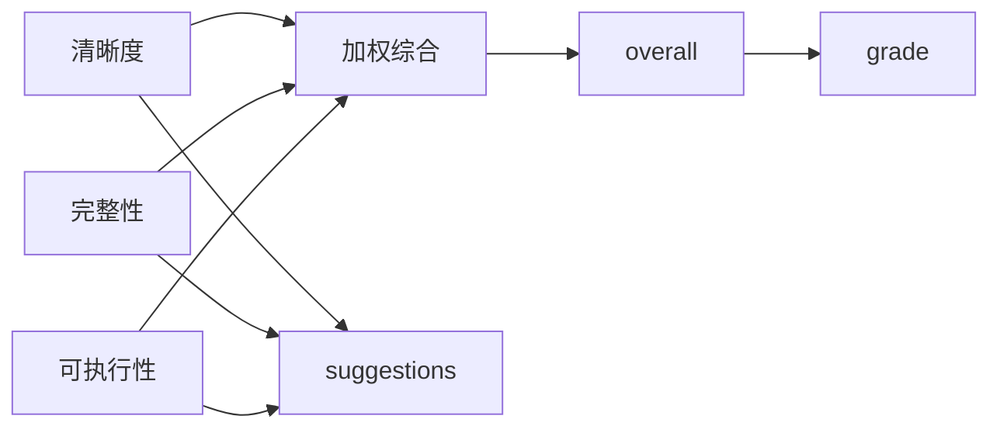
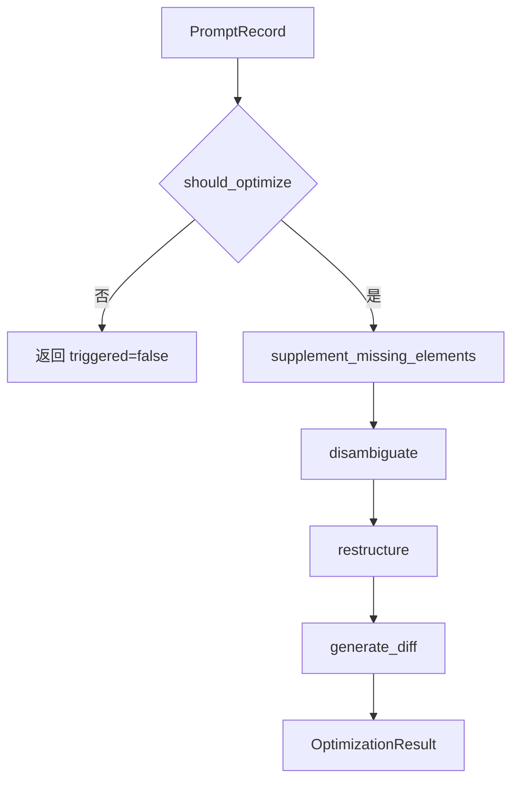

# 关键类与函数

## 核心数据模型

提示词萃取系统的核心数据结构定义在 `prompt_extraction/models.py`。这些 dataclass 组成了流水线各阶段之间的数据契约。

### `FeatureSet`

位置：[`prompt_extraction/models.py`](../../prompt_extraction/models.py)

用于保存从提示词中提取的结构化特征。

| 字段 | 类型 | 说明 |
|---|---|---|
| `instructions` | `list[str]` | 核心指令列表 |
| `constraints` | `list[dict]` | 约束条件列表，通常包含约束类型和原文 |
| `expected_output` | `Optional[str]` | 期望输出描述或输出示例 |
| `output_type` | `Optional[str]` | 推断出的输出类型，如 JSON、Markdown、代码等 |

### `QualityScore`

位置：[`prompt_extraction/models.py`](../../prompt_extraction/models.py)

用于保存提示词质量评估结果。

| 字段 | 类型 | 说明 |
|---|---|---|
| `clarity` | `float` | 清晰度评分 |
| `completeness` | `float` | 完整性评分 |
| `executability` | `float` | 可执行性评分 |
| `overall` | `float` | 综合评分 |
| `grade` | `str` | 等级，取值为“优、良、中、差” |
| `suggestions` | `list[str]` | 改进建议列表 |

### `OptimizationResult`

位置：[`prompt_extraction/models.py`](../../prompt_extraction/models.py)

用于保存提示词优化结果。

| 字段 | 类型 | 说明 |
|---|---|---|
| `triggered` | `bool` | 是否触发优化 |
| `optimized_text` | `str` | 优化后的提示词文本 |
| `improvements` | `list[str]` | 本次优化采取的改进项 |
| `diff` | `str` | 优化前后的逐行差异 |

### `PromptRecord`

位置：[`prompt_extraction/models.py`](../../prompt_extraction/models.py)

贯穿整个流水线的核心载体。

| 字段 | 类型 | 说明 |
|---|---|---|
| `id` | `str` | 提示词记录唯一标识 |
| `original_text` | `str` | 原始提示词文本 |
| `cleaned_text` | `str` | 清洗和标准化后的文本 |
| `markdown_structure` | `Optional[dict]` | Markdown 标题、列表、代码块等结构信息 |
| `features` | `FeatureSet` | 提取后的结构化特征 |
| `quality` | `QualityScore` | 质量评分结果 |
| `optimization` | `OptimizationResult` | 优化结果 |
| `error` | `Optional[str]` | 当前记录处理失败时的错误信息 |

## 流水线编排器

### `Pipeline`

位置：[`prompt_extraction/pipeline.py`](../../prompt_extraction/pipeline.py)

`Pipeline` 负责串联输入处理、文本清洗、标准化、特征提取、质量评估、优化和导出。

```mermaid
sequenceDiagram
    participant Caller as 调用方
    participant Pipeline as Pipeline
    participant Input as input
    participant Clean as cleaner/normalizer
    participant Extract as extractor
    participant Eval as evaluator
    participant Opt as optimizer

    Caller->>Pipeline: run_single(text) 或 run_batch(file_path)
    Pipeline->>Input: 构造 PromptRecord
    Pipeline->>Clean: clean_text + normalize_text
    Pipeline->>Extract: extract_features
    Pipeline->>Eval: evaluate
    alt 评分低于阈值
        Pipeline->>Opt: optimize
    end
    Pipeline-->>Caller: PromptRecord 或 list[PromptRecord]
```

#### `_process_record(record)`

内部核心处理函数，执行步骤：

1. 调用 `clean_text` 获得清洗文本、Markdown 结构和元数据。
2. 调用 `normalize_text` 标准化文本。
3. 调用 `extract_features` 提取结构化特征。
4. 调用 `evaluate` 计算质量评分。
5. 当 `quality.overall < QUALITY_THRESHOLD` 时调用 `optimize`。
6. 任一阶段异常时写入 `record.error`，避免单条记录失败影响批量流程。

#### `run_single(text)`

处理单条提示词文本。

- 输入：字符串。
- 输出：一个 `PromptRecord`。
- 空文本或纯空白文本会在输入阶段失败，并通过 `error` 字段返回错误。

#### `run_batch(file_path)`

处理批量输入文件。

- 输入：文件路径。
- 输出：`list[PromptRecord]`。
- 支持 CSV、JSON、TXT、Markdown。
- 单条记录失败不会中断后续记录处理。

#### `export_results(records, output_path)`

将处理结果导出为 CSV。

- 使用 `pandas.DataFrame` 构造结果表。
- 列表和字典字段会以 JSON 字符串形式写入。
- 使用 `utf-8-sig` 编码，以便 Excel 兼容中文。

## 输入解析函数

位置：[`prompt_extraction/input/parser.py`](../../prompt_extraction/input/parser.py)

| 函数 | 职责 |
|---|---|
| `detect_format(file_path)` | 根据扩展名识别 csv、json、txt、markdown |
| `_detect_prompt_column(headers)` | 从 CSV 表头中自动识别提示词列 |
| `_detect_prompt_key(records)` | 从 JSON 对象数组中自动识别提示词字段 |
| `_generate_id()` | 生成短 ID |
| `parse_csv(file_path)` | 解析 CSV 文件 |
| `parse_json(file_path)` | 解析 JSON 对象数组 |
| `parse_txt(file_path)` | 按非空行解析 TXT 文件 |
| `parse_markdown(file_path)` | 按 Markdown 一级/二级标题拆分区块 |
| `parse_file(file_path)` | 根据格式分发到具体解析函数 |

位置：[`prompt_extraction/input/input_handler.py`](../../prompt_extraction/input/input_handler.py)

| 函数 | 职责 |
|---|---|
| `process_single_input(text)` | 将单条文本转换为 `PromptRecord` |
| `process_batch_input(file_path)` | 将文件解析结果转换为 `PromptRecord` 列表 |
| `process_input(input_data, is_file)` | 统一输入入口 |

## 预处理函数

位置：[`prompt_extraction/preprocessing/cleaner.py`](../../prompt_extraction/preprocessing/cleaner.py)

| 函数 | 职责 |
|---|---|
| `normalize_whitespace(text)` | 将连续空白压缩为单个空格并去除首尾空白 |
| `strip_markup(text)` | 去除 Markdown 和 HTML 标记，保留纯文本内容 |
| `extract_markdown_structure(text)` | 提取标题、列表项、代码块等 Markdown 结构 |
| `identify_metadata(text)` | 识别 URL、email、代码块等元数据 |
| `clean_text(text)` | 清洗统一入口，返回清洗文本、Markdown 结构、元数据 |

位置：[`prompt_extraction/preprocessing/normalizer.py`](../../prompt_extraction/preprocessing/normalizer.py)

| 函数 | 职责 |
|---|---|
| `normalize_fullwidth(text)` | 全角字符转半角 |
| `normalize_punctuation(text)` | 中文标点标准化 |
| `normalize_text(text)` | 标准化统一入口 |

## 特征提取函数

位置：[`prompt_extraction/extraction/extractor.py`](../../prompt_extraction/extraction/extractor.py)

| 函数 | 职责 |
|---|---|
| `_split_sentences(text)` | 按常见中英文句末标点和换行拆分句子 |
| `_is_imperative_sentence(sentence)` | 判断是否为动词开头的祈使句 |
| `extract_instructions(text)` | 基于指令关键词和祈使句提取核心指令 |
| `_classify_constraint(text)` | 基于关键词判断约束类型 |
| `extract_constraints(text)` | 提取格式、内容、风格等约束 |
| `extract_expected_output(text)` | 提取预期输出描述和输出类型 |
| `extract_from_markdown_structure(md_structure)` | 从 Markdown 标题、列表、代码块补充提取特征 |
| `_merge_features(base, extra)` | 合并文本特征与 Markdown 结构特征并去重 |
| `extract_features(text, md_structure)` | 特征提取统一入口 |

## 质量评估函数

位置：[`prompt_extraction/assessment/evaluator.py`](../../prompt_extraction/assessment/evaluator.py)

| 函数 | 职责 | 评分方式 |
|---|---|---|
| `evaluate_clarity(text)` | 评估清晰度 | 100 起扣，考虑长度、结构、歧义词 |
| `evaluate_completeness(text, features)` | 评估完整性 | 0 起加，指令、约束、上下文、示例、输出格式各占一定分值 |
| `evaluate_executability(text, features)` | 评估可执行性 | 0 起加，考虑动作动词、约束可验证性、输出可判定性 |
| `evaluate(text, features)` | 综合评估 | 按权重合成综合分，并判定等级 |

综合评分逻辑：



## 优化函数

位置：[`prompt_extraction/optimization/optimizer.py`](../../prompt_extraction/optimization/optimizer.py)

| 函数 | 职责 |
|---|---|
| `should_optimize(quality)` | 判断综合评分是否低于质量阈值 |
| `_infer_output_format(text)` | 根据文本内容推断输出格式说明 |
| `_detect_implicit_constraints(text)` | 检测隐含约束并显式化 |
| `supplement_missing_elements(text, features)` | 补充缺失输出格式和约束 |
| `disambiguate(text)` | 替换模糊词，增强表达确定性 |
| `_extract_context(text)` | 提取背景或上下文行 |
| `restructure(text, features)` | 重组为标准 Markdown 结构 |
| `generate_diff(original, optimized)` | 生成优化前后逐行 diff |
| `optimize(record)` | 优化统一入口 |

优化流程：



## UI 入口与组件

位置：[`prompt_extraction/ui/app.py`](../../prompt_extraction/ui/app.py)

主应用职责：

- 初始化页面配置。
- 在侧边栏选择输入方式。
- 调用 `Pipeline.run_batch` 或 `Pipeline.run_single`。
- 统计处理结果。
- 展示结果表格与单条详情。
- 调用 UI 组件展示评分、雷达图、优化 diff 和导出按钮。

组件职责：

| 文件 | 职责 |
|---|---|
| `components/score_card.py` | 渲染评分卡 |
| `components/radar_chart.py` | 渲染 Plotly 雷达图 |
| `components/diff_viewer.py` | 渲染优化差异 |
| `components/export_button.py` | 渲染导出按钮 |
