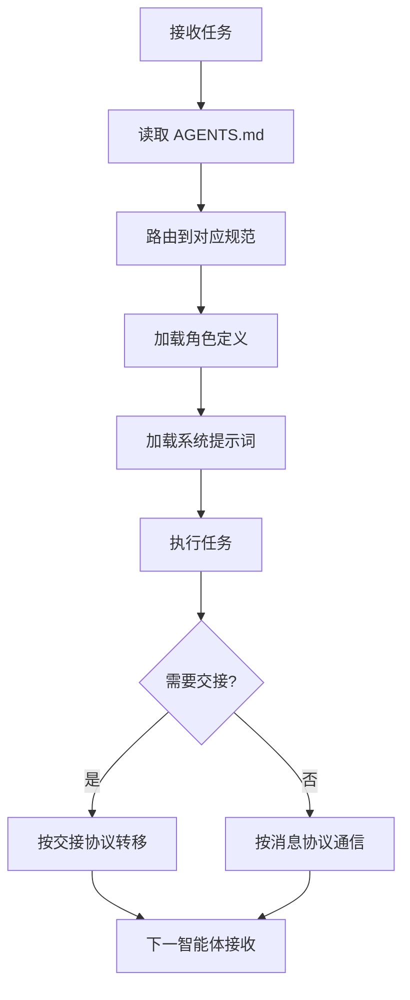

# 协作体系

> **来源**：从 `README.md` "协作协议"与"标准工作流"章节拆分

## 协作协议

多智能体协作通过以下 4 项协议保障：

| 协议 | 入口 | 用途 |
|---|---|---|
| 任务交接 | [.agents/protocols/handoff.md](../.agents/protocols/handoff.md) | 智能体间任务转移的标准化格式 |
| 消息传递 | [.agents/protocols/messaging.md](../.agents/protocols/messaging.md) | 智能体间通信的消息结构 |
| 冲突解决 | [.agents/protocols/conflict-resolution.md](../.agents/protocols/conflict-resolution.md) | 分歧仲裁与升级机制 |
| 临时依赖管理 | [.agents/protocols/dependency-management.md](../.agents/protocols/dependency-management.md) | 依赖存放、使用与清理 |

### 协作流程

## 标准工作流

本项目定义了 3 个标准工作流，均包含 Mermaid 流程图与详细步骤：

| 工作流 | 入口 | 适用场景 |
|---|---|---|
| 特性开发 | [.agents/workflows/feature-development.md](../.agents/workflows/feature-development.md) | 新功能从需求到交付 |
| 代码审查 | [.agents/workflows/code-review.md](../.agents/workflows/code-review.md) | 代码合并前的质量把关 |
| 测试 | [.agents/workflows/testing.md](../.agents/workflows/testing.md) | 测试编写、执行与验收 |

> **关联模块**：
> - `../README.md`
> - `agent-roles.md`
> - `../.agents/protocols/README.md`
> - `../.agents/workflows/README.md`