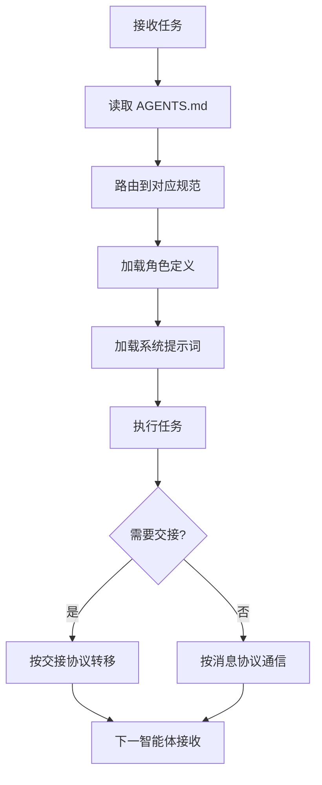

# 协作体系

> **来源**：从 `README.md` "协作协议"与"标准工作流"章节拆分

## 协作协议

多智能体协作通过以下 5 项协议保障：

| 协议 | 入口 | 用途 |
|---|---|---|
| 任务交接 | [.agents/protocols/handoff.md](../.agents/protocols/handoff.md) | 智能体间任务转移的标准化格式 |
| 消息传递 | [.agents/protocols/messaging.md](../.agents/protocols/messaging.md) | 智能体间通信的消息结构 |
| 冲突解决 | [.agents/protocols/conflict-resolution.md](../.agents/protocols/conflict-resolution.md) | 分歧仲裁与升级机制 |
| 临时依赖管理 | [.agents/protocols/dependency-management.md](../.agents/protocols/dependency-management.md) | 依赖存放、使用与清理 |
| 应用开发生命周期 | [.agents/protocols/app-development-workflow.md](../.agents/protocols/app-development-workflow.md) | 新应用从 `.temp/` 暂存到 `apps/` 稳定迁移的完整流程 |

### 应用开发生命周期

该协议规范了新应用的三阶段生命周期：

1. **暂存开发（`.temp/<app-name>/`）**：快速迭代阶段，允许频繁修改，不要求代码审查；应用名称使用 kebab-case，按模板搭建 `src/`、`tests/`、`README.md` 等目录结构。
2. **稳定迁移（→ `apps/`）**：分两种模式——**全量迁移**（完整应用，需通过测试、代码审查、无阻塞缺陷、文档完善四项门禁）与**选择性归档**（参赛交付物/阶段性快照，仅归档指定文件，豁免质量门禁）。迁移后运行 `generate-apps-index.py` 更新索引。
3. **清理**：全量迁移删除整个暂存目录并通知相关方；选择性归档仅删除已归档源文件，保留 `.temp/` 中间产物。

核心约束：禁止直接在 `apps/` 下启动新开发，禁止逆向迁移，迁移后须执行功能验证。

### 协作流程

## 标准工作流

本项目定义了 3 个标准工作流，均包含 Mermaid 流程图与详细步骤：

| 工作流 | 入口 | 适用场景 |
|---|---|---|
| 特性开发 | [.agents/workflows/feature-development.md](../.agents/workflows/feature-development.md) | 新功能从需求到交付 |
| 代码审查 | [.agents/workflows/code-review.md](../.agents/workflows/code-review.md) | 代码合并前的质量把关 |
| 测试 | [.agents/workflows/testing.md](../.agents/workflows/testing.md) | 测试编写、执行与验收 |

> **关联模块**：
> - `../README.md`
> - `agent-roles.md`
> - `../.agents/protocols/README.md`
> - `../.agents/workflows/README.md`